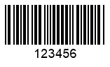

{}[Raed barcodes online](https://products.aspose.app/barcode/recognize). You can test the quality of ***Aspose.BarCode*** recognition functionality and view the results online.{}
  
## Overview
In ***Aspose.BarCode for .NET***, after reading the raw data from a barcode graphical representation, the library initiates data decoding that is performed according to the specific protocol. Often, in case of using particular 1D and postal barcode types, conflicting data decoding formats may appear due to the fact that some barcode symbologies have undergone standardization later than the start of their wide usage. To resolve such conflicts, class [*BarCodeReader*](https://apireference.aspose.com/barcode/net/aspose.barcode.barcoderecognition/barcodereader) contains a group of properties called [*BarcodeSettings*]( https://apireference.aspose.com/barcode/net/aspose.barcode.barcoderecognition/barcodesettings) that are responsible for data decoding settings.

## Checksum Verification
In many 1D and postal symbologies, data integrity verification and decoding are based on checksum control mechanisms. Class [*BarcodeSettings*]( https://apireference.aspose.com/barcode/net/aspose.barcode.barcoderecognition/barcodesettings
) provides the [*ChecksumValidation*]( https://apireference.aspose.com/barcode/net/aspose.barcode.barcoderecognition/barcodesettings/properties/checksumvalidation) property that is used to manage checksum settings for data validation and decoding. In general, barcode standards can be divided in two groups: those with obligatory checksum and those with optional one. Depending on this, the [*ChecksumValidation*]( https://apireference.aspose.com/barcode/net/aspose.barcode.barcoderecognition/barcodesettings/properties/checksumvalidation) field can take different values; hence, the barcode recognition process will change according to particular checksum settings.  

### Checksum Validation for Barcodes with Obligatory Checksum
Symbologies with obligatory checksum always require performing checksum control when the [*ChecksumValidation*]( https://apireference.aspose.com/barcode/net/aspose.barcode.barcoderecognition/barcodesettings/properties/checksumvalidation) property is set to *ChecksumValidation.Default* and *ChecksumValidation.On*. Otherwise, this parameter can take the value *ChecksumValidation.Off* that disables checksum controls for barcode type with obligatory checksum and thus allows reading data from incorrectly generated barcodes. However, in thi case, the probability of inaccurate recognition increases considerably.

 
  

//create barcode
using (BarcodeGenerator gen = new BarcodeGenerator(EncodeTypes.Code11, "123456"))
{
    gen.Parameters.Barcode.XDimension.Pixels = 2;
    gen.Save($"{path}Code11.png", BarCodeImageFormat.Png);
}

//read barcode image with ChecksumValidation.Default
Console.WriteLine("ReadChecksumCode11:");
Console.WriteLine("ChecksumValidation: Default");
using (BarCodeReader read = new BarCodeReader($"{path}Code11.png", DecodeType.Code11))
{
    read.BarcodeSettings.ChecksumValidation = ChecksumValidation.Default;
    foreach (BarCodeResult result in read.ReadBarCodes())
    {
        Console.WriteLine($"CodeType:{result.CodeTypeName}");
        Console.WriteLine($"CodeText:{result.CodeText}");
        Console.WriteLine($"1D Value:{result.Extended.OneD.Value}");
        Console.WriteLine($"1D CheckSum:{result.Extended.OneD.CheckSum}");
    }
}

//read barcode image with ChecksumValidation.Off
Console.WriteLine("ChecksumValidation: Off");
using (BarCodeReader read = new BarCodeReader($"{path}Code11.png", DecodeType.Code11))
{
    read.BarcodeSettings.ChecksumValidation = ChecksumValidation.Off;
    foreach (BarCodeResult result in read.ReadBarCodes())
    {
        Console.WriteLine($"CodeType:{result.CodeTypeName}");
        Console.WriteLine($"CodeText:{result.CodeText}");
        Console.WriteLine($"1D Value:{result.Extended.OneD.Value}");
        Console.WriteLine($"1D CheckSum:{result.Extended.OneD.CheckSum}");
    }
}


### Checksum Validation for Barcodes with Optional Checksum
For symbologies with optional checksum control, [*ChecksumValidation*]( https://apireference.aspose.com/barcode/net/aspose.barcode.barcoderecognition/barcodesettings/properties/checksumvalidation) can be set in such a way to enable checksum checking, namely, it needs to take the value *ChecksumValidation.On*. Otherwise, when the values *ChecksumValidation.Default* and *ChecksumValidation.Off* are used, checksum validation is omitted.

  

//create barcode
using (BarcodeGenerator gen = new BarcodeGenerator(EncodeTypes.Code39Extended, "123456"))
{
    gen.Parameters.Barcode.XDimension.Pixels = 2;
    gen.Parameters.Barcode.IsChecksumEnabled = EnableChecksum.Yes;
    gen.Save($"{path}Code39.png", BarCodeImageFormat.Png);
}

//read barcode image with ChecksumValidation.Default
Console.WriteLine("ReadChecksumCode39:");
Console.WriteLine("ChecksumValidation: Default");
using (BarCodeReader read = new BarCodeReader($"{path}Code39.png", DecodeType.Code39Extended))
{
    read.BarcodeSettings.ChecksumValidation = ChecksumValidation.Default;
    foreach (BarCodeResult result in read.ReadBarCodes())
    {
        Console.WriteLine($"CodeType:{result.CodeTypeName}");
        Console.WriteLine($"CodeText:{result.CodeText}");
        Console.WriteLine($"1D Value:{result.Extended.OneD.Value}");
        Console.WriteLine($"1D CheckSum:{result.Extended.OneD.CheckSum}");
    }
}

//read barcode image with ChecksumValidation.On
Console.WriteLine("ChecksumValidation: On");
using (BarCodeReader read = new BarCodeReader($"{path}Code39.png", DecodeType.Code39Extended))
{
    read.BarcodeSettings.ChecksumValidation = ChecksumValidation.On;
    foreach (BarCodeResult result in read.ReadBarCodes())
    {
        Console.WriteLine($"CodeType:{result.CodeTypeName}");
        Console.WriteLine($"CodeText:{result.CodeText}");
        Console.WriteLine($"1D Value:{result.Extended.OneD.Value}");
        Console.WriteLine($"1D CheckSum:{result.Extended.OneD.CheckSum}");
    }
}


## Recognition and Processing of Unicode Encodings
In ***Aspose.BarCode for .NET***, there is a special parameter called [*DetectEncoding*]( https://apireference.aspose.com/barcode/net/aspose.barcode.barcoderecognition/barcodesettings/properties/detectencoding) that allows enabling automatic recognition of UTF8 and UTF16 Unicode encodings during barcode recognition of 2D symbologies, as well as re-encoding the data into a Unicode string. When this mode is disabled, the barcode data can be read and decoded manually using the required encoding.
  


using (BarcodeGenerator gen = new BarcodeGenerator(EncodeTypes.QR, "بالقمة Aspose"))
{
    gen.Parameters.Barcode.XDimension.Pixels = 4;
    gen.Parameters.Barcode.QR.CodeTextEncoding = Encoding.UTF8;
    gen.Save($"{path}QRDetectEncoding.png", BarCodeImageFormat.Png);
}

Console.WriteLine("ReadDetectEncoding:");
//read barcode image with DetectEncoding set to true
Console.WriteLine("DetectEncoding: true");
using (BarCodeReader read = new BarCodeReader($"{path}QRDetectEncoding.png", DecodeType.QR))
{
    read.BarcodeSettings.DetectEncoding = true;
    foreach (BarCodeResult result in read.ReadBarCodes())
    {
        Console.WriteLine($"CodeType:{result.CodeTypeName}");
        Console.WriteLine($"CodeText:{result.CodeText}");
    }
}

//read barcode image with DetectEncoding set to False
Console.WriteLine("DetectEncoding: false");
using (BarCodeReader read = new BarCodeReader($"{path}QRDetectEncoding.png", DecodeType.QR))
{
    read.BarcodeSettings.DetectEncoding = false;
    foreach (BarCodeResult result in read.ReadBarCodes())
    {
        Console.WriteLine($"CodeType:{result.CodeTypeName}");
        Console.WriteLine($"CodeText:{result.CodeText}");
    }
}


## Using FNC Symbols
GS1 association utilizes FNC symbols to manage decoding for *Code 128* and some other barcode types. There are four types of FNC symbols (FNC1-FNC4); FNC1 is most widespread one and is used for GS1 Application Identifer (AI) marking. When the library detects that a barcode does not correspond to GS1 types (e.g. *Code 128* and *GS1 Code 128*), the decoder outputs FNC symbols as “<FNC#>”. Such messages can be deleted from recognition results by setting the [*StripFNC*]( https://apireference.aspose.com/barcode/net/aspose.barcode.barcoderecognition/barcodesettings/properties/stripfnc) property to false.  


//create barcode
using (BarcodeGenerator gen = new BarcodeGenerator(EncodeTypes.Code128, "Aspose" + FNC1 + FNC2 + FNC3))
{
    gen.Parameters.Barcode.XDimension.Pixels = 2;
    gen.Save($"{path}Code128FNC.png", BarCodeImageFormat.Png);
}

//read barcode image with StripFNC set to False
Console.WriteLine("ReadWithStripFNC:");
Console.WriteLine("StripFNC: false");
using (BarCodeReader read = new BarCodeReader($"{path}Code128FNC.png", DecodeType.Code128))
{
    read.BarcodeSettings.StripFNC = false;
    foreach (BarCodeResult result in read.ReadBarCodes())
    {
        Console.WriteLine($"CodeType:{result.CodeTypeName}");
        Console.WriteLine($"CodeText:{result.CodeText}");
    }
}

//read barcode image with StripFNC set to True
Console.WriteLine("StripFNC: true");
using (BarCodeReader read = new BarCodeReader($"{path}Code128FNC.png", DecodeType.Code128))
{
    read.BarcodeSettings.StripFNC = true;
    foreach (BarCodeResult result in read.ReadBarCodes())
    {
        Console.WriteLine($"CodeType:{result.CodeTypeName}");
        Console.WriteLine($"CodeText:{result.CodeText}");
    }
}


## Reading Australia Post Barcodes
*Australia Post* is a 4-state postal symbology used in Australian Post. In this barcode strandard, input messages include specific 2-digit format control code (FCC) fields and 8-digit sorting code (SC) fields. FCC fields are used to indicate one of three available barcode types with different fixed lengths: 37, 52, or 67 bars. Depending on FCC, barcodes may contain a customer information (CI) field that identifies one of the encoding types that support numerical or alphanumeric symbols. Customer information can occupy 16 bars in 52-length barcodes or 31 bars in 67-length ones. The Australia Post standard contains a checksum and information used for Reed-Solomon data recovery.  
*See more details about this symbology [here](/barcode/net/postal-barcodes/#australia-post-symbology)*.  
  
Due to the possibility to add customer information in barcode input data, barcode recognition for *Australia Post* barcodes has some specifics. In ***Aspose.BarCode for .NET***, developers can use class [*AustraliaPostSettings*](https://apireference.aspose.com/barcode/net/aspose.barcode.barcoderecognition/australiapostsettings) to customize recognition parameters for this barcode standard according to particular requirements. Further, main properties of class [*AustraliaPostSettings*](https://apireference.aspose.com/barcode/net/aspose.barcode.barcoderecognition/australiapostsettings) are explained in detail.

### Decoding Customer Information in Standard Formats
The *Australia Post* symbology allows encoding additional customer information in three different formats; automatic recognition of the format used for encoding is not possible. In ***Aspose.BarCode for .NET***, the required decoding format can be set in the [*CustomerInformationInterpretingType*](https://apireference.aspose.com/barcode/net/aspose.barcode.barcoderecognition/australiapostsettings/properties/customerinformationinterpretingtype) field that can take the following values as explained in the table below.
  
|Australia Post Encoding Table|Supported Symbols|
|---|---|
|CTable|Numerical digits, English letters, space symbol, and #|
|NTable|Numerical digits|
|Other|0, 1, 2, and 3 that correspond to H, A, D, and T states, respectively|
  
**CTable**  
  

  

//create barcode
using (BarcodeGenerator gen = new BarcodeGenerator(EncodeTypes.AustraliaPost, "6201234567ASPOSE"))
{
    gen.Parameters.Barcode.XDimension.Pixels = 4;
    gen.Parameters.Barcode.BarHeight.Pixels = 50;
    gen.Parameters.Barcode.AustralianPost.AustralianPostEncodingTable = CustomerInformationInterpretingType.CTable;
    gen.Save($"{path}AustraliaPostCTable.png", BarCodeImageFormat.Png);
}

//recognize image
Console.WriteLine("ReadAustraliaPostCTable:");
using (BarCodeReader read = new BarCodeReader($"{path}AustraliaPostCTable.png", DecodeType.AustraliaPost))
{
    read.BarcodeSettings.AustraliaPost.CustomerInformationInterpretingType = CustomerInformationInterpretingType.CTable;
    foreach (BarCodeResult result in read.ReadBarCodes())
    {
        Console.WriteLine($"CodeType:{result.CodeTypeName}");
        Console.WriteLine($"CodeText:{result.CodeText}");
    }
}


**NTable**

  

//create barcode
using (BarcodeGenerator gen = new BarcodeGenerator(EncodeTypes.AustraliaPost, "620123456701234"))
{
    gen.Parameters.Barcode.XDimension.Pixels = 4;
    gen.Parameters.Barcode.BarHeight.Pixels = 50;
    gen.Parameters.Barcode.AustralianPost.AustralianPostEncodingTable = CustomerInformationInterpretingType.NTable;
    gen.Save($"{path}AustraliaPostNTable.png", BarCodeImageFormat.Png);
}

//recognize image
Console.WriteLine("ReadAustraliaPostNTable:");
using (BarCodeReader read = new BarCodeReader($"{path}AustraliaPostNTable.png", DecodeType.AustraliaPost))
{
    read.BarcodeSettings.AustraliaPost.CustomerInformationInterpretingType = CustomerInformationInterpretingType.NTable;
    foreach (BarCodeResult result in read.ReadBarCodes())
    {
        Console.WriteLine($"CodeType:{result.CodeTypeName}");
        Console.WriteLine($"CodeText:{result.CodeText}");
    }
}


**Other**

  

//create barcode
using (BarcodeGenerator gen = new BarcodeGenerator(EncodeTypes.AustraliaPost, "6201234567321032103210"))
{
    gen.Parameters.Barcode.XDimension.Pixels = 4;
    gen.Parameters.Barcode.BarHeight.Pixels = 50;
    gen.Parameters.Barcode.AustralianPost.AustralianPostEncodingTable = CustomerInformationInterpretingType.Other;
    gen.Save($"{path}AustraliaPostOther.png", BarCodeImageFormat.Png);
}

//recognize image
Console.WriteLine("ReadAustraliaPostOther:");
using (BarCodeReader read = new BarCodeReader($"{path}AustraliaPostOther.png", DecodeType.AustraliaPost))
{
    read.BarcodeSettings.AustraliaPost.CustomerInformationInterpretingType = CustomerInformationInterpretingType.Other;
    foreach (BarCodeResult result in read.ReadBarCodes())
    {
        Console.WriteLine($"CodeType:{result.CodeTypeName}");
        Console.WriteLine($"CodeText:{result.CodeText}");
    }
}


### Removal of Fill Patterns
The *Australia Post* standard imposes the fixed size for each subtype. When barcode decoding is performed in the *CTable* format, the data that fills empty space in the input message gets decoded as symbol “z”. To avoid such a result, it is necessary to set the [*IgnoreEndingFillingPatternsForCTable *]( https://apireference.aspose.com/barcode/net/aspose.barcode.barcoderecognition/australiapostsettings/properties/ignoreendingfillingpatternsforctable) property to *True*.  


//create barcode
using (BarcodeGenerator gen = new BarcodeGenerator(EncodeTypes.AustraliaPost, "6201234567END"))
{
    gen.Parameters.Barcode.XDimension.Pixels = 4;
    gen.Parameters.Barcode.BarHeight.Pixels = 50;
    gen.Parameters.Barcode.AustralianPost.AustralianPostEncodingTable = CustomerInformationInterpretingType.CTable;
    gen.Save($"{path}AustraliaPostCTableIgnoreEnding.png", BarCodeImageFormat.Png);
}

Console.WriteLine("ReadAustraliaPostCTableIgnoreEnding:");
//recognize image with IgnoreEndingFillingPatternsForCTable true
Console.WriteLine("IgnoreEndingFillingPatternsForCTable: true");
using (BarCodeReader read = new BarCodeReader($"{path}AustraliaPostCTableIgnoreEnding.png", DecodeType.AustraliaPost))
{
    read.BarcodeSettings.AustraliaPost.CustomerInformationInterpretingType = CustomerInformationInterpretingType.CTable;
    read.BarcodeSettings.AustraliaPost.IgnoreEndingFillingPatternsForCTable = true;
    foreach (BarCodeResult result in read.ReadBarCodes())
    {
        Console.WriteLine($"CodeType:{result.CodeTypeName}");
        Console.WriteLine($"CodeText:{result.CodeText}");
    }
}

//recognize image with IgnoreEndingFillingPatternsForCTable false
Console.WriteLine("IgnoreEndingFillingPatternsForCTable: false");
using (BarCodeReader read = new BarCodeReader($"{path}AustraliaPostCTableIgnoreEnding.png", DecodeType.AustraliaPost))
{
    read.BarcodeSettings.AustraliaPost.CustomerInformationInterpretingType = CustomerInformationInterpretingType.CTable;
    read.BarcodeSettings.AustraliaPost.IgnoreEndingFillingPatternsForCTable = false;
    foreach (BarCodeResult result in read.ReadBarCodes())
    {
        Console.WriteLine($"CodeType:{result.CodeTypeName}");
        Console.WriteLine($"CodeText:{result.CodeText}");
    }
}


### Decoding Customer Information in Custom Format
***Aspose.BarCode for .NET*** allows developers to decode customer information in their own format. For this purpose, the library provides a special interface called [*CustomerInformationDecoder*]( https://apireference.aspose.com/barcode/net/aspose.barcode.barcoderecognition/australiapostsettings/properties/customerinformationdecoder). In such way, decoding of barcode data is performed using this interface; the properties [*CustomerInformationInterpretingType*]( https://apireference.aspose.com/barcode/net/aspose.barcode.barcoderecognition/australiapostsettings/properties/customerinformationinterpretingtype
) and [*IgnoreEndingFillingPatternsForCTable*]( https://apireference.aspose.com/barcode/net/aspose.barcode.barcoderecognition/australiapostsettings/properties/ignoreendingfillingpatternsforctable) are ignored.
  


class NTableDecoder : AustraliaPostCustomerInformationDecoder
{
    string[] N_Table = { "00", "01", "02", "10", "11", "12", "20", "21", "22", "30" };
    public string Decode(string customerInformationField)
    {
        StringBuilder bd = new StringBuilder();
        for (int i = 0; i < customerInformationField.Length; i += 2)
        {
            if (i + 2 <= customerInformationField.Length)
            {
                string tmp = customerInformationField.Substring(i, 2);
                for (int j = 0; j < N_Table.Length; j++)
                {
                    if (N_Table[j].Equals(tmp))
                    {
                        bd.Append(j);
                        break;
                    }
                }
            }
        }
        return bd.ToString();
    }
}
//create barcode
using (BarcodeGenerator gen = new BarcodeGenerator(EncodeTypes.AustraliaPost, "620123456701234"))
{
    gen.Parameters.Barcode.XDimension.Pixels = 4;
    gen.Parameters.Barcode.BarHeight.Pixels = 50;
    gen.Parameters.Barcode.AustralianPost.AustralianPostEncodingTable = CustomerInformationInterpretingType.NTable;
    gen.Save($"{path}AustraliaPostCustomerInformationDecoder.png", BarCodeImageFormat.Png);
}

//recognize image
Console.WriteLine("ReadAustraliaPostCustomerInformationDecoder:");
using (BarCodeReader read = new BarCodeReader($"{path}AustraliaPostCustomerInformationDecoder.png", DecodeType.AustraliaPost))
{
    read.BarcodeSettings.AustraliaPost.CustomerInformationDecoder = new NTableDecoder();
    foreach (BarCodeResult result in read.ReadBarCodes())
    {
        Console.WriteLine($"CodeType:{result.CodeTypeName}");
        Console.WriteLine($"CodeText:{result.CodeText}");
    }
}


