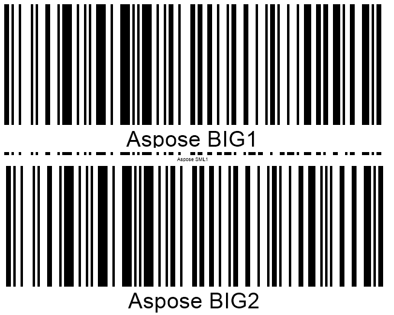

{}[Read Barcodes Online](https://products.aspose.app/barcode/recognize): You can check the quality of Aspose.BarCode recognition and view the results online.{}

## Overview
Barcode recognition is based on machine vision techniques and utilizes sophisticated mathematical algorithms for object detection and reading. Similar to other computer vision applications, converting an arbitrary image into a machine-readable code strongly depends on the quality of the source image. Namely, barcode images with low quality may be deemed unreadable according to accepted standards. Various methods can be used to recognize barcodes even with unacceptable quality; however, using these methods requires additional CPU computation time and leads to considerably increasing overall reading time. 

***Aspose.BarCode for .NET*** allows optimizing the barcode recognition process in terms of speed and quality depending on particular business needs and specificities. The library provides a special class called [*QualitySettings*](https://apireference.aspose.com/barcode/net/aspose.barcode.barcoderecognition/qualitysettings) that can be used to implement flexible settings for barcode recognition and to reach the required trade-off between reading capacity and speed according to the quality of source barcode images.
  
{}*If you need any clarifications, feel free to reach out [Aspose Technical Support](/barcode/net/technical-support/): ask your questions at [Aspose.Barcode Forum](https://forum.aspose.com/c/barcode/13) or contact [Aspose Paid Support Helpdesk](https://helpdesk.aspose.com/).*{}

## Recognition Options and Presets for Managing Speed and Quality
As mentioned above, ***Aspose.BarCode for .NET*** provides class [*QualitySettings*](https://apireference.aspose.com/barcode/net/aspose.barcode.barcoderecognition/qualitysettings) that allows enabling and disabling various algorithms for image recovery to read barcodes with distortions or artifacts. See the article [**Recognition Specifics**](/barcode/net/recognition-specifics/) for more information about special cases of barcode recognition. Moreover, class [*QualitySettings*](https://apireference.aspose.com/barcode/net/aspose.barcode.barcoderecognition/qualitysettings) provides special parameters to customize the trade-off between reading speed and quality in regular situations. Such parameters are grouped into several presets that facilitate image recovery and barcode reading for different recognition scenarios.

## Recognition Presets
This section provides detailed information about supported recognition presets, including *NormalQuality*, *HighPerformance*, *HighQuality*, *MaxBarCodes*, manually configured options, and others, as listed in the table below. By default, [*QualitySettings*](https://apireference.aspose.com/barcode/net/aspose.barcode.barcoderecognition/qualitysettings) uses the *NormalQuality* preset. 

|Recognition Preset|Description|
|---|---|
|[*NormalQuality*](https://apireference.aspose.com/barcode/net/aspose.barcode.barcoderecognition/qualitysettings/properties/normalquality)|Suitable for the most of barcodes with regular quality|
|[*HighQuality*](https://apireference.aspose.com/barcode/net/aspose.barcode.barcoderecognition/qualitysettings/properties/highquality)|Intended for work with low-quality barcodes; it allows reading and decoding diagonal and severely corrupted barcodes|
|[*HighPerformance*](https://apireference.aspose.com/barcode/net/aspose.barcode.barcoderecognition/qualitysettings/properties/highperformance)|Suggested for high-quality barcode images|
|[*HighQualityDetection*](https://apireference.aspose.com/barcode/net/aspose.barcode.barcoderecognition/qualitysettings/properties/highqualitydetection)|Similar to the *NormalQuality* one but has the [*DetectorSettings*](https://apireference.aspose.com/barcode/net/aspose.barcode.barcoderecognition/qualitysettings/properties/detectorsettings) parameter set to [*HighQuality*](https://apireference.aspose.com/barcode/net/aspose.barcode.barcoderecognition/barcodesvmdetectorsettings/properties/highquality)|
|[*MaxQualityDetection*](https://apireference.aspose.com/barcode/net/aspose.barcode.barcoderecognition/qualitysettings/properties/maxqualitydetection)|Similar to the *NormalQuality* one but with the [*DetectorSettings*](https://apireference.aspose.com/barcode/net/aspose.barcode.barcoderecognition/qualitysettings/properties/detectorsettings) set to [*MaxQuality*](https://apireference.aspose.com/barcode/net/aspose.barcode.barcoderecognition/barcodesvmdetectorsettings/properties/maxquality). It is applicable to detect diagonal and damaged barcodes|
|[*MaxBarcodes*](https://apireference.aspose.com/barcode/net/aspose.barcode.barcoderecognition/qualitysettings/properties/maxbarcodes)|Allows reading all potential barcodes in an image, even incorrect ones. It is recommended for use for set-up purposes only|
  
### Universal Presets for All Barcode Types
***Aspose.BarCode for .NET*** provides several universal recognition quality setting presets, such as [*HighPerformance*](https://apireference.aspose.com/barcode/net/aspose.barcode.barcoderecognition/qualitysettings/properties/highperformance), [*NormalQuality*](https://apireference.aspose.com/barcode/net/aspose.barcode.barcoderecognition/qualitysettings/properties/normalquality), and [*HighQuality*](https://apireference.aspose.com/barcode/net/aspose.barcode.barcoderecognition/qualitysettings/properties/highquality). These presets allow establishing linear dependence between recognition quality and speed for all barcode types, including 1D, 2D, and postal symbologies. In most cases, the [*NormalQuality*](https://apireference.aspose.com/barcode/net/aspose.barcode.barcoderecognition/qualitysettings/properties/normalquality) preset used by default is sufficient for the majority of barcodes that provide normal scanning quality. 
  
The following code snippet illustrates how to apply universal recognition presets to the sample image provided below.
  

  

Console.WriteLine("QualityPresetsMain:");

//read barcode image with QualitySettings set to HighPerformance
Console.WriteLine("QualitySettings: HighPerformance");
using (BarCodeReader read = new BarCodeReader($"{path}barcodes_different_quality.png", DecodeType.Code128, 
    DecodeType.Code39Extended, DecodeType.Planet, DecodeType.QR, DecodeType.MicroQR, DecodeType.Pdf417, DecodeType.DataMatrix, DecodeType.Aztec))
{
    read.QualitySettings = QualitySettings.HighPerformance;
    Console.WriteLine($"Barcodes read: {read.ReadBarCodes().Length}");
    foreach (BarCodeResult result in read.FoundBarCodes)
        Console.WriteLine($"{result.CodeTypeName}:{result.CodeText}");
}

//read barcode image with QualitySettings set to NormalQuality
Console.WriteLine("QualitySettings: NormalQuality");
using (BarCodeReader read = new BarCodeReader($"{path}barcodes_different_quality.png", DecodeType.Code128,
    DecodeType.Code39Extended, DecodeType.Planet, DecodeType.QR, DecodeType.MicroQR, DecodeType.Pdf417, DecodeType.DataMatrix, DecodeType.Aztec))
{
    read.QualitySettings = QualitySettings.NormalQuality;
    Console.WriteLine($"Barcodes read: {read.ReadBarCodes().Length}");
    foreach (BarCodeResult result in read.FoundBarCodes)
        Console.WriteLine($"{result.CodeTypeName}:{result.CodeText}");
}

//read barcode image with QualitySettings set to HighQuality
Console.WriteLine("QualitySettings: HighQuality");
using (BarCodeReader read = new BarCodeReader($"{path}barcodes_different_quality.png", DecodeType.Code128,
    DecodeType.Code39Extended, DecodeType.Planet, DecodeType.QR, DecodeType.MicroQR, DecodeType.Pdf417, DecodeType.DataMatrix, DecodeType.Aztec))
{
    read.QualitySettings = QualitySettings.HighQuality;
    Console.WriteLine($"Barcodes read: {read.ReadBarCodes().Length}");
    foreach (BarCodeResult result in read.FoundBarCodes)
        Console.WriteLine($"{result.CodeTypeName}:{result.CodeText}");
}

  

  

View the results of code execution

  
QualityPresetsMain:  
- QualitySettings: **HighPerformance**  
Barcodes read: 2  
Code128:Aspose Code 04  
Aztec:Aspose Regular  
- QualitySettings: **NormalQuality**  
Barcodes read: 6  
Code128:Aspose Code 04  
Aztec:Aspose Regular  
Code39Extended:/YYAD25HL  
DataMatrix:D19-WQ9-F91046-0811  
Code39Extended:0058  
Planet:990000837284  
- QualitySettings: **HighQuality**  
Barcodes read: 8  
Code128:Aspose Code 04  
Aztec:Aspose Regular  
Aztec:Aspose Inverse  
Code128:JJBEA129955634111200235  
MicroQR:FV50CE  
DataMatrix:D19-WQ9-F91046-0811  
Code39Extended:0058  
Planet:990000837284  
  

### Presets for 1D Barcode Types
To read 1D barcodes, ***Aspose.BarCode for .NET*** provides special quality setting presets that are intended for working with normal quality barcodes and at the same time, enable improved parameters for the detection and recognition of 1D barcodes. These presets can be particularly useful in cases when it is necessary to scan barcodes of small dimensions that are difficult for detecting and recognizing from complex documents with many textual blocks and tables. Specifically, using [*HighQualityDetection*](https://apireference.aspose.com/barcode/net/aspose.barcode.barcoderecognition/qualitysettings/properties/highqualitydetection) and [*MaxQualityDetection*](https://apireference.aspose.com/barcode/net/aspose.barcode.barcoderecognition/qualitysettings) presets allows getting much better recognition results for 1D barcodes in complex documents compared with basic settings. Similar improvements can be achieved by using the [*NormalQuality*](https://apireference.aspose.com/barcode/net/aspose.barcode.barcoderecognition/qualitysettings/properties/normalquality) preset and вуеукьштштп the appropriate settings in [*DetectorSettings*](https://apireference.aspose.com/barcode/net/aspose.barcode.barcoderecognition/qualitysettings/properties/detectorsettings).   
  
The image below illustrates an example of a document with various barcodes presented in this document along with textual parts and illustrations. 

  
The following code snippet explains how to set recognition quality parameters to ensure accurate detection and decoding of all 1D barcodes of target symbologies. 


Console.WriteLine("QualityPresetsOneD:");

//read barcode image with QualitySettings set to NormalQuality
Console.WriteLine("QualitySettings: NormalQuality");
using (BarCodeReader read = new BarCodeReader($"{path}many_code128.png", DecodeType.Code128))
{
    read.QualitySettings = QualitySettings.NormalQuality;
    Console.WriteLine($"Barcodes read: {read.ReadBarCodes().Length}");
    foreach (BarCodeResult result in read.FoundBarCodes)
        Console.WriteLine($"{result.CodeTypeName}:{result.CodeText}");
}

//read barcode image with QualitySettings set to HighQualityDetection
Console.WriteLine("QualitySettings: HighQualityDetection");
using (BarCodeReader read = new BarCodeReader($"{path}many_code128.png", DecodeType.Code128))
{
    read.QualitySettings = QualitySettings.HighQualityDetection;
    Console.WriteLine($"Barcodes read: {read.ReadBarCodes().Length}");
    foreach (BarCodeResult result in read.FoundBarCodes)
        Console.WriteLine($"{result.CodeTypeName}:{result.CodeText}");
}

//read barcode image with QualitySettings set to MaxQualityDetection
Console.WriteLine("QualitySettings: MaxQualityDetection");
using (BarCodeReader read = new BarCodeReader($"{path}many_code128.png", DecodeType.Code128))
{
    read.QualitySettings = QualitySettings.MaxQualityDetection;
    Console.WriteLine($"Barcodes read: {read.ReadBarCodes().Length}");
    foreach (BarCodeResult result in read.FoundBarCodes)
        Console.WriteLine($"{result.CodeTypeName}:{result.CodeText}");
}


  

View the results of code execution

  
QualityPresetsOneD:  
- QualitySettings: **NormalQuality**  
Barcodes read: 2  
Code128:Aspose Code 03  
Code128:Aspose Code 04  
- QualitySettings: **HighQualityDetection**  
Barcodes read: 4  
Code128:Aspose Diag 01  
Code128:Aspose Code 02  
Code128:Aspose Code 03  
Code128:Aspose Code 04  
- QualitySettings: **MaxQualityDetection**  
Barcodes read: 5  
Code128:Aspose Diag 01  
Code128:Aspose Code 02  
Code128:Aspose Code 03  
Code128:Aspose Code 01  
Code128:Aspose Code 04  
  

### Preset ***MaxBarCodes*** for Setups
To read all barcodes potentially presented in an image including incorrect ones, ***Aspose.BarCode for .NET*** suggests using a special preset called [*MaxBarCodes*](https://apireference.aspose.com/barcode/net/aspose.barcode.barcoderecognition/qualitysettings/properties/maxbarcodes). This preset applies recognition quality settings that allow recovering up to 1% of data contained in severely corrupted or erroneous barcodes. Similar recognition quality settings can be enabled using the [*AllowIncorrectBarcodes*](https://apireference.aspose.com/barcode/net/aspose.barcode.barcoderecognition/qualitysettings/properties/allowincorrectbarcodes) property.
Although the [*MaxBarCodes*](https://apireference.aspose.com/barcode/net/aspose.barcode.barcoderecognition/qualitysettings/properties/maxbarcodes) mode may be useful to decode barcodes that otherwise are unreadable, it should be used for setup purposes only, as applying this parameter may lead to notably increasing the time required to complete the recognition process and producing incorrect recognition outputs.  
  
The following code snippet explains how to work with the [*MaxBarCodes*](https://apireference.aspose.com/barcode/net/aspose.barcode.barcoderecognition/qualitysettings/properties/maxbarcodes) preset.


Console.WriteLine("MaxBarCodesPreset:");

//read barcode image with QualitySettings set to MaxBarCodes
Console.WriteLine("QualitySettings: MaxBarCodes");
using (BarCodeReader read = new BarCodeReader($"{path}barcodes_different_quality.png", DecodeType.Code128,
    DecodeType.Code39Extended, DecodeType.Planet, DecodeType.QR, DecodeType.MicroQR, DecodeType.Pdf417, DecodeType.DataMatrix, DecodeType.Aztec))
{
    read.QualitySettings = QualitySettings.MaxBarCodes;
    Console.WriteLine($"Barcodes read: {read.ReadBarCodes().Length}");
    foreach (BarCodeResult result in read.FoundBarCodes)
        Console.WriteLine($"{result.CodeTypeName}:{result.CodeText}");
}


  

View the results of code execution

  
MaxBarCodesPreset:  
- QualitySettings: MaxBarCodes  
Barcodes read: 11  
Code128:Aspose Code 04  
Code128:Aspose Code 01  
Aztec:Aspose Regular  
Aztec:Aspose Inverse  
Code128:JJBEA129955634111200235  
MicroQR:FV50CE  
QR:Aspose QR  
DataMatrix:D19-WQ9-F91046-0811  
Pdf417:Aspose Pdf417  
Code39Extended:0058  
Planet:990000837284  
  

## Recognition Options

### Fast Detection for High-Quality Barcodes
To read high-quality 1D barcode images generated using web-based tools, it is recommended to set [*AllowOneDFastBarcodesDetector*](https://apireference.aspose.com/barcode/net/aspose.barcode.barcoderecognition/qualitysettings/properties/allowonedfastbarcodesdetector) and [*FastScanOnly*](https://apireference.aspose.com/barcode/net/aspose.barcode.barcoderecognition/qualitysettings/properties/fastscanonly) recognition options. Both modes enable fast scanning of selected barcode image regions using lightweight recognition methods. The only difference between these two recognition options is that the [*FastScanOnly*](https://apireference.aspose.com/barcode/net/aspose.barcode.barcoderecognition/qualitysettings/properties/fastscanonly) mode does not imply further barcode detection in cases when no barcodes have been identified using lightweight recognition methods.  
  
The following code sample illustrates how to perform fast barcode detection for the image shown below as an example.  


Console.WriteLine("FastScan:");

//read barcode image with FastScan options disabled
Console.WriteLine("FastScan: disabled");
using (BarCodeReader read = new BarCodeReader($"{path}code128_hq.png", DecodeType.Code128))
{
    read.QualitySettings.FastScanOnly = false;
    read.QualitySettings.AllowOneDFastBarcodesDetector = false;
    Stopwatch watch = new Stopwatch();
    watch.Start();
    read.ReadBarCodes();
    watch.Stop();
    Console.WriteLine($"Barcodes read: {read.FoundCount}, Recognition time:{(int)watch.ElapsedMilliseconds} ms");
    foreach (BarCodeResult result in read.FoundBarCodes)
        Console.WriteLine($"{result.CodeTypeName}:{result.CodeText}");
}

//read barcode image with FastScan options enabled
Console.WriteLine("FastScan: enabled");
using (BarCodeReader read = new BarCodeReader($"{path}code128_hq.png", DecodeType.Code128))
{
    read.QualitySettings.FastScanOnly = true;
    read.QualitySettings.AllowOneDFastBarcodesDetector = true;
    Stopwatch watch = new Stopwatch();
    watch.Start();
    read.ReadBarCodes();
    watch.Stop();
    Console.WriteLine($"Barcodes read: {read.FoundCount}, Recognition time:{(int)watch.ElapsedMilliseconds} ms");
    foreach (BarCodeResult result in read.FoundBarCodes)
        Console.WriteLine($"{result.CodeTypeName}:{result.CodeText}");
}


  

View the results of code execution

  
FastScan:  
- FastScan: disabled  
Barcodes read: 1, Recognition time:85 ms  
Code128:Aspose  
- FastScan: enabled  
Barcodes read: 1, Recognition time:15 ms  
Code128:Aspose  

### Regular Recognition of Barcodes without Distortions
To read regular barcode labels with normal quality, ***Aspose.BarCode for .NET*** suggests an option called [*AllowRegularImage*](https://apireference.aspose.com/barcode/net/aspose.barcode.barcoderecognition/qualitysettings/properties/allowregularimage) that implies applying standard barcode recognition methods. It is recommended to keep this mode enabled in most cases as disabling it may result in recognition failures for regular barcodes.  
  
The following code snippet demonstrates how to implement regular barcode recognition considering the sample barcode image demonstrated below.
  


Console.WriteLine("RegularImage:");

//read barcode image with AllowRegularImage set to false
Console.WriteLine("AllowRegularImage: false");
using (BarCodeReader read = new BarCodeReader($"{path}aztec_regular_inverse.png", DecodeType.Aztec))
{
    read.QualitySettings = QualitySettings.HighPerformance;
    read.QualitySettings.AllowRegularImage = false;
    read.QualitySettings.AllowInvertImage = true;
    Console.WriteLine($"Barcodes read: {read.ReadBarCodes().Length}");
    foreach (BarCodeResult result in read.FoundBarCodes)
        Console.WriteLine($"{result.CodeTypeName}:{result.CodeText}");
}

//read barcode image with AllowRegularImage set to true
Console.WriteLine("AllowRegularImage: true");
using (BarCodeReader read = new BarCodeReader($"{path}aztec_regular_inverse.png", DecodeType.Aztec))
{
    read.QualitySettings = QualitySettings.HighPerformance;
    read.QualitySettings.AllowRegularImage = true;
    read.QualitySettings.AllowInvertImage = true;
    Console.WriteLine($"Barcodes read: {read.ReadBarCodes().Length}");
    foreach (BarCodeResult result in read.FoundBarCodes)
        Console.WriteLine($"{result.CodeTypeName}:{result.CodeText}");
}


  

View the results of code execution

   
RegularImage:  
- AllowRegularImage: false  
Barcodes read: 1  
Aztec:Aspose Inverse  
- AllowRegularImage: true  
Barcodes read: 2  
Aztec:Aspose Regular  
Aztec:Aspose Inverse  
  

## Detection of Potential Barcode Regions
To perform barcode recognition, first, ***Aspose.BarCode for .NET*** launches image segmentation and highlights regions with potential barcodes to start the recognition process using corresponding methods. The library utilizes two barcode region detectors: the one with customizable sensitivity that is managed through a group of properties called [*DetectorSettings*](https://apireference.aspose.com/barcode/net/aspose.barcode.barcoderecognition/qualitysettings/properties/detectorsettings) and the other one based on the previous detector implementation that allows successfully detecting approximately 97% of barcodes without additional settings. By default, the [*DetectorSettings*](https://apireference.aspose.com/barcode/net/aspose.barcode.barcoderecognition/qualitysettings/properties/detectorsettings) mode is used together with the quality parameter set to *NormalQuality*.

### Barcode Detector with Customized Sensibility
The [*DetectorSettings*](https://apireference.aspose.com/barcode/net/aspose.barcode.barcoderecognition/qualitysettings/properties/detectorsettings) property group allows flexibly setting the sensitivity of the barcode detector according to particular business needs. The higher is the detection sensitivity, the lower is recognition speed and the more accurate are the results of barcode region detection in complex images with multiple textual blocks and tables. In the case of 1D barcodes, [*DetectorSettings*](https://apireference.aspose.com/barcode/net/aspose.barcode.barcoderecognition/qualitysettings/properties/detectorsettings) provides the following modes for region detection sensitivity settings:
-	[*HighPerformance*](https://apireference.aspose.com/barcode/net/aspose.barcode.barcoderecognition/barcodesvmdetectorsettings/properties/highperformance)
-	[*NormalQuality*](https://apireference.aspose.com/barcode/net/aspose.barcode.barcoderecognition/barcodesvmdetectorsettings/properties/normalquality)  
-	[*HighQuality*](https://apireference.aspose.com/barcode/net/aspose.barcode.barcoderecognition/barcodesvmdetectorsettings/properties/highquality) 
-	[*MaxQuality*](https://apireference.aspose.com/barcode/net/aspose.barcode.barcoderecognition/barcodesvmdetectorsettings/properties/maxquality)  
  
The following code sample illustrates how to work with [*DetectorSettings*](https://apireference.aspose.com/barcode/net/aspose.barcode.barcoderecognition/qualitysettings/properties/detectorsettings).
    

Console.WriteLine("OneDDetectorSettings:");

//read barcode image with DetectorSettings set to HighPerformance
Console.WriteLine("DetectorSettings: HighPerformance");
using (BarCodeReader read = new BarCodeReader($"{path}many_code128.png", DecodeType.Code128))
{
    read.QualitySettings.DetectorSettings = BarcodeSvmDetectorSettings.HighPerformance;
    Console.WriteLine($"Barcodes read: {read.ReadBarCodes().Length}");
    foreach (BarCodeResult result in read.FoundBarCodes)
        Console.WriteLine($"{result.CodeTypeName}:{result.CodeText}");
}

//read barcode image with DetectorSettings set to MaxQuality
Console.WriteLine("DetectorSettings: MaxQuality");
using (BarCodeReader read = new BarCodeReader($"{path}many_code128.png", DecodeType.Code128))
{
    read.QualitySettings.DetectorSettings = BarcodeSvmDetectorSettings.MaxQuality;
    Console.WriteLine($"Barcodes read: {read.ReadBarCodes().Length}");
    foreach (BarCodeResult result in read.FoundBarCodes)
        Console.WriteLine($"{result.CodeTypeName}:{result.CodeText}");
}


  

View the results of code execution

  
OneDDetectorSettings:  
- DetectorSettings: **HighPerformance**  
Barcodes read: 2  
Code128:Aspose Code 03  
Code128:Aspose Code 04  
- DetectorSettings: **MaxQuality**  
Barcodes read: 5  
Code128:Aspose Diag 01  
Code128:Aspose Code 02  
Code128:Aspose Code 03  
Code128:Aspose Code 01  
Code128:Aspose Code 04  
  

### Old Version of Barcode Detector
The [*UseOldBarcodeDetector*](https://apireference.aspose.com/barcode/net/aspose.barcode.barcoderecognition/qualitysettings/properties/useoldbarcodedetector) property enables 1D barcode region detection through the use of the previous detector implementation without flexible sensitivity settings. This region detection mode approximately corresponds to the [*NormalQuality*](https://apireference.aspose.com/barcode/net/aspose.barcode.barcoderecognition/barcodesvmdetectorsettings/properties/normalquality) and [*HighQuality*](https://apireference.aspose.com/barcode/net/aspose.barcode.barcoderecognition/barcodesvmdetectorsettings/properties/highquality) settings of the new detector implemented in [*DetectorSettings*](https://apireference.aspose.com/barcode/net/aspose.barcode.barcoderecognition/qualitysettings/properties/detectorsettings).  
  
The following code snippet shows how to use the old version of the barcode detector. 


Console.WriteLine("OneOldBarcodeDetector:");

//read barcode image with UseOldBarcodeDetector set to false
Console.WriteLine("UseOldBarcodeDetector: false");
using (BarCodeReader read = new BarCodeReader($"{path}many_code128.png", DecodeType.Code128))
{
    read.QualitySettings.UseOldBarcodeDetector = false;
    Console.WriteLine($"Barcodes read: {read.ReadBarCodes().Length}");
    foreach (BarCodeResult result in read.FoundBarCodes)
        Console.WriteLine($"{result.CodeTypeName}:{result.CodeText}");
}

//read barcode image with UseOldBarcodeDetector set to true
Console.WriteLine("UseOldBarcodeDetector: true");
using (BarCodeReader read = new BarCodeReader($"{path}many_code128.png", DecodeType.Code128))
{
    read.QualitySettings.UseOldBarcodeDetector = true;
    Console.WriteLine($"Barcodes read: {read.ReadBarCodes().Length}");
    foreach (BarCodeResult result in read.FoundBarCodes)
        Console.WriteLine($"{result.CodeTypeName}:{result.CodeText}");
}


  

View the results of code execution

  
OneOldBarcodeDetector:  
- UseOldBarcodeDetector: false  
Barcodes read: 2  
Code128:Aspose Code 03  
Code128:Aspose Code 04  
- UseOldBarcodeDetector: true  
Barcodes read: 2  
Code128:Aspose Diag 01  
Code128:Aspose Code 02  
Code128:Aspose Code 03  
Code128:Aspose Code 04  
  

## Using Scan Gap for 1D and 2D Barcode Scanning
To perform preliminary scanning of large 1D barcodes and some 2D barcodes, such as *PDF417*, *QR Code*, or *Aztec*, scanning with a gap of a few lines is usually applied. This approach allows avoiding excessively long scanning and speeding up the recognition process. In ***Aspose.BarCode for .NET***, the scan gap can be set using a special parameter called [*AllowDetectScanGap*](https://apireference.aspose.com/barcode/net/aspose.barcode.barcoderecognition/qualitysettings/properties/allowdetectscangap). However, in cases when large and small barcodes are placed close to each other, this setting can result in a refusal to read barcodes of smaller sizes. Disabling this parameter allows successfully reading such combinations of barcode labels albeit at the expense of recognition speed.  
  
The following code sample explains how to customizr the scan gap while reading the source image given below as an example.


Console.WriteLine("DetectScanGap:");

//read barcode image with AllowDetectScanGap true
Console.WriteLine("AllowDetectScanGap: true");
using (BarCodeReader read = new BarCodeReader($"{path}code128_big_and_small.png", DecodeType.Code128))
{
    read.QualitySettings.AllowDetectScanGap = true;
    Console.WriteLine($"Barcodes read: {read.ReadBarCodes().Length}");
    foreach (BarCodeResult result in read.FoundBarCodes)
        Console.WriteLine($"{result.CodeTypeName}:{result.CodeText}");
}

//read barcode image with AllowDetectScanGap false
Console.WriteLine("AllowDetectScanGap: false");
using (BarCodeReader read = new BarCodeReader($"{path}code128_big_and_small.png", DecodeType.Code128))
{
    read.QualitySettings.AllowDetectScanGap = false;
    Console.WriteLine($"Barcodes read: {read.ReadBarCodes().Length}");
    foreach (BarCodeResult result in read.FoundBarCodes)
        Console.WriteLine($"{result.CodeTypeName}:{result.CodeText}");
}


  

View the results of code execution

  
DetectScanGap:  
- AllowDetectScanGap: true  
Barcodes read: 2  
Code128:Aspose BIG1  
Code128:Aspose BIG2  
- AllowDetectScanGap: false  
Barcodes read: 3  
Code128:Aspose BIG1  
Code128:Aspose SML1  
Code128:Aspose BIG2  
  

