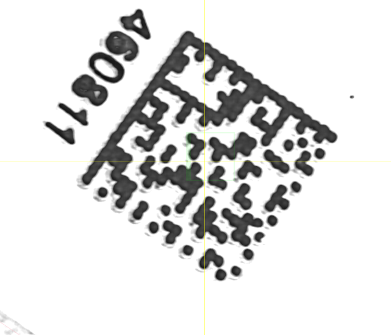
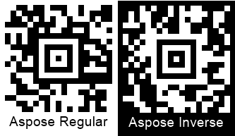
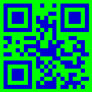

{}[Read barcodes online](https://products.aspose.app/barcode/recognize). You can check the quality of Aspose.BarCode recognition and view the results online.{}

## Overview

## Reading Barcode Images with Gaussian Noise

### Filtering Out White Spots


Console.WriteLine("WhiteSpotsRemoving:");

//read barcode image with AllowWhiteSpotsRemoving set to false
Console.WriteLine("AllowWhiteSpotsRemoving: false");
using (BarCodeReader read = new BarCodeReader($"{path}code128_whitespots.png", DecodeType.Code128))
{
    read.QualitySettings.AllowWhiteSpotsRemoving = false;
    Console.WriteLine($"Barcodes read: {read.ReadBarCodes().Length}");
    foreach (BarCodeResult result in read.FoundBarCodes)
        Console.WriteLine($"{result.CodeTypeName}:{result.CodeText}");
}

//read barcode image with AllowWhiteSpotsRemoving set to true
Console.WriteLine("AllowWhiteSpotsRemoving: true");
using (BarCodeReader read = new BarCodeReader($"{path}code128_whitespots.png", DecodeType.Code128))
{
    read.QualitySettings.AllowWhiteSpotsRemoving = true;
    Console.WriteLine($"Barcodes read: {read.ReadBarCodes().Length}");
    foreach (BarCodeResult result in read.FoundBarCodes)
        Console.WriteLine($"{result.CodeTypeName}:{result.CodeText}");
}


### Median Filtering for 2D Barcodes


Console.WriteLine("MedianSmoothing:");

//read barcode image with AllowMedianSmoothing set to false
Console.WriteLine("AllowMedianSmoothing: false");
using (BarCodeReader read = new BarCodeReader($"{path}datamatrix_noised.png", DecodeType.DataMatrix))
{
    read.QualitySettings.AllowMedianSmoothing = false;
    Console.WriteLine($"Barcodes read: {read.ReadBarCodes().Length}");
    foreach (BarCodeResult result in read.FoundBarCodes)
        Console.WriteLine($"{result.CodeTypeName}:{result.CodeText}");
}

//read barcode image with AllowMedianSmoothing set to true
Console.WriteLine("AllowMedianSmoothing: true");
using (BarCodeReader read = new BarCodeReader($"{path}datamatrix_noised.png", DecodeType.DataMatrix))
{
    read.QualitySettings.AllowMedianSmoothing = true;
    read.QualitySettings.MedianSmoothingWindowSize = 4;
    Console.WriteLine($"Barcodes read: {read.ReadBarCodes().Length}");
    foreach (BarCodeResult result in read.FoundBarCodes)
        Console.WriteLine($"{result.CodeTypeName}:{result.CodeText}");
}


  

View results of code execution

### Median Filtering for 1D Barcodes


Console.WriteLine("SaltAndPaperFiltering:");

//recognize image with AllowSaltAndPaperFiltering false
Console.WriteLine("AllowSaltAndPaperFiltering: false");
using (BarCodeReader read = new BarCodeReader($"{path}saltandpaper.png", DecodeType.Code39Standard, DecodeType.Code39Extended))
{
    read.QualitySettings.AllowSaltAndPaperFiltering = false;
    Console.WriteLine($"Barcodes read: {read.ReadBarCodes().Length}");
    foreach (BarCodeResult result in read.FoundBarCodes)
        Console.WriteLine($"{result.CodeTypeName}:{result.CodeText}");
}

//recognize image with AllowSaltAndPaperFiltering true
Console.WriteLine("AllowSaltAndPaperFiltering: true");
using (BarCodeReader read = new BarCodeReader($"{path}saltandpaper.png", DecodeType.Code39Standard, DecodeType.Code39Extended))
{
    read.QualitySettings.AllowSaltAndPaperFiltering = true;
    Console.WriteLine($"Barcodes read: {read.ReadBarCodes().Length}");
    foreach (BarCodeResult result in read.FoundBarCodes)
        Console.WriteLine($"{result.CodeTypeName}:{result.CodeText}");
}


  

View results of code execution

### Median Filtering for Postal Barcodes


Console.WriteLine("MicroWhiteSpotsRemoving:");

//recognize image with AllowMicroWhiteSpotsRemoving false
Console.WriteLine("AllowMicroWhiteSpotsRemoving: false");
using (BarCodeReader read = new BarCodeReader($"{path}planet_noised.png", DecodeType.Planet))
{
    read.QualitySettings.AllowMicroWhiteSpotsRemoving = false;
    Console.WriteLine($"Barcodes read: {read.ReadBarCodes().Length}");
    foreach (BarCodeResult result in read.FoundBarCodes)
        Console.WriteLine($"{result.CodeTypeName}:{result.CodeText}");
}

//recognize image with AllowMicroWhiteSpotsRemoving true
Console.WriteLine("AllowMicroWhiteSpotsRemoving: true");
using (BarCodeReader read = new BarCodeReader($"{path}planet_noised.png", DecodeType.Planet))
{
    read.QualitySettings.AllowMicroWhiteSpotsRemoving = true;
    Console.WriteLine($"Barcodes read: {read.ReadBarCodes().Length}");
    foreach (BarCodeResult result in read.FoundBarCodes)
        Console.WriteLine($"{result.CodeTypeName}:{result.CodeText}");
}


  

View results of code execution

## Reducing Barcode Image Size to Eliminate Visual Artifacts


Console.WriteLine("DecreasedImage:");

//recognize image with AllowDecreasedImage false
Console.WriteLine("AllowDecreasedImage: false");
using (BarCodeReader read = new BarCodeReader($"{path}datamatrix_waved.png", DecodeType.DataMatrix))
{
    read.QualitySettings.AllowDecreasedImage = false;
    Console.WriteLine($"Barcodes read: {read.ReadBarCodes().Length}");
    foreach (BarCodeResult result in read.FoundBarCodes)
        Console.WriteLine($"{result.CodeTypeName}:{result.CodeText}");
}

//recognize image with AllowDecreasedImage true
Console.WriteLine("AllowDecreasedImage: true");
using (BarCodeReader read = new BarCodeReader($"{path}datamatrix_waved.png", DecodeType.DataMatrix))
{
    read.QualitySettings.AllowDecreasedImage = true;
    Console.WriteLine($"Barcodes read: {read.ReadBarCodes().Length}");
    foreach (BarCodeResult result in read.FoundBarCodes)
        Console.WriteLine($"{result.CodeTypeName}:{result.CodeText}");
}


  

View results of code execution

## Reading Inverted Barcode Images


Console.WriteLine("InvertImage:");

//recognize image with AllowInvertImage false
Console.WriteLine("AllowInvertImage: false");
using (BarCodeReader read = new BarCodeReader($"{path}aztec_regular_inverse.png", DecodeType.Aztec))
{
    read.QualitySettings.AllowInvertImage = false;
    Console.WriteLine($"Barcodes read: {read.ReadBarCodes().Length}");
    foreach (BarCodeResult result in read.FoundBarCodes)
        Console.WriteLine($"{result.CodeTypeName}:{result.CodeText}");
}

//recognize image with AllowInvertImage true
Console.WriteLine("AllowInvertImage: true");
using (BarCodeReader read = new BarCodeReader($"{path}aztec_regular_inverse.png", DecodeType.Aztec))
{
    read.QualitySettings.AllowInvertImage = true;
    Console.WriteLine($"Barcodes read: {read.ReadBarCodes().Length}");
    foreach (BarCodeResult result in read.FoundBarCodes)
        Console.WriteLine($"{result.CodeTypeName}:{result.CodeText}");
}


  

View results of code execution

## Detecting Colored Barcodes on Colored Background


Console.WriteLine("ComplexBackground:");

//recognize image with AllowComplexBackground false
Console.WriteLine("AllowComplexBackground: false");
using (BarCodeReader read = new BarCodeReader($"{path}qr_color.png", DecodeType.QR))
{
    read.QualitySettings.AllowComplexBackground = false;
    Console.WriteLine($"Barcodes read: {read.ReadBarCodes().Length}");
    foreach (BarCodeResult result in read.FoundBarCodes)
        Console.WriteLine($"{result.CodeTypeName}:{result.CodeText}");
}

//recognize image with AllowComplexBackground true
Console.WriteLine("AllowComplexBackground: true");
using (BarCodeReader read = new BarCodeReader($"{path}qr_color.png", DecodeType.QR))
{
    read.QualitySettings.AllowComplexBackground = true;
    Console.WriteLine($"Barcodes read: {read.ReadBarCodes().Length}");
    foreach (BarCodeResult result in read.FoundBarCodes)
        Console.WriteLine($"{result.CodeTypeName}:{result.CodeText}");
}


  

View results of code execution

## Reading Barcodes with Erased or Displaced Bars


Console.WriteLine("OneDWipedBarsRestoration:");

//recognize image with AllowQRMicroQrRestoration and CheckMore1DVariants false
Console.WriteLine("AllowQRMicroQrRestoration and CheckMore1DVariants: false");
using (BarCodeReader read = new BarCodeReader($"{path}code128_wipedbars.png", DecodeType.Code128))
{
    read.QualitySettings.AllowOneDWipedBarsRestoration = false;
    read.QualitySettings.CheckMore1DVariants = false;
    Console.WriteLine($"Barcodes read: {read.ReadBarCodes().Length}");
    foreach (BarCodeResult result in read.FoundBarCodes)
        Console.WriteLine($"{result.CodeTypeName}:{result.CodeText}");
}

//recognize image with AllowQRMicroQrRestoration and CheckMore1DVariants true
Console.WriteLine("AllowQRMicroQrRestoration and CheckMore1DVariants: true");
using (BarCodeReader read = new BarCodeReader($"{path}code128_wipedbars.png", DecodeType.Code128))
{
    read.QualitySettings.AllowOneDWipedBarsRestoration = true;
    read.QualitySettings.CheckMore1DVariants = true;
    Console.WriteLine($"Barcodes read: {read.ReadBarCodes().Length}");
    foreach (BarCodeResult result in read.FoundBarCodes)
        Console.WriteLine($"{result.CodeTypeName}:{result.CodeText}");
}


  

View results of code execution

## Reading Evidently Incorrect Barcodes


Console.WriteLine("IncorrectBarcodes:");

//recognize image with AllowIncorrectBarcodes false
Console.WriteLine("AllowIncorrectBarcodes: false");
using (BarCodeReader read = new BarCodeReader($"{path}pdf417_qr_corrupted.png", DecodeType.Pdf417, DecodeType.QR))
{
    read.QualitySettings.AllowIncorrectBarcodes = false;
    Console.WriteLine($"Barcodes read: {read.ReadBarCodes().Length}");
    foreach (BarCodeResult result in read.FoundBarCodes)
        Console.WriteLine($"{result.CodeTypeName}:{result.CodeText}");
}

//recognize image with AllowIncorrectBarcodes true
Console.WriteLine("AllowIncorrectBarcodes: true");
using (BarCodeReader read = new BarCodeReader($"{path}pdf417_qr_corrupted.png", DecodeType.Pdf417, DecodeType.QR))
{
    read.QualitySettings.AllowIncorrectBarcodes = true;
    Console.WriteLine($"Barcodes read: {read.ReadBarCodes().Length}");
    foreach (BarCodeResult result in read.FoundBarCodes)
        Console.WriteLine($"{result.CodeTypeName}:{result.CodeText}");
}


  

View results of code execution

## Reading Severely Distorted QR Code and Micro QR Code Barcodes


Console.WriteLine("QRMicroQrRestoration:");

//recognize image with AllowQRMicroQrRestoration false
Console.WriteLine("AllowQRMicroQrRestoration: false");
using (BarCodeReader read = new BarCodeReader($"{path}microqr_3d_distorted.png", DecodeType.MicroQR))
{
    read.QualitySettings.AllowQRMicroQrRestoration = false;
    Console.WriteLine($"Barcodes read: {read.ReadBarCodes().Length}");
    foreach (BarCodeResult result in read.FoundBarCodes)
        Console.WriteLine($"{result.CodeTypeName}:{result.CodeText}");
}

//recognize image with AllowQRMicroQrRestoration true
Console.WriteLine("AllowQRMicroQrRestoration: true");
using (BarCodeReader read = new BarCodeReader($"{path}microqr_3d_distorted.png", DecodeType.MicroQR))
{
    read.QualitySettings.AllowQRMicroQrRestoration = true;
    Console.WriteLine($"Barcodes read: {read.ReadBarCodes().Length}");
    foreach (BarCodeResult result in read.FoundBarCodes)
        Console.WriteLine($"{result.CodeTypeName}:{result.CodeText}");
}


  

View results of code execution

## Reading Industrial DataMatrix Barcodes


Console.WriteLine("DatamatrixIndustrialBarcodes:");

//read barcode image with AllowDatamatrixIndustrialBarcodes set to false
Console.WriteLine("AllowDatamatrixIndustrialBarcodes: false");
using (BarCodeReader read = new BarCodeReader($"{path}datamatrix_industrial.png", DecodeType.DataMatrix))
{
    read.QualitySettings.AllowDatamatrixIndustrialBarcodes = false;
    Console.WriteLine($"Barcodes read: {read.ReadBarCodes().Length}");
    foreach (BarCodeResult result in read.FoundBarCodes)
        Console.WriteLine($"{result.CodeTypeName}:{result.CodeText}");
}

//read barcode image with AllowDatamatrixIndustrialBarcodes set to true
Console.WriteLine("AllowDatamatrixIndustrialBarcodes: true");
using (BarCodeReader read = new BarCodeReader($"{path}datamatrix_industrial.png", DecodeType.DataMatrix))
{
    read.QualitySettings.AllowDatamatrixIndustrialBarcodes = true;
    Console.WriteLine($"Barcodes read: {read.ReadBarCodes().Length}");
    foreach (BarCodeResult result in read.FoundBarCodes)
        Console.WriteLine($"{result.CodeTypeName}:{result.CodeText}");
}


  

View results of code execution

