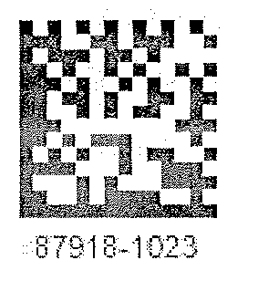

{}[Read barcodes online](https://products.aspose.app/barcode/recognize). You can check the quality of Aspose.BarCode recognition and view the results online.{}

## Overview
 
## Reading Barcode Images with Gaussian Noise
Gaussian noise is one of the most frequent distortions that may affect the quality of barcode images. The biggest problems arise in case when barcode images are monochrome or the distortion grain is much larger than the minimal barcode element. To mitigate such negative effects, it may be useful to apply median filtering methods that are suitable to both 1D and 2D barcodes. Although median filtering methods also introduce distortions by eliminating barcode elements together with noise, they still may succeed in making key barcode modules readable.

### Median Filtering for 2D Barcodes
In ***ASpose.BarCode for .NET***, median filtering can be implemented using a special property called [*AllowMedianSmoothing *]( https://apireference.aspose.com/barcode/net/aspose.barcode.barcoderecognition/qualitysettings/properties/allowmediansmoothing) and setting the median filtering window in the [*MedianSmoothingWindowSize*]( https://apireference.aspose.com/barcode/net/aspose.barcode.barcoderecognition/qualitysettings/properties/mediansmoothingwindowsize) parameter. Unlike for 1D barcodes, automated selection of median filtering window is not supported for 2D symbologies.


Console.WriteLine("MedianSmoothing:");

//read barcode image with AllowMedianSmoothing set to false
Console.WriteLine("AllowMedianSmoothing: false");
using (BarCodeReader read = new BarCodeReader($"{path}datamatrix_noised.png", DecodeType.DataMatrix))
{
    read.QualitySettings.AllowMedianSmoothing = false;
    Console.WriteLine($"Barcodes read: {read.ReadBarCodes().Length}");
    foreach (BarCodeResult result in read.FoundBarCodes)
        Console.WriteLine($"{result.CodeTypeName}:{result.CodeText}");
}

//read barcode image with AllowMedianSmoothing set to true
Console.WriteLine("AllowMedianSmoothing: true");
using (BarCodeReader read = new BarCodeReader($"{path}datamatrix_noised.png", DecodeType.DataMatrix))
{
    read.QualitySettings.AllowMedianSmoothing = true;
    read.QualitySettings.MedianSmoothingWindowSize = 4;
    Console.WriteLine($"Barcodes read: {read.ReadBarCodes().Length}");
    foreach (BarCodeResult result in read.FoundBarCodes)
        Console.WriteLine($"{result.CodeTypeName}:{result.CodeText}");
}


  

View the results of code execution

### Median Filtering for 1D Barcodes
One-dimensional filtering for linear barcodes can be set using a parameter called [*AllowSaltAndPaperFiltering*]( https://apireference.aspose.com/barcode/net/aspose.barcode.barcoderecognition/qualitysettings/properties/allowsaltandpaperfiltering). In this case, the filtering window size is selected automatically.


Console.WriteLine("SaltAndPaperFiltering:");

//read a barcode image with AllowSaltAndPaperFiltering set to false
Console.WriteLine("AllowSaltAndPaperFiltering: false");
using (BarCodeReader read = new BarCodeReader($"{path}saltandpaper.png", DecodeType.Code39Standard, DecodeType.Code39Extended))
{
    read.QualitySettings.AllowSaltAndPaperFiltering = false;
    Console.WriteLine($"Barcodes read: {read.ReadBarCodes().Length}");
    foreach (BarCodeResult result in read.FoundBarCodes)
        Console.WriteLine($"{result.CodeTypeName}:{result.CodeText}");
}

//read a barcode image with AllowSaltAndPaperFiltering set to true
Console.WriteLine("AllowSaltAndPaperFiltering: true");
using (BarCodeReader read = new BarCodeReader($"{path}saltandpaper.png", DecodeType.Code39Standard, DecodeType.Code39Extended))
{
    read.QualitySettings.AllowSaltAndPaperFiltering = true;
    Console.WriteLine($"Barcodes read: {read.ReadBarCodes().Length}");
    foreach (BarCodeResult result in read.FoundBarCodes)
        Console.WriteLine($"{result.CodeTypeName}:{result.CodeText}");
}


  

View the results of code execution

### Median Filtering for Postal Barcodes
One-dimensional median filtering for postal symbologies can be performed using the [*AllowMicroWhiteSpotsRemoving*]( https://apireference.aspose.com/barcode/net/aspose.barcode.barcoderecognition/qualitysettings/properties/allowmicrowhitespotsremoving) property. The size of the filtering window size is set automatically.


Console.WriteLine("MicroWhiteSpotsRemoving:");

//recognize image with AllowMicroWhiteSpotsRemoving false
Console.WriteLine("AllowMicroWhiteSpotsRemoving: false");
using (BarCodeReader read = new BarCodeReader($"{path}planet_noised.png", DecodeType.Planet))
{
    read.QualitySettings.AllowMicroWhiteSpotsRemoving = false;
    Console.WriteLine($"Barcodes read: {read.ReadBarCodes().Length}");
    foreach (BarCodeResult result in read.FoundBarCodes)
        Console.WriteLine($"{result.CodeTypeName}:{result.CodeText}");
}

//recognize image with AllowMicroWhiteSpotsRemoving true
Console.WriteLine("AllowMicroWhiteSpotsRemoving: true");
using (BarCodeReader read = new BarCodeReader($"{path}planet_noised.png", DecodeType.Planet))
{
    read.QualitySettings.AllowMicroWhiteSpotsRemoving = true;
    Console.WriteLine($"Barcodes read: {read.ReadBarCodes().Length}");
    foreach (BarCodeResult result in read.FoundBarCodes)
        Console.WriteLine($"{result.CodeTypeName}:{result.CodeText}");
}


  

View the results of code execution

### Filtering Out White Spots
The presence of white spots in barcode images is a frequent problem that appears while sending documents with barcodes through fax transmission.  To mitigate this issue in ***Aspose.BaCode for .NET***, it is possible to use a special setting called [*AllowWhiteSpotsRemoving*]( https://apireference.aspose.com/barcode/net/aspose.barcode.barcoderecognition/qualitysettings/properties/allowwhitespotsremoving) that allows filtering out not all Gaussian noise but only white spots. 


Console.WriteLine("WhiteSpotsRemoving:");

//read barcode image with AllowWhiteSpotsRemoving set to false
Console.WriteLine("AllowWhiteSpotsRemoving: false");
using (BarCodeReader read = new BarCodeReader($"{path}code128_whitespots.png", DecodeType.Code128))
{
    read.QualitySettings.AllowWhiteSpotsRemoving = false;
    Console.WriteLine($"Barcodes read: {read.ReadBarCodes().Length}");
    foreach (BarCodeResult result in read.FoundBarCodes)
        Console.WriteLine($"{result.CodeTypeName}:{result.CodeText}");
}

//read barcode image with AllowWhiteSpotsRemoving set to true
Console.WriteLine("AllowWhiteSpotsRemoving: true");
using (BarCodeReader read = new BarCodeReader($"{path}code128_whitespots.png", DecodeType.Code128))
{
    read.QualitySettings.AllowWhiteSpotsRemoving = true;
    Console.WriteLine($"Barcodes read: {read.ReadBarCodes().Length}");
    foreach (BarCodeResult result in read.FoundBarCodes)
        Console.WriteLine($"{result.CodeTypeName}:{result.CodeText}");
}


## Reducing Barcode Image Size to Eliminate Visual Artifacts
In some cases, distortions caused by excessive scaling of a barcode image can be mitigated by decreasing the scale space. In ***Aspose.BarCode for .NET***, it can be done using a special setting called [*AllowDecreasedImage*]( https://apireference.aspose.com/barcode/net/aspose.barcode.barcoderecognition/qualitysettings/properties/allowdecreasedimage) that allows reducing the size of an image and in this way, to facilitate its reading as a result of eliminating visual artifacts. 


Console.WriteLine("DecreasedImage:");

//recognize image with AllowDecreasedImage false
Console.WriteLine("AllowDecreasedImage: false");
using (BarCodeReader read = new BarCodeReader($"{path}datamatrix_waved.png", DecodeType.DataMatrix))
{
    read.QualitySettings.AllowDecreasedImage = false;
    Console.WriteLine($"Barcodes read: {read.ReadBarCodes().Length}");
    foreach (BarCodeResult result in read.FoundBarCodes)
        Console.WriteLine($"{result.CodeTypeName}:{result.CodeText}");
}

//recognize image with AllowDecreasedImage true
Console.WriteLine("AllowDecreasedImage: true");
using (BarCodeReader read = new BarCodeReader($"{path}datamatrix_waved.png", DecodeType.DataMatrix))
{
    read.QualitySettings.AllowDecreasedImage = true;
    Console.WriteLine($"Barcodes read: {read.ReadBarCodes().Length}");
    foreach (BarCodeResult result in read.FoundBarCodes)
        Console.WriteLine($"{result.CodeTypeName}:{result.CodeText}");
}


  

View the results of code execution

## Reading Inverted Barcode Images
***Aspose.BarCode for .NET** enables reading barcode images with inverted colors. To do this, it is required to enable a special parameter called [*AllowInvertImage*]( https://apireference.aspose.com/barcode/net/aspose.barcode.barcoderecognition/qualitysettings/properties/allowinvertimage).


Console.WriteLine("InvertImage:");

//recognize image with AllowInvertImage false
Console.WriteLine("AllowInvertImage: false");
using (BarCodeReader read = new BarCodeReader($"{path}aztec_regular_inverse.png", DecodeType.Aztec))
{
    read.QualitySettings.AllowInvertImage = false;
    Console.WriteLine($"Barcodes read: {read.ReadBarCodes().Length}");
    foreach (BarCodeResult result in read.FoundBarCodes)
        Console.WriteLine($"{result.CodeTypeName}:{result.CodeText}");
}

//recognize image with AllowInvertImage true
Console.WriteLine("AllowInvertImage: true");
using (BarCodeReader read = new BarCodeReader($"{path}aztec_regular_inverse.png", DecodeType.Aztec))
{
    read.QualitySettings.AllowInvertImage = true;
    Console.WriteLine($"Barcodes read: {read.ReadBarCodes().Length}");
    foreach (BarCodeResult result in read.FoundBarCodes)
        Console.WriteLine($"{result.CodeTypeName}:{result.CodeText}");
}


  

View the results of code execution

## Detecting Colored Barcodes on Colored Background
To read colored barcodes on colored background, ***Aspose.BarCode for .NET*** provides a special parameter called [*AllowComplexBackground*]( https://apireference.aspose.com/barcode/net/aspose.barcode.barcoderecognition/qualitysettings/properties/allowcomplexbackground) that attempts to distinguish colored background from barcode labels through color quantization and then subtract it. It should be noted that enabling this parameter results in considerable deceleration of recognition speed and thus should be used in special cases only.


Console.WriteLine("ComplexBackground:");

//recognize image with AllowComplexBackground false
Console.WriteLine("AllowComplexBackground: false");
using (BarCodeReader read = new BarCodeReader($"{path}qr_color.png", DecodeType.QR))
{
    read.QualitySettings.AllowComplexBackground = false;
    Console.WriteLine($"Barcodes read: {read.ReadBarCodes().Length}");
    foreach (BarCodeResult result in read.FoundBarCodes)
        Console.WriteLine($"{result.CodeTypeName}:{result.CodeText}");
}

//recognize image with AllowComplexBackground true
Console.WriteLine("AllowComplexBackground: true");
using (BarCodeReader read = new BarCodeReader($"{path}qr_color.png", DecodeType.QR))
{
    read.QualitySettings.AllowComplexBackground = true;
    Console.WriteLine($"Barcodes read: {read.ReadBarCodes().Length}");
    foreach (BarCodeResult result in read.FoundBarCodes)
        Console.WriteLine($"{result.CodeTypeName}:{result.CodeText}");
}


  

View the results of code execution

## Reading Barcodes with Erased or Displaced Bars
While scanning or sending barcode images using fax transmission, the problem of displaced or erased bars in 1D barcode labels often appears, especially, in those printed out using ink-jet printers. To resolve this issue, ***Aspose.BarCode for .NET*** provides two settings called [*AllowOneDWipedBarsRestoration*]( https://apireference.aspose.com/barcode/net/aspose.barcode.barcoderecognition/qualitysettings/properties/allowonedwipedbarsrestoration) and [*CheckMore1DVariants*]( https://apireference.aspose.com/barcode/net/aspose.barcode.barcoderecognition/qualitysettings/properties/checkmore1dvariants) that allow selecting the most suitable recognition option according to the checksum value and other barcode elements. However, it should be noted that enabling these settings may result in incorrect recognition of 1D barcodes.


Console.WriteLine("OneDWipedBarsRestoration:");

//recognize image with AllowQRMicroQrRestoration and CheckMore1DVariants false
Console.WriteLine("AllowQRMicroQrRestoration and CheckMore1DVariants: false");
using (BarCodeReader read = new BarCodeReader($"{path}code128_wipedbars.png", DecodeType.Code128))
{
    read.QualitySettings.AllowOneDWipedBarsRestoration = false;
    read.QualitySettings.CheckMore1DVariants = false;
    Console.WriteLine($"Barcodes read: {read.ReadBarCodes().Length}");
    foreach (BarCodeResult result in read.FoundBarCodes)
        Console.WriteLine($"{result.CodeTypeName}:{result.CodeText}");
}

//recognize image with AllowQRMicroQrRestoration and CheckMore1DVariants true
Console.WriteLine("AllowQRMicroQrRestoration and CheckMore1DVariants: true");
using (BarCodeReader read = new BarCodeReader($"{path}code128_wipedbars.png", DecodeType.Code128))
{
    read.QualitySettings.AllowOneDWipedBarsRestoration = true;
    read.QualitySettings.CheckMore1DVariants = true;
    Console.WriteLine($"Barcodes read: {read.ReadBarCodes().Length}");
    foreach (BarCodeResult result in read.FoundBarCodes)
        Console.WriteLine($"{result.CodeTypeName}:{result.CodeText}");
}


  

View the results of code execution

## Reading Evidently Incorrect Barcodes
In cases when it is necessary just to detect the presence of barcodes regardless of their validity and corresponding recognition correctness, it is possible to enable two special settings called [*AllowIncorrectBarcodes*](https://apireference.aspose.com/barcode/net/aspose.barcode.barcoderecognition/qualitysettings/properties/allowincorrectbarcodes) and [*ReadTinyBarcodes*](https://apireference.aspose.com/barcode/net/aspose.barcode.barcoderecognition/qualitysettings/properties/readtinybarcodes). The first one is used to attempt performing partial barcode recognition even if the reading process has provided incorrect results; in this case, barcode data are decoded with the [*Confidence*](https://apireference.aspose.com/barcode/net/aspose.barcode.barcoderecognition/barcoderesult/properties/confidence) level being *None*, which means that the correctness of recognition is not guaranteed.  
  
The [*ReadTinyBarcodes*](https://apireference.aspose.com/barcode/net/aspose.barcode.barcoderecognition/qualitysettings/properties/readtinybarcodes) option facilitates reading small barcode labels in large images. It is ignored if [*AllowIncorrectBarcodes*](https://apireference.aspose.com/barcode/net/aspose.barcode.barcoderecognition/qualitysettings/properties/allowincorrectbarcodes) is set to *True*. However, enabling this parameter may result in recognizing barcodes in place of actual text or tables.


Console.WriteLine("IncorrectBarcodes:");

//read barcode image with AllowIncorrectBarcodes set to false
Console.WriteLine("AllowIncorrectBarcodes: false");
using (BarCodeReader read = new BarCodeReader($"{path}pdf417_qr_corrupted.png", DecodeType.Pdf417, DecodeType.QR))
{
    read.QualitySettings.AllowIncorrectBarcodes = false;
    Console.WriteLine($"Barcodes read: {read.ReadBarCodes().Length}");
    foreach (BarCodeResult result in read.FoundBarCodes)
        Console.WriteLine($"{result.CodeTypeName}:{result.CodeText}");
}

//read barcode image with AllowIncorrectBarcodes set to true
Console.WriteLine("AllowIncorrectBarcodes: true");
using (BarCodeReader read = new BarCodeReader($"{path}pdf417_qr_corrupted.png", DecodeType.Pdf417, DecodeType.QR))
{
    read.QualitySettings.AllowIncorrectBarcodes = true;
    Console.WriteLine($"Barcodes read: {read.ReadBarCodes().Length}");
    foreach (BarCodeResult result in read.FoundBarCodes)
        Console.WriteLine($"{result.CodeTypeName}:{result.CodeText}");
}


  

View the results of code execution

## Reading Severely Distorted QR Code and Micro QR Code Barcodes
***Aspose.BarCide for .NET*** allows reading severely corrupted *QR Code* and *Micro QR Code* labels. This can be enabled by setting the [*AllowQRMicroQrRestoration*]( https://apireference.aspose.com/barcode/net/aspose.barcode.barcoderecognition/qualitysettings/properties/allowqrmicroqrrestoration) parameter.


Console.WriteLine("QRMicroQrRestoration:");

//recognize image with AllowQRMicroQrRestoration false
Console.WriteLine("AllowQRMicroQrRestoration: false");
using (BarCodeReader read = new BarCodeReader($"{path}microqr_3d_distorted.png", DecodeType.MicroQR))
{
    read.QualitySettings.AllowQRMicroQrRestoration = false;
    Console.WriteLine($"Barcodes read: {read.ReadBarCodes().Length}");
    foreach (BarCodeResult result in read.FoundBarCodes)
        Console.WriteLine($"{result.CodeTypeName}:{result.CodeText}");
}

//recognize image with AllowQRMicroQrRestoration true
Console.WriteLine("AllowQRMicroQrRestoration: true");
using (BarCodeReader read = new BarCodeReader($"{path}microqr_3d_distorted.png", DecodeType.MicroQR))
{
    read.QualitySettings.AllowQRMicroQrRestoration = true;
    Console.WriteLine($"Barcodes read: {read.ReadBarCodes().Length}");
    foreach (BarCodeResult result in read.FoundBarCodes)
        Console.WriteLine($"{result.CodeTypeName}:{result.CodeText}");
}


  

View the results of code execution

## Reading Industrial DataMatrix Barcodes
Industrial *DataMatrix* barcodes often have dotted patterns or other decoration elements and are placed onto metallic surfaces, in this way, creating embossed indelible barcode labels. To facilitate the recognition of such barcodes, it is possible to enable a special parameter called [*AllowDatamatrixIndustrialBarcodes*](https://apireference.aspose.com/barcode/net/aspose.barcode.barcoderecognition/qualitysettings/properties/allowdatamatrixindustrialbarcodes) that allows reading dashed labels in a slow mode.


Console.WriteLine("DatamatrixIndustrialBarcodes:");

//read barcode image with AllowDatamatrixIndustrialBarcodes set to false
Console.WriteLine("AllowDatamatrixIndustrialBarcodes: false");
using (BarCodeReader read = new BarCodeReader($"{path}datamatrix_industrial.png", DecodeType.DataMatrix))
{
    read.QualitySettings.AllowDatamatrixIndustrialBarcodes = false;
    Console.WriteLine($"Barcodes read: {read.ReadBarCodes().Length}");
    foreach (BarCodeResult result in read.FoundBarCodes)
        Console.WriteLine($"{result.CodeTypeName}:{result.CodeText}");
}

//read barcode image with AllowDatamatrixIndustrialBarcodes set to true
Console.WriteLine("AllowDatamatrixIndustrialBarcodes: true");
using (BarCodeReader read = new BarCodeReader($"{path}datamatrix_industrial.png", DecodeType.DataMatrix))
{
    read.QualitySettings.AllowDatamatrixIndustrialBarcodes = true;
    Console.WriteLine($"Barcodes read: {read.ReadBarCodes().Length}");
    foreach (BarCodeResult result in read.FoundBarCodes)
        Console.WriteLine($"{result.CodeTypeName}:{result.CodeText}");
}


  

View the results of code execution

