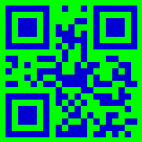

 
## **Read Inverted Barcode Images**
***Aspose.BarCode for .NET*** enables reading barcode images with inverted colors. To do this, it is required to enable a special parameter called [*AllowInvertImage*](https://reference.aspose.com/barcode/net/aspose.barcode.barcoderecognition/qualitysettings/properties/allowinvertimage). The following code snippet shows how to do that considering the provided barcode image as an example.


Console.WriteLine("InvertImage:");

//read barcode image with AllowInvertImage set to false
Console.WriteLine("AllowInvertImage: false");
using (BarCodeReader read = new BarCodeReader($"{path}aztec_regular_inverse.png", DecodeType.Aztec))
{
    read.QualitySettings.AllowInvertImage = false;
    Console.WriteLine($"Barcodes read: {read.ReadBarCodes().Length}");
    foreach (BarCodeResult result in read.FoundBarCodes)
        Console.WriteLine($"{result.CodeTypeName}:{result.CodeText}");
}

//read barcode image with AllowInvertImage set to true
Console.WriteLine("AllowInvertImage: true");
using (BarCodeReader read = new BarCodeReader($"{path}aztec_regular_inverse.png", DecodeType.Aztec))
{
    read.QualitySettings.AllowInvertImage = true;
    Console.WriteLine($"Barcodes read: {read.ReadBarCodes().Length}");
    foreach (BarCodeResult result in read.FoundBarCodes)
        Console.WriteLine($"{result.CodeTypeName}:{result.CodeText}");
}


  

View the results of code execution

  
InvertImage:  
- AllowInvertImage: false  
Barcodes read: 1  
Aztec:Aspose Regular  
- AllowInvertImage: true  
Barcodes read: 2  
Aztec:Aspose Regular  
Aztec:Aspose Inverse  
  

## **Read Colored Barcodes on Colored Background**
To read colored barcodes on a colored background, ***Aspose.BarCode for .NET*** provides a special parameter called [*AllowComplexBackground*](https://reference.aspose.com/barcode/net/aspose.barcode.barcoderecognition/qualitysettings/properties/allowcomplexbackground) that attempts to distinguish the colored background from barcode labels through color quantization and then subtract it. It should be noted that enabling this parameter results in considerable deceleration of recognition speed and thus should be used in special cases only. The following code sample explains how to implement subtraction of a colored barcode from the colored background, as demonstrated in the source image given below.
  


Console.WriteLine("ComplexBackground:");

//read barcode image with AllowComplexBackground set to false
Console.WriteLine("AllowComplexBackground: false");
using (BarCodeReader read = new BarCodeReader($"{path}qr_color.png", DecodeType.QR))
{
    read.QualitySettings.AllowComplexBackground = false;
    Console.WriteLine($"Barcodes read: {read.ReadBarCodes().Length}");
    foreach (BarCodeResult result in read.FoundBarCodes)
        Console.WriteLine($"{result.CodeTypeName}:{result.CodeText}");
}

//read barcode image with AllowComplexBackground set to true
Console.WriteLine("AllowComplexBackground: true");
using (BarCodeReader read = new BarCodeReader($"{path}qr_color.png", DecodeType.QR))
{
    read.QualitySettings.AllowComplexBackground = true;
    Console.WriteLine($"Barcodes read: {read.ReadBarCodes().Length}");
    foreach (BarCodeResult result in read.FoundBarCodes)
        Console.WriteLine($"{result.CodeTypeName}:{result.CodeText}");
}


  

View the results of code execution

ComplexBackground:  
- AllowComplexBackground: false  
Barcodes read: 0  
- AllowComplexBackground: true  
Barcodes read: 1  
QR:Aspose常に先を行く  
  

## **Read Industrial Data Matrix Barcodes**
Industrial *Data Matrix* barcodes often have dotted patterns or other decoration elements and are placed onto metallic surfaces, in this way, creating embossed indelible barcode labels. To facilitate the recognition of such barcodes, it is possible to enable a special parameter called [*AllowDatamatrixIndustrialBarcodes*](https://reference.aspose.com/barcode/net/aspose.barcode.barcoderecognition/qualitysettings/properties/allowdatamatrixindustrialbarcodes) that allows reading dashed labels in a slow mode. The following code snippet explains how to read sample industrial *Data Matrix* barcodes that are shown in the image below.


Console.WriteLine("DatamatrixIndustrialBarcodes:");

//read barcode image with AllowDatamatrixIndustrialBarcodes set to false
Console.WriteLine("AllowDatamatrixIndustrialBarcodes: false");
using (BarCodeReader read = new BarCodeReader($"{path}datamatrix_industrial.png", DecodeType.DataMatrix))
{
    read.QualitySettings.AllowDatamatrixIndustrialBarcodes = false;
    Console.WriteLine($"Barcodes read: {read.ReadBarCodes().Length}");
    foreach (BarCodeResult result in read.FoundBarCodes)
        Console.WriteLine($"{result.CodeTypeName}:{result.CodeText}");
}

//read barcode image with AllowDatamatrixIndustrialBarcodes set to true
Console.WriteLine("AllowDatamatrixIndustrialBarcodes: true");
using (BarCodeReader read = new BarCodeReader($"{path}datamatrix_industrial.png", DecodeType.DataMatrix))
{
    read.QualitySettings.AllowDatamatrixIndustrialBarcodes = true;
    Console.WriteLine($"Barcodes read: {read.ReadBarCodes().Length}");
    foreach (BarCodeResult result in read.FoundBarCodes)
        Console.WriteLine($"{result.CodeTypeName}:{result.CodeText}");
}


  

View the results of code execution

  
DatamatrixIndustrialBarcodes:  
- AllowDatamatrixIndustrialBarcodes: false  
Barcodes read: 0  
- AllowDatamatrixIndustrialBarcodes: true  
Barcodes read: 2  
DataMatrix:250623022021032007010300  
DataMatrix:StarDatamatrix  
  

