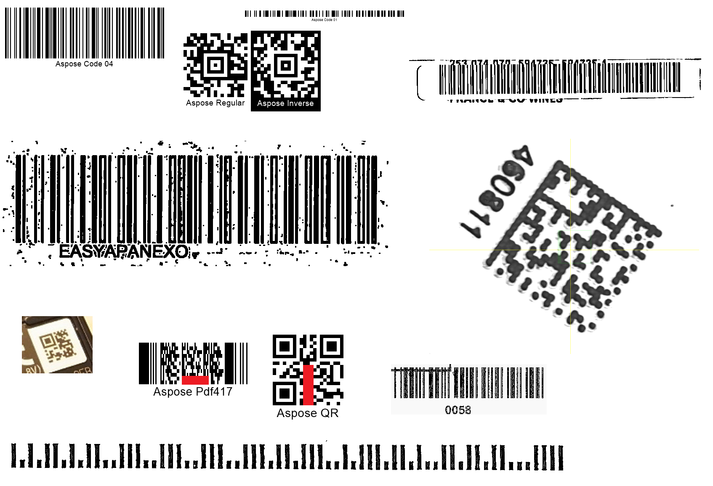

{}[Read Barcodes Online](https://products.aspose.app/barcode/recognize): You can check the quality of Aspose.BarCode recognition and view the results online.{}
## **Overview**
***Aspose.BarCode for .NET*** provides class [*QualitySettings*](https://reference.aspose.com/barcode/net/aspose.barcode.barcoderecognition/qualitysettings) that allows enabling and disabling various algorithms for image recovery to read barcodes with distortions or artifacts. In this way, class [*QualitySettings*](https://reference.aspose.com/barcode/net/aspose.barcode.barcoderecognition/qualitysettings) provides special parameters to customize the trade-off between reading speed and quality in regular situations. Such parameters are grouped into several presets that facilitate image recovery and barcode reading for different recognition scenarios.
{}*If you need any clarifications, feel free to reach out to [Aspose Technical Support](/barcode/net/technical-support/): ask your questions at [Aspose.Barcode Forum](https://forum.aspose.com/c/barcode/13) or contact [Aspose Paid Support Helpdesk](https://helpdesk.aspose.com/).*{}

## **Supported Presets**
This section provides detailed information about supported recognition presets, including *NormalQuality*, *HighPerformance*, *HighQuality*, *MaxQuality, as listed in the table below. By default, [*QualitySettings*](https://reference.aspose.com/barcode/net/aspose.barcode.barcoderecognition/qualitysettings) uses the *NormalQuality* preset.

|Recognition Preset|Description|
|---|---|
|[*HighPerformance*](https://reference.aspose.com/barcode/net/aspose.barcode.barcoderecognition/qualitysettings/properties/highperformance)| Suggested for high-quality barcode images |
|[*NormalQuality*](https://reference.aspose.com/barcode/net/aspose.barcode.barcoderecognition/qualitysettings/properties/normalquality)| Suitable for the most of barcodes with regular quality |
|[*HighQuality*](https://reference.aspose.com/barcode/net/aspose.barcode.barcoderecognition/qualitysettings/properties/highquality)| Intended for work with low-quality barcodes |
|[*MaxQuality*](https://reference.aspose.com/barcode/net/aspose.barcode.barcoderecognition/qualitysettings/properties/maxquality)| Intended for work with low-quality barcodes and uses all of the recognition methods. The recognuizton quality almost the same as *HighQuality* |


## **Supported Options**
This section provides detailed information about supported manually configured options, including *XDimension*, *BarcodeQuality*, *Deconvolution*, *InverseImage*, *ComplexBackground*, and others, as listed in the table below. 

|Recognition Options|Description|
|---|---|
|[*XDimension*](https://reference.aspose.com/barcode/net/aspose.barcode.barcoderecognition/qualitysettings/properties/xdimension)| Recognition mode which uses knowledge about barcode minimal element: matrix cell or bar. The knowledge about barcode minimal element is used to cutoff noise, text and non-barcode elements to increase performance. With using [*UseMinimalXDimension*](https://reference.aspose.com/barcode/net/aspose.barcode.barcoderecognition/xdimensionmode/) other property [*MinimalXDimension*](https://reference.aspose.com/barcode/net/aspose.barcode.barcoderecognition/qualitysettings/properties/minimalxdimension) is used to set minimal barcode element |
|[*MinimalXDimension*](https://reference.aspose.com/barcode/net/aspose.barcode.barcoderecognition/qualitysettings/properties/minimalxdimension)| Minimal size of [*XDimension*](https://reference.aspose.com/barcode/net/aspose.barcode.barcoderecognition/qualitysettings/properties/xdimension) in pixels which is used with [*UseMinimalXDimension*](https://reference.aspose.com/barcode/net/aspose.barcode.barcoderecognition/xdimensionmode/) |
|[*BarcodeQuality*](https://reference.aspose.com/barcode/net/aspose.barcode.barcoderecognition/qualitysettings/properties/barcodequality)| Mode which selects and enables methods to recognize barcode elements with the selected quality. Barcode elements with lower quality requires more heavy recognition methods which slows the recognition |
|[*Deconvolution*](https://reference.aspose.com/barcode/net/aspose.barcode.barcoderecognition/qualitysettings/properties/deconvolution)| Deconvolution (image restorations) mode defines level of image degradation. Originally deconvolution is a function which can restore image degraded (convoluted) by any natural function like blur, during obtaining image by camera. Because we cannot detect image function which corrupt the image, we have to check most well-known functions like [sharp](https://en.wikipedia.org/wiki/Kernel_(image_processing)) or [mathematical morphology](https://en.wikipedia.org/wiki/Mathematical_morphology) |
|[*InverseImage*](https://reference.aspose.com/barcode/net/aspose.barcode.barcoderecognition/qualitysettings/properties/inverseimage)| Mode which enables or disables additional recognition of barcodes on images with inverted colors (luminance) |
|[*ComplexBackground*](https://reference.aspose.com/barcode/net/aspose.barcode.barcoderecognition/qualitysettings/properties/complexbackground)| Mode which enables or disables additional recognition of color barcodes on color images |
|[*AllowIncorrectBarcodes*](https://reference.aspose.com/barcode/net/aspose.barcode.barcoderecognition/qualitysettings/properties/allowincorrectbarcodes)| Mode allows engine to recognize barcodes which has incorrect checksum or incorrect values. Mode can be used to recognize or mark damaged barcodes with incorrect text |

## **Deference in Barcode Reading with Quality Presets**
***Aspose.BarCode for .NET*** provides several universal recognition quality setting presets, such as [*HighPerformance*](https://reference.aspose.com/barcode/net/aspose.barcode.barcoderecognition/qualitysettings/properties/highperformance), [*NormalQuality*](https://reference.aspose.com/barcode/net/aspose.barcode.barcoderecognition/qualitysettings/properties/normalquality), [*HighQuality*](https://reference.aspose.com/barcode/net/aspose.barcode.barcoderecognition/qualitysettings/properties/highquality) and [*MaxQuality*](https://reference.aspose.com/barcode/net/aspose.barcode.barcoderecognition/qualitysettings/properties/maxquality). These presets allow establishing dependence between recognition quality and speed for all barcode types. In most cases, the [*NormalQuality*](https://reference.aspose.com/barcode/net/aspose.barcode.barcoderecognition/qualitysettings/properties/normalquality) preset, used by default is sufficient for the majority of barcodes that provide normal scanning quality.

The following table shows difference in recognition quality, depends on preset.

<p align="center"></p>

| HighPerformance Preset | NormalQuality Preset | HighQuality Preset | MaxQuality Preset | MaxQuality Preset and Incorrect Barcodes|
|---|---|---|---|---|
| Recognized barcodes: **5** | Recognized barcodes: **7** | Recognized barcodes: **10** | Recognized barcodes: **10** | Recognized barcodes: **12** |

``` csharp
Console.WriteLine("ReadQualityPresets:");
//recognize image with HighPerformance
Console.WriteLine("ReadQualityPresets: HighPerformance");
using (BarCodeReader read = new BarCodeReader($"{path}barcodes_different_quality.png", DecodeType.Code128,
    DecodeType.Code39Extended, DecodeType.Planet, DecodeType.QR, DecodeType.MicroQR, DecodeType.Pdf417, DecodeType.DataMatrix, DecodeType.Aztec))
{
    read.QualitySettings = QualitySettings.HighPerformance;
    Console.WriteLine($"Barcodes read: {read.ReadBarCodes().Length}");
    foreach (BarCodeResult result in read.FoundBarCodes)
        Console.WriteLine($"{result.CodeTypeName}:{result.CodeText}");
}

//recognize image with NormalQuality
Console.WriteLine("ReadQualityPresets: NormalQuality");
using (BarCodeReader read = new BarCodeReader($"{path}barcodes_different_quality.png", DecodeType.Code128,
    DecodeType.Code39Extended, DecodeType.Planet, DecodeType.QR, DecodeType.MicroQR, DecodeType.Pdf417, DecodeType.DataMatrix, DecodeType.Aztec))
{
    read.QualitySettings = QualitySettings.NormalQuality;
    Console.WriteLine($"Barcodes read: {read.ReadBarCodes().Length}");
    foreach (BarCodeResult result in read.FoundBarCodes)
        Console.WriteLine($"{result.CodeTypeName}:{result.CodeText}");
}

//recognize image with HighQuality
Console.WriteLine("ReadQualityPresets: HighQuality");
using (BarCodeReader read = new BarCodeReader($"{path}barcodes_different_quality.png", DecodeType.Code128,
    DecodeType.Code39Extended, DecodeType.Planet, DecodeType.QR, DecodeType.MicroQR, DecodeType.Pdf417, DecodeType.DataMatrix, DecodeType.Aztec))
{
    read.QualitySettings = QualitySettings.HighQuality;
    Console.WriteLine($"Barcodes read: {read.ReadBarCodes().Length}");
    foreach (BarCodeResult result in read.FoundBarCodes)
        Console.WriteLine($"{result.CodeTypeName}:{result.CodeText}");
}

//recognize image with MaxQuality
Console.WriteLine("ReadQualityPresets: MaxQuality");
using (BarCodeReader read = new BarCodeReader($"{path}barcodes_different_quality.png", DecodeType.Code128,
    DecodeType.Code39Extended, DecodeType.Planet, DecodeType.QR, DecodeType.MicroQR, DecodeType.Pdf417, DecodeType.DataMatrix, DecodeType.Aztec))
{
    read.QualitySettings = QualitySettings.MaxQuality;
    Console.WriteLine($"Barcodes read: {read.ReadBarCodes().Length}");
    foreach (BarCodeResult result in read.FoundBarCodes)
        Console.WriteLine($"{result.CodeTypeName}:{result.CodeText}");
}

//recognize image with MaxQuality and Incorrect Barcodes
Console.WriteLine("ReadQualityPresets: MaxQuality and Incorrect Barcodes");
using (BarCodeReader read = new BarCodeReader($"{path}barcodes_different_quality.png", DecodeType.Code128,
    DecodeType.Code39Extended, DecodeType.Planet, DecodeType.QR, DecodeType.MicroQR, DecodeType.Pdf417, DecodeType.DataMatrix, DecodeType.Aztec))
{
    read.QualitySettings = QualitySettings.MaxQuality;
    read.QualitySettings.AllowIncorrectBarcodes = true;
    Console.WriteLine($"Barcodes read: {read.ReadBarCodes().Length}");
    foreach (BarCodeResult result in read.FoundBarCodes)
        Console.WriteLine($"{result.CodeTypeName}:{result.CodeText}");
}
```

<details>  
<summary>View the results of code execution</summary>

```text
ReadQualityPresets:
ReadQualityPresets: HighPerformance
Barcodes read: 5
Code128:Aspose Code 04
Aztec:Aspose Regular
Code39Extended:/YYAD25HL
MicroQR:FV50CE
Code39Extended:0058
ReadQualityPresets: NormalQuality
Barcodes read: 7
Code128:Aspose Code 04
Aztec:Aspose Regular
Code39Extended:/YYAD25HL
MicroQR:FV50CE
DataMatrix:D19-WQ9-F91046-0811
Code39Extended:0058
Planet:990000837284
ReadQualityPresets: HighQuality
Barcodes read: 10
Code128:Aspose Code 04
Code128:Aspose Code 01
Aztec:Aspose Regular
Aztec:Aspose Inverse
Code128:JJBEA129955634111200235
Code128:EASYAPANEXO
MicroQR:FV50CE
DataMatrix:D19-WQ9-F91046-0811
Code39Extended:0058
Planet:990000837284
ReadQualityPresets: MaxQuality
Barcodes read: 10
Code128:Aspose Code 04
Code128:Aspose Code 01
Aztec:Aspose Regular
Aztec:Aspose Inverse
Code128:JJBEA129955634111200235
Code128:EASYAPANEXO
MicroQR:FV50CE
DataMatrix:D19-WQ9-F91046-0811
Code39Extended:0058
Planet:990000837284
ReadQualityPresets: MaxQuality and Incorrect Barcodes
Barcodes read: 12
Code128:Aspose Code 04
Code128:Aspose Code 01
Aztec:Aspose Regular
Aztec:Aspose Inverse
Code128:JJBEA129955634111200235
Code128:EASYAPANEXO
MicroQR:FV50CE
QR:Aspose QR
DataMatrix:D19-WQ9-F91046-0811
Pdf417:Aspose Pdf417
Code39Extended:0058
Planet:990000837284
```

</details>

## **Read Evidently Incorrect Barcodes**
To read all barcodes potentially presented in an image including incorrect ones, ***Aspose.BarCode for .NET*** provides a special option called [*AllowIncorrectBarcodes*](https://reference.aspose.com/barcode/net/aspose.barcode.barcoderecognition/qualitysettings/properties/allowincorrectbarcodes). This option tries to mark or partially recognize barcodes which could not pass checksum check and can be used only for debugging purposes. In this case, the barcode data is decoded with the [*Confidence*](https://reference.aspose.com/barcode/net/aspose.barcode.barcoderecognition/barcoderesult/properties/confidence) level being *None*, which means that the correctness of recognition is not guaranteed.  

The following code snippet explains how to force the recognition of the barcode known as unreadable:

<p align="center"></p>

| Incorrect Barcodes: disabled | Incorrect Barcodes: enabled |
|---|---|
| Recognized barcodes: **0** | Recognized barcodes: **2** |

``` csharp
Console.WriteLine("ReadIncorrectBarcodes:");
//recognize image with disabled AllowIncorrectBarcodes
Console.WriteLine("AllowIncorrectBarcodes: false");
using (BarCodeReader read = new BarCodeReader($"{path}pdf417_qr_corrupted.png", DecodeType.QR, DecodeType.Pdf417))
{
    read.QualitySettings.AllowIncorrectBarcodes = false;
    Console.WriteLine($"Barcodes read: {read.ReadBarCodes().Length}");
    foreach (BarCodeResult result in read.FoundBarCodes)
        Console.WriteLine($"{result.CodeTypeName}:{result.CodeText}");
}

//recognize image with enambled AllowIncorrectBarcodes
Console.WriteLine("AllowIncorrectBarcodes: true");
using (BarCodeReader read = new BarCodeReader($"{path}pdf417_qr_corrupted.png", DecodeType.QR, DecodeType.Pdf417))
{
    read.QualitySettings.AllowIncorrectBarcodes = true;
    Console.WriteLine($"Barcodes read: {read.ReadBarCodes().Length}");
    foreach (BarCodeResult result in read.FoundBarCodes)
        Console.WriteLine($"{result.CodeTypeName}:{result.CodeText}");
}
```

<details>  
<summary>View the results of code execution</summary>

```text  
ReadIncorrectBarcodes:
AllowIncorrectBarcodes: false
Barcodes read: 0
AllowIncorrectBarcodes: true
Barcodes read: 2
Pdf417:Aspose Pdf417
QR:Aspose QR
```

</details>
