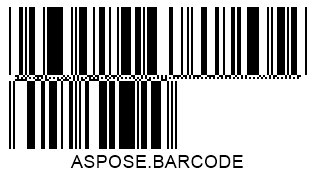

  

## **Read Metadata from PDF417, Macro PDF417 and Micro PDF417 Barcodes**

To read metadata from *PDF417* and *Micro PDF417* barcodes, ***Aspose.BarCode for .NET*** provides a group of properties called [*Pdf417ExtendedParameters*](https://reference.aspose.com/barcode/net/aspose.barcode.barcoderecognition/pdf417extendedparameters).

### **Read Structured Append and Macro fields from PDF417 and Micro PDF417 Barcodes**  

Described in the table Structured Append and Macro fields can be read from *PDF417* and *Micro PDF417* Barcodes:

|PDF417 Metadata Field|Description|
|---|---|
|[*Pdf417MacroFileID*](https://reference.aspose.com/barcode/net/aspose.barcode.generation/pdf417parameters/properties/pdf417macrofileid)|Unique identifier of a barcode series or PDF417 file|
|[*Pdf417MacroSegmentID*](https://reference.aspose.com/barcode/net/aspose.barcode.generation/pdf417parameters/properties/pdf417macrosegmentid)|Current segment identifier|
|[*Pdf417MacroSegmentsCount*](https://reference.aspose.com/barcode/net/aspose.barcode.generation/pdf417parameters/properties/pdf417macrosegmentscount)|Number of barcodes in a series|
|[*Pdf417MacroFileName*](https://reference.aspose.com/barcode/net/aspose.barcode.generation/pdf417parameters/properties/pdf417macrofilename)|Name of a file|
|[*Pdf417MacroChecksum*](https://reference.aspose.com/barcode/net/aspose.barcode.generation/pdf417parameters/properties/pdf417macrochecksum)|Checksum of a file that is calculated using CCITT-16 polynomial|
|[*Pdf417MacroFileSize*](https://reference.aspose.com/barcode/net/aspose.barcode.generation/pdf417parameters/properties/pdf417macrofilesize)|Total size of bytes in a series|
|[*Pdf417MacroTimeStamp*](https://reference.aspose.com/barcode/net/aspose.barcode.generation/pdf417parameters/properties/pdf417macrotimestamp)|Time of creating/sending the file|
|[*Pdf417MacroAddressee*](https://reference.aspose.com/barcode/net/aspose.barcode.generation/pdf417parameters/properties/pdf417macroaddressee)|Address of the file sender|
|[*Pdf417MacroSender*](https://reference.aspose.com/barcode/net/aspose.barcode.generation/pdf417parameters/properties/pdf417macrosender)|Name of the file sender|

The following code snippet shows how to get Structured Append and Macro fields from a sample *PDF417* barcode provided below.    
 
``` csharp
//generate MacroPdf417 with metadata
using (BarcodeGenerator gen = new BarcodeGenerator(EncodeTypes.MacroPdf417, "Åspóse.Barcóde©"))
{
    gen.Parameters.Barcode.XDimension.Pixels = 2;
    gen.Parameters.Barcode.Pdf417.Columns = 5;
    gen.Parameters.Barcode.Pdf417.Pdf417MacroFileID = 12345678;
    gen.Parameters.Barcode.Pdf417.Pdf417MacroSegmentID = 12;
    gen.Parameters.Barcode.Pdf417.Pdf417MacroSegmentsCount = 20;
    gen.Parameters.Barcode.Pdf417.Pdf417MacroFileName = "file01";
    //checksumm must be calculated in CCITT-16 / CRC-16-CCITT encoding
    //https://en.wikipedia.org/wiki/Cyclic_redundancy_check#Polynomial_representations_of_cyclic_redundancy_checks
    //for the example we use random number
    gen.Parameters.Barcode.Pdf417.Pdf417MacroChecksum = 1234;
    gen.Parameters.Barcode.Pdf417.Pdf417MacroFileSize = 400000;
    gen.Parameters.Barcode.Pdf417.Pdf417MacroTimeStamp = new DateTime(2019, 11, 1);
    gen.Parameters.Barcode.Pdf417.Pdf417MacroAddressee = "street";
    gen.Parameters.Barcode.Pdf417.Pdf417MacroSender = "aspose";
    gen.Parameters.Barcode.Pdf417.Pdf417MacroTerminator = Pdf417MacroTerminator.Set;
    gen.Save($"{path}ExtPDF417Meta.png", BarCodeImageFormat.Png);
}

//try to recognize Pdf417 metadata
Console.WriteLine("ReadExtPDF417Meta:");
using (BarCodeReader read = new BarCodeReader($"{path}ExtPDF417Meta.png", DecodeType.MacroPdf417))
{
    foreach (BarCodeResult result in read.ReadBarCodes())
    {
        Console.WriteLine($"CodeType:{result.CodeTypeName}");
        Console.WriteLine($"CodeText:{result.CodeText}");
        Console.WriteLine($"Pdf417MacroFileID:{result.Extended.Pdf417.MacroPdf417FileID}");
        Console.WriteLine($"Pdf417MacroSegmentID:{result.Extended.Pdf417.MacroPdf417SegmentID.ToString()}");
        Console.WriteLine($"Pdf417MacroSegmentsCount:{result.Extended.Pdf417.MacroPdf417SegmentsCount.ToString()}");
        Console.WriteLine($"Pdf417MacroFileName:{result.Extended.Pdf417.MacroPdf417FileName}");
        Console.WriteLine($"Pdf417MacroChecksum:{result.Extended.Pdf417.MacroPdf417Checksum.ToString()}");
        Console.WriteLine($"Pdf417MacroFileSize:{result.Extended.Pdf417.MacroPdf417FileSize.ToString()}");
        Console.WriteLine($"Pdf417MacroTimeStamp:{result.Extended.Pdf417.MacroPdf417TimeStamp.ToString()}");
        Console.WriteLine($"Pdf417MacroAddressee:{result.Extended.Pdf417.MacroPdf417Addressee}");
        Console.WriteLine($"Pdf417MacroSender:{result.Extended.Pdf417.MacroPdf417Sender}");
        Console.WriteLine($"MacroPdf417Terminator:{result.Extended.Pdf417.MacroPdf417Terminator}");
    }
}
```

<p align="center"></p>  

### **Read Special Modes Indicators from PDF417 and Micro PDF417 Barcodes**
Also, the indicators of special modes can be read from [*Pdf417ExtendedParameters*](https://reference.aspose.com/barcode/net/aspose.barcode.barcoderecognition/pdf417extendedparameters). To read the flag which marks contained in barcode data is instructions for initialization or reprogramming of the bar code reader you can use [*IsReaderInitialization*](https://reference.aspose.com/barcode/net/aspose.barcode.barcoderecognition/pdf417extendedparameters/isreaderinitialization/) property.
``` csharp
//generate MacroPdf417 with Reader Initialization
using (BarcodeGenerator gen = new BarcodeGenerator(EncodeTypes.Pdf417, "Åspóse.Barcóde©"))
{
    gen.Parameters.Barcode.XDimension.Pixels = 2;
    gen.Parameters.Barcode.Pdf417.Columns = 5;
    gen.Parameters.Barcode.Pdf417.IsReaderInitialization = true;
    gen.Save($"{path}ExtPDF417MetaReaderInitialization.png", BarCodeImageFormat.Png);
}

//try to recognize Pdf417 Reader Initialization
Console.WriteLine("ReadExtPDF417Meta: Reader Initialization");
using (BarCodeReader read = new BarCodeReader($"{path}ExtPDF417MetaReaderInitialization.png", DecodeType.Pdf417))
{
    foreach (BarCodeResult result in read.ReadBarCodes())
    {
        Console.WriteLine($"CodeType:{result.CodeTypeName}");
        Console.WriteLine($"CodeText:{result.CodeText}");
        Console.WriteLine($"IsReaderInitialization:{result.Extended.Pdf417.IsReaderInitialization}");
    }
}
```
<p align="center"></p>  

To read linked state of *PDF417* and *Micro PDF417* barcodes you can use property [*IsLinked*](https://reference.aspose.com/barcode/net/aspose.barcode.barcoderecognition/pdf417extendedparameters/islinked/). This property is set if modes 906, 907, 912, 914, 915, 918, 920 are present in barcode data.

``` csharp
//generate MacroPdf417 with Linked state
using (BarcodeGenerator gen = new BarcodeGenerator(EncodeTypes.MicroPdf417, "Åspóse.Barcóde©"))
{
    gen.Parameters.Barcode.XDimension.Pixels = 2;
    gen.Parameters.Barcode.Pdf417.IsLinked = true;
    gen.Save($"{path}ExtPDF417MetaLinked.png", BarCodeImageFormat.Png);
}

//try to recognize Pdf417 Linked state
Console.WriteLine("ReadExtPDF417Meta: Linked state");
using (BarCodeReader read = new BarCodeReader($"{path}ExtPDF417MetaLinked.png", DecodeType.MicroPdf417))
{
    foreach (BarCodeResult result in read.ReadBarCodes())
    {
        Console.WriteLine($"CodeType:{result.CodeTypeName}");
        Console.WriteLine($"CodeText:{result.CodeText}");
        Console.WriteLine($"IsLinked:{result.Extended.Pdf417.IsLinked}");
    }
}
```
<p align="center"></p>  

To read Code128 emulation state, which can be set to *Micro PDF417* barcodes, you can use property [*IsCode128Emulation*](https://reference.aspose.com/barcode/net/aspose.barcode.barcoderecognition/pdf417extendedparameters/iscode128emulation/). This property is set if modes 908, 909, 910, 911 are present in barcode data.
``` csharp
//generate MacroPdf417 with Code128 Emulation state
using (BarcodeGenerator gen = new BarcodeGenerator(EncodeTypes.MicroPdf417, "Aspose.Barcode"))
{
    gen.Parameters.Barcode.XDimension.Pixels = 2;
    gen.Parameters.Barcode.Pdf417.IsCode128Emulation = true;
    gen.Save($"{path}ExtPDF417MetaCode128Emulation.png", BarCodeImageFormat.Png);
}

//try to recognize Pdf417 Linked state
Console.WriteLine("ReadExtPDF417Meta: Code128 Emulation");
using (BarCodeReader read = new BarCodeReader($"{path}ExtPDF417MetaCode128Emulation.png", DecodeType.MicroPdf417))
{
    foreach (BarCodeResult result in read.ReadBarCodes())
    {
        Console.WriteLine($"CodeType:{result.CodeTypeName}");
        Console.WriteLine($"CodeText:{result.CodeText}");
        Console.WriteLine($"IsCode128Emulation:{result.Extended.Pdf417.IsCode128Emulation}");
    }
}
```
<p align="center"></p>  

## **Read Metadata from QR Code with Structured Append**
To read metadata from *QR Code* barcodes, it is necessary to use a group of properties called [*QrExtendedParameters*](https://reference.aspose.com/barcode/net/aspose.barcode.barcoderecognition/qrextendedparameters). These properties enable reading the information about *QR Code* barcodes with structured append that allows combining several *QR Code* labels into one. This information includes the following fields:

- [*QRStructuredAppendModeBarCodeIndex*](https://reference.aspose.com/barcode/net/aspose.barcode.barcoderecognition/qrextendedparameters/properties/qrstructuredappendmodebarcodeindex) - the sequence number of the current barcode (starting from 0)
- [*QRStructuredAppendModeBarCodesQuantity*](https://reference.aspose.com/barcode/net/aspose.barcode.barcoderecognition/qrextendedparameters/properties/qrstructuredappendmodebarcodesquantity) - the number of barcodes in a composite *QR Code* image (can take values from 2 to 16)
- [*QRStructuredAppendModeParityData*](https://reference.aspose.com/barcode/net/aspose.barcode.barcoderecognition/qrextendedparameters/properties/qrstructuredappendmodeparitydata) - a byte that serves as a checksum identifier. In the general case, it is calculated as *XOR* of all bytes in which UTF16BE symbols are encoded using two bytes  
  
The code snippet given below explains how to get metadata for a sample *QR Code* image with structured append.
   

//generate QR with metadata
using (BarcodeGenerator gen = new BarcodeGenerator(EncodeTypes.QR, "Åspóse.Barcóde©"))
{
    gen.Parameters.Barcode.XDimension.Pixels = 4;
    gen.Parameters.Barcode.QR.StructuredAppend.TotalCount = 3;
    gen.Parameters.Barcode.QR.StructuredAppend.SequenceIndicator = 1;
    gen.Parameters.Barcode.QR.StructuredAppend.ParityByte = 123;
    gen.Save($"{path}ExtQRMeta.png", BarCodeImageFormat.Png);
}

//attempt to recognize QR metadata
Console.WriteLine("ReadExtQRMeta:");
using (BarCodeReader read = new BarCodeReader($"{path}ExtQRMeta.png", DecodeType.QR))
{
    foreach (BarCodeResult result in read.ReadBarCodes())
    {
        Console.WriteLine($"CodeType:{result.CodeTypeName}");
        Console.WriteLine($"CodeText:{result.CodeText}");
        Console.WriteLine($"BarCodesQuantity:{result.Extended.QR.QRStructuredAppendModeBarCodesQuantity}");
        Console.WriteLine($"BarCodeIndex:{result.Extended.QR.QRStructuredAppendModeBarCodeIndex}");
        Console.WriteLine($"ParityData:{result.Extended.QR.QRStructuredAppendModeParityData}");
    }
}


<p align="center"></p>

## **Read Metadata from Aztec Code**

Metadata can be read from *Aztec Code* barcodes with the group of properties called [*AztecExtendedParameters*](https://reference.aspose.com/barcode/net/aspose.barcode.barcoderecognition/aztecextendedparameters/). These properties enable reading the extended information about *Aztec Code* barcodes like:
- [*IsReaderInitialization*](https://reference.aspose.com/barcode/net/aspose.barcode.barcoderecognition/aztecextendedparameters/isreaderinitialization/) – indicates that contained in barcode data is instructions for initialization or reprogramming of the bar code reader;
- [*StructuredAppendBarcodeId*](https://reference.aspose.com/barcode/net/aspose.barcode.barcoderecognition/aztecextendedparameters/structuredappendbarcodeid/) – is a barcode part in sequence, can be from 1 to 26 and cannot be more than StructuredAppendBarcodesCount;
- [*StructuredAppendBarcodesCount*](https://reference.aspose.com/barcode/net/aspose.barcode.barcoderecognition/aztecextendedparameters/structuredappendbarcodescount/) – counts of barcode parts in the sequence, can be from 1 to 26;
- [*StructuredAppendFileId*](https://reference.aspose.com/barcode/net/aspose.barcode.barcoderecognition/aztecextendedparameters/structuredappendfileid/) – variable string from digits, uppercase and lowercase letters, which defines the barcode group. Maximal size of the string is 24 symbols, space is not supported.

The following code snippet shows how to get metadata from a sample *Aztec Code* barcode provided below.

``` csharp
//generate Aztec with metadata
using (BarcodeGenerator gen = new BarcodeGenerator(EncodeTypes.Aztec, "Åspóse.Barcóde©"))
{
    gen.Parameters.Barcode.XDimension.Pixels = 4;
    gen.Parameters.Barcode.Aztec.AztecSymbolMode = AztecSymbolMode.FullRange;
    gen.Parameters.Barcode.Aztec.IsReaderInitialization = true;
    gen.Parameters.Barcode.Aztec.StructuredAppendBarcodeId = 2;
    gen.Parameters.Barcode.Aztec.StructuredAppendBarcodesCount = 4;
    gen.Parameters.Barcode.Aztec.StructuredAppendFileId = "File01";

    gen.Save($"{path}ExtAztecMeta.png", BarCodeImageFormat.Png);
}

//try to recognize Aztec metadata
Console.WriteLine("ReadExtAztecMeta:");
using (BarCodeReader read = new BarCodeReader($"{path}ExtAztecMeta.png", DecodeType.Aztec))
{
    foreach (BarCodeResult result in read.ReadBarCodes())
    {
        Console.WriteLine($"CodeType:{result.CodeTypeName}");
        Console.WriteLine($"CodeText:{result.CodeText}");
        Console.WriteLine($"IsReaderInitialization:{result.Extended.Aztec.IsReaderInitialization}");
        Console.WriteLine($"StructuredAppendBarcodeId:{result.Extended.Aztec.StructuredAppendBarcodeId}");
        Console.WriteLine($"StructuredAppendBarcodesCount:{result.Extended.Aztec.StructuredAppendBarcodesCount}");
        Console.WriteLine($"StructuredAppendFileId:{result.Extended.Aztec.StructuredAppendFileId}");
    }
}
```
<p align="center"></p>

## **Read Metadata from DataMatrix**

Metadata can be read from *DataMatrix* barcodes with the group of properties called [*DataMatrixExtendedParameters*](https://reference.aspose.com/barcode/net/aspose.barcode.barcoderecognition/datamatrixextendedparameters/).

You can read with the property [*IsReaderProgramming*](https://reference.aspose.com/barcode/net/aspose.barcode.barcoderecognition/datamatrixextendedparameters/isreaderprogramming/) the flag which marks contained in barcode data is instructions for initialization or reprogramming of the bar code reader.

``` csharp
//generate DataMatrix with Reader Programming metadata
using (BarcodeGenerator gen = new BarcodeGenerator(EncodeTypes.DataMatrix, "Åspóse.Barcóde©"))
{
    gen.Parameters.Barcode.XDimension.Pixels = 4;
    gen.Parameters.Barcode.DataMatrix.IsReaderProgramming = true;

    gen.Save($"{path}ExtDataMatrixMetaReaderProgramming.png", BarCodeImageFormat.Png);
}

//try to recognize DataMatrix metadata Reader Programming
Console.WriteLine("ReadExtDataMatrixMeta: Reader Programming");
using (BarCodeReader read = new BarCodeReader($"{path}ExtDataMatrixMetaReaderProgramming.png", DecodeType.DataMatrix))
{
    foreach (BarCodeResult result in read.ReadBarCodes())
    {
        Console.WriteLine($"CodeType:{result.CodeTypeName}");
        Console.WriteLine($"CodeText:{result.CodeText}");
        Console.WriteLine($"IsReaderProgramming:{result.Extended.DataMatrix.IsReaderProgramming}");
    }
}
```
<p align="center"></p>

The *Structured Append* properties shows is the *DataMatrix* a part of barcode sequence and includes the following fields:
- [*StructuredAppendBarcodeId*](https://reference.aspose.com/barcode/net/aspose.barcode.barcoderecognition/datamatrixextendedparameters/structuredappendbarcodeid/) – identifier of barcode id in sequence, which starts from 1 and must be less or equal to barcodes count.
- [*StructuredAppendBarcodesCount*](https://reference.aspose.com/barcode/net/aspose.barcode.barcoderecognition/datamatrixextendedparameters/structuredappendbarcodescount/) – count of barcodes in sequence, can be from 2 to 16.
- [*StructuredAppendFileId*](https://reference.aspose.com/barcode/net/aspose.barcode.barcoderecognition/datamatrixextendedparameters/structuredappendfileid/) – the value from 1 to 64516 which identifies group of sequence.

``` csharp
//generate DataMatrix with Structured Append metadata
using (BarcodeGenerator gen = new BarcodeGenerator(EncodeTypes.DataMatrix, "Åspóse.Barcóde©"))
{
    gen.Parameters.Barcode.XDimension.Pixels = 4;
    gen.Parameters.Barcode.DataMatrix.StructuredAppendBarcodesCount = 4;
    gen.Parameters.Barcode.DataMatrix.StructuredAppendBarcodeId = 2;
    gen.Parameters.Barcode.DataMatrix.StructuredAppendFileId = 4321;

    gen.Save($"{path}ExtDataMatrixMetaStructuredAppend.png", BarCodeImageFormat.Png);
}

//try to recognize DataMatrix metadata Structured Append
Console.WriteLine("ReadExtDataMatrixMeta: Structured Append");
using (BarCodeReader read = new BarCodeReader($"{path}ExtDataMatrixMetaStructuredAppend.png", DecodeType.DataMatrix))
{
    foreach (BarCodeResult result in read.ReadBarCodes())
    {
        Console.WriteLine($"CodeType:{result.CodeTypeName}");
        Console.WriteLine($"CodeText:{result.CodeText}");
        Console.WriteLine($"StructuredAppendBarcodesCount:{result.Extended.DataMatrix.StructuredAppendBarcodesCount}");
        Console.WriteLine($"StructuredAppendBarcodeId:{result.Extended.DataMatrix.StructuredAppendBarcodeId}");
        Console.WriteLine($"StructuredAppendFileId:{result.Extended.DataMatrix.StructuredAppendFileId}");
    }
}
```
<p align="center"></p>

## **Read Metadata from DotCode**

Metadata can be read from *DotCode* barcodes with the group of properties called [*DotCodeExtendedParameters*](https://reference.aspose.com/barcode/net/aspose.barcode.barcoderecognition/dotcodeextendedparameters/). These properties enable reading the extended information about *DotCode* barcodes like:
- [*DotCodeIsReaderInitialization*](https://reference.aspose.com/barcode/net/aspose.barcode.barcoderecognition/dotcodeextendedparameters/dotcodeisreaderinitialization/) – indicates that contained in barcode data is instructions for initialization or reprogramming of the bar code reader;
- [*DotCodeStructuredAppendModeBarcodeId*](https://reference.aspose.com/barcode/net/aspose.barcode.barcoderecognition/dotcodeextendedparameters/dotcodestructuredappendmodebarcodeid/) – identifier of barcode id in sequence, which starts from 1 and must be less or equal to barcodes count.
- [*DotCodeStructuredAppendModeBarcodesCount*](https://reference.aspose.com/barcode/net/aspose.barcode.barcoderecognition/dotcodeextendedparameters/dotcodestructuredappendmodebarcodescount/) – count of barcodes in sequence, can be from 1 to 35.

``` csharp
//generate DotCode with metadata
using (BarcodeGenerator gen = new BarcodeGenerator(EncodeTypes.DotCode, "Åspóse.Barcóde©"))
{
    gen.Parameters.Barcode.XDimension.Pixels = 4;
    gen.Parameters.Barcode.DotCode.IsReaderInitialization = true;
    gen.Parameters.Barcode.DotCode.DotCodeStructuredAppendModeBarcodesCount = 4;
    gen.Parameters.Barcode.DotCode.DotCodeStructuredAppendModeBarcodeId = 2;

    gen.Save($"{path}ExtDotCodeMeta.png", BarCodeImageFormat.Png);
}

//try to recognize DotCode metadata
Console.WriteLine("ReadExtDotCodeMeta:");
using (BarCodeReader read = new BarCodeReader($"{path}ExtDotCodeMeta.png", DecodeType.DotCode))
{
    foreach (BarCodeResult result in read.ReadBarCodes())
    {
        Console.WriteLine($"CodeType:{result.CodeTypeName}");
        Console.WriteLine($"CodeText:{result.CodeText}");
        Console.WriteLine($"DotCodeIsReaderInitialization:{result.Extended.DotCode.DotCodeIsReaderInitialization}");
        Console.WriteLine($"DotCodeStructuredAppendModeBarcodesCount:{result.Extended.DotCode.DotCodeStructuredAppendModeBarcodesCount}");
        Console.WriteLine($"DotCodeStructuredAppendModeBarcodeId:{result.Extended.DotCode.DotCodeStructuredAppendModeBarcodeId}");
    }
}
```
<p align="center"></p>

## **Read Metadata from MaxiCode**
Metadata can be read from *MaxiCode* barcodes with the group of properties called [*MaxiCodeExtendedParameters*](https://reference.aspose.com/barcode/net/aspose.barcode.barcoderecognition/maxicodeextendedparameters/). These properties enable reading the extended information about *MaxiCode* barcodes like:
- [*MaxiCodeMode*](https://reference.aspose.com/barcode/net/aspose.barcode.barcoderecognition/maxicodeextendedparameters/maxicodemode/) – indicates in which mode (from 2 to 6) the barcode data was encoded. Modes 4,5 are modes for general data encoding and mode 6 is instructions for initialization or reprogramming of the bar code reader;
- [*MaxiCodeStructuredAppendModeBarcodeId*](https://reference.aspose.com/barcode/net/aspose.barcode.barcoderecognition/maxicodeextendedparameters/maxicodestructuredappendmodebarcodeid/) – identifier of barcode id in sequence, which starts from 1 and must be less or equal to barcodes count.
- [*MaxiCodeStructuredAppendModeBarcodesCount*](https://reference.aspose.com/barcode/net/aspose.barcode.barcoderecognition/maxicodeextendedparameters/maxicodestructuredappendmodebarcodescount/)– count of barcodes in sequence, can be from 2 to 8.

``` csharp
//generate MaxiCode with metadata
using (BarcodeGenerator gen = new BarcodeGenerator(EncodeTypes.MaxiCode, "Åspóse.Barcóde©"))
{
    gen.Parameters.Barcode.MaxiCode.MaxiCodeMode = MaxiCodeMode.Mode5;
    gen.Parameters.Barcode.MaxiCode.MaxiCodeStructuredAppendModeBarcodesCount = 4;
    gen.Parameters.Barcode.MaxiCode.MaxiCodeStructuredAppendModeBarcodeId = 2;

    gen.Save($"{path}ExtMaxiCodeMeta.png", BarCodeImageFormat.Png);
}

//try to recognize MaxiCode metadata
Console.WriteLine("ReadExtMaxiCodeMeta:");
using (BarCodeReader read = new BarCodeReader($"{path}ExtMaxiCodeMeta.png", DecodeType.MaxiCode))
{
    foreach (BarCodeResult result in read.ReadBarCodes())
    {
        Console.WriteLine($"CodeType:{result.CodeTypeName}");
        Console.WriteLine($"CodeText:{result.CodeText}");
        Console.WriteLine($"MaxiCodeMode:{result.Extended.MaxiCode.MaxiCodeMode.ToString()}");
        Console.WriteLine($"MaxiCodeStructuredAppendModeBarcodesCount:{result.Extended.MaxiCode.MaxiCodeStructuredAppendModeBarcodesCount}");
        Console.WriteLine($"MaxiCodeStructuredAppendModeBarcodeId:{result.Extended.MaxiCode.MaxiCodeStructuredAppendModeBarcodeId}");
    }
}
```
<p align="center"></p>

## **Read Metadata from GS1 Composite**
*GS1 Composite* barcodes consists from *1D* and *2D* symbol which are combined into one barcode. And sometimes we need to know what symbology is used as *1D* symbol and sometimes as *2D*. Also, you can read data, which separately was encoded in *1D* and *2D* symbols. To do this you can use group of properties called [*GS1CompositeBarExtendedParameters*](https://reference.aspose.com/barcode/net/aspose.barcode.barcoderecognition/gs1compositebarextendedparameters/) which includes the following options:
- [*OneDType*](https://reference.aspose.com/barcode/net/aspose.barcode.barcoderecognition/gs1compositebarextendedparameters/onedtype/) – *1D (linear)* barcode type of *GS1 Composite* barcode;
- [*OneDCodeText*](https://reference.aspose.com/barcode/net/aspose.barcode.barcoderecognition/gs1compositebarextendedparameters/onedcodetext/) – *1D (linear)* barcode value of *GS1 Composite* barcode;
- [*TwoDType*](https://reference.aspose.com/barcode/net/aspose.barcode.barcoderecognition/gs1compositebarextendedparameters/twodtype/) – *2D* barcode type of *GS1 Composite* barcode;
- [*TwoDCodeText*](https://reference.aspose.com/barcode/net/aspose.barcode.barcoderecognition/gs1compositebarextendedparameters/twodcodetext/) – *2D* barcode value of *GS1 Composite* barcode.

``` csharp
//generate GS1CompositeBar with metadata

using (BarcodeGenerator gen = new BarcodeGenerator(EncodeTypes.GS1CompositeBar, "(01)98898765432106(3202)012345|(10)ABCD0123(240)0123456789"))
{
    gen.Parameters.Barcode.XDimension.Pixels = 2;
    gen.Parameters.Barcode.CodeTextParameters.Location = CodeLocation.None;
    gen.Parameters.Barcode.GS1CompositeBar.TwoDComponentType = TwoDComponentType.CC_C;
    gen.Parameters.Barcode.GS1CompositeBar.LinearComponentType = EncodeTypes.GS1Code128;

    gen.Save($"{path}ExtGS1CompositeBarMeta.png", BarCodeImageFormat.Png);
}

//try to recognize Aztec metadata
Console.WriteLine("ReadExtGS1CompositeBarMeta:");
using (BarCodeReader read = new BarCodeReader($"{path}ExtGS1CompositeBarMeta.png", DecodeType.GS1CompositeBar))
{
    foreach (BarCodeResult result in read.ReadBarCodes())
    {
        Console.WriteLine($"CodeType:{result.CodeTypeName}");
        Console.WriteLine($"CodeText:{result.CodeText}");
        Console.WriteLine($"OneDType:{result.Extended.GS1CompositeBar.OneDType.ToString()}");
        Console.WriteLine($"OneDCodeText:{result.Extended.GS1CompositeBar.OneDCodeText}");
        Console.WriteLine($"TwoDType:{result.Extended.GS1CompositeBar.TwoDType.ToString()}");
        Console.WriteLine($"TwoDCodeText:{result.Extended.GS1CompositeBar.TwoDCodeText}");
    }
}
```
<p align="center"></p>

## **Read Metadata from DataBar Barcodes with 2D Components**
To read metadata from *DataBar* barcodes with 2D components, the library provides a group of properties called [*DataBarExtendedParameters*](https://reference.aspose.com/barcode/net/aspose.barcode.barcoderecognition/databarextendedparameters). This property group includes a special parameter called [*Is2DCompositeComponent*](https://reference.aspose.com/barcode/net/aspose.barcode.barcoderecognition/databarextendedparameters/properties/is2dcompositecomponent) that is used to enable or disable a 2D component in *DataBar* barcodes.  
  
The following code sample illustrates how to get metadata from a sample *DataBar* barcode with a 2D component (shown below).
  

//generate Databar with metadata
using (BarcodeGenerator gen = new BarcodeGenerator(EncodeTypes.DatabarExpandedStacked, "ASPOSE.BARCODE"))
{
    gen.Parameters.Barcode.XDimension.Pixels = 2;
    gen.Parameters.Barcode.DataBar.Rows = 2;
    gen.Parameters.Barcode.DataBar.Is2DCompositeComponent = true;
    gen.Save($"{path}ExtDataBarMeta.png", BarCodeImageFormat.Png);
}

//attempt to recognize Databar metadata
Console.WriteLine("ReadExtDataBarMeta:");
using (BarCodeReader read = new BarCodeReader($"{path}ExtDataBarMeta.png", DecodeType.DatabarExpanded, DecodeType.DatabarExpandedStacked))
{
    foreach (BarCodeResult result in read.ReadBarCodes())
    {
        Console.WriteLine($"CodeType:{result.CodeTypeName}");
        Console.WriteLine($"CodeText:{result.CodeText}");
        Console.WriteLine($"Is2DCompositeComponent:{result.Extended.DataBar.Is2DCompositeComponent}");
    }
}


<p align="center"></p>

## **Read Metadata from 1D Barcodes**
For some 1D symbologies, such as, for example, *EAN 13*, it is possible to separate the decoded barcode data into barcode information itself and the checksum value. This can be done using a group of properties called [*OneDExtendedParameters*](https://reference.aspose.com/barcode/net/aspose.barcode.barcoderecognition/onedextendedparameters) that provides the following fields: [*Value*](https://reference.aspose.com/barcode/net/aspose.barcode.barcoderecognition/onedextendedparameters/properties/value) that stores the decoded 1D barcode text and [*CheckSum*](https://reference.aspose.com/barcode/net/aspose.barcode.barcoderecognition/onedextendedparameters/properties/checksum) that contains the result of checksum calculation.
  

//generate EAN 13 with metadata
using (BarcodeGenerator gen = new BarcodeGenerator(EncodeTypes.EAN13, "1234567890128"))
{
    gen.Parameters.Barcode.XDimension.Pixels = 2;
    gen.Save($"{path}EAN13.png", BarCodeImageFormat.Png);
}

//attempt to recognize EAN 13 with the value and checksum
Console.WriteLine("ReadExtOneD:");
using (BarCodeReader read = new BarCodeReader($"{path}EAN13.png", DecodeType.EAN13))
{
    foreach (BarCodeResult result in read.ReadBarCodes())
    {
        Console.WriteLine($"CodeType:{result.CodeTypeName}");
        Console.WriteLine($"CodeText:{result.CodeText}");
        Console.WriteLine($"Value:{result.Extended.OneD.Value}");
        Console.WriteLine($"CheckSum:{result.Extended.OneD.CheckSum}");
    }
}


<p align="center"></p>
  
## **Get Raw Data from Code 128 Barcodes**
The input data in *Code 128* barcodes can be encoded in three different modes: A, B, or C. The library provides a group of properties called [*Code128ExtendedParameters*](https://reference.aspose.com/barcode/net/aspose.barcode.barcoderecognition/code128extendedparameters) with a special field called [*Code128DataPortions*](https://reference.aspose.com/barcode/net/aspose.barcode.barcoderecognition/code128extendedparameters/properties/code128dataportions
) that stores decoded parts of the input data together with information about their encoding mode.


//generate Code 128 with metadata
using (BarcodeGenerator gen = new BarcodeGenerator(EncodeTypes.Code128, "Aspose1234"))
{
    gen.Parameters.Barcode.XDimension.Pixels = 2;
    gen.Save($"{path}Code128.png", BarCodeImageFormat.Png);
}

//try to recognize Code 128 with data portions
Console.WriteLine("ReadExtCode128Meta:");
using (BarCodeReader read = new BarCodeReader($"{path}Code128.png", DecodeType.Code128))
{
    foreach (BarCodeResult result in read.ReadBarCodes())
    {
        Console.WriteLine($"CodeType:{result.CodeTypeName}");
        Console.WriteLine($"CodeText:{result.CodeText}");
        string data = "";
        foreach (Code128DataPortion portion in result.Extended.Code128.Code128DataPortions)
            data += "Type{" + portion.Code128SubType.ToString() +"}, Data{" + portion.Data + "};";
        Console.WriteLine($"Code128DataPortions:{data}");
    }
}


<p align="center"></p>
