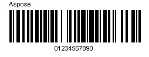
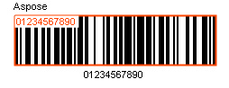
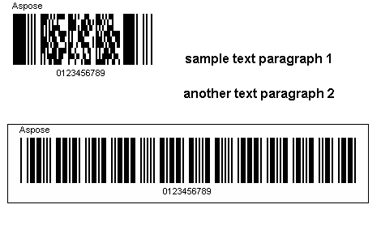
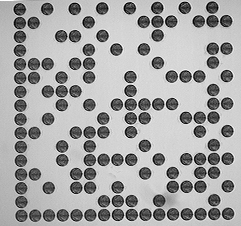

{}[Try online](https://products.aspose.app/barcode/recognize). You can test the quality of ***Aspose.BarCode*** recognition and view the results online.{}
## **BarCode Recognition Basics**
***Aspose.BarCode for .NET*** contains two powerful classes: [*BarcodeGenerator*](https://apireference.aspose.com/barcode/net/aspose.barcode.generation/barcodegenerator) and [*BarCodeReader*](https://apireference.aspose.com/barcode/net/aspose.barcode.barcoderecognition/barcodereader) to implement barcode image generation and recognition, respectively. *BarCodeReader* recognizes most commonly used 1D and 2D barcodes so that they can be detected from anywhere.
### **How to scan a barcode from an image**
The following example demonstrates how to scan a barcode image using ***Aspose.BarCode for .NET*** classes.

// Read file from directory using DecodeType.EAN13
using (BarCodeReader reader = new BarCodeReader(dataDir + "Scan.jpg", DecodeType.EAN13))
{
    foreach (BarCodeResult result in reader.ReadBarCodes())
    {
        // Read symbology type and code text
        Console.WriteLine("Symbology Type: " + result.CodeType);
        Console.WriteLine("CodeText: " + result.CodeText);
    }
}
 
{}**[ScanBarCodePicture.cs](https://github.com/aspose-barcode/Aspose.BarCode-for-.NET/blob/master/Examples/CSharp/ManageAndOptimizeBarcodeRecognition/ScanBarCodePicture.cs) is the source of this code example hosted by GitHub**{}

|**Barcode Image**|**Scan results**|
| :- | :- |
|||
## **Read Barcode from Stream**

using (FileStream lStream = new FileStream(dataDir + "Scan.jpg", FileMode.Open, FileAccess.Read, FileShare.Read))
{
    using (BarCodeReader reader = new BarCodeReader(lStream))
    {
        //other way to set
        reader.SetBarCodeImage(lStream);
        foreach (BarCodeResult result in reader.ReadBarCodes())
            Console.WriteLine("BarCode CodeText: " + result.CodeText);
    }
}
 
{}**[BarcodeReaderSetBarcodeImage.cs](https://github.com/aspose-barcode/Aspose.BarCode-for-.NET/blob/master/Examples/CSharp/ManageAndOptimizeBarcodeRecognition/BarcodeReaderSetBarcodeImage.cs) is the source of this code example hosted by GitHub**{}
## **Recognizing Barcode Symbology**
Here, the basic settings of *BarCodeReader* class are discussed. In case when the symbology type is known, to recognize barcodes from an image, it is required to specify the symbology type (*CodeType* property) in the constructor of *BarCodeReader* class and then call [*BarCodeReader.ReadBarCodes()*](https://apireference.aspose.com/barcode/net/aspose.barcode.barcoderecognition/barcodereader/methods/readbarcodes) method. 
### **SymbologyType of a barcode**
If the target symbology type is predefined in the constructor, recognition will be processed faster compared with the case when *CodeType* property is set to the default value. <!--This needs to be clarified and detalized.-->
The following code snippet illustrates how to specify the symbology type.

// Create an instance of BarCodeReader class 
using (BarCodeReader reader = new BarCodeReader(dataDir + "Code128.jpg", DecodeType.Code128))
{
    foreach (BarCodeResult result in reader.ReadBarCodes())
    {
        // Display code text and Symbology Type
        Console.WriteLine("CodeText: " + result.CodeText);
        Console.Write("Symbology Type: " + result.CodeType);
    }
}
 
{}**[RecognizeSpecificBarcodeSymbology.cs](https://github.com/aspose-barcode/Aspose.BarCode-for-.NET/blob/master/Examples/CSharp/ManageAndOptimizeBarcodeRecognition/RecognizeSpecificBarcodeSymbology.cs) as a source of code example, hosted by GitHub**{}

For unknown types of barcodes, [*DecodeType.AllSupportedTypes*](https://apireference.aspose.com/barcode/net/aspose.barcode.barcoderecognition/decodetype/fields/allsupportedtypes) should be used. <!--This is unclear.-->

### **Recognizing Multiple Symbologies in Single Image**
In some case, multiple barcodes may be presented in a single image. ***Aspose.BarCode for .NET*** can detect and recognize all barcodes of the supported symbology types. This can be realized by specifying multiple symbology types separated by comma in the barcode constructor. As an example, see the image below. In this case, two barcodes of types Code39Standard and PDF417 are placed in one image.


// Create an instance of BarCodeReader class
using (BarCodeReader reader = new BarCodeReader(dataDir + "RecognizingMultipleSymbologies.png", DecodeType.Code39Standard, DecodeType.Pdf417))
{
    foreach (BarCodeResult result in reader.ReadBarCodes())
    {
        Console.WriteLine("Codetext: " + result.CodeText);
        Console.WriteLine("Symbology type: " + result.CodeType);
    }
}
 
{}**[RecognizeMultipleSymbologies.cs](https://github.com/aspose-barcode/Aspose.BarCode-for-.NET/blob/master/Examples/CSharp/ManageAndOptimizeBarcodeRecognition/RecognizeMultipleSymbologies.cs) is the source of this code example hosted by GitHub**{}
In the provided code snippet, we assume that the symbology types of the barcodes presented in the image are known. Accordingly, we specify the target symbologies separated by comma. 
## **Get all Barcodes from an Image**
To detect all barcodes presented in an image, [*DecodeType.AllSupportedTypes*](https://apireference.aspose.com/barcode/net/aspose.barcode.barcoderecognition/decodetype/fields/allsupportedtypes) method has been introduced. This method is applicable only to 1D barcodes. It returns an array of all barcodes identified in an image. This array contains all information about detected barcodes, such as code text, symbology, recognition percentage, and scan region details. The following code snippet illustrates how to detect all 1D barcodes presented in an image.

// Initialize the BarCodeReader object and Call read method
BarCodeReader reader = new BarCodeReader(dataDir + "Barcode2.png", DecodeType.AllSupportedTypes);

// To get all possible barcodes
reader.QualitySettings = QualitySettings.MaxBarCodes;

foreach (BarCodeResult result in reader.ReadBarCodes())
{
    // Display code text, symbology, detected angle, recognition percentage of the barcode
    Console.WriteLine("Code Text: " + result.CodeText + " Symbology: " + result.CodeType + " Recognition percentage: " + result.Region.Angle);

    // Display x and y coordinates of barcode detected
    Point[] point = result.Region.Points;
    Console.WriteLine("Top left coordinates: X = " + point[0].X + ", Y = " + point[0].Y);
    Console.WriteLine("Bottom left coordinates: X = " + point[1].X + ", Y = " + point[1].Y);
    Console.WriteLine("Bottom right coordinates: X = " + point[2].X + ", Y = " + point[2].Y);
    Console.WriteLine("Top right coordinates: X = " + point[3].X + ", Y = " + point[3].Y);
}
 
{}**[GetAllPossibleBarcodesfromImage.cs](https://github.com/aspose-barcode/Aspose.BarCode-for-.NET/blob/master/Examples/CSharp/ManageAndOptimizeBarcodeRecognition/GetAllPossibleBarcodesfromImage.cs) is the source of this code example hosted by GitHub**{}
## **Datamatrix Barcode**
### **Detect Decorated Datamatrix Barcode**
[***Aspose.BarCode for .NET API***](https://www.aspose.com/products/barcode/net) enables detecting decorated DataMatrix barcodes on an image. To implement the detection of a DataMatrix barcode, developers have to configure *QualitySettings* using *BarCodeReader.QualitySettings* property that is an instance of *QualitySettings* class. *QualitySettings* allows to configure recognition quality and speed manually. You can quickly set up *QualitySettings* using the embedded presets: *HighPerformance*, *NormalQuality*, *HighQuality*, and *MaxBarCodes*. Alternatively, you can manually configure desired options. The default value of *QualitySettings* is "NormalQuality". To realize the recognition of a dot peen DataMatrix barcode, BarCodeReader.[AllowDatamatrixIndustrialBarcodes](https://apireference.aspose.com/barcode/net/aspose.barcode.barcoderecognition/qualitysettings/properties/allowdatamatrixindustrialbarcodes) property needs to be set to "True". The following code snippet demonstrates how to detect decorated DataMatrix barcodes.


// Initialize the BarCodeReader class by passing barcode file name and barcode type as parameters            
using (BarCodeReader reader = new BarCodeReader(dataDir + "datamatrix-stars.png", DecodeType.DataMatrix))
{
    //set high performance mode
    reader.QualitySettings = QualitySettings.HighPerformance;
	reader.QualitySettings.AllowDatamatrixIndustrialBarcodes = true;
    foreach (BarCodeResult result in reader.ReadBarCodes())
    {
        Console.WriteLine(result.CodeType + ": " + result.CodeText);
    }
}
 
{}**[DetectDecoratedDatamatrix.cs](https://github.com/aspose-barcode/Aspose.BarCode-for-.NET/blob/master/Examples/CSharp/ManageAndOptimizeBarcodeRecognition/DetectDecoratedDatamatrix.cs) as a source of code example, hosted by GitHub**{}

### **Detect Dot Peen Datamatrix Barcode**
[Aspose.BarCode for .NET API](https://www.aspose.com/products/barcode/net) allows developers to detect dot peen DataMatrix barcode on the image. To detect the dot peen DataMatrix barcode, developers have to set the BarCodeReader.[AllowDatamatrixIndustrialBarcodes](https://apireference.aspose.com/barcode/net/aspose.barcode.barcoderecognition/qualitysettings/properties/allowdatamatrixindustrialbarcodes) property to true. The [AllowDatamatrixIndustrialBarcodes](https://apireference.aspose.com/barcode/net/aspose.barcode.barcoderecognition/qualitysettings/properties/allowdatamatrixindustrialbarcodes) property allows engine for Datamatrix to recognize dashed industrial Datamatrix barcodes. Following is the code illustration.


// Initialize the BarCodeReader class by passing barcode file name and barcode type as parameters
using (BarCodeReader reader = new BarCodeReader(dataDir + "datamatrix-DotPeen.png", DecodeType.DataMatrix))
{
    //set high performance mode
    reader.QualitySettings = QualitySettings.HighPerformance;
    reader.QualitySettings.AllowDatamatrixIndustrialBarcodes = true;
    foreach (BarCodeResult result in reader.ReadBarCodes())
    {
        Console.WriteLine(result.CodeType + ": " + result.CodeText);
    }
}
 
{}**[DetectDotPeenDatamatrix.cs](https://github.com/aspose-barcode/Aspose.BarCode-for-.NET/blob/master/Examples/CSharp/ManageAndOptimizeBarcodeRecognition/DetectDotPeenDatamatrix.cs) as a source of code example, hosted by GitHub**{}

## **MacroPDF417 Barcode**
### **Reading Multiple MacroPDF417 Barcodes**
We can recognize Macro Pdf417 barcodes which is PDF417 barcodes with extended metadata. [BarCodeReader](https://apireference.aspose.com/barcode/net/aspose.barcode.barcoderecognition/barcodereader) class. can recognize these metadatas and store them in [Pdf417ExtendedParameters](https://apireference.aspose.com/barcode/net/aspose.barcode.barcoderecognition/pdf417extendedparameters) structure. The BarCodeReader class can recognize the Segment ID, File ID, Segment ID, Segment Count, File Size, Sender, Addressee, Date and Checksum metadatas.In the lower code example we show how to read Macro Pdf417 metadatas with barcode data.

// Create array for storing multiple bar codes file names
string[] files = new string[] { "MacroPdf417_0.png", "MacroPdf417_1.png" };

// Iiterate through the bar code image files
for (int i = 0; i < files.Length; ++i)
{
    // Create instance of BarCodeReader class and set symbology
    using (BarCodeReader reader = new BarCodeReader(dataDir + files[i], DecodeType.MacroPdf417))
    {
        foreach (BarCodeResult result in reader.ReadBarCodes())
        {
            // Get code text, file id, segment id and segment count
            Console.WriteLine("File Name: " + files[i] + " Code Text: " + result.CodeText);
            Console.WriteLine("File ID: " + result.Extended.Pdf417.MacroPdf417FileID);
            Console.WriteLine("Segment ID: " + result.Extended.Pdf417.MacroPdf417SegmentID);
            Console.WriteLine("Segment Count: " + result.Extended.Pdf417.MacroPdf417SegmentsCount);
            Console.WriteLine("File Size: " + result.Extended.Pdf417.MacroPdf417FileSize);
            Console.WriteLine("Sender: " + result.Extended.Pdf417.MacroPdf417Sender);
            Console.WriteLine("Addressee: " + result.Extended.Pdf417.MacroPdf417Addressee);
            Console.WriteLine("Date: " + result.Extended.Pdf417.MacroPdf417TimeStamp.ToString());
            Console.WriteLine("Checksum: " + result.Extended.Pdf417.MacroPdf417Checksum);
        }
        Console.WriteLine();
    }
}
 
{}**[ReadMultipleMacroPdf417Barcodes.cs](https://github.com/aspose-barcode/Aspose.BarCode-for-.NET/blob/master/Examples/CSharp/ManageAndOptimizeBarcodeRecognition/ReadMultipleMacroPdf417Barcodes.cs) as a source of code example, hosted by GitHub**{}

## **Recognizing Barcode in WPF Project**
Aspose.BarCode supports recognizing barcodes in WPF projects. To do so, specify the symbology type in the constructor of the BarCodeReader class and use the [ReadBarCodes()](https://apireference.aspose.com/barcode/net/aspose.barcode.barcoderecognition/barcodereader/methods/readbarcodes) method to recognize the barcodes from the barcode control. Aspose.BarCode.dll should be referenced in WPF applications for barcode generation and recognition. To use Barcode in WPF Project please the steps given follow.

1. Create a new WPF application in Visual Studio 2019.
1. Add a reference to Aspose.BarCode.dll to **References** section.
1. Drag a button control to the form.
1. Add the following code to its Click event.


//generate our image source, can be obtained from other variants
Bitmap imageSourceForRecognition = (new BarcodeGenerator(EncodeTypes.Code128, "12345678")).GenerateBarCodeImage();

//read our barcode
using (BarCodeReader reader = new BarCodeReader(imageSourceForRecognition, DecodeType.Code128))
{
    foreach (BarCodeResult result in reader.ReadBarCodes())
    {
        // Read symbology type and code text
        Console.WriteLine("Symbology Type: " + result.CodeType);
        Console.WriteLine("CodeText: " + result.CodeText);
    }
}
 
{}**[ReadBarcodeInWPF](https://github.com/aspose-barcode/Aspose.BarCode-for-.NET/blob/master/Examples/CSharp/ManageAndOptimizeBarcodeRecognition/ReadBarcodeInWPF.cs) as a source of code example, hosted by GitHub**{}

Also you need to initialize license, the best way of license initialization is initialize it as lazy initialization in static class.

internal class LazyLicenseInitialization
{
    private static LazyLicenseInitialization instance = new LazyLicenseInitialization();
    private LazyLicenseInitialization()
    {
        //code setting license
        //(new Aspose.BarCode.License()).SetLicense(@"Aspose.Total.NET.lic");
    }
    //required to make LazyLicenseInitialization visible to VM
    //and do single run code in LazyLicenseInitialization() 
    internal static void Init()
    { }
}

public MainWindow()
{
	//once run license intialization
	LazyLicenseInitialization.Init();
    InitializeComponent();
}
 
## **Read Predefined Barcode types sets**
[BarCodeReader](https://apireference.aspose.com/barcode/net/aspose.barcode.barcoderecognition/barcodereader) allows to read not only selected barcode types set but already predefined types sets which is defined in [DecodeType](https://apireference.aspose.com/barcode/net/aspose.barcode.barcoderecognition/decodetype).
### **Read All Supported Barcodes**

using (BarCodeReader reader = new BarCodeReader(dataDir + "test.png", DecodeType.AllSupportedTypes))
{
    foreach (BarCodeResult result in reader.ReadBarCodes())
    {
        Console.WriteLine(result.CodeType.ToString() + " " + result.CodeText);
    }
}
 
{}**[ReadAllSupportedTypesBarcode.cs](https://github.com/aspose-barcode/Aspose.BarCode-for-.NET/blob/master/Examples/CSharp/ManageBarCodes/ReadAllSupportedTypesBarcode.cs) as a source of code example, hosted by GitHub**{}
### **Read Most Common Barcodes**

using (BarCodeReader reader = new BarCodeReader(dataDir + "test.png", DecodeType.MostCommonTypes))
{
    foreach (BarCodeResult result in reader.ReadBarCodes())
    {
        Console.WriteLine(result.CodeType.ToString() + " " + result.CodeText);
    }
}
 
{}**[ReadMostCommonTypeBarcode.cs](https://github.com/aspose-barcode/Aspose.BarCode-for-.NET/blob/master/Examples/CSharp/ManageBarCodes/ReadMostCommonTypeBarcode.cs) as a source of code example, hosted by GitHub**{}
### **Read Postal Type Barcodes**

using (BarCodeReader reader = new BarCodeReader(dataDir + "test.png", DecodeType.PostalTypes))
{
    foreach (BarCodeResult result in reader.ReadBarCodes())
    {
        Console.WriteLine(result.CodeType.ToString() + " " + result.CodeText);
    }
}
 
{}**[ReadPostalTypesBarcode.cs](https://github.com/aspose-barcode/Aspose.BarCode-for-.NET/blob/master/Examples/CSharp/ManageBarCodes/ReadPostalTypesBarcode.cs) as a source of code example, hosted by GitHub**{}
### **Read 1D Barcodes**

using (BarCodeReader reader = new BarCodeReader(dataDir + "test.png", DecodeType.Types1D))
{
    foreach (BarCodeResult result in reader.ReadBarCodes())
    {
        Console.WriteLine(result.CodeType.ToString() + " " + result.CodeText);
    }
}
 
{}**[ReadType1DBarcode.cs](https://github.com/aspose-barcode/Aspose.BarCode-for-.NET/blob/master/Examples/CSharp/ManageBarCodes/ReadType1DBarcode.cs) as a source of code example, hosted by GitHub**{}
### **Read 2D Barcodes**

using (BarCodeReader reader = new BarCodeReader(dataDir + "test.png", DecodeType.Types2D))
{
    foreach (BarCodeResult result in reader.ReadBarCodes())
    {
        Console.WriteLine(result.CodeType.ToString() + " " + result.CodeText);
    }
}
 
{}**[ReadType2DBarcode.cs](https://github.com/aspose-barcode/Aspose.BarCode-for-.NET/blob/master/Examples/CSharp/ManageBarCodes/ReadType2DBarcode.cs) as a source of code example, hosted by GitHub**{}