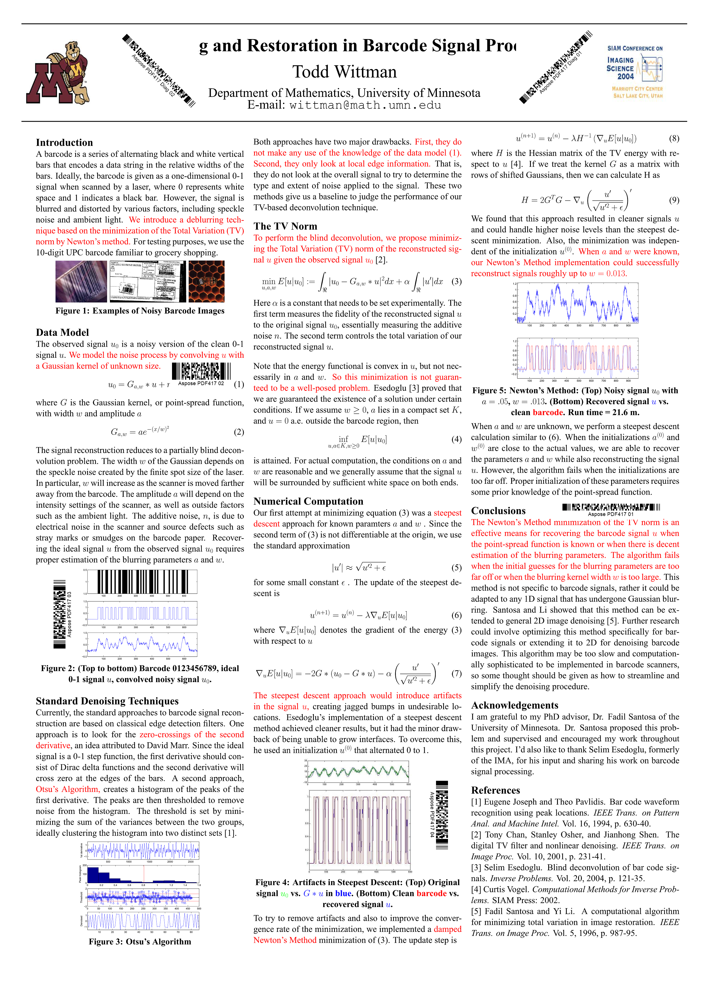

## Overview
In addition to barcode recognition functionality, class [*BarCodeReader*](https://apireference.aspose.com/barcode/net/aspose.barcode.barcoderecognition/barcodereader) allows performing barcode data serialization and uploading in XML format. Barcode data can be saved using the [*ExportToXml*](https://apireference.aspose.com/barcode/net/aspose.barcode.barcoderecognition/barcodereader/methods/exporttoxml) function both to a file [*ExportToXml File*](https://apireference.aspose.com/barcode/net/aspose.barcode.barcoderecognition/barcodereader/methods/exporttoxml) or to a stream [*ExportToXml Stream*](https://apireference.aspose.com/barcode/net/aspose.barcode.barcoderecognition.barcodereader/exporttoxml/methods/1). Moreover, the data required for recognition can be imported in XML format from a file or a stream using corresponding functions [*ImportFromXml File*](https://apireference.aspose.com/barcode/net/aspose.barcode.barcoderecognition.barcodereader/importfromxml/methods/1) and [*ImportFromXml Stream*](https://apireference.aspose.com/barcode/net/aspose.barcode.barcoderecognition/barcodereader/methods/importfromxml). 
  
The data about a barcode image to be read, as well as the link to a file containing the source image or the image itself, cannot be serialized and need to be set explicitly using the family of functions called [*SetBarCodeImage*](https://apireference.aspose.com/barcode/net/aspose.barcode.barcoderecognition/barcodereader/methods/setbarcodeimage/index).    

{}*If you need any clarifications, feel free to reach out [Aspose Technical Support](/barcode/net/technical-support/): ask your questions at [Aspose.Barcode Forum](https://forum.aspose.com/c/barcode/13) or contact Aspose [Paid Support Helpdesk](https://helpdesk.aspose.com/).*{}

## Saving Barcode Data to XML
As mentioned above, there are two way to save the current state of class [*BarCodeReader*](https://apireference.aspose.com/barcode/net/aspose.barcode.barcoderecognition/barcodereader): to an XML file through the [*ImportToXml(String)*](https://apireference.aspose.com/barcode/net/aspose.barcode.barcoderecognition.barcodereader/importfromxml/methods/1) function or to a stream using the [*ImportToXml(Stream)*](https://apireference.aspose.com/barcode/net/aspose.barcode.barcoderecognition/barcodereader/methods/importfromxml) function. The code snippet below illustrates how to implement data serialization to an XML file.   


//init barcode reader
using (BarCodeReader read = new BarCodeReader())
{
    read.SetBarCodeReadType(DecodeType.Pdf417);
    read.BarcodeSettings.StripFNC = true;
    read.QualitySettings.MedianSmoothingWindowSize = 5;
    ////serialize BarCodeReader to file
    read.ExportToXml($"{path}readerPdf417.xml");
}


## Loading Barcode Data from XML
The current state of of class [*BarCodeReader*]() can be imported from an XML file using the [*ImportFromXml(String)*]() function or from a stream through the [*ImportFromXml(Stream)*]() function. The data about the source barcode image to be recognized is not serialized.  
  
The code sample provided below explains how to load data from an XML file. 


//load BarCodeReader from file
Console.WriteLine("BarCodeReaderSerialization:");
using (BarCodeReader read = BarCodeReader.ImportFromXml($"{path}readerPdf417.xml"))
{
    //set the recognized file because it is not stored
    read.SetBarCodeImage($"{recpath}many_pdf417.png");
    //initialized data
    Console.WriteLine($"StripFNC:{read.BarcodeSettings.StripFNC}");
    Console.WriteLine($"MedianSmoothingWindowSize:{read.QualitySettings.MedianSmoothingWindowSize}");
    //read
    Console.WriteLine($"Barcodes read: {read.ReadBarCodes().Length}");
    foreach (BarCodeResult result in read.FoundBarCodes)
        Console.WriteLine($"{result.CodeTypeName}:{result.CodeText}");
}


## Loading and Saving Data from Stream


//stream 
MemoryStream ms = new MemoryStream();

//init barcode reader
using (BarCodeReader read = new BarCodeReader())
{
    read.SetBarCodeReadType(DecodeType.Pdf417);
    read.BarcodeSettings.StripFNC = true;
    read.QualitySettings.MedianSmoothingWindowSize = 5;
    ////serialize BarCodeReader to stream
    read.ExportToXml(ms);
    ms.Position = 0;
}

//load BarCodeReader from file
Console.WriteLine("BarCodeReaderStreamSerialization:");
using (BarCodeReader read = BarCodeReader.ImportFromXml(ms))
{
    //set the recognized file because it is not stored
    read.SetBarCodeImage($"{recpath}many_pdf417.png");
    //initialized data
    Console.WriteLine($"StripFNC:{read.BarcodeSettings.StripFNC}");
    Console.WriteLine($"MedianSmoothingWindowSize:{read.QualitySettings.MedianSmoothingWindowSize}");
    //read
    Console.WriteLine($"Barcodes read: {read.ReadBarCodes().Length}");
    foreach (BarCodeResult result in read.FoundBarCodes)
        Console.WriteLine($"{result.CodeTypeName}:{result.CodeText}");
}
