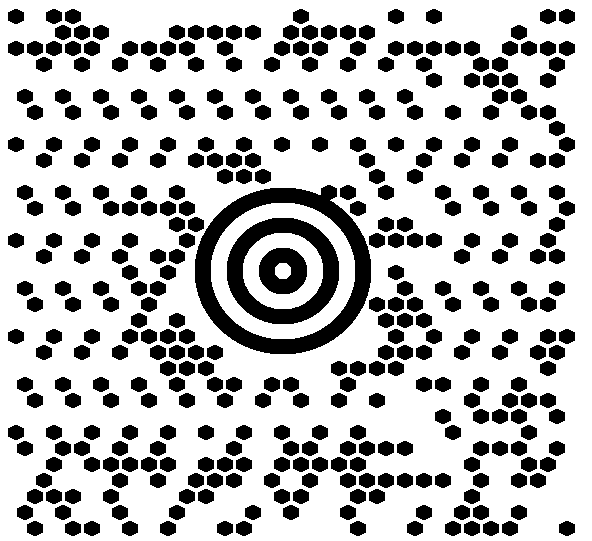

{}[Generate MaxiCode Barcodes Online](https://products.aspose.app/barcode/generate/maxicode): You can test the quality of ***Aspose.BarCode*** generation for MaxiCode barcodes and view the results online.{}

## **Overview**
*MaxiCode* is a 2D matrix barcode type can be used to encode textual data and streams of bytes. *MaxiCode* barcodes contain a round bullseye finder pattern consisting of three concentric circles, six orientation patterns, and 33 rows with 29 or 30 hexagonal modules. Data capacity is at most 60 bytes or 140 numerical (90 alphanumeric) digits. *MaxiCode* has been introduced for postal services; it is intended for industrial standard support and is not recommended for business-as-usual use.  
You can find more information about this barcode type on [this page](/net/maxicode-barcodes/).
  
{}*If you need any clarifications, feel free to reach out [Aspose Technical Support](/barcode/net/technical-support/): ask your questions at [Aspose.Barcode Forum](https://forum.aspose.com/c/barcode/13) or contact [Aspose Paid Support Helpdesk](https://helpdesk.aspose.com/).*{}

## **MaxiCode Mode Settings**
In ***Aspose.BarCode for .NET***, developers can set different generation modes to create *MaxiCode* barcodes using the [*MaxiCodeMode*](https://reference.aspose.com/barcode/net/aspose.barcode.generation/maxicodeparameters/maxicodemode) property of class [*MaxiCodeParameters*](https://reference.aspose.com/barcode/net/aspose.barcode.generation/maxicodeparameters). The following data modes are supported: 
- *Modes 2 and 3* - special industrial standards that are used in the transportation industry to store the information about shipping along with additional data
- *Modes 4 and 5* - can store arbitrary text information or byte streams and differ from each other only by the number of codewords for error correction and potential data capacity
- *Mode 6* - is the same as *Mode 4*, but the barcode information is used to set up hardware readers

These modes are described further in the article.   

### **MaxiCode Modes 2 and 3**
For correct barcode generation, *MaxiCodeModes 2 and 3* need the input data being organized in the predefined formats that can be summarized as follows:  
- <mark>Format1: “[)>(rs)01(gs)(Postal Code)(gs)(Country Code)(gs)(Service Category)(gs)(Secondary Message)(eot)”</mark>
- <mark>Format2: “(Postal Code 9 digits)(gs)(Country Code)(gs)(Service Category)(gs)(Secondary Message)(eot)”</mark>
  
The following special characters are used:
- Group separator Unicode character: (gs) - \u001d
- Record separator Unicode character: (rs) - \u001e
- End-of-transmission Unicode character: (eot) - \u0004

## **MaxiCode Barcodes with Complex Data Modes**
To simplify the generation and reading of MaxiCode barcodes with complex data formats, the barcode library provides a set of classes: [*MaxiCodeCodetext*](https://reference.aspose.com/barcode/net/aspose.barcode.complexbarcode/maxicodecodetext/), [*MaxiCodeStructuredCodetext*](https://reference.aspose.com/barcode/net/aspose.barcode.complexbarcode/maxicodestructuredcodetext/), [*MaxiCodeCodetextMode2*](https://reference.aspose.com/barcode/net/aspose.barcode.complexbarcode/maxicodecodetextmode2/), [*MaxiCodeCodetextMode3*](https://reference.aspose.com/barcode/net/aspose.barcode.complexbarcode/maxicodecodetextmode3/), [*MaxiCodeStandardCodetext*](https://reference.aspose.com/barcode/net/aspose.barcode.complexbarcode/maxicodestandardcodetext/), [*MaxiCodeSecondMessage*](https://reference.aspose.com/barcode/net/aspose.barcode.complexbarcode/maxicodesecondmessage/), [*MaxiCodeStandartSecondMessage*](https://reference.aspose.com/barcode/net/aspose.barcode.complexbarcode/maxicodestandartsecondmessage/), and [*MaxiCodeStructuredSecondMessage*](https://reference.aspose.com/barcode/net/aspose.barcode.complexbarcode/maxicodestructuredsecondmessage/). All these classes correspond to [*ComplexBarcode*](https://reference.aspose.com/barcode/net/aspose.barcode.complexbarcode/).  
Classes [*MaxiCodeCodetextMode2*](https://reference.aspose.com/barcode/net/aspose.barcode.complexbarcode/maxicodecodetextmode2/), [*MaxiCodeCodetextMode3*](https://reference.aspose.com/barcode/net/aspose.barcode.complexbarcode/maxicodecodetextmode3/), [*MaxiCodeStandartSecondMessage*](https://reference.aspose.com/barcode/net/aspose.barcode.complexbarcode/maxicodestandartsecondmessage/), and [*MaxiCodeStructuredSecondMessage*](https://reference.aspose.com/barcode/net/aspose.barcode.complexbarcode/maxicodestructuredsecondmessage/) might be specifically useful for developers because the required formats of data to be encoded in MaxiCode modes 2 and 3 are quite complex. 

### **Generation Modes**

#### **MaxiCode Mode 2**

Class [*MaxiCodeCodetextMode2*](https://reference.aspose.com/barcode/net/aspose.barcode.complexbarcode/maxicodecodetextmode2/) can be used to generate barcodes applying the *MaxiCode Mode 2*.  
  
The code sample provided below illustrates how to generate *MaxiCode* using the input data where the secondary part is represented as an unstructured message.

``` csharp
//create MaxiCode in mode 2 with structured second message
MaxiCodeCodetextMode2 maxiCodeCodetext = new MaxiCodeCodetextMode2();
maxiCodeCodetext.PostalCode = "524032140";
maxiCodeCodetext.CountryCode = 056;
maxiCodeCodetext.ServiceCategory = 999;

//create structured second message
MaxiCodeStructuredSecondMessage maxiCodeStructuredSecondMessage = new MaxiCodeStructuredSecondMessage();
maxiCodeStructuredSecondMessage.Add("634 ALPHA DRIVE");
maxiCodeStructuredSecondMessage.Add("PITTSBURGH");
maxiCodeStructuredSecondMessage.Add("PA");
maxiCodeStructuredSecondMessage.Year = 99;
maxiCodeCodetext.SecondMessage = maxiCodeStructuredSecondMessage;

//encode message
using (ComplexBarcodeGenerator complexGenerator = new ComplexBarcodeGenerator(maxiCodeCodetext))
{
     complexGenerator.Save($"{path}MaxiCodeMode2StructuredSecondMessage.png");
}
```
  
<p align="center"></p>
  
The following code sample shows how to create *MaxiCode* with the secondary part of the input data being a structured message.

``` csharp
//create MaxiCode in mode 2 with structured second message
MaxiCodeCodetextMode2 maxiCodeCodetext = new MaxiCodeCodetextMode2();
maxiCodeCodetext.PostalCode = "524032140";
maxiCodeCodetext.CountryCode = 056;
maxiCodeCodetext.ServiceCategory = 999;

//create structured second message
MaxiCodeStructuredSecondMessage maxiCodeStructuredSecondMessage = new MaxiCodeStructuredSecondMessage();
maxiCodeStructuredSecondMessage.Add("634 ALPHA DRIVE");
maxiCodeStructuredSecondMessage.Add("PITTSBURGH");
maxiCodeStructuredSecondMessage.Add("PA");
maxiCodeStructuredSecondMessage.Year = 99;
maxiCodeCodetext.SecondMessage = maxiCodeStructuredSecondMessage;

//encode message
using (ComplexBarcodeGenerator complexGenerator = new ComplexBarcodeGenerator(maxiCodeCodetext))
{
     complexGenerator.Save($"{path}MaxiCodeMode2StructuredSecondMessage.png");
}
```
  
<p align="center"></p>

#### **MaxiCode Mode 3**
Class [*MaxiCodeCodetextMode3*](https://reference.aspose.com/barcode/net/aspose.barcode.complexbarcode/maxicodecodetextmode3/) allows developers to create *MaxiCode* barcodes using the *Mode 3* to get the required data format.  
  
The code sample below demonstrates how to generate *MaxiCode* passing the input data with the secondary part being formatted as an unstructured message.

``` csharp
//create MaxiCode in mode 3 with a standard second message
MaxiCodeCodetextMode3 maxiCodeCodetext = new MaxiCodeCodetextMode3();
maxiCodeCodetext.PostalCode = "B1050";
maxiCodeCodetext.CountryCode = 056;
maxiCodeCodetext.ServiceCategory = 999;

//create a standard second message
MaxiCodeStandartSecondMessage maxiCodeStandartSecondMessage = new MaxiCodeStandartSecondMessage();
maxiCodeStandartSecondMessage.Message = "Second message";
maxiCodeCodetext.SecondMessage = maxiCodeStandartSecondMessage;

//encode the message
using (ComplexBarcodeGenerator complexGenerator = new ComplexBarcodeGenerator(maxiCodeCodetext))
{
    complexGenerator.Save($"{path}MaxiCodeMode3StandardSecondMessage.png");
}
```
  
<p align="center"></p>

The following code sample can be used to create *MaxiCode* with the input data having the secondary part being a structured message.

``` csharp
//create MaxiCode in mode 3 with a structured second message
MaxiCodeCodetextMode3 maxiCodeCodetext = new MaxiCodeCodetextMode3();
maxiCodeCodetext.PostalCode = "B1050";
maxiCodeCodetext.CountryCode = 056;
maxiCodeCodetext.ServiceCategory = 999;

//create a structured second message
MaxiCodeStructuredSecondMessage maxiCodeStructuredSecondMessage = new MaxiCodeStructuredSecondMessage();
maxiCodeStructuredSecondMessage.Add("634 ALPHA DRIVE");
maxiCodeStructuredSecondMessage.Add("PITTSBURGH");
maxiCodeStructuredSecondMessage.Add("PA");
maxiCodeStructuredSecondMessage.Year = 99;
maxiCodeCodetext.SecondMessage = maxiCodeStructuredSecondMessage;

//encode the message
using (ComplexBarcodeGenerator complexGenerator = new ComplexBarcodeGenerator(maxiCodeCodetext))
{
    complexGenerator.Save($"{path}MaxiCodeMode3StructuredSecondMessage.png");
}
```

<p align="center"></p>

#### **Modes 4, 5, and 6**

Class [*MaxiCodeCodetextMode*](https://reference.aspose.com/barcode/net/aspose.barcode.complexbarcode/maxicodecodetext/) can be used to generate *MaxiCode* barcodes with the data formats suitable for *Modes 4, 5, and 6*. To set the required generation regime, it is necessary to initialize the *Mode* property.

``` csharp
MaxiCodeStandardCodetext maxiCodeCodetext = new MaxiCodeStandardCodetext();
maxiCodeCodetext.Mode = MaxiCodeMode.Mode4;
maxiCodeCodetext.Message = "MaxiCode standard codetext";

//encode message
using (ComplexBarcodeGenerator complexGenerator = new ComplexBarcodeGenerator(maxiCodeCodetext))
{
    complexGenerator.Save($"{path}MaxiCodeStandardCodetext.png");
}
```

### **Decoding Settings**
To read *MaxiCode* barcode, it is necessary to create an instance of class [*BarcodeReader*](https://reference.aspose.com/barcode/net/aspose.barcode.barcoderecognition/barcodereader/) and set *DecodeType.MaxiCode*. Then, the fetched data can be transformed by calling the *TryDecodeMaxiCode* method of class [*ComplexCodetextReader*](https://reference.aspose.com/barcode/net/aspose.barcode.complexbarcode/complexcodetextreader/) that returns an object of class [*MaxiCodeCodetext*](https://reference.aspose.com/barcode/net/aspose.barcode.complexbarcode/maxicodecodetext/). Objects of this class can be converted into objects of classes [*MaxiCodeCodetextMode2*](https://reference.aspose.com/barcode/net/aspose.barcode.complexbarcode/maxicodecodetextmode2/), [*MaxiCodeCodetextMode3*](https://reference.aspose.com/barcode/net/aspose.barcode.complexbarcode/maxicodecodetextmode3/), or [*MaxiCodeStandardCodetext*](https://reference.aspose.com/barcode/net/aspose.barcode.complexbarcode/maxicodestandardcodetext/), depending on the used *Maxicode* data mode.

The code sample given below shows how to decode a *MaxiCode* barcode with the input data having a structured secondary message.

``` csharp
//recognize MaxiCode in mode 2 with a standard second message
using (BarCodeReader reader = new BarCodeReader($"{path}MaxiCodeMode2StandardSecondMessage.png", DecodeType.MaxiCode))
{
    foreach (BarCodeResult result in reader.ReadBarCodes())
    {
        MaxiCodeCodetext complexCodetext = ComplexCodetextReader.TryDecodeMaxiCode(result.Extended.MaxiCode.MaxiCodeMode, result.CodeText);
        MaxiCodeCodetextMode2 maxiCodeStructuredCodetext = complexCodetext as MaxiCodeCodetextMode2;
        if (maxiCodeStructuredCodetext == null)
            continue;

        Console.WriteLine("PostalCode: " + maxiCodeStructuredCodetext.PostalCode);
        Console.WriteLine("CountryCode: " + maxiCodeStructuredCodetext.CountryCode);
        Console.WriteLine("ServiceCategory: " + maxiCodeStructuredCodetext.ServiceCategory);

        MaxiCodeStandartSecondMessage secondMessage = maxiCodeStructuredCodetext.SecondMessage as MaxiCodeStandartSecondMessage;
        if (secondMessage == null)
            continue;

        Console.WriteLine("Second message:" + secondMessage.Message);
    }
}
```

