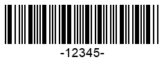

## Overview
***AsposeBarcode for .NET*** enables generating barcode labels according to the *Codabar* standard that supports encoding numerical digits and six punctuation signs. The number of digits to be encoded in a barcode is unlimited. A *Codabar* barcode may contain four optional alphabet characters (usually, A, B, C, or D) that are used as start and stop characters. In this way, the symbology provides four types of start characters and four types of stop ones. Accordingly, for the same information to be encoded, it allows generating 16 barcodes with different service sets of start or stop characters.  
The *Codabar* symbology has the following format: [*Start Characters* **A/B/C/D**] [*Data Characters* from the charset: **0-9** and "**–$./:+**"] [*Stop Character* **A/B/C/D**].

## Start and Stop Symbols
The library allows encoding start and stop characters independently using any of four supported formats: A, B, C, or D. To do set the required format, it is necessary to initiate the [CodabarStartSymbol](https://apireference.aspose.com/barcode/net/aspose.barcode.generation/codabarparameters/properties/codabarstartsymbol) and [CodabarStopSymbol](https://apireference.aspose.com/barcode/net/aspose.barcode.generation/codabarparameters/properties/codabarstopsymbol) properties included in the [*Codabar*](https://apireference.aspose.com/barcode/net/aspose.barcode.generation/barcodeparameters/properties/codabar) group of properties in class [*BarcodeParameters*](https://apireference.aspose.com/barcode/net/aspose.barcode.generation/barcodeparameters).  
The sample barcode labels demonstrated below have been generated with different settings for start and stop characters.
  
|Codabar Start and Stop Characters|A|B|C|D|
|:---:|:---:|:---:|:---:|:---:|
| |||||
  
The following code snippet illustrates how to set different combinations of start and stop characters in *Codabar* barcodes.   

BarcodeGenerator gen = new BarcodeGenerator(EncodeTypes.Codabar, "-12345-");
gen.Parameters.Barcode.XDimension.Pixels = 2;
//set start A and stop A
gen.Parameters.Barcode.Codabar.CodabarStartSymbol = CodabarSymbol.A;
gen.Parameters.Barcode.Codabar.CodabarStopSymbol = CodabarSymbol.A;
gen.Save($"{path}CodabarStartAStopA.png", BarCodeImageFormat.Png);
//set start B and stop B
gen.Parameters.Barcode.Codabar.CodabarStartSymbol = CodabarSymbol.B;
gen.Parameters.Barcode.Codabar.CodabarStopSymbol = CodabarSymbol.B;
gen.Save($"{path}CodabarStartBStopB.png", BarCodeImageFormat.Png);
//set start C and stop C
gen.Parameters.Barcode.Codabar.CodabarStartSymbol = CodabarSymbol.C;
gen.Parameters.Barcode.Codabar.CodabarStopSymbol = CodabarSymbol.C;
gen.Save($"{path}CodabarStartCStopC.png", BarCodeImageFormat.Png);
//set start D and stop D
gen.Parameters.Barcode.Codabar.CodabarStartSymbol = CodabarSymbol.D;
gen.Parameters.Barcode.Codabar.CodabarStopSymbol = CodabarSymbol.D;
gen.Save($"{path}CodabarStartDStopD.png", BarCodeImageFormat.Png);

  
## Checksum Setting

|Codabar Checksum Setting|None|Set to Mod10|Set to Mod16|
|:---:|:---:|:---:|:---:|
| ||||


//Mod10
foreach (var value in encodedCodetext)
    checkSum = (checkSum + value) % 10;
//Mod16
foreach (var value in encodedCodetext)
    checkSum = (checkSum + value) % 16;
 


BarcodeGenerator gen = new BarcodeGenerator(EncodeTypes.Codabar, "-12345-");
gen.Parameters.Barcode.XDimension.Pixels = 2;
//set None checksum
gen.Parameters.Barcode.IsChecksumEnabled = EnableChecksum.Default;
gen.Save($"{path}CodabarChecksumNone.png", BarCodeImageFormat.Png);
//set Mod10 checksum
gen.Parameters.Barcode.IsChecksumEnabled = EnableChecksum.Yes;
gen.Parameters.Barcode.Codabar.CodabarChecksumMode = CodabarChecksumMode.Mod10;
gen.Save($"{path}CodabarChecksumMod10.png", BarCodeImageFormat.Png);
//set Mod16 checksum
gen.Parameters.Barcode.IsChecksumEnabled = EnableChecksum.Yes;
gen.Parameters.Barcode.Codabar.CodabarChecksumMode = CodabarChecksumMode.Mod16;
gen.Save($"{path}CodabarChecksumMod16.png", BarCodeImageFormat.Png);
