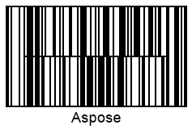
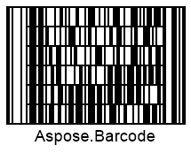

## Overview
*Codablock-F* is a two-dimensional multi-row stacked symbology that allows generating barcodes composed of several *Code128* barcode labels. Using this symbology, it is possible to encode up to 2,725 characters in the required number rows (from 2 to 44) so that each of lines can contain from 4 to 62 digits. *Codablock-F* has two main advantages over basic *Code128*. First, it allows utilizing horizontal and vertical space more efficiently owing to flexible settings of barcode layout (the number of rows and columns). Second, it provides two check digits (based on the modulo 86 algorithm) for an entire message encoded in a *Codablock-F* barcode in addition to the obligatory checksum for each row consisting of *Code128* barcodes. Moreover, *Codablock-F* can be read by laser scanners.

## Barcode Height Settings

In ***Aspose.BarCode for .NET***, developers can set the height of each row in a stacked barcode by initializing the [*AspectRatio*](https://apireference.aspose.com/barcode/net/aspose.barcode.generation/codablockparameters/properties/aspectratio) property that is defined as a relative coefficient the value of the [*XDimension*]() property. It is recommended not to set the value of *ASpectRatio* less than 10. 

|Aspect Ratio Settings|Is Set to 15|Is Set to 30|
|:---:|:---:|:---:|
| |||

## Layout Settings

[*Columns*](https://apireference.aspose.com/barcode/net/aspose.barcode.generation/codablockparameters/properties/columns)

[*Rows*](https://apireference.aspose.com/barcode/net/aspose.barcode.generation/codablockparameters/properties/rows)
  
|Layout Settings|4 Columns|4 Rows|6 Rows and 4 Columns|
|:---:|:---:|:---:|:---:|:---:|
| ||||
 