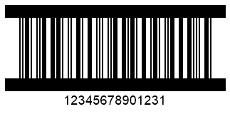
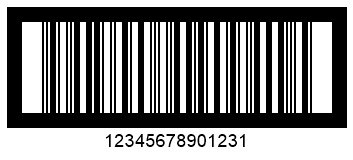

## Overview
The *ITF* symbology has been introduced by GS based on the *Interleaved 2 of 5* standard for the purposes of encoding trade identificatory GTIN. This barcode type allows encoding a set of only 14 digits where the last character is the check digit. 

## Border Settings for ITF14 and ITF6

### Border Style

  
|ITF Border Type|No Borders (*None*)|(*Frame*)|(*Bar*)|(*FrameOut*)|(*BarOut*)|
|:---:|:---:|:---:|:---:|:---:|:---:|
| ||||||
  

BarcodeGenerator gen = new BarcodeGenerator(EncodeTypes.ITF14, "12345678901231");
gen.Parameters.Barcode.XDimension.Pixels = 2;
//ITF border type None
gen.Parameters.Barcode.ITF.ItfBorderType = ITF14BorderType.None;
gen.Save($"{path}ITF14BorderNone.png", BarCodeImageFormat.Png);
//ITF border type Bar
gen.Parameters.Barcode.ITF.ItfBorderType = ITF14BorderType.Bar;
gen.Save($"{path}ITF14BorderBar.png", BarCodeImageFormat.Png);
//ITF border type BarOut
gen.Parameters.Barcode.ITF.ItfBorderType = ITF14BorderType.BarOut;
gen.Save($"{path}ITF14BorderBarOut.png", BarCodeImageFormat.Png);
//ITF border type Frame
gen.Parameters.Barcode.ITF.ItfBorderType = ITF14BorderType.Frame;
gen.Save($"{path}ITF14BorderFrame.png", BarCodeImageFormat.Png);
//ITF border type FrameOut
gen.Parameters.Barcode.ITF.ItfBorderType = ITF14BorderType.FrameOut;
gen.Save($"{path}ITF14BorderFrameOut.png", BarCodeImageFormat.Png);

  
### Border Thickness

[*IftBorderThickness*](https://apireference.aspose.com/barcode/net/aspose.barcode.generation/itfparameters)
  
|Border Size|5 Pixels|15 Pixels|
|:---:|:---:|:---:|
| |||
  

BarcodeGenerator gen = new BarcodeGenerator(EncodeTypes.ITF14, "12345678901231");
gen.Parameters.Barcode.XDimension.Pixels = 2;
gen.Parameters.Barcode.ITF.ItfBorderType = ITF14BorderType.Frame;
//ITF border size 5 Pixels
gen.Parameters.Barcode.ITF.ItfBorderThickness.Pixels = 5;
gen.Save($"{path}ITF14BorderSize5Pixels.png", BarCodeImageFormat.Png);
//ITF border size 15 Pixels
gen.Parameters.Barcode.ITF.ItfBorderThickness.Pixels = 15;
gen.Save($"{path}ITF14BorderSize15Pixels.png", BarCodeImageFormat.Png);

  
## Setting Quiet Zone
[*QuietZoneCoef*](https://apireference.aspose.com/barcode/net/aspose.barcode.generation/itfparameters/properties/quietzonecoef)

|Quiet Zone Coefficient|Is Set to 10|Is Set to 30|
|:---:|:---:|:---:|
| |||
  

arcodeGenerator gen = new BarcodeGenerator(EncodeTypes.ITF14, "12345678901231");
gen.Parameters.Barcode.XDimension.Pixels = 2;
gen.Parameters.Barcode.ITF.ItfBorderType = ITF14BorderType.Frame;
//ITF quiet zone 10 * XDimension
gen.Parameters.Barcode.ITF.QuietZoneCoef = 10;
gen.Save($"{path}ITF14QuietZone10.png", BarCodeImageFormat.Png);
//ITF quiet zone 30 * XDimension
gen.Parameters.Barcode.ITF.QuietZoneCoef = 30;
gen.Save($"{path}ITF14QuietZone30.png", BarCodeImageFormat.Png);
