## **Overview**

***Microsoft Word*** document format supports built-in barcodes which can be embeded with [***DisplayBarcode***](https://support.microsoft.com/en-au/office/field-codes-displaybarcode-6d81eade-762d-4b44-ae81-f9d3d9e07be3) and [***MergeBarcode***](https://support.microsoft.com/en-au/office/field-codes-mergebarcode-812fc43f-cb53-4782-8f9f-290ed08d34f3) field codes. [***Aspose.Words***](https://products.aspose.com/words/net/) with ***Aspose.BarCode*** together allow to render built-in  barcodes into images during word document conversion into other formats. 

Barcodes conversion into images is provided by [***IBarcodeGenerator***](https://reference.aspose.com/words/net/aspose.words.fields/ibarcodegenerator/) interface which receives barcode options with [***BarcodeParameters***](https://reference.aspose.com/words/net/aspose.words.fields/barcodeparameters/) structure and creates [raster barcode image](https://en.wikipedia.org/wiki/Raster_graphics). 

Main issue of this approach that any [raster image is resolution dependent](https://en.wikipedia.org/wiki/Raster_graphics#Resolution) which does not allow you to create barcode image with barcode element which is less than pixel. ***Aspose.Words*** has embedded resolution [96 ppi](https://en.wikipedia.org/wiki/Image_resolution#Pixel_count) for the images generated with ***IBarcodeGenerator*** and makes restriction to minimal barcode size. To solve this problem, you can [manually add barcode images](/barcode/net/add-barcode-to-word-document/) with selected resolution to Word document and save it to required format.

This article describes how to properly use ***IBarcodeGenerator*** with ***Aspose.Words*** with ***Aspose.BarCode*** to render barcode images into other formats.

The example project can be downloaded [here](custombarcode.zip).

## **IBarcodeGenerator implementation with Aspose.BarCode**

This section shows how properly to implement ***IBarcodeGenerator*** with all possible field values. The main problem here is impossibility to create really tiny barcode image because ***IBarcodeGenerator*** does not support image resolution and minimal barcode element (cell or bar) cannot be less than 1 pixel.


//Copyright(c) 2001-2023 Aspose Pty Ltd.All rights reserved.
using System;
using System.IO;
using Aspose.Words.Fields;
using Aspose.BarCode.Generation;
#if NETSTANDARD2_0_OR_GREATER || NETCOREAPP2_1_OR_GREATER
using SkiaSharp;
using Aspose.Drawing;
using Aspose.Drawing.Imaging;
#else
using System.Drawing;
using System.Drawing.Imaging;
#endif

namespace Aspose.BarCode.Utils
{
    internal class CustomBarcodeGeneratorUtils
    {
        public static double TwipsToPixels(string heightInTwips, double defVal)
        {
            return TwipsToPixels(heightInTwips, 96, defVal);
        }

        public static double TwipsToPixels(string heightInTwips, double resolution, double defVal)
        {
            try
            {
                int lVal = int.Parse(heightInTwips);
                return (lVal / 1440.0) * resolution;
            }
            catch
            {
                return defVal;
            }
        }

        public static float GetRotationAngle(string rotationAngle, float defVal)
        {
            switch (rotationAngle)
            {
                case "0":
                    return 0;
                case "1":
                    return 270;
                case "2":
                    return 180;
                case "3":
                    return 90;
                default:
                    return defVal;
            }
        }

        public static QRErrorLevel GetQRCorrectionLevel(string errorCorrectionLevel, QRErrorLevel def)
        {
            switch (errorCorrectionLevel)
            {
                case "0":
                    return QRErrorLevel.LevelL;
                case "1":
                    return QRErrorLevel.LevelM;
                case "2":
                    return QRErrorLevel.LevelQ;
                case "3":
                    return QRErrorLevel.LevelH;
                default:
                    return def;
            }
        }

        public static SymbologyEncodeType GetBarcodeEncodeType(string encodeTypeFromWord)
        {
            //https://support.microsoft.com/en-au/office/field-codes-displaybarcode-6d81eade-762d-4b44-ae81-f9d3d9e07be3
            switch (encodeTypeFromWord)
            {
                case "QR":
                    return EncodeTypes.QR;
                case "CODE128":
                    return EncodeTypes.Code128;
                case "CODE39":
                    return EncodeTypes.Code39Standard;
                case "JPPOST":
                    return EncodeTypes.RM4SCC;
                case "EAN8":
                case "JAN8":
                    return EncodeTypes.EAN8;
                case "EAN13":
                case "JAN13":
                    return EncodeTypes.EAN13;
                case "UPCA":
                    return EncodeTypes.UPCA;
                case "UPCE":
                    return EncodeTypes.UPCE;
                case "CASE":
                case "ITF14":
                    return EncodeTypes.ITF14;
                case "NW7":
                    return EncodeTypes.Codabar;
                default:
                    return EncodeTypes.None;
            }
        }
        
        public static Color ConvertColor(string inputColor, Color defVal)
        {
            if (string.IsNullOrEmpty(inputColor)) return defVal;
            try
            {
                int color = Convert.ToInt32(inputColor, 16);
                //return Color.FromArgb((color >> 16) & 0xFF, (color >> 8) & 0xFF, color & 0xFF);
                return Color.FromArgb(color & 0xFF, (color >> 8) & 0xFF, (color >> 16) & 0xFF);
            }
            catch
            {
                return defVal;
            }
        }
        
        public static double ScaleFactor(string scaleFactor, double defVal)
        {
            try
            {
                int scale = int.Parse(scaleFactor);
                return scale / 100.0;
            }
            catch
            {
                return defVal;
            }
        }

        public static void SetPosCodeStyle(BarcodeGenerator gen, string posCodeStyle, string barcodeValue)
        {
            switch (posCodeStyle)
            {
                //STD default and without changes
                case "SUP2":
                    gen.CodeText = barcodeValue.Substring(0, barcodeValue.Length - 2);
                    gen.Parameters.Barcode.Supplement.SupplementData = barcodeValue.Substring(barcodeValue.Length - 2, 2);
                    break;
                case "SUP5":
                    gen.CodeText = barcodeValue.Substring(0, barcodeValue.Length - 5);
                    gen.Parameters.Barcode.Supplement.SupplementData = barcodeValue.Substring(barcodeValue.Length - 5, 5);
                    break;
                case "CASE":
                    gen.Parameters.Border.Visible = true;
                    gen.Parameters.Border.Color = gen.Parameters.Barcode.BarColor;
                    gen.Parameters.Border.DashStyle = BorderDashStyle.Solid;
                    gen.Parameters.Border.Width.Pixels = gen.Parameters.Barcode.XDimension.Pixels * 5;
                    break;
            }
        }

        public const double DefaultQRXDimensionInPixels = 4.0;
        public const double Default1DXDimensionInPixels = 1.0;
        public static Bitmap DrawErrorImage(Exception error)
        {
            Bitmap bmp = new Bitmap(100, 100);

            using (Graphics grf = Graphics.FromImage(bmp))
#if NETSTANDARD2_0_OR_GREATER || NETCOREAPP2_1_OR_GREATER
                grf.DrawString(error.Message, new Aspose.Drawing.Font("Microsoft Sans Serif", 8f, FontStyle.Regular), Brushes.Red, new Rectangle(0,0, bmp.Width, bmp.Height));
#else
                grf.DrawString(error.Message, new System.Drawing.Font("Microsoft Sans Serif", 8f, FontStyle.Regular), Brushes.Red, new Rectangle(0,0, bmp.Width, bmp.Height));
#endif
            return bmp;
        }

#if NETSTANDARD2_0_OR_GREATER || NETCOREAPP2_1_OR_GREATER
        public static SKBitmap ConvertImageToWord(Bitmap bmp)
        {
            MemoryStream ms = new MemoryStream();
            bmp.Save(ms, ImageFormat.Png);
            ms.Position = 0;

            return SKBitmap.Decode(ms);
        }
#else
        public static Image ConvertImageToWord(Bitmap bmp)
        {
            return bmp;
        }
#endif
    }

    internal class CustomBarcodeGenerator : IBarcodeGenerator
    {
#if NETSTANDARD2_0_OR_GREATER || NETCOREAPP2_1_OR_GREATER        
        public SKBitmap GetBarcodeImage(Aspose.Words.Fields.BarcodeParameters parameters)
#else
        public Image GetBarcodeImage(Aspose.Words.Fields.BarcodeParameters parameters)
#endif
        {
            try
            {
                BarcodeGenerator gen = new BarcodeGenerator(CustomBarcodeGeneratorUtils.GetBarcodeEncodeType(parameters.BarcodeType), parameters.BarcodeValue);

                //color
                gen.Parameters.Barcode.BarColor = CustomBarcodeGeneratorUtils.ConvertColor(parameters.ForegroundColor, gen.Parameters.Barcode.BarColor);
                gen.Parameters.BackColor = CustomBarcodeGeneratorUtils.ConvertColor(parameters.BackgroundColor, gen.Parameters.BackColor);

                //show or hide text
                if (!parameters.DisplayText)
                    gen.Parameters.Barcode.CodeTextParameters.Location = CodeLocation.None;
                else
                    gen.Parameters.Barcode.CodeTextParameters.Location = CodeLocation.Below;

                //qr error level
                gen.Parameters.Barcode.QR.QrErrorLevel = QRErrorLevel.LevelH;
                if (!string.IsNullOrEmpty(parameters.ErrorCorrectionLevel))
                    gen.Parameters.Barcode.QR.QrErrorLevel = CustomBarcodeGeneratorUtils.GetQRCorrectionLevel(parameters.ErrorCorrectionLevel, gen.Parameters.Barcode.QR.QrErrorLevel);

                //rotation angle
                if (!string.IsNullOrEmpty(parameters.SymbolRotation))
                    gen.Parameters.RotationAngle = CustomBarcodeGeneratorUtils.GetRotationAngle(parameters.SymbolRotation, gen.Parameters.RotationAngle);

                //scalingFactor
                double scalingFactor = 1;
                if (!string.IsNullOrEmpty(parameters.ScalingFactor))
                    scalingFactor = CustomBarcodeGeneratorUtils.ScaleFactor(parameters.ScalingFactor, scalingFactor);

                //size
                if (gen.BarcodeType == EncodeTypes.QR)
                    gen.Parameters.Barcode.XDimension.Pixels = (float)Math.Max(1.0, Math.Round(CustomBarcodeGeneratorUtils.DefaultQRXDimensionInPixels * scalingFactor));
                else
                    gen.Parameters.Barcode.XDimension.Pixels = (float)Math.Max(1.0, Math.Round(CustomBarcodeGeneratorUtils.Default1DXDimensionInPixels * scalingFactor));

                //height
                if (!string.IsNullOrEmpty(parameters.SymbolHeight))
                    gen.Parameters.Barcode.BarHeight.Pixels = (float)Math.Max(5.0, Math.Round(CustomBarcodeGeneratorUtils.TwipsToPixels(parameters.SymbolHeight, gen.Parameters.Barcode.BarHeight.Pixels) * scalingFactor));

                //Style of a Point of Sale barcode
                if (!string.IsNullOrEmpty(parameters.PosCodeStyle))
                    CustomBarcodeGeneratorUtils.SetPosCodeStyle(gen, parameters.PosCodeStyle, parameters.BarcodeValue);

                return CustomBarcodeGeneratorUtils.ConvertImageToWord(gen.GenerateBarCodeImage());
            }
            catch (Exception e)
            {
                return CustomBarcodeGeneratorUtils.ConvertImageToWord(CustomBarcodeGeneratorUtils.DrawErrorImage(e));
            }
        }

#if NETSTANDARD2_0_OR_GREATER || NETCOREAPP2_1_OR_GREATER         
        public SKBitmap GetOldBarcodeImage(Aspose.Words.Fields.BarcodeParameters parameters)
#else
        public Image GetOldBarcodeImage(Aspose.Words.Fields.BarcodeParameters parameters)
#endif
        {
            throw new NotImplementedException();
        }
    }
}


## **Render built-in barcode from Word document to PDF**

Now we can set up our ***CustomBarcodeGenerator*** to [***FieldOptions***](https://reference.aspose.com/words/net/aspose.words.fields/fieldoptions/), add barcode field to Word document and convert it to PDF.


internal static void CreateDocumentWithBarcode(string barcodeField, string documentName)
{
    //path of Data
    string path = @".\..\..\..\Data\";
    Directory.CreateDirectory(path);
    
    Aspose.Words.Document wordDoc = new Aspose.Words.Document();
    Aspose.Words.DocumentBuilder wordBuilder = new Aspose.Words.DocumentBuilder(wordDoc);
    //set up CustomBarcodeGenerator
    wordDoc.FieldOptions.BarcodeGenerator = new CustomBarcodeGenerator();

    wordBuilder.Write("Header\n");
    wordBuilder.InsertField(barcodeField);
    wordBuilder.Write("\nFooter.");

    wordDoc.Save($"{path}{documentName}.docx", Aspose.Words.SaveFormat.Docx);
    
    PdfSaveOptions pso = new PdfSaveOptions();
    pso.Compliance = PdfCompliance.Pdf17;

    wordDoc.Save($"{path}{documentName}.pdf", pso);
}


## **Rendered results**

| **Built-in  barcode** | **Word** | **PDF** | **Description** |
| :-: | :-: | :-: | :-: |
| *"DISPLAYBARCODE “Aspose.Barcode” QR"* | 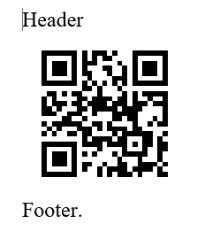 | 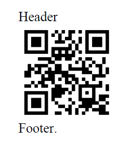 | Standard QR barcode |
| *"DISPLAYBARCODE “Aspose.Barcode” QR \\f  0x00FF00 \\b 0xFF0000"* | 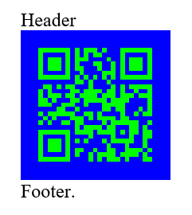 | 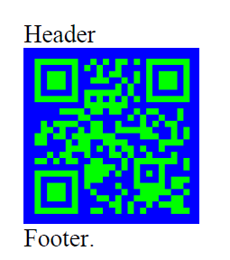|  QR barcode with bckground and foreground colors |
| *"DISPLAYBARCODE “ASPOSE BARCODE” CODE39 \\t"* | 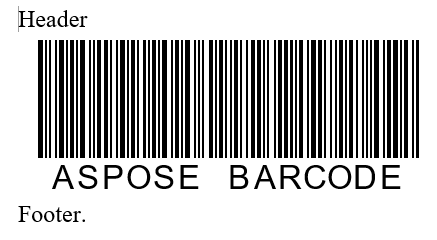 | 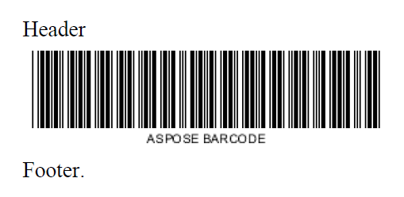|  CODE39 barcode with visible text |
| *"DISPLAYBARCODE “Aspose.Barcode” QR \\q 3"* | 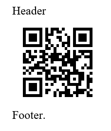 | 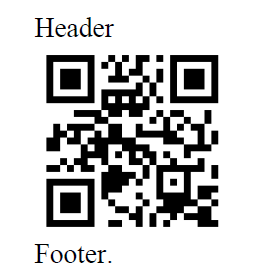|  QR barcode with LevelH error correction|
| *"DISPLAYBARCODE “Aspose.Barcode” QR \\r 1"* | 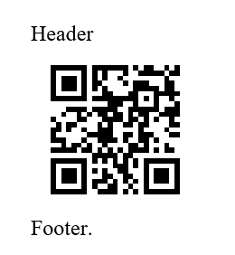 | 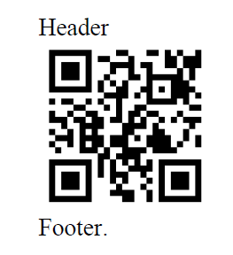|  Rotated QR barcode |
| *"DISPLAYBARCODE “Aspose.Barcode” QR \\s 25"* | 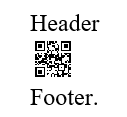 | 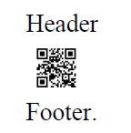 |  Scaled to 25% QR barcode |
| *"DISPLAYBARCODE “ASPOSE BARCODE” CODE39 \\h 1200"* | 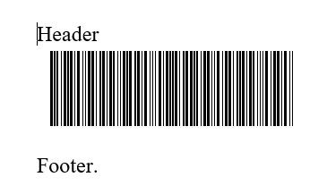 | 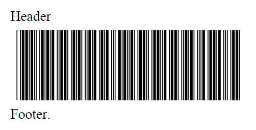 |  CODE39  with height 1200 twips (1/1440 inch)|
| *"DISPLAYBARCODE “501234567890” EAN13 \\p STD"* | 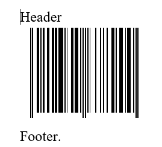 | 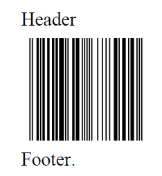| Standard EAN13 barcode|
| *"DISPLAYBARCODE “50123456789012” EAN13 \\p SUP2"* | 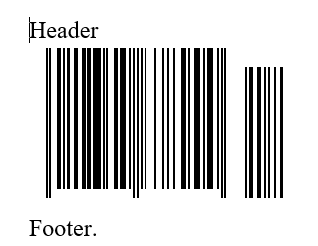 | 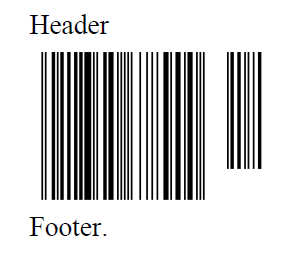|  EAN13 barcode with Supplement(EAN2) |
| *"DISPLAYBARCODE “50123456789012345” EAN13 \\p SUP5"* | 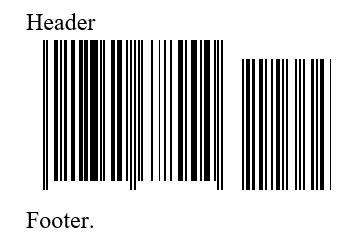 | 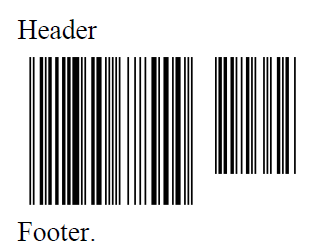|  EAN13 barcode with Supplement(EAN5) |
| *"DISPLAYBARCODE “501234567890” EAN13 \\p CASE"* | 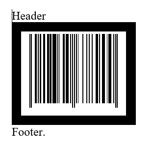 | 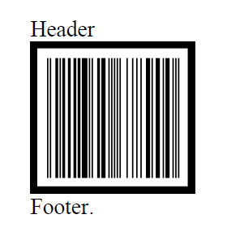|  EAN13 barcode with frame |
