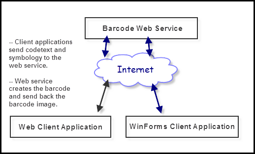
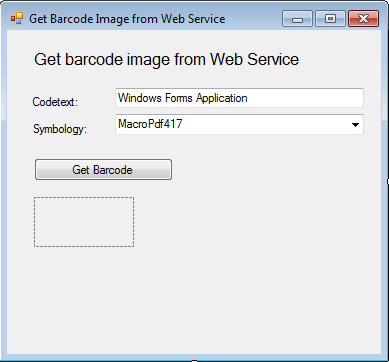

{} 

In this article, we will use ASP.NET web services to create barcodes. We will also create Windows Forms and Console application to request barcode image.

{} 
##### **Benefits**
Web services provide a major benefit in integrating the software with external applications. With standardized request/response model, any client application that can utilize XML web service can benefit from it.Below is the brief visual representation of the barcode service. The clients do not need to refer to Aspose.BarCode for .NET. They will just send 2 string values (codetext and symbology) and will get the barcode image (byte array) from service.

##### **Barcode Web Service**
Open Microsoft Visual Studio and create a new project of type “ASP.NET Web Service Application”. Name the project as “BarCodeService”. Add reference to the following .NET assemblies.

1. System.Drawing from .NET tab of “Add Reference” dialog box
1. Aspose.BarCode.

Browse to the location where Aspose.BarCode for .NET is installed and select. Visual Studio adds a default class “Service1” to the Web Service project in Service1.asmx file. Open it and add the following method to this class.

**[C#]**



 [WebMethod]

public byte[] GetBarcode(string strCodetext, string strSymbology)

{

    // Initialize BarCodeBuilder

    BarCodeBuilder builder = new BarCodeBuilder();

    // Set codetext

    builder.CodeText = strCodetext;

    // Set barcode symbology

    builder.SymbologyType = (Symbology) Enum.Parse(typeof(Symbology), strSymbology, true);

    // Create and save the barcode image to memory stream

    MemoryStream imgStream = new MemoryStream();

    builder.Save(imgStream, ImageFormat.Png);

    // Return the barcode image as a byte array

    return imgStream.ToArray();

}



The web method needs the following two parameters from client:

1. Codetext
1. Symbology

These parameters are of String type. The parameters are passed to the BarCodeBuilder class, which then creates the barcode and sends the barcode image in the form of byte array to the client.

{} 

This web method can be called by any kind of application that can consume a web service.

{} 
##### **Consume Web Service from Windows Forms Application**
Open Visual Studio and create a new project of type “Windows Application”. Name the project as “ GetBarCodeWinForms ”. Add reference to the web service by right clicking on “References” and then choosing “Add Service Reference” from the context menu. Type the address of web service or discover it. After getting the correct service, give “BarCodeService” in the Namespace and click on “Ok” button to add the reference.

Design the forms as follows.

It contains the following controls:

1. Textbox: Input codetext from user
1. Combobox: Input symbology type from user
1. Button: Call web service
1. Picturebox: Display the barcode image

Write the following code on click event of the button.

**[C#]**



 // Initialize the Barcode Web Service

BarCodeService.Service1SoapClient barcodeService = new BarCodeService.Service1SoapClient();

// Call the GetBarcode web method

// Pass codetext and symbology in parameters

// Get the barcode image returned from the web method in the form of byte array

byte[] arrBarcodeImage = barcodeService.GetBarcode(txtCodetext.Text, cmbSymbology.Text);

// Create an instance of Image from the byte array

MemoryStream imgStream = new MemoryStream(arrBarcodeImage);

Image imgBarcode = Bitmap.FromStream(imgStream);

// Assign the barcode image to the Picturebox control

picBarcodeImage.Image = imgBarcode;

picBarcodeImage.Height = imgBarcode.Height;

picBarcodeImage.Width = imgBarcode.Width;



Run the application, specify some values and click on the “Get Barcode” button. The application will consume the barcode web service and get the barcode image from it. The image will then be displayed on the form as below.

##### **Consume Web Service from a Console Application**
Create a new project in Visual Studio and choose “Console Application” in project type. Name the project as “ GetBarCodeConsole ”. Add the reference to the barcode service, just as we gave above in the winforms application.Write the below code in the main() method.

**[C#]**



 try

{

    // Initialize the Barcode Web Service

    BarCodeService.Service1SoapClient c = new GetBarCodeConsole.BarCodeService.Service1SoapClient();

    // Call the GetBarcode web method

    // Pass codetext and symbology in parameters

    // Get the barcode image returned from the web method in the form of byte array

    byte[] arrBarcodeImage = c.GetBarcode("console application", "pdf417");

    // Save the byte array (barcode image) to disk

    FileStream imgWriter = new FileStream("barcode.png", FileMode.Create);

    imgWriter.Write(arrBarcodeImage, 0, arrBarcodeImage.Length);

    imgWriter.Close();

    // Open the barcode image

    Process.Start("barcode.png");

}

catch (Exception ex)

{

    Console.WriteLine(ex.Message);

}

Console.WriteLine("Press any key to exit....");

Console.ReadKey();



Run the application, it will consume the barcode web service, get barcode image and save the image locally to disk.
##### **Summary**
Aspose.BarCode for .NET can easily be used in ASP.NET web services to generate the barcodes and serve the barcode image to various clients.
##### **References**
- [Aspose.BarCode for .NET Product Overview](/barcode/net/product-overview/)
- [Specify Symbology for Barcode](/barcode/net/symbologies-for-barcodes/)
