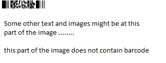

{}[Try online](https://products.aspose.app/barcode/recognize). You can check the quality of Aspose.BarCode recognition and view the results online.{}
## **Overview of Barcode Recognition Optimization Methods**
BarCodeReader uses [Machine vision](https://en.wikipedia.org/wiki/Machine_vision) algorithms to extract machine reading tags, which is also knows as barcodes, from captured image from any source. This raises main Machine vision problem to find balance between reading quality and speed. 

[BarCodeReader](https://apireference.aspose.com/barcode/net/aspose.barcode.barcoderecognition/barcodereader) has following features which allows obtaining the best balance depends your requirements:
* [Multi-threading](https://apireference.aspose.com/barcode/net/aspose.barcode.common/processorsettings) support. This feature utilizes additional processor cores to speed up algorithms, where they allow this.
* [Barcode types selection](https://apireference.aspose.com/barcode/net/aspose.barcode.barcoderecognition/decodetype). When you do not need in recognition of all supported barcodes types you can select only required types. Selection of only required barcode types instead of [AllSupportedTypes](https://apireference.aspose.com/barcode/net/aspose.barcode.barcoderecognition/decodetype/fields/allsupportedtypes) reduces recognition time.
* [QualitySettings](https://apireference.aspose.com/barcode/net/aspose.barcode.barcoderecognition/qualitysettings). This set of options allows to precisely tune barcode reading engine to you type of image and possible distortions. Disabling some options could increase recognition speed and enabling could increase recognition quality in your case.
* Regions selection. You can select required regions where barcode images could be located and reading engine will read barcode data only from selected regions. However, BarCodeReader uses own algorithms for barcode area precision and misusing of this option could even increase recognition time.

## **Optimize Barcode Recognition Process Through Multi-Threading**
[ProcessorSettings](https://apireference.aspose.com/barcode/net/aspose.barcode.common/processorsettings) class of namespace Aspose.BarCodeRecognition allows us to speed up the recognition process by defining the settings to involve multi-threading calculations and setting the number of processor cores to use. 
The process of multi-threading optimizations relies on standard system [ThreadPool](https://docs.microsoft.com/dotnet/api/system.threading.threadpool). This makes number of used threads depend on existent amount of worker threads, which also should be properly setup.

Aspose.BarCodeRecognition namespace introduced a class [ProcessorSettings](https://apireference.aspose.com/barcode/net/aspose.barcode.common/processorsettings) to define the settings for involving multi-threading and the number of processor cores to be used. ProcessorSettings can be found as a static member of class [BarCodeReader](https://apireference.aspose.com/barcode/net/aspose.barcode.barcoderecognition/barcodereader). Developers can set UseAllCores property to **true** or **false** to specify whether to use all cores of the processor or not. In case it is set to **false** then set how many cores for one job to be used by setting the UseOnlyThisCoresCount property that takes in an integer value. MaxAdditionalAllowedThreads defines maximal number of used threads for whole recognition engine.

The folowing examples show how to use multi-threading for obtaning maximal performance.

### **Enable Restricted Number Of Cores**

// Start the stopwatch
Stopwatch sw = new Stopwatch();
sw.Start();

// Define ThreadPool options
int workerThreads;
int completionPortThreads;
ThreadPool.GetMaxThreads(out workerThreads, out completionPortThreads);
ThreadPool.SetMaxThreads(Math.Max(RequiredCores * 2, workerThreads), completionPortThreads);
ThreadPool.GetMinThreads(out workerThreads, out completionPortThreads);
ThreadPool.SetMinThreads(Math.Max(RequiredCores * 2, workerThreads), completionPortThreads);

// Use manual ammount of allowed cores for whole recognition engine
BarCodeReader.ProcessorSettings.UseAllCores = false;
BarCodeReader.ProcessorSettings.UseOnlyThisCoresCount = RequiredCores;
BarCodeReader.ProcessorSettings.MaxAdditionalAllowedThreads = RequiredCores;

// Perform the BarCode recognition task Initialize the BarCodeReader object
using (BarCodeReader reader = new BarCodeReader(dataDir + "code39.png", DecodeType.Code128))
{
    foreach (BarCodeResult result in reader.ReadBarCodes())
    {
        Console.WriteLine(" Code Text: " + result.CodeText + " Type: " + result.CodeType);
    }
}

// Stop the stopwatch
sw.Stop();
// Write the Elapsed time to console
Console.WriteLine("Elapsed: " + sw.Elapsed);
 
{}**[OptimizingBarCodeRecognitionProcess.cs](https://github.com/aspose-barcode/Aspose.BarCode-for-.NET/blob/master/Examples/CSharp/ManageAndOptimizeBarcodeRecognition/OptimizingBarCodeRecognitionProcess.cs) as a source of code example, hosted by GitHub**{}
### **Enable All Cores**

// Start the stopwatch
Stopwatch sw = new Stopwatch();
sw.Start();

// Define ThreadPool options
int workerThreads;
int completionPortThreads;
ThreadPool.GetMaxThreads(out workerThreads, out completionPortThreads);
ThreadPool.SetMaxThreads(Math.Max(Environment.ProcessorCount * 4, workerThreads), completionPortThreads);
ThreadPool.GetMinThreads(out workerThreads, out completionPortThreads);
ThreadPool.SetMinThreads(Math.Max(Environment.ProcessorCount * 4, workerThreads), completionPortThreads);

// Use automatic ammount of allowed cores for task which is simular to Environment.ProcessorCount
// and max ammount of used threads for whole recognition engine is Environment.ProcessorCount * 2
BarCodeReader.ProcessorSettings.UseAllCores = true;
BarCodeReader.ProcessorSettings.MaxAdditionalAllowedThreads = Environment.ProcessorCount * 2;

// Perform the BarCode recognition task Initialize the BarCodeReader object
using (BarCodeReader reader = new BarCodeReader(dataDir + "code39.png", DecodeType.Code128))
{
    foreach (BarCodeResult result in reader.ReadBarCodes())
    {
        Console.WriteLine(" Code Text: " + result.CodeText + " Type: " + result.CodeType);
    }
}

// Stop the stopwatch
sw.Stop();
// Write the Elapsed time to console
Console.WriteLine("Elapsed: " + sw.Elapsed); 
{}**[OptimizingBarCodeRecognitionProcess.cs](https://github.com/aspose-barcode/Aspose.BarCode-for-.NET/blob/master/Examples/CSharp/ManageAndOptimizeBarcodeRecognition/OptimizingBarCodeRecognitionProcess.cs) as a source of code example, hosted by GitHub**{}

## **Optimize Barcode Recognition Process Through Barcode Types Selection**
[AllSupportedTypes](https://apireference.aspose.com/barcode/net/aspose.barcode.barcoderecognition/decodetype/fields/allsupportedtypes) allows to recognize all types of barcodes. [BarCodeReader](https://apireference.aspose.com/barcode/net/aspose.barcode.barcoderecognition/barcodereader)allows to recognize close to 70 barcode types and detection of some barcode types are independent from other. Some barcode types can be detected together and do not affect recognition speed. This leads to the situation that recognition time non-linearly depends from number of recognized types.

Also, some barcode types like [Industrial 2 of 5](https://en.wikipedia.org/wiki/Industrial_2_of_5) and [IATA 2 of 5](https://en.wikipedia.org/wiki/Industrial_2_of_5#IATA_2_of_5)are almost the same by structure and barcode type can be misrecognized. As other example, [MSI Barcode](https://en.wikipedia.org/wiki/MSI_Barcode) has low quality barcode structure and can be wrongly recognized on some noises on image. 

In this way, selection of only required barcode types allows to avoid wrong recognition and improve barcode recognition speed.
### **Recognizing All Supported Barcodes**

using (BarCodeReader reader = new BarCodeReader(dataDir + "test.png", DecodeType.AllSupportedTypes))
{
    foreach (BarCodeResult result in reader.ReadBarCodes())
    {
        Console.WriteLine(result.CodeType.ToString() + " " + result.CodeText);
    }
}
 
{}**[ReadAllSupportedTypesBarcode.cs](https://github.com/aspose-barcode/Aspose.BarCode-for-.NET/blob/master/Examples/CSharp/ManageBarCodes/ReadAllSupportedTypesBarcode.cs) as a source of code example, hosted by GitHub**{}
### **Recognizing Selected Barcode Symbologies**

// Initialize the BarCodeReader
using (BarCodeReader reader = new BarCodeReader(dataDir + "RecognizingMultipleSymbologies.png", DecodeType.Code39Standard, DecodeType.Pdf417))
{
    foreach (BarCodeResult result in reader.ReadBarCodes())
    {
        Console.WriteLine("Codetext: " + result.CodeText);
        Console.WriteLine("Symbology type: " + result.CodeType);
    }
}
 
{}**[RecognizeMultipleSymbologies.cs](https://github.com/aspose-barcode/Aspose.BarCode-for-.NET/blob/master/Examples/CSharp/ManageAndOptimizeBarcodeRecognition/RecognizeMultipleSymbologies.cs) as a source of code example, hosted by GitHub**{}

## **Optimize Barcode Recognition Process Through QualitySettings**
[QualitySettings](https://apireference.aspose.com/barcode/net/aspose.barcode.barcoderecognition/qualitysettings) allows to configure recognition quality and speed by setup internal algorithms of barcode reading engine. QualitySettings has predefined option presets, which can be additionally configured by tuning separate options. This can satisfy you in recognition speed with required quality on you types of images. 
### **QualitySettings Presets**
Barcode reading engine provides some recognition modes, those help developers to quickly set up and tune the processing speed and quality in a way which is the most appropriate for their need.

|Preset| Description|
| :- | :- |
|[High Performance](https://apireference.aspose.com/barcode/net/aspose.barcode.barcoderecognition/qualitysettings/properties/highperformance)|HighPerformance recognition quality preset. High-quality barcodes are recognized well in this mode.|
|[Normal Quality](https://apireference.aspose.com/barcode/net/aspose.barcode.barcoderecognition/qualitysettings/properties/normalquality)|Normal quality recognition quality preset. Suitable for most of the barcodes.|
|[High Quality Detection](https://apireference.aspose.com/barcode/net/aspose.barcode.barcoderecognition/qualitysettings/properties/highqualitydetection)|HighQualityDetection recognition quality preset. Same as NormalQuality but with high quality [DetectorSettings](https://apireference.aspose.com/barcode/net/aspose.barcode.barcoderecognition/qualitysettings/properties/detectorsettings)|
|[Max Quality Detection](https://apireference.aspose.com/barcode/net/aspose.barcode.barcoderecognition/qualitysettings/properties/maxqualitydetection)|MaxQualityDetection recognition quality preset. Same as NormalQuality but with highest quality [DetectorSettings](https://apireference.aspose.com/barcode/net/aspose.barcode.barcoderecognition/qualitysettings/properties/detectorsettings).|
|[High Quality](https://apireference.aspose.com/barcode/net/aspose.barcode.barcoderecognition/qualitysettings/properties/highquality)|HighQuality recognition quality preset. This preset is developed for low-quality barcodes.|
|[Max Barcodes](https://apireference.aspose.com/barcode/net/aspose.barcode.barcoderecognition/qualitysettings/properties/maxbarcodes)|MaxBarCodes recognition quality preset. This preset is developed to recognize all possible barcodes, even incorrect barcodes.|

The following code snippet shows how to switch the barcode recognition modes:

// Create an instance of BarCodeReader and set image and symbology type to recognize
using (BarCodeReader barCodeReader = new BarCodeReader(dataDir + "code39.png", DecodeType.Code39Standard))
{
    // Set grayscale image processing
    barCodeReader.QualitySettings = QualitySettings.MaxBarCodes;

    // Try to recognize all possible barcodes in the image and Display the codetext
    foreach (BarCodeResult result in barCodeReader.ReadBarCodes())
    {
        Console.WriteLine("Codetext: " + result.CodeText);
    }
}
 
{}**[ImageProcessingBarcodeRecognition.cs](https://github.com/aspose-barcode/Aspose.BarCode-for-.NET/blob/master/Examples/CSharp/ManageAndOptimizeBarcodeRecognition/ImageProcessingBarcodeRecognition.cs) as a source of code example, hosted by GitHub**{}

### **QualitySettings Options**
QualitySettings options can be configured separately after preset setup. This can enable special recognition algorithm to resolve image distortions in your cases. 

|Option| Description|
| :- | :- |
|[AllowComplexBackground](https://apireference.aspose.com/barcode/net/aspose.barcode.barcoderecognition/qualitysettings/properties/allowcomplexbackground)|Allows the engine to recognize color barcodes on the color background as an additional scan. Extremely slow mode.|
|[AllowDatamatrixIndustrialBarcodes](https://apireference.aspose.com/barcode/net/aspose.barcode.barcoderecognition/qualitysettings/properties/allowdatamatrixindustrialbarcodes)|Allows engine for Datamatrix to recognize dashed industrial Datamatrix barcodes. The slow mode helps only for dashed barcodes which consist of spots.|
|[AllowDecreasedImage](https://apireference.aspose.com/barcode/net/aspose.barcode.barcoderecognition/qualitysettings/properties/allowdecreasedimage)|Allows the engine to recognize the decreased image as an additional scan. Size for decreasing is selected by internal engine algorithms. Mode helps to recognize barcodes that are noised and blurred but captured with high resolution.|
|[AllowDetectScanGap](https://apireference.aspose.com/barcode/net/aspose.barcode.barcoderecognition/qualitysettings/properties/allowdetectscangap)|Allows the engine to use the gap between scans to increase recognition speed. The mode can make recognition problems with low height barcodes.|
|[AllowIncorrectBarcodes](https://apireference.aspose.com/barcode/net/aspose.barcode.barcoderecognition/qualitysettings/properties/allowincorrectbarcodes)|Allows the engine to recognize barcodes that have an incorrect checksum or incorrect values. The mode can be used to recognize damaged barcodes with incorrect text.|
|[AllowInvertImage](https://apireference.aspose.com/barcode/net/aspose.barcode.barcoderecognition/qualitysettings/properties/allowinvertimage)|Allows the engine to recognize the inverse color image as an additional scan. The mode can be used when the barcode is white on black background.|
|[AllowMedianSmoothing](https://apireference.aspose.com/barcode/net/aspose.barcode.barcoderecognition/qualitysettings/properties/allowmediansmoothing)|Allows engine to enable median smoothing as an additional scan. Mode helps to recognize noised barcodes.|
|[AllowMicroWhiteSpotsRemoving](https://apireference.aspose.com/barcode/net/aspose.barcode.barcoderecognition/qualitysettings/properties/allowmicrowhitespotsremoving)|Allows engine for Postal barcodes to recognize slightly noised images. Mode helps to recognize slightly damaged Postal barcodes.|
|[AllowOneDFastBarcodesDetector](https://apireference.aspose.com/barcode/net/aspose.barcode.barcoderecognition/qualitysettings/properties/allowonedfastbarcodesdetector)|Allows engine for 1D barcodes to quickly recognize high-quality barcodes which fill almost the whole image. Mode helps to quickly recognize generated barcodes from the Internet.|
|[AllowOneDWipedBarsRestoration](https://apireference.aspose.com/barcode/net/aspose.barcode.barcoderecognition/qualitysettings/properties/allowonedwipedbarsrestoration)|Allows engine for 1D barcodes to recognize barcodes with single wiped/glued bars in pattern.|
|[AllowQRMicroQrRestoration](https://apireference.aspose.com/barcode/net/aspose.barcode.barcoderecognition/qualitysettings/properties/allowqrmicroqrrestoration)|Allows engine for QR/MicroQR to recognize damaged MicroQR barcodes.|
|[AllowRegularImage](https://apireference.aspose.com/barcode/net/aspose.barcode.barcoderecognition/qualitysettings/properties/allowregularimage)|Allows the engine to recognize the regular image without any restorations as the main scan. Mode to recognize the image as is.|
|[AllowSaltAndPaperFiltering](https://apireference.aspose.com/barcode/net/aspose.barcode.barcoderecognition/qualitysettings/properties/allowsaltandpaperfiltering)|Allows engine to recognize barcodes with salt and paper noise type. The mode can remove small noise with white and black dots.|
|[AllowWhiteSpotsRemoving](https://apireference.aspose.com/barcode/net/aspose.barcode.barcoderecognition/qualitysettings/properties/allowwhitespotsremoving)|Allows the engine to recognize the image without small white spots an additional scan. Mode helps to recognize the noised image as well as median smoothing filtering.|
|[CheckMore1DVariants](https://apireference.aspose.com/barcode/net/aspose.barcode.barcoderecognition/qualitysettings/properties/checkmore1dvariants)|Allows engine to recognize 1D barcodes with checksum by checking more recognition variants.|
|[DetectorSettings](https://apireference.aspose.com/barcode/net/aspose.barcode.barcoderecognition/qualitysettings/properties/detectorsettings)|Settings of 1D barcodes area detector.|
|[MedianSmoothingWindowSize](https://apireference.aspose.com/barcode/net/aspose.barcode.barcoderecognition/qualitysettings/properties/mediansmoothingwindowsize)|Window size for median smoothing. Typical values are 3 or 4. The default value is 3. AllowMedianSmoothing must be set.|
|[ReadTinyBarcodes](https://apireference.aspose.com/barcode/net/aspose.barcode.barcoderecognition/qualitysettings/properties/readtinybarcodes)|Allows engine to recognize tiny barcodes on large images. Ignored if AllowIncorrectBarcodes is set to True.|
|[UseOldBarcodeDetector](https://apireference.aspose.com/barcode/net/aspose.barcode.barcoderecognition/qualitysettings/properties/useoldbarcodedetector)|Switches to the old barcode detector which is sometimes faster.|

The following code snippet shows how to use QualitySettings options:

// Initialize the BarCodeReader object and  Set recognition mode
using (BarCodeReader reader = new BarCodeReader(dataDir + "datamatrix-barcode.jpg", DecodeType.DataMatrix))
{
    reader.QualitySettings = QualitySettings.HighPerformance;
    reader.QualitySettings.AllowInvertImage = true;
    reader.QualitySettings.AllowIncorrectBarcodes = true;

    // Try to recognize all possible barcodes in the image and Display the codetext
    foreach (BarCodeResult result in reader.ReadBarCodes())
    {
        Console.WriteLine("Codetext: " + result.CodeText);
    }
}
 
{}**[SwitchBarcodeRecognitionModes.cs](https://github.com/aspose-barcode/Aspose.BarCode-for-.NET/blob/master/Examples/CSharp/ManageAndOptimizeBarcodeRecognition/SwitchBarcodeRecognitionModes.cs) as a source of code example, hosted by GitHub**{}

### **QualitySettings Examples**
#### **QualitySettings Preset Example**

using (BarCodeReader reader = new BarCodeReader(dataDir + "Scan.jpg"))
{
    //set high quality mode with low speed recognition 
    reader.QualitySettings = QualitySettings.HighQuality;
    foreach (BarCodeResult result in reader.ReadBarCodes())
        Console.WriteLine("BarCode CodeText: " + result.CodeText);
}
 
{}**[BarCodeRecognitionFilters.cs](https://github.com/aspose-barcode/Aspose.BarCode-for-.NET/blob/master/Examples/CSharp/ManageAndOptimizeBarcodeRecognition/BarCodeRecognitionFilters.cs) as a source of code example, hosted by GitHub**{}

#### **QualitySettings Preset with Manual Options**

using (BarCodeReader reader = new BarCodeReader(dataDir + "Scan.jpg"))
{
    //set high performance mode
    reader.QualitySettings = QualitySettings.HighPerformance;
    //set separate options
    reader.QualitySettings.AllowMedianSmoothing = true;
    reader.QualitySettings.MedianSmoothingWindowSize = 5;
    foreach (BarCodeResult result in reader.ReadBarCodes())
        Console.WriteLine("BarCode CodeText: " + result.CodeText);
}
 
{}**[BarCodeRecognitionFilters.cs](https://github.com/aspose-barcode/Aspose.BarCode-for-.NET/blob/master/Examples/CSharp/ManageAndOptimizeBarcodeRecognition/BarCodeRecognitionFilters.cs) as a source of code example, hosted by GitHub**{}

#### **QualitySettings with Manual Options for Normal Quality**

using (BarCodeReader reader = new BarCodeReader(dataDir + "Scan.jpg"))
{
    //default mode is NormalQuality
    //set separate options
    reader.QualitySettings.AllowMedianSmoothing = true;
    reader.QualitySettings.MedianSmoothingWindowSize = 5;
    foreach (BarCodeResult result in reader.ReadBarCodes())
        Console.WriteLine("BarCode CodeText: " + result.CodeText);
}
 
{}**[BarCodeRecognitionFilters.cs](https://github.com/aspose-barcode/Aspose.BarCode-for-.NET/blob/master/Examples/CSharp/ManageAndOptimizeBarcodeRecognition/BarCodeRecognitionFilters.cs) as a source of code example, hosted by GitHub**{}

#### **Improve Barcode detection by allowing Unreadable Barcodes in Quality Settings**
[BarCodeReader](https://apireference.aspose.com/barcode/net/aspose.barcode.barcoderecognition/barcodereader) allows developers to detect an unreadable barcode on the image be enabling [QualitySettings.MaxBarCodes](https://apireference.aspose.com/barcode/net/aspose.barcode.barcoderecognition/qualitysettings/properties/maxbarcodes) preset.

using (BarCodeReader reader = new BarCodeReader(dataDir + "code39.png", DecodeType.Code39Standard))
{
    //set max barcodes mode, which tries to find all possible barcodes, even incorrect. 
    //The slowest recognition mode
    reader.QualitySettings = QualitySettings.MaxBarCodes;
    foreach (BarCodeResult result in reader.ReadBarCodes())
    {
        Console.WriteLine("BarCode CodeText: " + result.CodeText);
        Console.WriteLine("BarCode Type: " + result.CodeType);
    }
}
 
{}**[DetectUnreadableBarcode.cs](https://github.com/aspose-barcode/Aspose.BarCode-for-.NET/blob/master/Examples/CSharp/ManageAndOptimizeBarcodeRecognition/DetectUnreadableBarcode.cs) as a source of code example, hosted by GitHub**{}

#### **Improve Barcode detection by Allowing Image Inversion in Quality Settings**

using (BarCodeReader reader = new BarCodeReader(dataDir + "Scan.jpg", DecodeType.DataMatrix))
{
    reader.QualitySettings.AllowInvertImage = true;
    foreach (BarCodeResult result in reader.ReadBarCodes())
        Console.WriteLine("BarCode CodeText: " + result.CodeText);
}
 
{}**[BarCodeRecognitionFilters.cs](https://github.com/aspose-barcode/Aspose.BarCode-for-.NET/blob/master/Examples/CSharp/ManageAndOptimizeBarcodeRecognition/BarCodeRecognitionFilters.cs) as a source of code example, hosted by GitHub**{}
#### **Recognizing Single Wiped Bars in Pattern**
Aspose.BarCode provides public property AllowOneDWipedBarsRestoration to the QualitySettings which allows recognizing barcodes with single wiped/glued bars in pattern. This property is enabled by default in HighQuality, MaxBarCodes modes. Currently this property can be used for Code128, GS1Code128, SCC14, EAN14, SSCC18, AustralianPosteParcel and SwissPostParcel barcode types.

// Initialize the BarCodeReader object and  Set recognition mode
using (BarCodeReader reader = new BarCodeReader(@"file.tiff", DecodeType.Code128))
{
    reader.QualitySettings.AllowOneDWipedBarsRestoration = true;
    List<string> lCodetexts = new List<string>();
    foreach (BarCodeResult result in reader.ReadBarCodes())
    {
        lCodetexts.Add(result.CodeText);
        Console.WriteLine(result.CodeText);
    }
} 
{}**[SingleWipedBarsInPattern.cs](https://github.com/aspose-barcode/Aspose.BarCode-for-.NET/blob/master/Examples/CSharp/ManageAndOptimizeBarcodeRecognition/SingleWipedBarsInPattern.cs) as a source of code example, hosted by GitHub**{}

## **Optimize Barcode Recognition Process Through Specific Regions Selection**
You can choose only regions with possible barcode areas and this in most cases could improve recognition speed. However, you have to make attention on [BarCodeReader](https://apireference.aspose.com/barcode/net/aspose.barcode.barcoderecognition/barcodereader) specific algorithms, because it uses own algorithms for barcode area detection and misusing of this option could even decrease recognition speed. This recognition option could be used, as an example, for reading barcodes only from central camera region.
### **Reading Barcode from Specific Region of Image**
In this section, we will scan only a part of the image that contains a barcode. Suppose that we have an image of a large size e.g. 800 x 600 pixels and our barcode is placed on the top left corner of the image e.g. 100 x 50 pixels, we can optimize the barcode scanning by specifying the area, instead of scanning the whole image. But, in this case, we need to know in advance about the location of the barcode. The barcode reader will not scan other parts of the image if we specify the area. The following image is 333 x 127 pixels and the size of the barcode is only 94 x 18 pixels and it is located on the top right corner of the image. The rest of the image contains some text in this example. But in your case, it might contain any other text and image.

If we specify an area of (0, 0, 100, 50), the barcode reader will scan only this area and will be able to recognize the barcode. It will greatly increase the speed of recognition because the barcode reader will not look in other parts of the image.

// Create an instance of BarCodeReader class and specify an area to look for the barcode
using (BarCodeReader reader = new BarCodeReader(new Bitmap(dataDir + "ReadBarcodefromSpecificRegionofImage.png"), new Rectangle(0, 0, 100, 50), DecodeType.Pdf417))
{
    // Read all barcodes in the provided area
    foreach (BarCodeResult result in reader.ReadBarCodes())
    {
        // Display the codetext and symbology type of the barcode found
        Console.WriteLine("Codetext: " + result.CodeText + " Symbology: " + result.CodeType);
    }
}
 
{}**[ReadBarcodeSpecificRegionOfImage.cs](https://github.com/aspose-barcode/Aspose.BarCode-for-.NET/blob/master/Examples/CSharp/ManageAndOptimizeBarcodeRecognition/ReadBarcodeSpecificRegionOfImage.cs) as a source of code example, hosted by GitHub**{}
### **Reading Barcode from Whole Region of Image**

using (Bitmap lBitmap = new Bitmap(dataDir + "Scan.jpg"))
{
    using (BarCodeReader reader = new BarCodeReader(lBitmap, new Rectangle(0, 0, lBitmap.Width, lBitmap.Height)))
    {
        //other way to set
        reader.SetBarCodeImage(lBitmap, new Rectangle(0, 0, lBitmap.Width, lBitmap.Height));
        foreach (BarCodeResult result in reader.ReadBarCodes())
            Console.WriteLine("BarCode CodeText: " + result.CodeText);
    }
}
 
{}**[ReadBarcodeSpecificRegionOfImage.cs](https://github.com/aspose-barcode/Aspose.BarCode-for-.NET/blob/master/Examples/CSharp/ManageAndOptimizeBarcodeRecognition/ReadBarcodeSpecificRegionOfImage.cs) as a source of code example, hosted by GitHub**{}
### **Reading Barcodes from Multiple Regions**
In this section, we will scan multiple parts of the image to read barcodes from those specific regions. Suppose that we have an image of large size e.g. 800 x 600 pixels and our barcodes are placed on the top left and bottom right corners of the image, we can optimize the barcode scanning by specifying the areas, instead of scanning the whole image. But, in this case, we need to know in advance about the locations of the barcodes. The barcode reader will not scan other parts of the image if we specify the areas.

// Initialize the Bitmap object            
Bitmap bitmap = new Bitmap(dataDir + "Region.png");
Rectangle[] areas = new Rectangle[3];
areas[0] = new Rectangle(50, 50, 300, 300);
areas[1] = new Rectangle(400, 40, 350, 350);
areas[2] = new Rectangle(40, 500, 700, 150);

// Initialize the BarCodeReader object and load bitmap object       
using (BarCodeReader reader = new BarCodeReader(bitmap, areas, DecodeType.Code39Standard))
{
    foreach (BarCodeResult result in reader.ReadBarCodes())
    {
        Console.WriteLine(result.CodeType + ": " + result.CodeText);
    }
}
 
{}**[ReadMultipleBarcodeRegions.cs](https://github.com/aspose-barcode/Aspose.BarCode-for-.NET/blob/master/Examples/CSharp/ManageAndOptimizeBarcodeRecognition/ReadMultipleBarcodeRegions.cs) as a source of code example, hosted by GitHub**{}
### **Reading Barcodes from Whole Region Defined as Multiple Regions**

using (Bitmap lBitmap = new Bitmap(dataDir + "Scan.jpg"))
{
    using (BarCodeReader reader = new BarCodeReader(lBitmap, new Rectangle[] { new Rectangle(0, 0, lBitmap.Width, lBitmap.Height) }))
    {
        //other way to set
        reader.SetBarCodeImage(lBitmap, new Rectangle[] { new Rectangle(0, 0, lBitmap.Width, lBitmap.Height) });
        foreach (BarCodeResult result in reader.ReadBarCodes())
            Console.WriteLine("BarCode CodeText: " + result.CodeText);
    }
}
 
{}**[ReadBarcodeSpecificRegionOfImage.cs](https://github.com/aspose-barcode/Aspose.BarCode-for-.NET/blob/master/Examples/CSharp/ManageAndOptimizeBarcodeRecognition/ReadBarcodeSpecificRegionOfImage.cs) as a source of code example, hosted by GitHub**{}