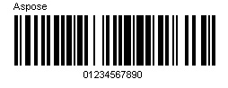
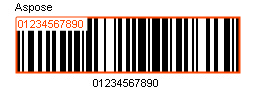
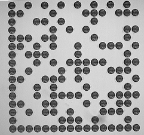

{}[Try online](https://products.aspose.app/barcode/recognize). You can check the quality of Aspose.BarCode recognition and view the results online.{}
## **BarCode Recognition Basics**
Aspose.BarCode for .NET component contains two powerful classes, [BarcodeGenerator](https://apireference.aspose.com/barcode/net/aspose.barcode.generation/barcodegenerator) and [BarCodeReader](https://apireference.aspose.com/barcode/net/aspose.barcode.barcoderecognition/barcodereader), handling BarCode images generation and recognition respectively. BarCodeReader reads most commonly used 1D and 2D barcodes, detecting them anywhere.
### **How to scan a barcode from a picture**
The following example demonstrates how to scan a picture of a barcode image using Aspose.BarCode

// Read file from directory with DecodeType.EAN13
using (BarCodeReader reader = new BarCodeReader(dataDir + "Scan.jpg", DecodeType.EAN13))
{
    foreach (BarCodeResult result in reader.ReadBarCodes())
    {
        // Read symbology type and code text
        Console.WriteLine("Symbology Type: " + result.CodeType);
        Console.WriteLine("CodeText: " + result.CodeText);
    }
}
 
{}**[ScanBarCodePicture.cs](https://github.com/aspose-barcode/Aspose.BarCode-for-.NET/blob/master/Examples/CSharp/ManageAndOptimizeBarcodeRecognition/ScanBarCodePicture.cs) as a source of code example, hosted by GitHub**{}

|**A barcode image**|**Scan results**|
| :- | :- |
|||
## **Read Barcode from Stream**

using (FileStream lStream = new FileStream(dataDir + "Scan.jpg", FileMode.Open, FileAccess.Read, FileShare.Read))
{
    using (BarCodeReader reader = new BarCodeReader(lStream))
    {
        //other way to set
        reader.SetBarCodeImage(lStream);
        foreach (BarCodeResult result in reader.ReadBarCodes())
            Console.WriteLine("BarCode CodeText: " + result.CodeText);
    }
}
 
{}**[BarcodeReaderSetBarcodeImage.cs](https://github.com/aspose-barcode/Aspose.BarCode-for-.NET/blob/master/Examples/CSharp/ManageAndOptimizeBarcodeRecognition/BarcodeReaderSetBarcodeImage.cs) as a source of code example, hosted by GitHub**{}
## **Recognizing Barcode Symbology**
This section shows the basic settings of BarCodeReader. We will specify the Symbology type in the constructor of BarCodeReader class and use the [BarCodeReader.ReadBarCodes()](https://apireference.aspose.com/barcode/net/aspose.barcode.barcoderecognition/barcodereader/methods/readbarcodes) method to recognize the barcodes from the image. This should be the case if we already know the Symbology Type.
### **SymbologyType of a barcode**
If we specify the Symbology Type in the constructor, the program will know beforehand about the symbology type to be recognized and it will be faster than not passing the symbology type in the constructor. If we know the types of barcodes ahead, recognition will speed up a lot. The following code snippet shows you how to specify the symbology Type.

// Create instance of BarCodeReader class 
using (BarCodeReader reader = new BarCodeReader(dataDir + "Code128.jpg", DecodeType.Code128))
{
    foreach (BarCodeResult result in reader.ReadBarCodes())
    {
        // Display code text and Symbology Type
        Console.WriteLine("CodeText: " + result.CodeText);
        Console.Write("Symbology Type: " + result.CodeType);
    }
}
 
{}**[RecognizeSpecificBarcodeSymbology.cs](https://github.com/aspose-barcode/Aspose.BarCode-for-.NET/blob/master/Examples/CSharp/ManageAndOptimizeBarcodeRecognition/RecognizeSpecificBarcodeSymbology.cs) as a source of code example, hosted by GitHub**{}

For unknown types of barcodes, use [DecodeType.AllSupportedTypes](https://apireference.aspose.com/barcode/net/aspose.barcode.barcoderecognition/decodetype/fields/allsupportedtypes).

### **Recognizing Multiple Symbologies in Single Image**
There might be such situations in which there are multiple barcodes in a single image. Aspose.BarCode can easily recognize all the barcodes of the supported symbology types. This can be done by specifying multiple symbology types separated by comma in the barcode constructor. See the image below. It contains 2 barcodes of type Code39Standard and PDF417.


// Initialize the BarCodeReader
using (BarCodeReader reader = new BarCodeReader(dataDir + "RecognizingMultipleSymbologies.png", DecodeType.Code39Standard, DecodeType.Pdf417))
{
    foreach (BarCodeResult result in reader.ReadBarCodes())
    {
        Console.WriteLine("Codetext: " + result.CodeText);
        Console.WriteLine("Symbology type: " + result.CodeType);
    }
}
 
{}**[RecognizeMultipleSymbologies.cs](https://github.com/aspose-barcode/Aspose.BarCode-for-.NET/blob/master/Examples/CSharp/ManageAndOptimizeBarcodeRecognition/RecognizeMultipleSymbologies.cs) as a source of code example, hosted by GitHub**{}
In the above code snippet, we assumed that we already knew the symbology types of the barcodes in the image. So, we specified the symbologies separated by comma. 
## **Get all Possible Barcodes from an Image**
The [DecodeType.AllSupportedTypes](https://apireference.aspose.com/barcode/net/aspose.barcode.barcoderecognition/decodetype/fields/allsupportedtypes) method is only for 1D barcodes. It returns an array of all possible barcodes found. This array holds all information about the barcodes like code text, symbology, recognition percentage, and region details. The following code snippet shows you how to get all possible 1D barcodes from an image.

// Initialize the BarCodeReader object and Call read method
BarCodeReader reader = new BarCodeReader(dataDir + "Barcode2.png", DecodeType.AllSupportedTypes);

// To get all possible barcodes
reader.QualitySettings = QualitySettings.MaxBarCodes;

foreach (BarCodeResult result in reader.ReadBarCodes())
{
    // Display code text, symbology, detected angle, recognition percentage of the barcode
    Console.WriteLine("Code Text: " + result.CodeText + " Symbology: " + result.CodeType + " Recognition percentage: " + result.Region.Angle);

    // Display x and y coordinates of barcode detected
    Point[] point = result.Region.Points;
    Console.WriteLine("Top left coordinates: X = " + point[0].X + ", Y = " + point[0].Y);
    Console.WriteLine("Bottom left coordinates: X = " + point[1].X + ", Y = " + point[1].Y);
    Console.WriteLine("Bottom right coordinates: X = " + point[2].X + ", Y = " + point[2].Y);
    Console.WriteLine("Top right coordinates: X = " + point[3].X + ", Y = " + point[3].Y);
}
 
{}**[GetAllPossibleBarcodesfromImage.cs](https://github.com/aspose-barcode/Aspose.BarCode-for-.NET/blob/master/Examples/CSharp/ManageAndOptimizeBarcodeRecognition/GetAllPossibleBarcodesfromImage.cs) as a source of code example, hosted by GitHub**{}
## **Datamatrix Barcode**
### **Detect Decorated Datamatrix Barcode**
[Aspose.BarCode for .NET API](https://www.aspose.com/products/barcode/net) allows developers to detect decorated DataMatrix barcode on the image. To detect the decorated DataMatrix barcode, developers have to configure QualitySettings by using BarCodeReader.QualitySettings property which is an instance of QualitySettings class. QualitySettings allows to configure recognition quality and speed manually. You can quickly set up QualitySettings by embedded presets: HighPerformance, NormalQuality, HighQuality, MaxBarCodes or you can manually configure separate options. The default value of QualitySettings is NormalQuality. To detect the dot peen DataMatrix barcode, developers have to set the BarCodeReader.[AllowDatamatrixIndustrialBarcodes](https://apireference.aspose.com/barcode/net/aspose.barcode.barcoderecognition/qualitysettings/properties/allowdatamatrixindustrialbarcodes) property to true. The following code snippet shows you how to detect decorated DataMatrix barcodes.


// Initialize the BarCodeReader class by passing barcode file name and barcode type as parameters            
using (BarCodeReader reader = new BarCodeReader(dataDir + "datamatrix-stars.png", DecodeType.DataMatrix))
{
    //set high performance mode
    reader.QualitySettings = QualitySettings.HighPerformance;
	reader.QualitySettings.AllowDatamatrixIndustrialBarcodes = true;
    foreach (BarCodeResult result in reader.ReadBarCodes())
    {
        Console.WriteLine(result.CodeType + ": " + result.CodeText);
    }
}
 
{}**[DetectDecoratedDatamatrix.cs](https://github.com/aspose-barcode/Aspose.BarCode-for-.NET/blob/master/Examples/CSharp/ManageAndOptimizeBarcodeRecognition/DetectDecoratedDatamatrix.cs) as a source of code example, hosted by GitHub**{}

### **Detect Dot Peen Datamatrix Barcode**
[Aspose.BarCode for .NET API](https://www.aspose.com/products/barcode/net) allows developers to detect dot peen DataMatrix barcode on the image. To detect the dot peen DataMatrix barcode, developers have to set the BarCodeReader.[AllowDatamatrixIndustrialBarcodes](https://apireference.aspose.com/barcode/net/aspose.barcode.barcoderecognition/qualitysettings/properties/allowdatamatrixindustrialbarcodes) property to true. The [AllowDatamatrixIndustrialBarcodes](https://apireference.aspose.com/barcode/net/aspose.barcode.barcoderecognition/qualitysettings/properties/allowdatamatrixindustrialbarcodes) property allows engine for Datamatrix to recognize dashed industrial Datamatrix barcodes. Following is the code illustration.


// Initialize the BarCodeReader class by passing barcode file name and barcode type as parameters
using (BarCodeReader reader = new BarCodeReader(dataDir + "datamatrix-DotPeen.png", DecodeType.DataMatrix))
{
    //set high performance mode
    reader.QualitySettings = QualitySettings.HighPerformance;
    reader.QualitySettings.AllowDatamatrixIndustrialBarcodes = true;
    foreach (BarCodeResult result in reader.ReadBarCodes())
    {
        Console.WriteLine(result.CodeType + ": " + result.CodeText);
    }
}
 
{}**[DetectDotPeenDatamatrix.cs](https://github.com/aspose-barcode/Aspose.BarCode-for-.NET/blob/master/Examples/CSharp/ManageAndOptimizeBarcodeRecognition/DetectDotPeenDatamatrix.cs) as a source of code example, hosted by GitHub**{}

## **MacroPDF417 Barcode**
### **Reading Multiple MacroPDF417 Barcodes**
We can recognize Macro Pdf417 barcodes which is PDF417 barcodes with extended metadata. [BarCodeReader](https://apireference.aspose.com/barcode/net/aspose.barcode.barcoderecognition/barcodereader) class. can recognize these metadatas and store them in [Pdf417ExtendedParameters](https://apireference.aspose.com/barcode/net/aspose.barcode.barcoderecognition/pdf417extendedparameters) structure. The BarCodeReader class can recognize the Segment ID, File ID, Segment ID, Segment Count, File Size, Sender, Addressee, Date and Checksum metadatas.In the lower code example we show how to read Macro Pdf417 metadatas with barcode data.

// Create array for storing multiple bar codes file names
string[] files = new string[] { "MacroPdf417_0.png", "MacroPdf417_1.png" };

// Iiterate through the bar code image files
for (int i = 0; i < files.Length; ++i)
{
    // Create instance of BarCodeReader class and set symbology
    using (BarCodeReader reader = new BarCodeReader(dataDir + files[i], DecodeType.MacroPdf417))
    {
        foreach (BarCodeResult result in reader.ReadBarCodes())
        {
            // Get code text, file id, segment id and segment count
            Console.WriteLine("File Name: " + files[i] + " Code Text: " + result.CodeText);
            Console.WriteLine("File ID: " + result.Extended.Pdf417.MacroPdf417FileID);
            Console.WriteLine("Segment ID: " + result.Extended.Pdf417.MacroPdf417SegmentID);
            Console.WriteLine("Segment Count: " + result.Extended.Pdf417.MacroPdf417SegmentsCount);
            Console.WriteLine("File Size: " + result.Extended.Pdf417.MacroPdf417FileSize);
            Console.WriteLine("Sender: " + result.Extended.Pdf417.MacroPdf417Sender);
            Console.WriteLine("Addressee: " + result.Extended.Pdf417.MacroPdf417Addressee);
            Console.WriteLine("Date: " + result.Extended.Pdf417.MacroPdf417TimeStamp.ToString());
            Console.WriteLine("Checksum: " + result.Extended.Pdf417.MacroPdf417Checksum);
        }
        Console.WriteLine();
    }
}
 
{}**[ReadMultipleMacroPdf417Barcodes.cs](https://github.com/aspose-barcode/Aspose.BarCode-for-.NET/blob/master/Examples/CSharp/ManageAndOptimizeBarcodeRecognition/ReadMultipleMacroPdf417Barcodes.cs) as a source of code example, hosted by GitHub**{}

## **Recognizing Barcode in WPF Project**
Aspose.BarCode supports recognizing barcodes in WPF projects. To do so, specify the symbology type in the constructor of the BarCodeReader class and use the [ReadBarCodes()](https://apireference.aspose.com/barcode/net/aspose.barcode.barcoderecognition/barcodereader/methods/readbarcodes) method to recognize the barcodes from the barcode control. Aspose.BarCode.dll should be referenced in WPF applications for barcode generation and recognition. To use Barcode in WPF Project please the steps given follow.

1. Create a new WPF application in Visual Studio 2019.
1. Add a reference to Aspose.BarCode.dll to **References** section.
1. Drag a button control to the form.
1. Add the following code to its Click event.


//generate our image source, can be obtained from other variants
Bitmap imageSourceForRecognition = (new BarcodeGenerator(EncodeTypes.Code128, "12345678")).GenerateBarCodeImage();

//read our barcode
using (BarCodeReader reader = new BarCodeReader(imageSourceForRecognition, DecodeType.Code128))
{
    foreach (BarCodeResult result in reader.ReadBarCodes())
    {
        // Read symbology type and code text
        Console.WriteLine("Symbology Type: " + result.CodeType);
        Console.WriteLine("CodeText: " + result.CodeText);
    }
}
 
{}**[ReadBarcodeInWPF](https://github.com/aspose-barcode/Aspose.BarCode-for-.NET/blob/master/Examples/CSharp/ManageAndOptimizeBarcodeRecognition/ReadBarcodeInWPF.cs) as a source of code example, hosted by GitHub**{}

Also you need to initialize license, the best way of license initialization is initialize it as lazy initialization in static class.

internal class LazyLicenseInitialization
{
    private static LazyLicenseInitialization instance = new LazyLicenseInitialization();
    private LazyLicenseInitialization()
    {
        //code setting license
        //(new Aspose.BarCode.License()).SetLicense(@"Aspose.Total.NET.lic");
    }
    //required to make LazyLicenseInitialization visible to VM
    //and do single run code in LazyLicenseInitialization() 
    internal static void Init()
    { }
}

public MainWindow()
{
	//once run license intialization
	LazyLicenseInitialization.Init();
    InitializeComponent();
}
 
## **Read Predefined Barcode types sets**
[BarCodeReader](https://apireference.aspose.com/barcode/net/aspose.barcode.barcoderecognition/barcodereader) allows to read not only selected barcode types set but already predefined types sets which is defined in [DecodeType](https://apireference.aspose.com/barcode/net/aspose.barcode.barcoderecognition/decodetype).
### **Read All Supported Barcodes**

using (BarCodeReader reader = new BarCodeReader(dataDir + "test.png", DecodeType.AllSupportedTypes))
{
    foreach (BarCodeResult result in reader.ReadBarCodes())
    {
        Console.WriteLine(result.CodeType.ToString() + " " + result.CodeText);
    }
}
 
{}**[ReadAllSupportedTypesBarcode.cs](https://github.com/aspose-barcode/Aspose.BarCode-for-.NET/blob/master/Examples/CSharp/ManageBarCodes/ReadAllSupportedTypesBarcode.cs) as a source of code example, hosted by GitHub**{}
### **Read Most Common Barcodes**

using (BarCodeReader reader = new BarCodeReader(dataDir + "test.png", DecodeType.MostCommonTypes))
{
    foreach (BarCodeResult result in reader.ReadBarCodes())
    {
        Console.WriteLine(result.CodeType.ToString() + " " + result.CodeText);
    }
}
 
{}**[ReadMostCommonTypeBarcode.cs](https://github.com/aspose-barcode/Aspose.BarCode-for-.NET/blob/master/Examples/CSharp/ManageBarCodes/ReadMostCommonTypeBarcode.cs) as a source of code example, hosted by GitHub**{}
### **Read Postal Type Barcodes**

using (BarCodeReader reader = new BarCodeReader(dataDir + "test.png", DecodeType.PostalTypes))
{
    foreach (BarCodeResult result in reader.ReadBarCodes())
    {
        Console.WriteLine(result.CodeType.ToString() + " " + result.CodeText);
    }
}
 
{}**[ReadPostalTypesBarcode.cs](https://github.com/aspose-barcode/Aspose.BarCode-for-.NET/blob/master/Examples/CSharp/ManageBarCodes/ReadPostalTypesBarcode.cs) as a source of code example, hosted by GitHub**{}
### **Read 1D Barcodes**

using (BarCodeReader reader = new BarCodeReader(dataDir + "test.png", DecodeType.Types1D))
{
    foreach (BarCodeResult result in reader.ReadBarCodes())
    {
        Console.WriteLine(result.CodeType.ToString() + " " + result.CodeText);
    }
}
 
{}**[ReadType1DBarcode.cs](https://github.com/aspose-barcode/Aspose.BarCode-for-.NET/blob/master/Examples/CSharp/ManageBarCodes/ReadType1DBarcode.cs) as a source of code example, hosted by GitHub**{}
### **Read 2D Barcodes**

using (BarCodeReader reader = new BarCodeReader(dataDir + "test.png", DecodeType.Types2D))
{
    foreach (BarCodeResult result in reader.ReadBarCodes())
    {
        Console.WriteLine(result.CodeType.ToString() + " " + result.CodeText);
    }
}
 
{}**[ReadType2DBarcode.cs](https://github.com/aspose-barcode/Aspose.BarCode-for-.NET/blob/master/Examples/CSharp/ManageBarCodes/ReadType2DBarcode.cs) as a source of code example, hosted by GitHub**{}