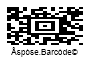

{}[Generate Aztec Barcodes Online](https://products.aspose.app/barcode/generate/aztec): You can check the quality of ***Aspose.BarCode*** generation for Aztec barcodes and view the results online.{}

## **Overview**
*Aztec Code* is a 2D matrix type that supports encoding both byte streams and alphanumeric characters. *Aztec Code* barcodes are depicted as square-grid modules with a unique pattern in the middle of a barcode image that facilitates barcode scanning and recognition. Moreover, it enables Reed-Solomon error correction to verify data integrity and recover encoded information. This symbology provides high data density and recognition accuracy.  
  
*Aztec Code* includes the following  subtypes:
-	*Full-Range Aztec Code* - encodes up to 1,914 bytes or 3,832 numerical (3,067 alphanumeric) digits
-	*Compact Aztec Code* - can encode up to 53 byte or 110 numerical (89 alphanumeric) digits
-	*Aztec Rune* - encodes values from 0 to 255 and is intended to mark objects in Augmented Reality applications
  
{}*If you need any clarifications, feel free to reach out [Aspose Technical Support](/barcode/net/technical-support/): ask your questions at [Aspose.Barcode Forum](https://forum.aspose.com/c/barcode/13) or contact [Aspose Paid Support Helpdesk](https://helpdesk.aspose.com/).*{}
  
## **Aztec Code Generation Mode Settings**
To select the required generation mode for *Aztec Code* barcodes in ***Aspose.BarCode for .NET***, it is necessary to initialize the [*AztecSymbolMode*](https://reference.aspose.com/barcode/net/aspose.barcode.generation/aztecparameters/properties/aztecsymbolmode) field of class [*AztecParameters*](https://reference.aspose.com/barcode/net/aspose.barcode.generation/aztecparameters). This property can take the following values:
- *Auto*. In this generation mode, the library selects the most compact *Aztec Code* barcode type with the capacity sufficient to encode the information inputted into [*CodeText*](https://reference.aspose.com/barcode/net/aspose.barcode.generation/barcodegenerator/properties/codetext).
- *Compact*. This mode is used to generate *Compact Aztec Code* barcodes up to 4 layers with the maximal size of 27x27 modules. 
- *FullRange*. This mode is set to create *Full-Range Aztec Code* barcodes up to 32 layers with the maximal size of 151x151 modules.
- *Rune*. This mode is intended to generate *Aztec Rune* barcodes and allows encoding only numerical digits from 0 to 255. These are small machine-readable marks with the maximal size of 11x11 modules.  
  
Sample *Aztec Code* barcodes provided below have been created using different generation modes.
  
|Generation Mode|***Auto***|***Compact***|***Full-Range***|***Rune***|
| :-: | :-: | :-: | :-: | :-: |
| |||||
  
The following code snippet illustrates how to set the required generation mode for *Aztec Code*.
  
``` csharp

BarcodeGenerator gen = new BarcodeGenerator(EncodeTypes.Aztec, "Åspóse.Barcóde©");
gen.Parameters.Barcode.XDimension.Pixels = 4;
//set symbol mode Auto
gen.CodeText = "Åspóse.Barcóde©";
gen.Parameters.Barcode.Aztec.AztecSymbolMode = AztecSymbolMode.Auto;
gen.Save($"{path}AztecSymbolModeAuto.png", BarCodeImageFormat.Png);
//set symbol mode FullRange
gen.CodeText = "Åspóse.Barcóde©";
gen.Parameters.Barcode.Aztec.AztecSymbolMode = AztecSymbolMode.FullRange;
gen.Save($"{path}AztecSymbolModeFullRange.png", BarCodeImageFormat.Png);
//set symbol mode Compact
gen.CodeText = "Åspóse.Barcóde©";
gen.Parameters.Barcode.Aztec.AztecSymbolMode = AztecSymbolMode.Compact;
gen.Save($"{path}AztecSymbolModeCompact.png", BarCodeImageFormat.Png);
//set symbol mode Auto
gen.CodeText = "123";
gen.Parameters.Barcode.Aztec.AztecSymbolMode = AztecSymbolMode.Rune;
gen.Save($"{path}AztecSymbolModeRune.png", BarCodeImageFormat.Png);

```
 
## **Encode Byte Streams**
***Aspose.BarCode for .NET*** allows encoding streams of bytes as *Aztec Code* barcodes. To visualize the text under barcode images, it is necessary to initialize the [*TwoDDisplayText*](https://reference.aspose.com/barcode/net/aspose.barcode.generation/codetextparameters/properties/twoddisplaytext) property (see more information about this property [here](https://docs.aspose.com/barcode/net/working-with-barcode-text-appearance/#replacing-barcode-text-in-2d-barcodes/)). The code sample provided below shows how to encode a stream of bytes into an *Aztec Code* barcode.
  
``` csharp

byte[] encodedArr = { 0xFF, 0xFE, 0xFD, 0xFC, 0xFB, 0xFA, 0xF9 };

//encode array to string
StringBuilder strBld = new StringBuilder();
foreach (byte bval in encodedArr)
    strBld.Append((char)bval);

//encode in an Aztec Code barcode
BarcodeGenerator gen = new BarcodeGenerator(EncodeTypes.Aztec, strBld.ToString());
gen.Parameters.Barcode.XDimension.Pixels = 4;
//set symbol mode Auto
gen.Parameters.Barcode.Aztec.AztecSymbolMode = AztecSymbolMode.Auto;
gen.Parameters.Barcode.CodeTextParameters.TwoDDisplayText = "Bytes mode";
gen.Save($"{path}AztecBytesEncoding.png", BarCodeImageFormat.Png);

//attempt to recognize
BarCodeReader read = new BarCodeReader(gen.GenerateBarCodeImage(), DecodeType.Aztec);
foreach (BarCodeResult result in read.ReadBarCodes())
    Console.WriteLine("AztecBytesEncoding:" + BitConverter.ToString(result.CodeBytes));

```
  
<p align="center"></p>
  
## **Encode Unicode Symbols**
***Aspose.BarCode for .NET*** enables encoding Unicode symbols using the [*CodeTextEncoding*](https://reference.aspose.com/barcode/net/aspose.barcode.generation/aztecparameters/properties/codetextencoding) property of class [*AztecParameters*](https://reference.aspose.com/barcode/net/aspose.barcode.generation/aztecparameters). This property is valid for all *Aztec Code* subtypes except *Rune*. The following code snippet explains how to set various Unicode encodings.
  
``` csharp

Console.OutputEncoding = Encoding.Unicode;
BarcodeGenerator gen = new BarcodeGenerator(EncodeTypes.Aztec, "Aspose常に先を行く");
gen.Parameters.Barcode.XDimension.Pixels = 4;
//set UTF8 encoding
gen.Parameters.Barcode.Aztec.CodeTextEncoding = Encoding.UTF8;
gen.Save($"{path}AztecCodeTextEncoding.png", BarCodeImageFormat.Png);
//try to recognize it
BarCodeReader read = new BarCodeReader(gen.GenerateBarCodeImage(), DecodeType.Aztec);
foreach (BarCodeResult result in read.ReadBarCodes())
    Console.WriteLine("AztecCodeTextEncoding:" + result.GetCodeText(Encoding.UTF8));

```
  
<p align="center"></p>
  
## **Error Correction Level Settings**
In addition to the main barcode data, *Aztec Code* barcodes contain recovery information that can occupy from 5 to 95% of the entire encoded data stream. It is recommended to set this parameter to 23%. To select the required error correction level for *Aztec Code* in ***Aspose.BarCode for .NET***, it is necessary to initialize the [*AztecErrorLevel*](https://reference.aspose.com/barcode/net/aspose.barcode.generation/aztecparameters/properties/aztecerrorlevel) property of class [*AztecParameters*](https://reference.aspose.com/barcode/net/aspose.barcode.generation/aztecparameters).  
  
Sample barcodes demonstrated below have been generated with different error correction level settings.
  
|Error Correction Level|Is Set to 5|Is Set to 50|
| :-: | :-: | :-: |
| |||
  
The following code sample is given to explain how to set the required error correction level for *Aztec Code*.
  
``` csharp

BarcodeGenerator gen = new BarcodeGenerator(EncodeTypes.Aztec, "Åspóse.Barcóde© is a powerful library to generate & recognize 1D & 2D barcodes");
gen.Parameters.Barcode.XDimension.Pixels = 4;
gen.Parameters.Barcode.Aztec.AztecSymbolMode = AztecSymbolMode.FullRange;
//set error correction capacity to 5%
gen.Parameters.Barcode.Aztec.AztecErrorLevel = 5;
gen.Save($"{path}AztecErrorLevel5.png", BarCodeImageFormat.Png);
//set error correction capacity to 50%
gen.Parameters.Barcode.Aztec.AztecErrorLevel = 50;
gen.Save($"{path}AztecErrorLevel50.png", BarCodeImageFormat.Png);

```

## **Aspect Ratio Settings**
*Aspect Ratio* is the ratio between the height and the width of a barcode. To adjust barcode proportions using the X and Y coordinates in ***Aspose.BarCode for .NET***, it is necessary to use the [*AspectRatio*](https://reference.aspose.com/barcode/net/aspose.barcode.generation/aztecparameters/properties/aspectratio) property of class [*AztecParameters*](https://reference.aspose.com/barcode/net/aspose.barcode.generation/aztecparameters). In ***Aspose.BarCode for .NET***, it is defined as a relative coefficient to the value of [*XDimension*](https://reference.aspose.com/barcode/net/aspose.barcode.generation/barcodeparameters/properties/xdimension). In most cases, the value of *AspectRatio* should be set to 1. However, if developers need to adjust the proportions of generated barcodes, it can be done using the [*AspectRatio*](https://reference.aspose.com/barcode/net/aspose.barcode.generation/aztecparameters/properties/aspectratio) parameter.  
  
The barcode images demonstrated below have been created using different aspect ratio settings.
  
|Aspect Ratio|Is Set to 1|Is Set to 0.5|
| :-: | :-: | :-: |
| |||
  
The following code snippet shows how to manage aspect ratio settings for *Aztec Code*.
  
``` csharp

BarcodeGenerator gen = new BarcodeGenerator(EncodeTypes.Aztec, "Åspóse.Barcóde©");
gen.Parameters.Barcode.XDimension.Pixels = 4;
//set aspect ratio to 1
gen.Parameters.Barcode.Aztec.AspectRatio = 1;
gen.Save($"{path}AztecAspectRatio1.png", BarCodeImageFormat.Png);
//set aspect ratio to 0.5
gen.Parameters.Barcode.Aztec.AspectRatio = 0.5f;
gen.Save($"{path}AztecAspectRatio0.5.png", BarCodeImageFormat.Png);

```
  