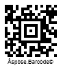

{}[Generate Aztec Barcodes Online](https://products.aspose.app/barcode/generate/aztec): You can check the quality of ***Aspose.BarCode*** generation for Aztec barcodes and view the results online.{}

## **Overview**
*Aztec Code* is a 2D matrix type that supports encoding both byte streams and alphanumeric characters. *Aztec Code* barcodes are depicted as square-grid modules with a unique pattern in the middle of a barcode image that facilitates barcode scanning and recognition. Moreover, it enables Reed-Solomon error correction to verify data integrity and recover encoded information. This symbology provides high data density and recognition accuracy.  
  
*Aztec Code* includes the following  subtypes:
-	*Full-Range Aztec Code* - encodes up to 1,914 bytes or 3,832 numerical (3,067 alphanumeric) digits
-	*Compact Aztec Code* - can encode up to 53 byte or 110 numerical (89 alphanumeric) digits
-	*Aztec Rune* - encodes values from 0 to 255 and is intended to mark objects in Augmented Reality applications
  
{}*If you need any clarifications, feel free to reach out [Aspose Technical Support](/barcode/net/technical-support/): ask your questions at [Aspose.Barcode Forum](https://forum.aspose.com/c/barcode/13) or contact [Aspose Paid Support Helpdesk](https://helpdesk.aspose.com/).*{}
  
## **Aztec Code Generation Mode Settings**
To select the required generation mode for *Aztec Code* barcodes in ***Aspose.BarCode for .NET***, it is necessary to initialize the [*AztecSymbolMode*](https://reference.aspose.com/barcode/net/aspose.barcode.generation/aztecparameters/properties/aztecsymbolmode) field of class [*AztecParameters*](https://reference.aspose.com/barcode/net/aspose.barcode.generation/aztecparameters). This property can take the following values:
- *Auto*. In this generation mode, the library selects the most compact *Aztec Code* barcode type with the capacity sufficient to encode the information inputted into [*CodeText*](https://reference.aspose.com/barcode/net/aspose.barcode.generation/barcodegenerator/properties/codetext).
- *Compact*. This mode is used to generate *Compact Aztec Code* barcodes up to 4 layers with the maximal size of 27x27 modules. 
- *FullRange*. This mode is set to create *Full-Range Aztec Code* barcodes up to 32 layers with the maximal size of 151x151 modules.
- *Rune*. This mode is intended to generate *Aztec Rune* barcodes and allows encoding only numerical digits from 0 to 255. These are small machine-readable marks with the maximal size of 11x11 modules.  
  
Sample *Aztec Code* barcodes provided below have been created using different generation modes.
  
|Generation Mode|***Auto***|***Compact***|***Full-Range***|***Rune***|
| :-: | :-: | :-: | :-: | :-: |
| |||||
  
The following code snippet illustrates how to set the required generation mode for *Aztec Code*.
  

using (BarcodeGenerator gen = new BarcodeGenerator(EncodeTypes.Aztec, "Åspóse.Barcóde©"))
{
    gen.Parameters.Barcode.XDimension.Pixels = 4;
    //set symbol mode Auto
    gen.CodeText = "Åspóse.Barcóde©";
    gen.Parameters.Barcode.Aztec.AztecSymbolMode = AztecSymbolMode.Auto;
    gen.Save($"{path}AztecSymbolModeAuto.png", BarCodeImageFormat.Png);
    //set symbol mode FullRange
    gen.CodeText = "Åspóse.Barcóde©";
    gen.Parameters.Barcode.Aztec.AztecSymbolMode = AztecSymbolMode.FullRange;
    gen.Save($"{path}AztecSymbolModeFullRange.png", BarCodeImageFormat.Png);
    //set symbol mode Compact
    gen.CodeText = "Åspóse.Barcóde©";
    gen.Parameters.Barcode.Aztec.AztecSymbolMode = AztecSymbolMode.Compact;
    gen.Save($"{path}AztecSymbolModeCompact.png", BarCodeImageFormat.Png);
    //set symbol mode Auto
    gen.CodeText = "123";
    gen.Parameters.Barcode.Aztec.AztecSymbolMode = AztecSymbolMode.Rune;
    gen.Save($"{path}AztecSymbolModeRune.png", BarCodeImageFormat.Png);
}

 
## **Set Encoding Mode**

The barcode library supports different encoding modes to generate *Aztec* barcodes. The required mode can be selected by setting the [*AztecEncodeMode*](https://reference.aspose.com/barcode/net/aspose.barcode.generation/aztecparameters/aztecencodemode) property of class [*AztecParameters*](https://reference.aspose.com/barcode/net/aspose.barcode.generation/aztecparameters). The possible values are defined in the [*AztecEncodeMode*](https://reference.aspose.com/barcode/net/aspose.barcode.generation/aztecencodemode/) enumeration. These modes are briefly described below:

- *Auto*. In Auto mode, the CodeText is encoded with maximum data compactness. This is the default value. 
- *Binary*. The *Binary* mode is used to encode binary data with maximum data compactness. 
- *ECI*. The Extended Channel Interpretation (ECI) mode indicates the encoded data is interpreted according to the ECI protocol defined by the AIM ECI Specifications.
- *Extended*. The *Extended* mode provides flexible encoding controls and allows for manually specifying the required encoding for a part of Codetext.


### ***Auto* Encoding Mode**
In Auto mode, the CodeText is encoded with maximum data compactness. Unicode characters are re-encoded using the encoding specified in the [*ECIEncoding*](https://reference.aspose.com/barcode/net/aspose.barcode.generation/aztecparameters/eciencoding/) parameter, with an ECI identifier inserted. If a character is found that is not supported by the selected ECI encoding, an exception is thrown. By default, the [*ECIEncoding*](https://reference.aspose.com/barcode/net/aspose.barcode.generation/aztecparameters/eciencoding/) property is set to [*ECIEncodings*](https://reference.aspose.com/barcode/net/aspose.barcode.generation/eciencodings/).UTF8 (ECI ID:"\000026"). The following code sample shows how to generate Aztec barcode in the *Auto* mode.    
  
<p align="center"></p>
  
``` csharp
using (BarcodeGenerator gen = new BarcodeGenerator(EncodeTypes.Aztec, "犬Right狗"))
{
    gen.Save($"{path}AztecEncodeModeAuto.png", BarCodeImageFormat.Png);
}
```

### ***Binary* Encoding Mode**
The *Binary* mode serves to encode byte streams. If a Unicode character is encountered, an exception is thrown. The code sample below explains how to work with this encoding mode.

<p align="center"></p>  
  
``` csharp
byte[] encodedArr = { 0xFF, 0xFE, 0xFD, 0xFC, 0xFB, 0xFA, 0xF9 };
using (BarcodeGenerator gen = new BarcodeGenerator(EncodeTypes.Aztec))
{
    bg.SetCodeText(encodedArr);
    //set Aztec encode mode to Binary
    gen.Parameters.Barcode.Aztec.AztecEncodeMode = AztecEncodeMode.Binary;
    gen.Save($"{path}AztecEncodeModeBinary.png", BarCodeImageFormat.Png);

}
```

### ***ECI* Encoding Mode**
The Extended Channel Interpretation (ECI) mode indicates that the encoded data is interpreted according to the ECI protocol defined by the AIM ECI Specifications. When the ECI mode is selected, the entire CodeText is re-encoded using the encoding specified in the [*ECIEncoding*](https://reference.aspose.com/barcode/net/aspose.barcode.generation/aztecparameters/eciencoding/) parameter, with an ECI identifier inserted. If a character is found that is not supported by the selected ECI encoding, an exception is thrown. By default, the [*ECIEncoding*](https://reference.aspose.com/barcode/net/aspose.barcode.generation/aztecparameters/eciencoding/) property is set to [*ECIEncodings*](https://reference.aspose.com/barcode/net/aspose.barcode.generation/eciencodings/).UTF8 (ECI ID:"\000026").

The following code sample demonstrates how to use the *ECI* mode.

<p align="center"></p>

```csharp
// ECI mode, Latin/Greek alphabet encoding. ECI ID:"\000009"
var str = "ΑΒΓΔΕ";

using (var bg = new BarcodeGenerator(EncodeTypes.Aztec, str))
{
    bg.Parameters.Barcode.Aztec.AztecEncodeMode = AztecEncodeMode.ECI;
    bg.Parameters.Barcode.Aztec.ECIEncoding = ECIEncodings.ISO_8859_7;
    var img = bg.GenerateBarCodeImage();
}
```

### ***Extended* Encoding Mode**
In the *Extended Codetext* mode, the input data passed to the [*Codetext*](https://reference.aspose.com/barcode/net/aspose.barcode.generation/barcodegenerator/codetext/) property contains special control words in addition to main information. Such words activate extended controls over data encoding and enable storing textual parts with different encodings in a single barcode. To generate Aztec barcodes in this format, it is recommended to use class [*AztecExtCodetextBuilder*](https://reference.aspose.com/barcode/net/aspose.barcode.generation/aztecextcodetextbuilder/).  
The following code sample demonstrate how to use the *Extended* mode.  

<p align="center"></p>


```csharp
//create codetext
AztecExtCodetextBuilder textBuilder = new AztecExtCodetextBuilder();
textBuilder.AddECICodetext(ECIEncodings.Win1251, "Will");
textBuilder.AddECICodetext(ECIEncodings.UTF8, "犬Right狗");
textBuilder.AddECICodetext(ECIEncodings.UTF16BE, "犬Power狗");
textBuilder.AddPlainCodetext("Plain text");

//generate codetext
string codetext = textBuilder.GetExtendedCodetext();

//generate
using (BarcodeGenerator gen = new BarcodeGenerator(EncodeTypes.Aztec, codetext))
{
    gen.Parameters.Barcode.XDimension.Pixels = 15;
    //set encode mode to Extended
    gen.Parameters.Barcode.Aztec.AztecEncodeMode = AztecncodeMode.Extended;
    gen.Parameters.Barcode.CodeTextParameters.TwoDDisplayText = "Extended mode";
    gen.Save($"{path}AztecEncodeModeExtended.png", BarCodeImageFormat.Png);
}
```

## **Layout Settings**

By default, the size of the barcode will be automatically selected based on the data size. To manually determine the size of the barcode, it is necessary to initialize the [*LayersCount*](https://reference.aspose.com/barcode/net/aspose.barcode.generation/aztecparameters/layerscount/) property of the [*AztecParameters*](https://reference.aspose.com/barcode/net/aspose.barcode.generation/aztecparameters/) class. This property can have values from 1 to 3 for *Compact Aztec Code* and from 1 to 32 for *Full-Range Aztec Code*. If the data size exceeds the capacity of the symbol with the specified size, an exception will be thrown.

The following code sample demonstrate how to set the layout for a generated *Aztec Code* barcode. 

|Layers Count|Is Set to Auto|Is Set to 10|
| :-: | :-: | :-: |
| |||


using (BarcodeGenerator gen = new BarcodeGenerator(EncodeTypes.Aztec, "Åspóse.Barcóde©"))
{
    gen.Parameters.Barcode.XDimension.Pixels = 4;
    
    //auto (by default)
    gen.Save($"{path}AztecLayersCountAuto.png", BarCodeImageFormat.Png);

    //set layers count to 10
    gen.Parameters.Barcode.Aztec.LayersCount = 10;
    gen.Save($"{path}AztecLayersCount10.png", BarCodeImageFormat.Png);
}


## **Error Correction Level Settings**
In addition to the main barcode data, *Aztec Code* barcodes contain recovery information that can occupy from 5 to 95% of the entire encoded data stream. It is recommended to set this parameter to 23%. To select the required error correction level for *Aztec Code* in ***Aspose.BarCode for .NET***, it is necessary to initialize the [*AztecErrorLevel*](https://reference.aspose.com/barcode/net/aspose.barcode.generation/aztecparameters/properties/aztecerrorlevel) property of class [*AztecParameters*](https://reference.aspose.com/barcode/net/aspose.barcode.generation/aztecparameters).  
  
Sample barcodes demonstrated below have been generated with different error correction level settings.
  
|Error Correction Level|Is Set to 5|Is Set to 50|
| :-: | :-: | :-: |
| |||
  
The following code sample is given to explain how to set the required error correction level for *Aztec Code*.


using (BarcodeGenerator gen = new BarcodeGenerator(EncodeTypes.Aztec, "Åspóse.Barcóde© is a powerful library to generate & recognize 1D & 2D barcodes"))
{
    gen.Parameters.Barcode.XDimension.Pixels = 4;
    gen.Parameters.Barcode.Aztec.AztecSymbolMode = AztecSymbolMode.FullRange;
    //set error correction capacity to 5%
    gen.Parameters.Barcode.Aztec.AztecErrorLevel = 5;
    gen.Save($"{path}AztecErrorLevel5.png", BarCodeImageFormat.Png);
    //set error correction capacity to 50%
    gen.Parameters.Barcode.Aztec.AztecErrorLevel = 50;
    gen.Save($"{path}AztecErrorLevel50.png", BarCodeImageFormat.Png);
}


### **Structured Append Mode**
***Aspose.BarCode for .NET*** supports a special generation mode to create *Aztec Code* barcodes with a structured append. This mode allows combining up to 26 *Aztec Code* barcodes. To enable this generation mode, it is necessary to initialize the following properties:
-	[*StructuredAppendBarcodesCount*](https://reference.aspose.com/barcode/net/aspose.barcode.generation/aztecparameters/structuredappendbarcodescount/) – the number of barcodes to be combined (value from 1 to 26)
-	[*StructuredAppendBarcodeId*](https://reference.aspose.com/barcode/net/aspose.barcode.generation/aztecparameters/structuredappendbarcodeid/) – the position of a barcode in the set (value from 1 to StructuredAppendBarcodesCount)  
-	[*StructuredAppendFileId*](https://reference.aspose.com/barcode/net/aspose.barcode.generation/aztecparameters/structuredappendfileid/) – an optional field that must be the same in all symbols that make up the message. It should not contain spaces.

The following code sample shows how to enable the *Structured Append* mode.    
  
<p align="center"></p>


using (BarcodeGenerator gen = new BarcodeGenerator(EncodeTypes.Aztec, "Aspose"))
{
    gen.Parameters.Barcode.XDimension.Pixels = 15;
    //set Aztec strucutured append mode
    gen.Parameters.Barcode.Aztec.StructuredAppendBarcodeId = 3;
    gen.Parameters.Barcode.Aztec.StructuredAppendBarcodesCount = 5;
    gen.Parameters.Barcode.Aztec.StructuredAppendFileId = "ABCD";
    gen.Save($"{path}AztecStructuredAppendMode.png", BarCodeImageFormat.Png);
}


## **Hardware Reader Initialization**
To encode a special flag indicating that the data encoded in a *Aztec Code* barcode is intended to initialize a hardware reader, it is possible to set the [*IsReaderInitialization*](https://reference.aspose.com/barcode/net/aspose.barcode.generation/aztecparameters/isreaderinitialization/) property. The following code sample shows how to enable this property.  
  

using (BarcodeGenerator gen = new BarcodeGenerator(EncodeTypes.Aztec, "Aspose"))
{
    gen.Parameters.Barcode.XDimension.Pixels = 10;
    //set flag that indicates that data is encoded for reader initialization
    gen.Parameters.Barcode.Aztec.IsReaderInitialization = true;
    gen.Save($"{path}AztecReaderInitialization.png", BarCodeImageFormat.Png);
}


## **Aspect Ratio Settings**
*Aspect Ratio* is the ratio between the height and the width of a barcode. To adjust barcode proportions using the X and Y coordinates in ***Aspose.BarCode for .NET***, it is necessary to use the [*AspectRatio*](https://reference.aspose.com/barcode/net/aspose.barcode.generation/aztecparameters/properties/aspectratio) property of class [*AztecParameters*](https://reference.aspose.com/barcode/net/aspose.barcode.generation/aztecparameters). In ***Aspose.BarCode for .NET***, it is defined as a relative coefficient to the value of [*XDimension*](https://reference.aspose.com/barcode/net/aspose.barcode.generation/barcodeparameters/properties/xdimension). In most cases, the value of *AspectRatio* should be set to 1. However, if developers need to adjust the proportions of generated barcodes, it can be done using the [*AspectRatio*](https://reference.aspose.com/barcode/net/aspose.barcode.generation/aztecparameters/properties/aspectratio) parameter.  
  
The barcode images demonstrated below have been created using different aspect ratio settings.
  
|Aspect Ratio|Is Set to 1|Is Set to 0.5|
| :-: | :-: | :-: |
| |||
  
The following code snippet shows how to manage aspect ratio settings for *Aztec Code*.
  

using (BarcodeGenerator gen = new BarcodeGenerator(EncodeTypes.Aztec, "Åspóse.Barcóde©"))
{
    gen.Parameters.Barcode.XDimension.Pixels = 4;
    //set aspect ratio 1
    gen.Parameters.Barcode.Aztec.AspectRatio = 1;
    gen.Save($"{path}AztecAspectRatio1.png", BarCodeImageFormat.Png);
    //set aspect ratio 0.5
    gen.Parameters.Barcode.Aztec.AspectRatio = 0.5f;
    gen.Save($"{path}AztecAspectRatio0.5.png", BarCodeImageFormat.Png);
}

