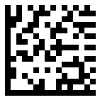
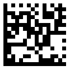
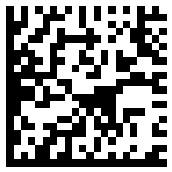
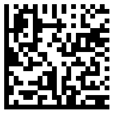
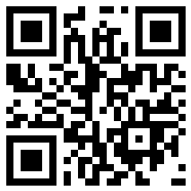
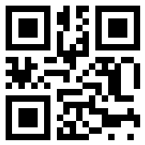
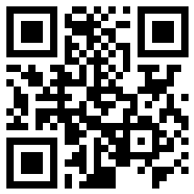
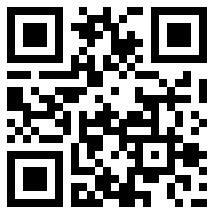
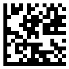

{}[Generate Barcodes Online](https://products.aspose.app/barcode/generate): You can test the quality of ***Aspose.BarCode*** generation and get the results online.{}

## **Overview**

[2D barcodes](https://en.wikipedia.org/wiki/Barcode#Matrix_(2D)_codes) allow to add description or machine reading tag to any object of real world. The description can be any, but, in most cases, can be split into three different types of encoded data:
- alphanumeric English characters data with punctuation like [ISO/IEC 646](https://en.wikipedia.org/wiki/ISO/IEC_646);
- binary of raw [bytes](https://en.wikipedia.org/wiki/Byte) stream encoding;
- [Unicode](https://en.wikipedia.org/wiki/Unicode) symbols encoding.

2D barcode types, like [DataMatrix](https://reference.aspose.com/barcode/net/aspose.barcode.generation/encodetypes/datamatrix/), [Aztec](https://reference.aspose.com/barcode/net/aspose.barcode.generation/encodetypes/aztec/), [MaxiCode](https://reference.aspose.com/barcode/net/aspose.barcode.generation/encodetypes/maxicode/), [PDF417](https://reference.aspose.com/barcode/net/aspose.barcode.generation/encodetypes/pdf417/), [DotCode](https://reference.aspose.com/barcode/net/aspose.barcode.generation/encodetypes/dotcode/), [Han Xin code](https://reference.aspose.com/barcode/net/aspose.barcode.generation/encodetypes/hanxin/) or [QR code](https://reference.aspose.com/barcode/net/aspose.barcode.generation/encodetypes/qr/) family, have [special embedded modes](https://en.wikipedia.org/wiki/Data_Matrix#Encoding) for alphanumeric English characters encoding with compactification around 4 bits on character for digits and 6 bits on character for English text. The worst situation with [QR code family](https://en.wikipedia.org/wiki/QR_code#Encoding), they use 8 bits on character for lowercase English text.

Every 2D barcode can effectively encode raw bytes stream. Main problem for ***Aspose.BarCode*** users was in byte array or stream conversion into [CodeText](https://reference.aspose.com/barcode/net/aspose.barcode.generation/barcodegenerator/codetext/). At this time, problem is fixed and the data can be converted with [SetCodeText](https://reference.aspose.com/barcode/net/aspose.barcode.generation/barcodegenerator/setcodetext/#setcodetext) method.

Unicode encoding in 2D barcodes is slightly tricky. Some of the 2D barcodes like [Han Xin code](https://en.wikipedia.org/wiki/Han_Xin_code) or [QR code family](https://en.wikipedia.org/wiki/QR_code) have embedded modes which allows to natively encode Chinese or [UTF8](https://en.wikipedia.org/wiki/Han_Xin_code#Unicode_mode) characters for ***Han Xin code*** or ***kanji*** ([JIS X 0208](https://en.wikipedia.org/wiki/JIS_X_0208)) encoding, which supports ***Japanese***, ***Greek***, ***Cyrillic*** characters, for ***QR code family***. But in most cases 2D barcodes cannot directly encode Unicode characters and can encode only byte stream.

Of course, you can directly encode Unicode text into byte array with proper [Encoding](https://learn.microsoft.com/dotnet/api/system.text.encoding) and decode it on reader side. Main problem hire is knowledge about ***Encoding*** which was used to encode current text. Some encodings are legacy and can be detected by many readers, like [UTF8](https://en.wikipedia.org/wiki/UTF-8) encoding, some encodings are only for internal usage. To avoid this problem, [Extended Channel Interpretation](https://en.wikipedia.org/wiki/Extended_Channel_Interpretation) (ECI) was developed to add special mark of used encoding for current data portions. In this way, the reader has knowledge which encoding should be used to decode current portion of data into Unicode characters.

{}*If you need any clarifications, feel free to reach out [Aspose Technical Support](/barcode/net/technical-support/): ask your questions at [Aspose.Barcode Forum](https://forum.aspose.com/c/barcode/13) or contact [Aspose Paid Support Helpdesk](https://helpdesk.aspose.com/).*{}

## Aspose.BarCode encoding modes and variables

***Aspose.BarCode*** supports encoding of these three main cases of data encoding. It uses two main variables from groups where each group manage encoding for separate barcode type like: [DataMatrix](https://reference.aspose.com/barcode/net/aspose.barcode.generation/datamatrixparameters/), [DotCode](https://reference.aspose.com/barcode/net/aspose.barcode.generation/dotcodeparameters/), [Pdf417](https://reference.aspose.com/barcode/net/aspose.barcode.generation/pdf417parameters/), [QR](https://reference.aspose.com/barcode/net/aspose.barcode.generation/qrparameters/), [MaxiCode](https://reference.aspose.com/barcode/net/aspose.barcode.generation/maxicodeparameters/), [Aztec](https://reference.aspose.com/barcode/net/aspose.barcode.generation/aztecparameters/), [HanXin](https://reference.aspose.com/barcode/net/aspose.barcode.generation/hanxinparameters/). These variables are:
- ***BarcodeType_EncodeMode***, as an example [DataMatrixEncodeMode](https://reference.aspose.com/barcode/net/aspose.barcode.generation/datamatrixencodemode/). The variable controls ***CodeText*** encoding mode and contains four main modes: ***Auto***, ***Binary***, ***ECI*** and ***Extended***.
- [***ECIEncoding***](https://reference.aspose.com/barcode/net/aspose.barcode.generation/eciencodings/) – controls default characters encoding and [Extended Channel Interpretation](https://en.wikipedia.org/wiki/Extended_Channel_Interpretation) (ECI) designator which can be used to encode Unicode characters in the desribed upper modes.

***BarcodeType_EncodeMode***, as an example [DataMatrixEncodeMode](https://reference.aspose.com/barcode/net/aspose.barcode.generation/datamatrixencodemode/), contains the following encoding modes:
|Mode|Description|
|--|--|
|***Auto***|The mode is suitable for all three cases and allows to encode alphanumeric, binary or Unicode data in the optimized way. ***Auto*** mode selects the best embedded encoding method for alphanumeric and binary data. If it finds Unicode symbols, it tries to encode them with Unicode methods, embedded into barcode specification. If it cannot encode Unicode symbols with the embedded methods, it encodes Unicode chain with ***ECI*** designator and encoding which is selected in [ECIEncoding](https://reference.aspose.com/barcode/net/aspose.barcode.generation/eciencodings/) field and proceeds other parts of [CodeText](https://reference.aspose.com/barcode/net/aspose.barcode.generation/barcodegenerator/codetext/).|
|***Binary***|The mode works in the same way as ***Auto*** but it does not support Unicode symbols. If it finds Unicode in ***CodeText*** it throws the [Exception](https://reference.aspose.com/barcode/net/aspose.barcode/barcodeexception/). It is recommended to use [SetCodeText](https://reference.aspose.com/barcode/net/aspose.barcode.generation/barcodegenerator/setcodetext/#setcodetext) method to set byte stream. Binary mode selects the best embedded encoding methods for alphanumeric and binary data. [TwoDDisplayText](https://reference.aspose.com/barcode/net/aspose.barcode.generation/codetextparameters/twoddisplaytext/) property can replace human readable text.|
|***ECI***|The mode encodes whole provided [CodeText](https://reference.aspose.com/barcode/net/aspose.barcode.generation/barcodegenerator/codetext/) with encoding from [ECIEncoding](https://reference.aspose.com/barcode/net/aspose.barcode.generation/eciencodings/) field, adds ***ECI*** designator and tries to optimize encode byte stream with embedded encoding methods for alphanumeric and binary data.|
|***Extended***|The mode allows to select manually multiple ***ECI*** modes for every chunk of text or encode data in special embedded into barcode symbology modes. The mode should be used only by advanced users who know the barcode specification. To replace human readable text, you should use [TwoDDisplayText](https://reference.aspose.com/barcode/net/aspose.barcode.generation/codetextparameters/twoddisplaytext/) property.|
|***Special***|Special modes are specific to symbology embedded encoding modes like ***C40*** for [DataMatrixEncodeMode](https://reference.aspose.com/barcode/net/aspose.barcode.generation/datamatrixencodemode/) or ***URI*** for [HanXinEncodeMode](https://reference.aspose.com/barcode/net/aspose.barcode.generation/hanxinencodemode/). It should be used for special industrial requirements and should not be used for other encodings.|

## Encode alphanumeric data

You can encode alphanumeric data in ***Auto*** encoding mode and set the alphanumeric text to [CodeText](https://reference.aspose.com/barcode/net/aspose.barcode.generation/barcodegenerator/codetext/) field. The ***Aspose.BarCode*** selects the best encoding method for the data.
``` csharp
using (BarcodeGenerator gen = new BarcodeGenerator(EncodeTypes.DataMatrix, "Aspose 2002-2024"))
{
    gen.Parameters.Barcode.XDimension.Pixels = 8;
    gen.Parameters.Barcode.DataMatrix.DataMatrixEncodeMode = DataMatrixEncodeMode.Auto;
    gen.Save($"{path}Encoding2DAlphanumeric.png", BarCodeImageFormat.Png);

    using (BarCodeReader reader = new BarCodeReader(gen.GenerateBarCodeImage(), DecodeType.DataMatrix))
        foreach (BarCodeResult result in reader.ReadBarCodes())
            Console.WriteLine($"CodeText:{result.CodeText}");
}
```
<p align="center"></p>

## Encode binary bytes data

You can encode bytes array in ***Auto*** or ***Binary*** mode. ***Binary*** mode checks provided [CodeText](https://reference.aspose.com/barcode/net/aspose.barcode.generation/barcodegenerator/codetext/) on Unicode symbols and throws exception if they are found. [SetCodeText](https://reference.aspose.com/barcode/net/aspose.barcode.generation/barcodegenerator/setcodetext/#setcodetext) function was added to helps automatically convert binary data into ***CodeText***. [TwoDDisplayText](https://reference.aspose.com/barcode/net/aspose.barcode.generation/codetextparameters/twoddisplaytext/) property helps to replace visible ***CodeText*** to human readable text.

### Encode byte array
The example shows how to encode binary data from byte array:
``` csharp
byte[] encodedArr = { 0xFF, 0xFE, 0xFD, 0xFC, 0xFB, 0xFA, 0xF9 };

//encode in DataMatrix code
using (BarcodeGenerator gen = new BarcodeGenerator(EncodeTypes.DataMatrix))
{
    gen.Parameters.Barcode.XDimension.Pixels = 8;
    //set encode mode to binary
    gen.SetCodeText(encodedArr);
    gen.Parameters.Barcode.DataMatrix.DataMatrixEncodeMode = DataMatrixEncodeMode.Binary;
    gen.Parameters.Barcode.CodeTextParameters.TwoDDisplayText = "Binary mode";
    gen.Save($"{path}Encoding2DBinary.png", BarCodeImageFormat.Png);

    //try to recognize
    using (BarCodeReader read = new BarCodeReader(gen.GenerateBarCodeImage(), DecodeType.DataMatrix))
        foreach (BarCodeResult result in read.ReadBarCodes())
            Console.WriteLine("Encoding2DBinary:" + BitConverter.ToString(result.CodeBytes));
}
```
<p align="center"></p>

### Encode data from stream
The example shows how to encode binary data from stream:
``` csharp
Stream encodedStream = CreateStream();
encodedStream.Position = 0;
byte[] encodedArr = new byte[encodedStream.Length];
encodedStream.Read(encodedArr, 0, encodedArr.Length);

//encode in DataMatrix code
using (BarcodeGenerator gen = new BarcodeGenerator(EncodeTypes.DataMatrix))
{
    gen.Parameters.Barcode.XDimension.Pixels = 8;
    //set encode mode to binary
    gen.SetCodeText(encodedArr);
    gen.Parameters.Barcode.DataMatrix.DataMatrixEncodeMode = DataMatrixEncodeMode.Binary;
    gen.Parameters.Barcode.CodeTextParameters.TwoDDisplayText = "Binary mode";
    gen.Save($"{path}Encoding2DBinaryStream.png", BarCodeImageFormat.Png);

    //try to recognize
    using (BarCodeReader read = new BarCodeReader(gen.GenerateBarCodeImage(), DecodeType.DataMatrix))
        foreach (BarCodeResult result in read.ReadBarCodes())
            Console.WriteLine("Encoding2DBinaryStream:" + BitConverter.ToString(result.CodeBytes));
}
```
<p align="center"></p>

## Encode Unicode data
You can encode Unicode [CodeText](https://reference.aspose.com/barcode/net/aspose.barcode.generation/barcodegenerator/codetext/) in 2D barcodes in three different ways:
- ***Auto*** mode with [ECIEncoding](https://reference.aspose.com/barcode/net/aspose.barcode.generation/eciencodings/) splits ***CodeText*** on Unicode and non-Unicode sequences and encode Unicode sequences with encoding from ***ECIEncoding*** property and adds ***ECI*** designator for the current chunk of data. In most cases, this is in the best way for encoding any text data.
- ***ECI*** with [ECIEncoding](https://reference.aspose.com/barcode/net/aspose.barcode.generation/eciencodings/) unconditionally converts full [CodeText](https://reference.aspose.com/barcode/net/aspose.barcode.generation/barcodegenerator/codetext/) into byte array with encoding from ***ECIEncoding*** and adds ***ECI*** designator.
- ***Manual encoding*** of provided text converts text into byte stream without ***ECI*** designator by [SetCodeText](https://reference.aspose.com/barcode/net/aspose.barcode.generation/barcodegenerator/setcodetext/#setcodetext_1) function. Some encoding like [UTF8](https://en.wikipedia.org/wiki/UTF-8) could be automatically recognized on reader side, but in most cases the reader does not know text encoding and can recognize barcode data as trash. [TwoDDisplayText](https://reference.aspose.com/barcode/net/aspose.barcode.generation/codetextparameters/twoddisplaytext/) should be used to change human readable text.

### Encode Unicode data in Auto mode
The example shows how to encode Unicode data in ***Auto*** mode with [ECIEncoding](https://reference.aspose.com/barcode/net/aspose.barcode.generation/eciencodings/).
``` csharp
using (BarcodeGenerator gen = new BarcodeGenerator(EncodeTypes.DataMatrix, "Aspose常に先を行"))
{
    gen.Parameters.Barcode.XDimension.Pixels = 8;
    gen.Parameters.Barcode.DataMatrix.DataMatrixEncodeMode = DataMatrixEncodeMode.Auto;
    gen.Parameters.Barcode.DataMatrix.ECIEncoding = ECIEncodings.UTF8;
    gen.Save($"{path}Encoding2DUnicodeAuto.png", BarCodeImageFormat.Png);

    using (BarCodeReader reader = new BarCodeReader(gen.GenerateBarCodeImage(), DecodeType.DataMatrix))
        foreach (BarCodeResult result in reader.ReadBarCodes())
            Console.WriteLine($"CodeText:{result.CodeText}");
}
```
<p align="center"></p>

### Encode Unicode data in ECI mode
The example shows how to encode Unicode data in ***ECI*** mode with [ECIEncoding](https://reference.aspose.com/barcode/net/aspose.barcode.generation/eciencodings/).
``` csharp
using (BarcodeGenerator gen = new BarcodeGenerator(EncodeTypes.DataMatrix, "Aspose常に先を行"))
{
    gen.Parameters.Barcode.XDimension.Pixels = 8;
    gen.Parameters.Barcode.DataMatrix.DataMatrixEncodeMode = DataMatrixEncodeMode.ECI;
    gen.Parameters.Barcode.DataMatrix.ECIEncoding = ECIEncodings.UTF8;
    gen.Save($"{path}Encoding2DUnicodeECI.png", BarCodeImageFormat.Png);

    using (BarCodeReader reader = new BarCodeReader(gen.GenerateBarCodeImage(), DecodeType.DataMatrix))
        foreach (BarCodeResult result in reader.ReadBarCodes())
            Console.WriteLine($"CodeText:{result.CodeText}");
}
```
<p align="center"></p>

### Encode Unicode data manually in UTF8
The example shows how to encode Unicode data manually in ***QR code*** with automatically detected [UTF8](https://en.wikipedia.org/wiki/UTF-8) encoding. However, without ***ECI*** designator, the barcode data sometimes can be decoded incorrectly.
``` csharp
using (BarcodeGenerator gen = new BarcodeGenerator(EncodeTypes.QR))
{
    gen.Parameters.Barcode.XDimension.Pixels = 8;
    gen.Parameters.Barcode.QR.QrEncodeMode = QREncodeMode.Auto;
    gen.SetCodeText("Aspose常に先を行", Encoding.UTF8);
    gen.Parameters.Barcode.CodeTextParameters.TwoDDisplayText = "Aspose常に先を行";
    gen.Save($"{path}Encoding2DUnicodeUTF8.png", BarCodeImageFormat.Png);

    using (BarCodeReader reader = new BarCodeReader(gen.GenerateBarCodeImage(), DecodeType.QR))
        foreach (BarCodeResult result in reader.ReadBarCodes())
            Console.WriteLine($"CodeText:{result.CodeText}");
}
```
<p align="center"></p>

### Encode Unicode data manually in custom encoding
The example shows how to encode Unicode data manually in ***QR code*** with undetectable [Windows-1253](https://en.wikipedia.org/wiki/Windows-1253) encoding with manual decoding on reader side.
``` csharp
using (BarcodeGenerator gen = new BarcodeGenerator(EncodeTypes.QR))
{
    gen.Parameters.Barcode.XDimension.Pixels = 8;
    gen.Parameters.Barcode.QR.QrEncodeMode = QREncodeMode.Auto;
    gen.SetCodeText("AsposeΣΑΩ", Encoding.GetEncoding(1253));
    gen.Parameters.Barcode.CodeTextParameters.TwoDDisplayText = "AsposeΣΑΩ";
    gen.Save($"{path}Encoding2DUnicodeCustom.png", BarCodeImageFormat.Png);

    using (BarCodeReader reader = new BarCodeReader(gen.GenerateBarCodeImage(), DecodeType.QR))
        foreach (BarCodeResult result in reader.ReadBarCodes())
        {
            Console.WriteLine($"Undecoded CodeText:{result.CodeText}");
            Console.WriteLine($"CodeText:{result.GetCodeText(Encoding.GetEncoding(1253))}");
        }
}
```
<p align="center"></p>

## Encode data in Extended mode
In this mode the data can be encoded in manual mode where special encoded modes can be set to different chunks of CodeText or data can be encoded on multiple languages with different encodings. ***Aspose.BarCode*** provides special helpers like [QrExtCodetextBuilder](https://reference.aspose.com/barcode/net/aspose.barcode.generation/qrextcodetextbuilder/). Also, you can change human readable description with [TwoDDisplayText](https://reference.aspose.com/barcode/net/aspose.barcode.generation/codetextparameters/twoddisplaytext/).

``` csharp
//generate extended codetext
QrExtCodetextBuilder textBuilder = new QrExtCodetextBuilder();
textBuilder.AddECICodetext(ECIEncodings.Win1251, "Слово");
textBuilder.AddECICodetext(ECIEncodings.UTF8, "常に先");
textBuilder.AddECICodetext(ECIEncodings.UTF16BE, "を行く");
textBuilder.AddPlainCodetext(@"Aspose");

using (BarcodeGenerator gen = new BarcodeGenerator(EncodeTypes.QR, textBuilder.GetExtendedCodetext()))
{
    gen.Parameters.Barcode.XDimension.Pixels = 8;
    gen.Parameters.Barcode.QR.QrEncodeMode = QREncodeMode.Extended;
    gen.Parameters.Barcode.CodeTextParameters.TwoDDisplayText = "Extended mode";
    gen.Save($"{path}Encoding2DExtended.png", BarCodeImageFormat.Png);

    using (BarCodeReader reader = new BarCodeReader(gen.GenerateBarCodeImage(), DecodeType.QR))
        foreach (BarCodeResult result in reader.ReadBarCodes())
            Console.WriteLine($"CodeText:{result.CodeText}");
}
```
<p align="center"></p>

## Encode GS1 data
To encode ***GS1*** data you should use [GS1 versions](https://reference.aspose.com/barcode/net/aspose.barcode.generation/encodetypes/) of the 2D barcode type and set ***GS1*** text in special format to the [CodeText](https://reference.aspose.com/barcode/net/aspose.barcode.generation/barcodegenerator/codetext/) field. You do not need other parameters to set.

***GS1 CodeText*** format has the following structure:
<p align="center"><mark>"(Application_Identifier_1)Application_Data(Application_Identifier_2)Application_Data"</mark></p> 

As an example, we can encode the following value: "(01)12345678901231(21)ASPOSE(30)9876".
``` csharp
using (BarcodeGenerator gen = new BarcodeGenerator(EncodeTypes.GS1QR, "(01)12345678901231(21)ASPOSE(30)9876"))
{
    gen.Parameters.Barcode.XDimension.Pixels = 8;
    gen.Save($"{path}Encoding2DGS1.png", BarCodeImageFormat.Png);

    using (BarCodeReader reader = new BarCodeReader(gen.GenerateBarCodeImage(), DecodeType.GS1QR))
        foreach (BarCodeResult result in reader.ReadBarCodes())
            Console.WriteLine($"CodeText:{result.CodeText}");
}
```
<p align="center"></p>

## Encode data in Special modes
Sometimes we require to encode data in special industrial formats like [C40](https://en.wikipedia.org/wiki/Data_Matrix#Text_modes) encoding for [DataMatrix](https://reference.aspose.com/barcode/net/aspose.barcode.generation/datamatrixencodemode/) . It can encode alphanumeric data similar to ***ISO/IEC 646***, where it spends ~5 bits on capital letter and ~11 bit on lowercase letter and punctuation.

``` csharp
using (BarcodeGenerator gen = new BarcodeGenerator(EncodeTypes.DataMatrix, "ASPOSE.BARCODE"))
{
    gen.Parameters.Barcode.XDimension.Pixels = 8;
    gen.Parameters.Barcode.DataMatrix.DataMatrixEncodeMode = DataMatrixEncodeMode.C40;
    gen.Save($"{path}Encoding2DSpecial.png", BarCodeImageFormat.Png);

    using (BarCodeReader reader = new BarCodeReader(gen.GenerateBarCodeImage(), DecodeType.DataMatrix))
        foreach (BarCodeResult result in reader.ReadBarCodes())
            Console.WriteLine($"CodeText:{result.CodeText}");
}
```
<p align="center"></p>
