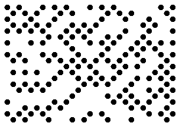
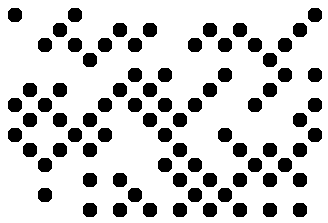
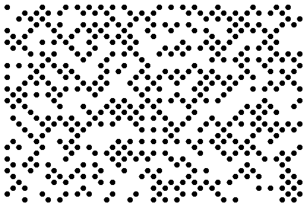
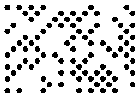

## **Overview**
DotCode is a 2D barcode type used to ensure accurate barcode reading and decoding for barcodes created with high-speed inkjet or laser printing.  
Main features of DotCode include the following:
-	Can encode both textual data and streams of bytes
-	Supports Reed-Solomon error correction
-	Maximal encoding capacity is not limited meaning that the size of input data is variable
-	Supports ECI
-	Supports the structured append mechanism to combine data stored in different barcodes
-	Supports the division of the data encoded in a single barcode into several messages


{}*If you need any clarifications, feel free to reach out [Aspose Technical Support](/barcode/net/technical-support/): ask your questions at [Aspose.Barcode Forum](https://forum.aspose.com/c/barcode/13) or contact [Aspose Paid Support Helpdesk](https://helpdesk.aspose.com/).*{}

## **Set DotCode Layout**
To generate DotCode barcodes with the predefined layout, it is necessary to initialize [*Rows*](https://reference.aspose.com/barcode/net/aspose.barcode.generation/dotcodeparameters/rows/) and [*Columns*](https://reference.aspose.com/barcode/net/aspose.barcode.generation/dotcodeparameters/columns/) properties of class [*DotCodeParameters*](https://reference.aspose.com/barcode/net/aspose.barcode.generation/dotcodeparameters/).
The DotCode standard sets the following restrictions on the number of rows and columns:
-	the minimal number of rows or columns is 5. To improve recognition quality, it is recommended to set at least 7 rows and columns,
-	Sum of the numbers of rows and columns in a DotCode barcode must be an odd number.
It is also possible to define the odd number of rows or columns only. In this case, the second layout parameter will be set automatically. If the manually specified number of rows and columns is not enough to generate a DotCode barcode, an exception will be thrown.  
  
| |12 Rows|18 Columns|26 Rows and 29 Columns|
|--|--|--|--|
| |<p align="center"></p>|<p align="center"></p>|<p align="center"></p>|
  
The following code sample explains how to set the layout for a generated DotCode barcode.

``` csharp
using (BarcodeGenerator gen = new BarcodeGenerator(EncodeTypes.DotCode, "Aspose"))
{
    gen.Parameters.Barcode.XDimension.Pixels = 10;
    //set columns 18
    gen.Parameters.Barcode.DotCode.Columns = 18;
    gen.Save($"{path}DotCodeColumns18.png", BarCodeImageFormat.Png);
    //set rows 12
    gen.Parameters.Barcode.DotCode.Columns = -1;
    gen.Parameters.Barcode.DotCode.Rows = 12;
    gen.Save($"{path}DotCodeRows12.png", BarCodeImageFormat.Png);
    //set rows 20 columns 29
    gen.Parameters.Barcode.DotCode.Columns = 29;
    gen.Parameters.Barcode.DotCode.Rows = 26;
    gen.Save($"{path}DotCodeRows26Columns29.png", BarCodeImageFormat.Png);
}

```

## **Set Encoding Mode**
The barcode library supports different encoding modes to generate DotCode barcodes. The required mode can be selected by setting the [*DotCodeEncodeMode*](https://reference.aspose.com/barcode/net/aspose.barcode.generation/dotcodeparameters/dotcodeencodemode/) property of class [*DotCodeParameters*](https://reference.aspose.com/barcode/net/aspose.barcode.generation/dotcodeparameters/). The possible values are defined in the [*DotCodeEncodeMode*](https://reference.aspose.com/barcode/net/aspose.barcode.generation/dotcodeencodemode/) enumeration. These modes are briefly described below:

- *Auto*. In Auto mode, the CodeText is encoded with maximum data compactness. This is the default value. 
- *Binary*. The *Binary* mode is used to encode binary data with maximum data compactness. 
- *ECI*. The Extended Channel Interpretation (ECI) mode indicates the encoded data is interpreted according to the ECI protocol defined by the AIM ECI Specifications.
- *Extended*. The *Extended* mode provides flexible encoding controls and allows for manually specifying the required encoding for a part of Codetext.

### ***Auto* Encoding Mode**
In Auto mode, the CodeText is encoded with maximum data compactness. Unicode characters are re-encoded using the encoding specified in the [*ECIEncoding*](https://reference.aspose.com/barcode/net/aspose.barcode.generation/dotcodeparameters/eciencoding/) parameter, with an ECI identifier inserted. If a character is found that is not supported by the selected ECI encoding, an exception is thrown. By default, the [*ECIEncoding*](https://reference.aspose.com/barcode/net/aspose.barcode.generation/dotcodeparameters/eciencoding/) property is set to [*ECIEncodings*](https://reference.aspose.com/barcode/net/aspose.barcode.generation/eciencodings/).UTF8 (ECI ID:"\000026"). The following code sample shows how to generate DotCode barcode in the *Auto* mode.    
  
<p align="center"></p>
  
``` csharp
using (BarcodeGenerator gen = new BarcodeGenerator(EncodeTypes.DotCode, "犬Right狗"))
{
    gen.Save($"{path}DotCodeEncodeModeAuto.png", BarCodeImageFormat.Png);
}
```

### ***Binary* Encoding Mode**
The *Binary* mode serves to encode byte streams. If a Unicode character is encountered, an exception is thrown. The code sample below explains how to work with this encoding mode.

<p align="center"></p>  
  
``` csharp
byte[] encodedArr = { 0xFF, 0xFE, 0xFD, 0xFC, 0xFB, 0xFA, 0xF9 };
using (BarcodeGenerator gen = new BarcodeGenerator(EncodeTypes.DotCode))
{
    bg.SetCodeText(encodedArr);
    //set DotCode encode mode to Binary
    gen.Parameters.Barcode.DotCode.DotCodeEncodeMode = DotCodeEncodeMode.Binary;
    gen.Save($"{path}DotCodeEncodeModeBinary.png", BarCodeImageFormat.Png);

}
```

### ***ECI* Encoding Mode**
The Extended Channel Interpretation (ECI) mode indicates that the encoded data is interpreted according to the ECI protocol defined by the AIM ECI Specifications. When the ECI mode is selected, the entire CodeText is re-encoded using the encoding specified in the [*ECIEncoding*](https://reference.aspose.com/barcode/net/aspose.barcode.generation/dotcodeparameters/eciencoding/) parameter, with an ECI identifier inserted. If a character is found that is not supported by the selected ECI encoding, an exception is thrown. By default, the [*ECIEncoding*](https://reference.aspose.com/barcode/net/aspose.barcode.generation/dotcodeparameters/eciencoding/) property is set to [*ECIEncodings*](https://reference.aspose.com/barcode/net/aspose.barcode.generation/eciencodings/).UTF8 (ECI ID:"\000026").

The following code sample demonstrates how to use the *ECI* mode.

<p align="center"></p>

```csharp
// ECI mode, Latin/Greek alphabet encoding. ECI ID:"\000009"
var str = "ΑΒΓΔΕ";

using (var bg = new BarcodeGenerator(EncodeTypes.DotCode, str))
{
    bg.Parameters.Barcode.DotCode.DotCodeEncodeMode = DotCodeEncodeMode.ECI;
    bg.Parameters.Barcode.DotCode.ECIEncoding = ECIEncodings.ISO_8859_7;
    var img = bg.GenerateBarCodeImage();
}
```

### ***Extended* Encoding Mode**
In the *Extended Codetext* mode, the input data passed to the [*Codetext*](https://reference.aspose.com/barcode/net/aspose.barcode.generation/barcodegenerator/codetext/) property contains special control words in addition to main information. Such words activate extended controls over data encoding and enable storing textual parts with different encodings in a single barcode. To generate DotCode barcodes in this format, it is recommended to use class [*DotCodeExtCodetextBuilder*](https://reference.aspose.com/barcode/net/aspose.barcode.generation/dotcodeextcodetextbuilder/).  
The following code sample demonstrate how to use the *Extended* mode.  

<p align="center"></p>


```csharp
//create codetext
DotCodeExtCodetextBuilder textBuilder = new DotCodeExtCodetextBuilder();
textBuilder.AddFNC1FormatIdentifier();
textBuilder.AddECICodetext(ECIEncodings.UTF8, "犬Right狗");
textBuilder.AddPlainCodetext("Plain text");
textBuilder.AddFNC3SymbolSeparator();
textBuilder.AddFNC3ReaderInitialization();
textBuilder.AddPlainCodetext("Reader initialization info");

//generate barcode text
string codetext = textBuilder.GetExtendedCodetext();

//generate a DotCode barcode
using (BarcodeGenerator gen = new BarcodeGenerator(EncodeTypes.DotCode, codetext))
{
    gen.Parameters.Barcode.DotCode.DotCodeEncodeMode = DotCodeEncodeMode.Extended;
    gen.Save($"{path}DotCodeExtended.png", BarCodeImageFormat.Png);
}
```

### **Structured Append Mode**
The barcode library supports a special generation mode to create DotCode barcodes with a structured append. This mode allows combining up to 35 DotCode barcodes. To enable this generation mode, it is necessary to initialize the following properties:
-	[*DotCodeStructuredAppendModeBarcodesCount*](https://reference.aspose.com/barcode/net/aspose.barcode.generation/dotcodeparameters/dotcodestructuredappendmodebarcodescount/2) – the number of barcodes to be combined (value from 1 to 35)
-	[*DotCodeStructuredAppendModeBarcodeId*](https://reference.aspose.com/barcode/net/aspose.barcode.generation/dotcodeparameters/dotcodestructuredappendmodebarcodeid/) – the position of a barcode in the set (value from 1 to DotCodeStructuredAppendModeBarcodesCount)  
  
The following code sample shows how to enable the *Structured Append* mode.    
  
<p align="center"></p>

``` csharp
using (BarcodeGenerator gen = new BarcodeGenerator(EncodeTypes.DotCode, "Aspose"))
{
    gen.Parameters.Barcode.XDimension.Pixels = 10;
    //set DotCode strucutured append mode
    gen.Parameters.Barcode.DotCode.DotCodeStructuredAppendModeBarcodeId = 3;
    gen.Parameters.Barcode.DotCode.DotCodeStructuredAppendModeBarcodesCount = 5;
    gen.Save($"{path}DotCodeStructuredAppendMode.png", BarCodeImageFormat.Png);
}
```

## **Aspect Ratio**
By default, the ratio between X and Y coordinates in a DotCode barcode equals to 1. To manually adjust this ratio with custom values, developers can initialize the [*AspectRatio*](https://reference.aspose.com/barcode/net/aspose.barcode.generation/dotcodeparameters/aspectratio/) property of class [*DotCodeParameters*](https://reference.aspose.com/barcode/net/aspose.barcode.generation/dotcodeparameters/), which is relative to the value of [*XDimension*](https://reference.aspose.com/barcode/net/aspose.barcode.generation/barcodeparameters/xdimension/). The code sample below explains how to modify the aspect ratio in a generated DotCode barcode.   

<p align="center"></p>
  
``` csharp
using (BarcodeGenerator gen = new BarcodeGenerator(EncodeTypes.DotCode, "Aspose"))
{
    gen.Parameters.Barcode.XDimension.Pixels = 10;
    //set aspect ratio 0.5
    gen.Parameters.Barcode.DotCode.AspectRatio = 0.5f;
    gen.Save($"{path}DotCodeAspectRatio0.5.png", BarCodeImageFormat.Png);
}
```

## **Hardware Reader Initialization**
To encode a special flag indicating that the data encoded in a DotCode barcode is intended to initialize a hardware reader, it is possible to set the [*IsReaderInitialization*](https://reference.aspose.com/barcode/net/aspose.barcode.generation/dotcodeparameters/isreaderinitialization/) property. The following code sample shows how to enable this property.  
  
``` csharp
using (BarcodeGenerator gen = new BarcodeGenerator(EncodeTypes.DotCode, "Aspose"))
{
    gen.Parameters.Barcode.XDimension.Pixels = 10;
    //set flag that indicates that data is encoded for reader initialization
    gen.Parameters.Barcode.DotCode.IsReaderInitialization = true;
    gen.Save($"{path}DotCodeReaderInitialization.png", BarCodeImageFormat.Png);
}
```