## **Overview**
[*GS1 Composite barcode*](https://www.iso.org/standard/51425.html) symbology is a set of *1D* and *2D* barcodes combinations. The symbology was developed to extend low data density *1D* barcodes with *2D* component which has more additional information. *GS1 Composite* consists from two parts: *1D linear barcode* containing primary data which can be read with basic scanners and *2D barcode containing* supplementary data which qualifies the primary message.

**Aspose.Barcode for .Net** allows to encode this symbology as [*EncodeTypes.GS1CompositeBar*](https://reference.aspose.com/barcode/net/aspose.barcode.generation/encodetypes/gs1compositebar/) with [*GS1CompositeBar*](https://reference.aspose.com/barcode/net/aspose.barcode.generation/gs1compositebarparameters/) parameters which allows to setup *1D* and *2D* components type and other options. **Aspose.Barcode** barcode generation engine requires symbol "|" to split *1D* and *2D* CodeText.

*1D* component types includes: 
- [EAN barcodes](/barcode/info-cards/ean-barcodes/): *EAN8*, *UPCA*, *EAN13*, *UPCE*;
- [DataBar barcodes](/barcode/info-cards/databar-family/): *Databar OmniDirectional*, *Databar Stacked OmniDirectional*, *Databar Stacked*, *Databar Limited*, *Databar Expanded*, *Databar Expanded Stacked*;
- [*GS1 Code128*](/barcode/net/gs1-barcodes/#barcode-generation-according-to-gs1-standards) barcode.

*Databar Expanded*, *Databar Expanded Stacked* and *GS1 Code128* barcodes, which are used as *1D* component, can encode any [*ISO/IEC 646*](https://www.iso.org/standard/4777.html) symbol which is allowed to use in encoding [*GS1 Application Identifier*]( https://www.gs1.org/standards/barcodes/application-identifiers). All other *1D* barcodes from *1D* components can encode only data in strict format.

*2D* component types includes: 
- *CC_A* – the barcode component, based on [*MicroPDF417*](/barcode/net/pdf417-barcodes/#micro-pdf417)-like symbology.
- *CC_B* – the barcode component, used [*MicroPDF417*](/barcode/net/pdf417-barcodes/#micro-pdf417) symbology to encode *2D* binary data.
- *CC_C* – the barcode component, used [*PDF417*](/barcode/net/pdf417-barcodes/#pdf417-and-macro-pdf417) symbology to encode *2D* binary data.

{}*If you need any clarifications, feel free to reach out [Aspose Technical Support](/barcode/net/technical-support/): ask your questions at [Aspose.Barcode Forum](https://forum.aspose.com/c/barcode/13) or contact [Aspose Paid Support Helpdesk](https://helpdesk.aspose.com/).*{}

## **1D-Linear Barcode Component Selection**
*1D-Linear Components* encodes item primary identification and has the same parameters as used *1D* barcode type like data density and ability to encode characters. In the following list we give more detail about every *1D component*:
- **1D Components Type**: [EAN8](/barcode/info-cards/ean-8/)<br> **Encoding**: 8 Digits (GTIN-8)<br> **2D component**: CC_A, CC_B. Both 3-columns.
<p align="center">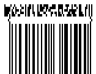</p>

``` csharp
//Encode GS1Composite barcode with EAN8 linear component
using (BarcodeGenerator gen = new BarcodeGenerator(EncodeTypes.GS1CompositeBar, "20123451|(10)ABCD0123(240)0123456789"))
{
    gen.Parameters.Barcode.XDimension.Pixels = 2;
    gen.Parameters.Barcode.CodeTextParameters.Location = CodeLocation.None;
    gen.Parameters.Barcode.GS1CompositeBar.TwoDComponentType = TwoDComponentType.CC_A;
    gen.Parameters.Barcode.GS1CompositeBar.LinearComponentType = EncodeTypes.EAN8;

    gen.Save($"{path}GS1Composite1D_EAN8.png", BarCodeImageFormat.Png);
}
```
- **1D Components Type**: [UPCA](/barcode/info-cards/upc-a/)<br> **Encoding**: 12 Digits (GTIN-12)<br> **2D component**: CC_A, CC_B. Both 4-columns.
<p align="center">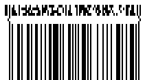</p>

``` csharp
//Encode GS1Composite barcode with UPCA linear component
using (BarcodeGenerator gen = new BarcodeGenerator(EncodeTypes.GS1CompositeBar, "001234567895|(10)ABCD0123(240)0123456789"))
{
    gen.Parameters.Barcode.XDimension.Pixels = 2;
    gen.Parameters.Barcode.CodeTextParameters.Location = CodeLocation.None;
    gen.Parameters.Barcode.GS1CompositeBar.TwoDComponentType = TwoDComponentType.CC_A;
    gen.Parameters.Barcode.GS1CompositeBar.LinearComponentType = EncodeTypes.UPCA;

    gen.Save($"{path}GS1Composite1D_UPCA.png", BarCodeImageFormat.Png);
}
```
- **1D Components Type**: [EAN13](/barcode/info-cards/ean-13/)<br> **Encoding**: 13 Digits (GTIN-13) <br> **2D component**: CC_A, CC_B. Both 4-columns.
<p align="center">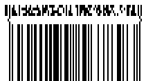</p>

``` csharp
//Encode GS1Composite barcode with EAN13 linear component
using (BarcodeGenerator gen = new BarcodeGenerator(EncodeTypes.GS1CompositeBar, "2001234567893|(10)ABCD0123(240)0123456789"))
{
    gen.Parameters.Barcode.XDimension.Pixels = 2;
    gen.Parameters.Barcode.CodeTextParameters.Location = CodeLocation.None;
    gen.Parameters.Barcode.GS1CompositeBar.TwoDComponentType = TwoDComponentType.CC_A;
    gen.Parameters.Barcode.GS1CompositeBar.LinearComponentType = EncodeTypes.EAN13;

    gen.Save($"{path}GS1Composite1D_EAN13.png", BarCodeImageFormat.Png);
}
```
- **1D Components Type**: [UPCE](/barcode/info-cards/upc-e/)<br> **Encoding**: 8 Digits (GTIN-12 with zeros suppress) <br> **2D component**: CC_A, CC_B. Both 2-columns.
<p align="center">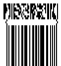</p>

``` csharp
//Encode GS1Composite barcode with UPCE linear component
using (BarcodeGenerator gen = new BarcodeGenerator(EncodeTypes.GS1CompositeBar, "04252614|(10)ABCD0123(240)0123456789"))
{
    gen.Parameters.Barcode.XDimension.Pixels = 2;
    gen.Parameters.Barcode.CodeTextParameters.Location = CodeLocation.None;
    gen.Parameters.Barcode.GS1CompositeBar.TwoDComponentType = TwoDComponentType.CC_A;
    gen.Parameters.Barcode.GS1CompositeBar.LinearComponentType = EncodeTypes.UPCE;

    gen.Save($"{path}GS1Composite1D_UPCE.png", BarCodeImageFormat.Png);
}
```
- **1D Components Type**: [Databar OmniDirectional](/barcode/info-cards/databar-omnidirectional/)<br> **Encoding**: 16 Digits (AI 01 and GTIN-14)<br> **2D component**: CC_A, CC_B. Both 4-columns.
<p align="center">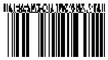</p>

``` csharp
//Encode GS1Composite barcode with DatabarOmniDirectional linear component
using (BarcodeGenerator gen = new BarcodeGenerator(EncodeTypes.GS1CompositeBar, "(01)24012345678905|(10)ABCD0123(240)0123456789"))
{
    gen.Parameters.Barcode.XDimension.Pixels = 2;
    gen.Parameters.Barcode.CodeTextParameters.Location = CodeLocation.None;
    gen.Parameters.Barcode.GS1CompositeBar.TwoDComponentType = TwoDComponentType.CC_A;
    gen.Parameters.Barcode.GS1CompositeBar.LinearComponentType = EncodeTypes.DatabarOmniDirectional;

    gen.Save($"{path}GS1Composite1D_DatabarOmniDirectional.png", BarCodeImageFormat.Png);
}
```
- **1D Components Type**: [Databar Stacked OmniDirectional](/barcode/info-cards/databar-omnidirectional/)<br> **Encoding**: 16 Digits (AI 01 and GTIN-14)<br> **2D component**: CC_A, CC_B. Both 2-columns. 
<p align="center">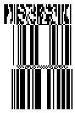</p>

``` csharp
//Encode GS1Composite barcode with DatabarStackedOmniDirectional linear component
using (BarcodeGenerator gen = new BarcodeGenerator(EncodeTypes.GS1CompositeBar, "(01)24012345678905|(10)ABCD0123(240)0123456789"))
{
    gen.Parameters.Barcode.XDimension.Pixels = 2;
    gen.Parameters.Barcode.CodeTextParameters.Location = CodeLocation.None;
    gen.Parameters.Barcode.GS1CompositeBar.TwoDComponentType = TwoDComponentType.CC_A;
    gen.Parameters.Barcode.GS1CompositeBar.LinearComponentType = EncodeTypes.DatabarStackedOmniDirectional;

    gen.Save($"{path}GS1Composite1D_DatabarStackedOmniDirectional.png", BarCodeImageFormat.Png);
}
```
- **1D Components Type**: [Databar Stacked](/barcode/info-cards/databar-truncated/)<br> **Encoding**: 16 Digits (AI 01 and GTIN-14)<br> **2D component**: CC_A, CC_B. Both 2-columns.
<p align="center">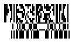</p>

``` csharp
//Encode GS1Composite barcode with DatabarStacked linear component
using (BarcodeGenerator gen = new BarcodeGenerator(EncodeTypes.GS1CompositeBar, "(01)24012345678905|(10)ABCD0123(240)0123456789"))
{
    gen.Parameters.Barcode.XDimension.Pixels = 2;
    gen.Parameters.Barcode.CodeTextParameters.Location = CodeLocation.None;
    gen.Parameters.Barcode.GS1CompositeBar.TwoDComponentType = TwoDComponentType.CC_A;
    gen.Parameters.Barcode.GS1CompositeBar.LinearComponentType = EncodeTypes.DatabarStacked;

    gen.Save($"{path}GS1Composite1D_DatabarStacked.png", BarCodeImageFormat.Png);
}
```
- **1D Components Type**: [Databar Limited](/barcode/info-cards/databar-limited/)<br> **Encoding**: 15 Digits (AI 01 and GTIN-14 without checksum)<br> **2D component**: CC_A, CC_B. Both 3-columns. 
<p align="center">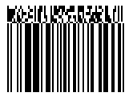</p>

``` csharp
//Encode GS1Composite barcode with DatabarLimited linear component
using (BarcodeGenerator gen = new BarcodeGenerator(EncodeTypes.GS1CompositeBar, "(01)15012345678907|(10)ABCD0123(240)0123456789"))
{
    gen.Parameters.Barcode.XDimension.Pixels = 2;
    gen.Parameters.Barcode.CodeTextParameters.Location = CodeLocation.None;
    gen.Parameters.Barcode.GS1CompositeBar.TwoDComponentType = TwoDComponentType.CC_A;
    gen.Parameters.Barcode.GS1CompositeBar.LinearComponentType = EncodeTypes.DatabarLimited;

    gen.Save($"{path}GS1Composite1D_DatabarLimited.png", BarCodeImageFormat.Png);
}
```
- **1D Components Type**: [Databar Expanded](/barcode/info-cards/databar-expanded/)<br> **Encoding**: Up to 74 Digits or variable length of [ISO/IEC 646](https://www.iso.org/standard/4777.html)<br> **2D component**: CC_A, CC_B. Both 4-columns.
<p align="center"></p>

``` csharp
//Encode GS1Composite barcode with DatabarExpanded linear component
using (BarcodeGenerator gen = new BarcodeGenerator(EncodeTypes.GS1CompositeBar, "(01)98898765432106(3202)012345(15)991231|(10)ABCD0123(240)0123456789"))
{
    gen.Parameters.Barcode.XDimension.Pixels = 2;
    gen.Parameters.Barcode.CodeTextParameters.Location = CodeLocation.None;
    gen.Parameters.Barcode.GS1CompositeBar.TwoDComponentType = TwoDComponentType.CC_A;
    gen.Parameters.Barcode.GS1CompositeBar.LinearComponentType = EncodeTypes.DatabarExpanded;

    gen.Save($"{path}GS1Composite1D_DatabarExpanded.png", BarCodeImageFormat.Png);
}
```
- **1D Components Type**:[Databar Expanded Stacked](/barcode/info-cards/databar-expanded/) <br> **Encoding**: Up to 74 Digits or variable length of [ISO/IEC 646](https://www.iso.org/standard/4777.html)<br> **2D component**: CC_A, CC_B. Both 4-columns.
<p align="center">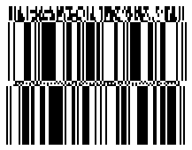</p>

``` csharp
//Encode GS1Composite barcode with DatabarExpandedStacked linear component
using (BarcodeGenerator gen = new BarcodeGenerator(EncodeTypes.GS1CompositeBar, "(01)98898765432106(3202)012345(15)991231|(10)ABCD0123(240)0123456789"))
{
    gen.Parameters.Barcode.XDimension.Pixels = 2;
    gen.Parameters.Barcode.CodeTextParameters.Location = CodeLocation.None;
    gen.Parameters.Barcode.GS1CompositeBar.TwoDComponentType = TwoDComponentType.CC_A;
    gen.Parameters.Barcode.GS1CompositeBar.LinearComponentType = EncodeTypes.DatabarExpandedStacked;

    gen.Save($"{path}GS1Composite1D_DatabarExpandedStacked.png", BarCodeImageFormat.Png);
}
```
- **1D Components Type**: [GS1 Code128](/barcode/net/gs1-barcodes/#barcode-generation-according-to-gs1-standards)<br> **Encoding**: Up to 48 Digits or variable length of [ISO/IEC 646](https://www.iso.org/standard/4777.html)<br> **2D component**: CC_A (4-columns), CC_B (4-columns), CC_C (variable length).
<p align="center"></p>

``` csharp
//Encode GS1Composite barcode with GS1Code128 linear component
using (BarcodeGenerator gen = new BarcodeGenerator(EncodeTypes.GS1CompositeBar, "(01)98898765432106(3202)012345|(10)ABCD0123(240)0123456789"))
{
    gen.Parameters.Barcode.XDimension.Pixels = 2;
    gen.Parameters.Barcode.CodeTextParameters.Location = CodeLocation.None;
    gen.Parameters.Barcode.GS1CompositeBar.TwoDComponentType = TwoDComponentType.CC_A;
    gen.Parameters.Barcode.GS1CompositeBar.LinearComponentType = EncodeTypes.GS1Code128;

    gen.Save($"{path}GS1Composite1D_GS1Code128.png", BarCodeImageFormat.Png);
}
```
## **2D Linear Barcode Component Selection**
*2D component* columns amount and type depends from *1D linear* component. *2D component* columns contains three types: *CC_A*, *CC_B* and *CC_C*. *CC_C* can be used only with *GS1 Code128*, all others like *CC_A*, *CC_B* can be used with any *1D linear component*. Any *2D component* can encode [ISO/IEC 646](https://www.iso.org/standard/4777.html) charset which includes:
- digits (0-9);
- uppercase letters(A-Z);
- lowercase letters(a-z);
- special symbol *FNC1* which is used internally as [GS1 Application Identifier]( https://www.gs1.org/standards/barcodes/application-identifiers) splitter;
- punctuation symbols (!\"%&'()*+,-./:;<=>?_);
- space symbol ( )

All symbols can be used freely in [non GS1 encoding mode](https://reference.aspose.com/barcode/net/aspose.barcode.generation/gs1compositebarparameters/isallowonlygs1encoding/) or according *GS1 rules*, where it is allowed in *GS1 Application Identifier*.

In the following list we give more detail about every *2D component*.
- **CC_A** - is *2D* component, based on [MicroPDF417](/barcode/net/pdf417-barcodes/#micro-pdf417)-like symbology. Can encode up to 56 digits or any [ISO/IEC 646](https://www.iso.org/standard/4777.html) symbols with variable length. Can be used with any *1D linear component*.
<p align="center"></p>

``` csharp
//Encode GS1Composite barcode with CC_A 2D component
using (BarcodeGenerator gen = new BarcodeGenerator(EncodeTypes.GS1CompositeBar, "(01)98898765432106(3202)012345|(10)ABCD0123(240)0123456789"))
{
    gen.Parameters.Barcode.XDimension.Pixels = 2;
    gen.Parameters.Barcode.CodeTextParameters.Location = CodeLocation.None;
    gen.Parameters.Barcode.GS1CompositeBar.TwoDComponentType = TwoDComponentType.CC_A;
    gen.Parameters.Barcode.GS1CompositeBar.LinearComponentType = EncodeTypes.GS1Code128;

    gen.Save($"{path}GS1Composite2D_CC_A.png", BarCodeImageFormat.Png);
}
```
- **CC_B** - is 2D component, used [MicroPDF417](/barcode/net/pdf417-barcodes/#micro-pdf417) symbology to encode 2D binary data. Can encode up to 338 digits or any [ISO/IEC 646](https://www.iso.org/standard/4777.html) symbols with variable length. Can be used with any 1D linear component.
<p align="center">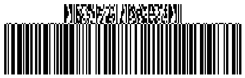</p>

``` csharp
//Encode GS1Composite barcode with CC_B 2D component
using (BarcodeGenerator gen = new BarcodeGenerator(EncodeTypes.GS1CompositeBar, "(01)98898765432106(3202)012345|(10)ABCD0123(240)0123456789"))
{
    gen.Parameters.Barcode.XDimension.Pixels = 2;
    gen.Parameters.Barcode.CodeTextParameters.Location = CodeLocation.None;
    gen.Parameters.Barcode.GS1CompositeBar.TwoDComponentType = TwoDComponentType.CC_B;
    gen.Parameters.Barcode.GS1CompositeBar.LinearComponentType = EncodeTypes.GS1Code128;

    gen.Save($"{path}GS1Composite2D_CC_B.png", BarCodeImageFormat.Png);
}
```
- **CC_C** - is 2D component, used [PDF417](/barcode/net/pdf417-barcodes/#pdf417-and-macro-pdf417) symbology to encode 2D binary data. Can encode up to 2361 digits or any [ISO/IEC 646](https://www.iso.org/standard/4777.html) symbols with variable length. Can be used only with [GS1 Code128](/barcode/net/gs1-barcodes/#barcode-generation-according-to-gs1-standards).
<p align="center">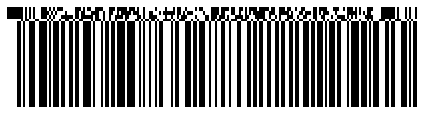</p>

``` csharp
//Encode GS1Composite barcode with CC_C 2D component
using (BarcodeGenerator gen = new BarcodeGenerator(EncodeTypes.GS1CompositeBar, "(01)98898765432106(3202)012345|(10)ABCD0123(240)0123456789"))
{
    gen.Parameters.Barcode.XDimension.Pixels = 2;
    gen.Parameters.Barcode.CodeTextParameters.Location = CodeLocation.None;
    gen.Parameters.Barcode.GS1CompositeBar.TwoDComponentType = TwoDComponentType.CC_C;
    gen.Parameters.Barcode.GS1CompositeBar.LinearComponentType = EncodeTypes.GS1Code128;

    gen.Save($"{path}GS1Composite2D_CC_C.png", BarCodeImageFormat.Png);
}
```
## **2D Component in non GS1 Mode**
Sometimes we need to encode *non GS1* data in *2D* component. For this you can use property [IsAllowOnlyGS1Encoding](https://reference.aspose.com/barcode/net/aspose.barcode.generation/gs1compositebarparameters/isallowonlygs1encoding/).
<p align="center">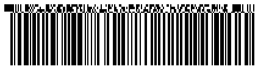</p>

``` csharp
//Encode GS1Composite barcode with not GS1 complaint 2D component
using (BarcodeGenerator gen = new BarcodeGenerator(EncodeTypes.GS1CompositeBar, "(01)98898765432106(3202)012345|Aspose.Barcode"))
{
    gen.Parameters.Barcode.XDimension.Pixels = 2;
    gen.Parameters.Barcode.CodeTextParameters.Location = CodeLocation.None;
    gen.Parameters.Barcode.GS1CompositeBar.TwoDComponentType = TwoDComponentType.CC_C;
    gen.Parameters.Barcode.GS1CompositeBar.LinearComponentType = EncodeTypes.GS1Code128;
    gen.Parameters.Barcode.GS1CompositeBar.IsAllowOnlyGS1Encoding = false;

    gen.Save($"{path}GS1Composite2D_NotGS1TwoDSupplement.png", BarCodeImageFormat.Png);
}
```
## **Encode Special Modes for 2D component**
2D component data can be encoded in three modes with different compaction ability:
- *Mode 0* - general-purpose data compaction which can be used to encode any [GS1 Application Identifier]( https://www.gs1.org/standards/barcodes/application-identifiers) or [non GS1 data]( https://reference.aspose.com/barcode/net/aspose.barcode.generation/gs1compositebarparameters/isallowonlygs1encoding/) with [ISO/IEC 646](https://www.iso.org/standard/4777.html) charset;
- *Mode 10* which can be used to encode data with GS1 AI *11*, *17* and *10* with maximal compaction;
- *Mode 11* which can be used to encode data with GS1 AI *90* with maximal compaction.

### **Mode 0**
In this mode you can encode any [ISO/IEC 646](https://www.iso.org/standard/4777.html) symbol sequence.

**Digits encoding**:
<p align="center">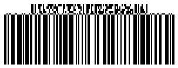</p>

``` csharp
//Encode GS1Composite barcode Encodation Method 0: Digits
using (BarcodeGenerator gen = new BarcodeGenerator(EncodeTypes.GS1CompositeBar, "(01)98898765432106|0123456789"))
{
    gen.Parameters.Barcode.XDimension.Pixels = 2;
    gen.Parameters.Barcode.CodeTextParameters.Location = CodeLocation.None;
    gen.Parameters.Barcode.GS1CompositeBar.TwoDComponentType = TwoDComponentType.CC_B;
    gen.Parameters.Barcode.GS1CompositeBar.LinearComponentType = EncodeTypes.GS1Code128;
    gen.Parameters.Barcode.GS1CompositeBar.IsAllowOnlyGS1Encoding = false;

    gen.Save($"{path}GS1CompositeMode_0_Digits.png", BarCodeImageFormat.Png);
}
```
**Uppercase letters encoding**:
<p align="center">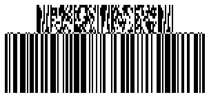</p>

``` csharp
//Encode GS1Composite barcode Encodation Method 0: Capital Letters
using (BarcodeGenerator gen = new BarcodeGenerator(EncodeTypes.GS1CompositeBar, "(01)98898765432106|ABCDEFGHIJKLMNOPQRSTUVWXYZ"))
{
    gen.Parameters.Barcode.XDimension.Pixels = 2;
    gen.Parameters.Barcode.CodeTextParameters.Location = CodeLocation.None;
    gen.Parameters.Barcode.GS1CompositeBar.TwoDComponentType = TwoDComponentType.CC_B;
    gen.Parameters.Barcode.GS1CompositeBar.LinearComponentType = EncodeTypes.GS1Code128;
    gen.Parameters.Barcode.GS1CompositeBar.IsAllowOnlyGS1Encoding = false;

    gen.Save($"{path}GS1CompositeMode_0_CapitalLetters.png", BarCodeImageFormat.Png);
}
```
**Lowercase letters encoding**:
<p align="center">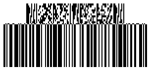</p>

``` csharp
//Encode GS1Composite barcode Encodation Method 0: Letters
using (BarcodeGenerator gen = new BarcodeGenerator(EncodeTypes.GS1CompositeBar, "(01)98898765432106|abcdefghijklmnopqrstuvwxyz"))
{
    gen.Parameters.Barcode.XDimension.Pixels = 2;
    gen.Parameters.Barcode.CodeTextParameters.Location = CodeLocation.None;
    gen.Parameters.Barcode.GS1CompositeBar.TwoDComponentType = TwoDComponentType.CC_B;
    gen.Parameters.Barcode.GS1CompositeBar.LinearComponentType = EncodeTypes.GS1Code128;
    gen.Parameters.Barcode.GS1CompositeBar.IsAllowOnlyGS1Encoding = false;

    
```
**Punctuation encoding**:
<p align="center">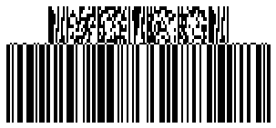</p>

``` csharp
//Encode GS1Composite barcode Encodation Method 0: Punctuation
using (BarcodeGenerator gen = new BarcodeGenerator(EncodeTypes.GS1CompositeBar, "(01)98898765432106|!\"%&'()*+,-./:;<=>?_ "))
{
    gen.Parameters.Barcode.XDimension.Pixels = 2;
    gen.Parameters.Barcode.CodeTextParameters.Location = CodeLocation.None;
    gen.Parameters.Barcode.GS1CompositeBar.TwoDComponentType = TwoDComponentType.CC_B;
    gen.Parameters.Barcode.GS1CompositeBar.LinearComponentType = EncodeTypes.GS1Code128;
    gen.Parameters.Barcode.GS1CompositeBar.IsAllowOnlyGS1Encoding = false;

    gen.Save($"{path}GS1CompositeMode_0_Punctuation.png", BarCodeImageFormat.Png);
}
```
### **Mode 10**
In *Mode 10* you can encode supplement *2D* data with *GS1 AI* *11*, *17*, *10* and their combination like AI *11* with AI *10* or AI *17* with AI *10* with maximal compaction. Also, you can encode any other *GS1 AI* after these sequences.

**GS1 AI 10 encoding**:
<p align="center">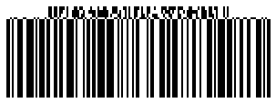</p>

``` csharp
//Encode GS1Composite barcode Encodation Method 10: AI 10(Batch or lot number)
using (BarcodeGenerator gen = new BarcodeGenerator(EncodeTypes.GS1CompositeBar, "(01)98898765432106|(10)0123"))
{
    gen.Parameters.Barcode.XDimension.Pixels = 2;
    gen.Parameters.Barcode.CodeTextParameters.Location = CodeLocation.None;
    gen.Parameters.Barcode.GS1CompositeBar.TwoDComponentType = TwoDComponentType.CC_A;
    gen.Parameters.Barcode.GS1CompositeBar.LinearComponentType = EncodeTypes.GS1Code128;

    gen.Save($"{path}GS1CompositeMode_10_AI10.png", BarCodeImageFormat.Png);
}
```
**GS1 AI 11 encoding**:
<p align="center">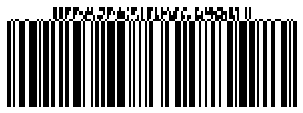</p>

``` csharp
//Encode GS1Composite barcode Encodation Method 10: AI 11(Production date (YYMMDD))
using (BarcodeGenerator gen = new BarcodeGenerator(EncodeTypes.GS1CompositeBar, "(01)98898765432106|(11)991231"))
{
    gen.Parameters.Barcode.XDimension.Pixels = 2;
    gen.Parameters.Barcode.CodeTextParameters.Location = CodeLocation.None;
    gen.Parameters.Barcode.GS1CompositeBar.TwoDComponentType = TwoDComponentType.CC_A;
    gen.Parameters.Barcode.GS1CompositeBar.LinearComponentType = EncodeTypes.GS1Code128;

    gen.Save($"{path}GS1CompositeMode_10_AI11.png", BarCodeImageFormat.Png);
}
```
**GS1 AI 17 encoding**:
<p align="center">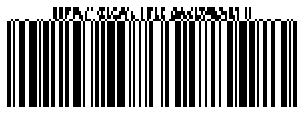</p>

``` csharp
//Encode GS1Composite barcode Encodation Method 10: AI 17(Expiration date (YYMMDD))
using (BarcodeGenerator gen = new BarcodeGenerator(EncodeTypes.GS1CompositeBar, "(01)98898765432106|(17)991231"))
{
    gen.Parameters.Barcode.XDimension.Pixels = 2;
    gen.Parameters.Barcode.CodeTextParameters.Location = CodeLocation.None;
    gen.Parameters.Barcode.GS1CompositeBar.TwoDComponentType = TwoDComponentType.CC_A;
    gen.Parameters.Barcode.GS1CompositeBar.LinearComponentType = EncodeTypes.GS1Code128;

    gen.Save($"{path}GS1CompositeMode_10_AI17.png", BarCodeImageFormat.Png);
}
```
**GS1 AI 11 with AI 10 encoding**:
<p align="center">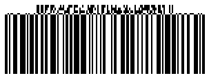</p>

``` csharp
//Encode GS1Composite barcode Encodation Method 10: AI 10(Batch or lot number) AI 11(Production date (YYMMDD))
using (BarcodeGenerator gen = new BarcodeGenerator(EncodeTypes.GS1CompositeBar, "(01)98898765432106|(11)991231(10)0123"))
{
    gen.Parameters.Barcode.XDimension.Pixels = 2;
    gen.Parameters.Barcode.CodeTextParameters.Location = CodeLocation.None;
    gen.Parameters.Barcode.GS1CompositeBar.TwoDComponentType = TwoDComponentType.CC_A;
    gen.Parameters.Barcode.GS1CompositeBar.LinearComponentType = EncodeTypes.GS1Code128;

    gen.Save($"{path}GS1CompositeMode_10_AI11_AI10.png", BarCodeImageFormat.Png);
}
```

### **Mode 11**
In *Mode 11* you can encode *GS1 AI 90* and following data with maximal compaction.

<p align="center">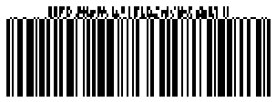</p>

``` csharp
//Encode GS1Composite barcode Encodation Method 11: AI 90 (containing alphanumeric data)
using (BarcodeGenerator gen = new BarcodeGenerator(EncodeTypes.GS1CompositeBar, "(01)98898765432106|(90)9K12(10)0123"))
{
    gen.Parameters.Barcode.XDimension.Pixels = 2;
    gen.Parameters.Barcode.CodeTextParameters.Location = CodeLocation.None;
    gen.Parameters.Barcode.GS1CompositeBar.TwoDComponentType = TwoDComponentType.CC_A;
    gen.Parameters.Barcode.GS1CompositeBar.LinearComponentType = EncodeTypes.GS1Code128;

    gen.Save($"{path}GS1CompositeMode_11.png", BarCodeImageFormat.Png);
}
```
