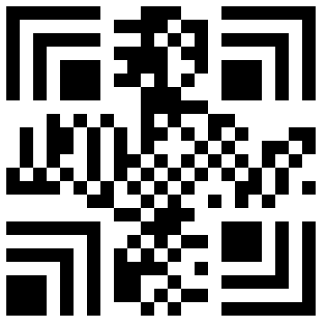
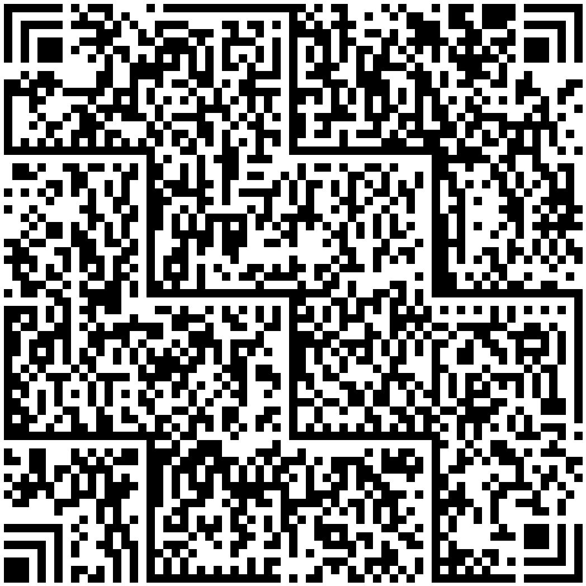
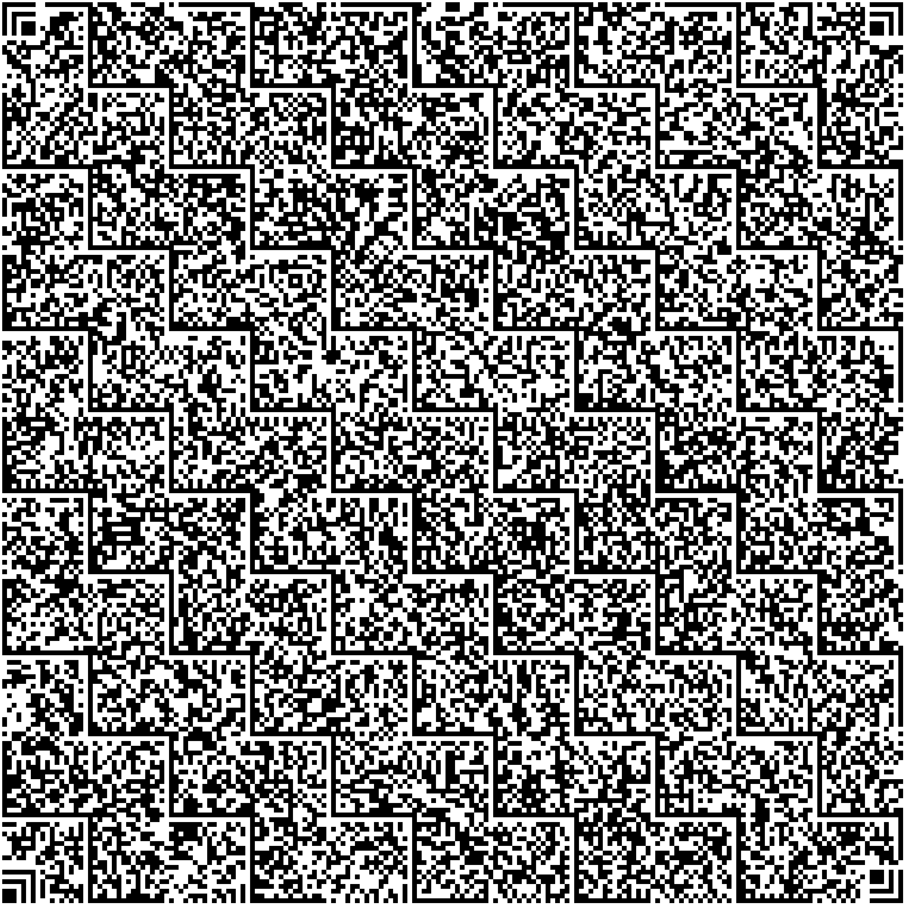

## **Overview**
Han Xin Code, alternatively referred to as Chinese Sensible, is a matrix symbology introduced in 2007. It was developed to encode both simplified Chinese characters and all ASCII characters and digits. Han Xin Code symbols are two-dimensional and have a variable-size matrix structure. They comprise an arrangement of black and white modules arranged in a square pattern. The ownership and governance of this barcode standard are held by GS1 China.

With the minimum error correction level settings, Han Xin Code can encode up to 2,174 common Chinese characters, 3,261 binary bytes, 4,350 ASCII characters, or 7,827 digits. Multiple data types can be encoded in a single barcode. This standard is defined the in AIMD-015 barcode symbology specification - Han Xin Code.

{}*If you need any clarifications, feel free to reach out [Aspose Technical Support](/barcode/net/technical-support/): ask your questions at [Aspose.Barcode Forum](https://forum.aspose.com/c/barcode/13) or contact [Aspose Paid Support Helpdesk](https://helpdesk.aspose.com/).*{}

## **Version Settings**
Han Xin Code provides 84 variants of different sizes denoted as Version 1, Version 2 … Version 84. Version 1 has 23 modules × 23 modules; Version 2 contains 25 modules × 25 modules, and so on, increasing by modules per side up to Version 84, which has 189 modules × 189 modules.

By default, the [*HanXinVersion*](https://reference.aspose.com/barcode/net/aspose.barcode.generation/hanxinparameters/hanxinversion/) property of class [*HanXinParameters*](https://reference.aspose.com/barcode/net/aspose.barcode.generation/hanxinparameters) is set to *HanXinVersion.Auto*. In this mode, the encoder automatically picks the smallest possible version. To set a specific version, [*HanXinVersion*](https://reference.aspose.com/barcode/net/aspose.barcode.generation/hanxinversion/) needs to be initizalized with the corresponding value: from *HanXinVersion.Version01* to *HanXinVersion.Version84*.
  
| |Version 1|Version 24|Version 84|
|--|:---:|:------:|:------:|
| |<p align="center"></p>|<p align="center"></p>|<p align="center"></p>|
  

The following code sample explains how to set the Han Xin Code version.

``` csharp
using (var bg = new BarcodeGenerator(EncodeTypes.HanXin, "1234567890"))
{
    // Auto (by default)
    var img = bg.GenerateBarCodeImage();
    img.Save(Global.PathCombine({path}, "ver_auto.png"));

    // Version 24
    bg.Parameters.Barcode.HanXin.HanXinVersion = HanXinVersion.Version24;
    img = bg.GenerateBarCodeImage();
    img.Save(Global.PathCombine({path}, "ver24.png"));
}
```

## **Encoding Mode Settings**
The barcode library supports different encoding modes to generate Han Xin barcodes. The required mode can be selected by setting the [*HanXinEncodeMode*](https://reference.aspose.com/barcode/net/aspose.barcode.generation/hanxinparameters/hanxinencodemode/) property of class [*HanXinParameters*](https://reference.aspose.com/barcode/net/aspose.barcode.generation/hanxinparameters). The possible values are defined in the [*HanXinEncodeMode*](https://reference.aspose.com/barcode/net/aspose.barcode.generation/hanxinencodemode/) enumeration. These modes are briefly described below:
- *Auto*. In Auto mode, the CodeText is encoded with maximum data compactness. This is the default value.
- *Binary*. The *Binary* mode is used to encode binary data with maximum data compactness. 
- *ECI*. The Extended Channel Interpretation (ECI) mode indicates the encoded data is interpreted according to the ECI protocol defined by the AIM ECI Specifications.
- *Unicode*. The *Unicode* mode designs a way to represent any text data reference to UTF8 encoding/charset in Han Xin Code.
- *URI*. The *URI* mode indicates the data represented in Han Xin Code is Uniform Resource Identifier (URI) reference to [*RFC 3986*](https://datatracker.ietf.org/doc/html/rfc3986).
- *Extended*. The *Extended* mode provides flexible encoding controls and allows for manually specifying the required encoding for a part of Codetext.

### ***Auto* Encoding Mode**
This mode automatically changes between *Numeric*, *Text*, *Binary*, and 4 *GB18030* (Chinese) modes to achieve the best data compactness. This is the default value.

The following code sample shows how to generate Han Xin barcodes using the *Auto* mode.
  
``` csharp
// Text + Region One + Region Two + GB18030 2 Byte
var str = "abc123全ň全漄灟漄灟螅全ň螅螅螅";

using (var bg = new BarcodeGenerator(EncodeTypes.HanXin, str))
{
    bg.Parameters.Barcode.HanXin.HanXinEncodeMode = HanXinEncodeMode.Auto; // It is already Auto by default
    var img = bg.GenerateBarCodeImage();
}
```

### ***Binary* Encoding Mode**
The *Binary* mode serves to encode byte streams. If a Unicode character is encountered, an exception is thrown. The code sample below explains how to work with this encoding mode.

``` csharp
// Binary mode 

byte[] encodedArr = { 0xFF, 0xFE, 0xFD, 0xFC, 0xFB, 0xFA, 0xF9 };
using (BarcodeGenerator bg = new BarcodeGenerator(EncodeTypes.HanXin))
{
    bg.SetCodeText(encodedArr);
    bg.Parameters.Barcode.HanXin.HanXinEncodeMode = HanXinEncodeMode.Binary;
    var img = bg.GenerateBarCodeImage();
}
```

### ***ECI* Mode**
The Extended Channel Interpretation (ECI) mode indicates that the encoded data is interpreted according to the ECI protocol defined by the AIM ECI Specifications. When the ECI mode is selected, the entire CodeText is re-encoded using the encoding specified in the [*HanXinECIEncoding*](https://reference.aspose.com/barcode/net/aspose.barcode.generation/hanxinparameters/hanxineciencoding/) parameter, with an ECI identifier inserted. If a character is found that is not supported by the selected ECI encoding, an exception is thrown. By default, the [*HanXinECIEncoding*](https://reference.aspose.com/barcode/net/aspose.barcode.generation/hanxinparameters/hanxineciencoding/) property is set to [*ECIEncodings*](https://reference.aspose.com/barcode/net/aspose.barcode.generation/eciencodings/).UTF8 (ECI ID:"\000026").

The following code sample demonstrates how to use the *ECI* mode.

```csharp
// ECI mode, Latin/Greek alphabet encoding. ECI Id:"\000009"
var str = "ΑΒΓΔΕ";

using (var bg = new BarcodeGenerator(EncodeTypes.HanXin, str))
{
    bg.Parameters.Barcode.HanXin.HanXinEncodeMode = HanXinEncodeMode.ECI;
    bg.Parameters.Barcode.HanXin.HanXinECIEncoding = ECIEncodings.ISO_8859_7;
    var img = bg.GenerateBarCodeImage();
}
```

### ***Unicode* Mode**
The *Unicode* mode provides a way to store text data entered in the UTF8 encoding format within Han Xin barcodes.
  
The following code sample shows how to enable the *Unicode* mode.

``` csharp
var str = "abcd АБВ ıntəˈnæʃənəl 语言语言 แผ่นดินฮั่นเสื่ ∑ f(i) = ∏ 🖨 🚘✉🥇⚽ 你好測試測試 こんにちは テスト テスト 안녕하세요 테스트 테스트";

using (var bg = new BarcodeGenerator(EncodeTypes.HanXin, str))
{
    bg.Parameters.Barcode.HanXin.HanXinEncodeMode = HanXinEncodeMode.Unicode;
    var img = bg.GenerateBarCodeImage();
}
```

### ***URI* Mode**
The *URI* mode indicates the data represented in Han Xin Code is Uniform Resource Identifier (URI) reference to [*RFC 3986*](https://datatracker.ietf.org/doc/html/rfc3986).

``` csharp
// URI mode 
var str = "https://www.test.com/%BC%DE%ab/search=test";

using (var bg = new BarcodeGenerator(EncodeTypes.HanXin, str))
{
    bg.Parameters.Barcode.HanXin.HanXinEncodeMode = HanXinEncodeMode.URI;
    var img = bg.GenerateBarCodeImage();

    using (var r = new BarCodeReader(img, DecodeType.HanXin))
    {
        var found = r.ReadBarCodes();
        Assert.AreEqual(1, found.Length);
        Assert.AreEqual(str.ToLower(), found[0].CodeText.ToLower());
    }
}
```

### ***Extended* Mode**
The *Extended* mode allows combining all supported encoding formats within a single barcode, including the following: Auto, Binary, Text, Numeric, URI, Unicode, ECI, Common Chinese Region One, Common Chinese Region Two, GB18030 Two Byte, and GB18030 Four Byte. 

The barcode text can be defined manually with prefixes and doubled backslashes, e.g.: `@"\auto:abc\000009:ΑΒΓΔΕ\auto:ab\\c"` or using the HanXinExtCodetextBuilder. 

If the barcode text contains an ECI fragment, then only the following modes can be used after the ECI fragment: *Auto*, *Binary*, *Text*, *Numeric*, *URI*, or *ECI*.

Following code examples illustrate how to use all the modes.

``` csharp
// Extended mode example 1
var str = @"\auto:abc\000009:ΑΒΓΔΕ\auto:abc";

var expectedStr = str.Replace(@"\auto:", "");
expectedStr = expectedStr.Replace(@"\000009:", "");

// expectedStr == "abcΑΒΓΔΕabc"

using (var bg = new BarcodeGenerator(EncodeTypes.HanXin, str))
{
    bg.Parameters.Barcode.HanXin.HanXinEncodeMode = HanXinEncodeMode.Extended;
    var img = bg.GenerateBarCodeImage();

    using (var r = new BarCodeReader(img, DecodeType.HanXin))
    {
        var found = r.ReadBarCodes();
        Assert.AreEqual(1, found.Length);
        Assert.AreEqual(expectedStr, found[0].CodeText);
    }
}

// Extended mode example 2
var str = @"\gb180302b:漄\gb180304b:㐁\region1:全\region2:螅\numeric:123\text:qwe\unicode:ıntəˈnæʃənəl" +
     @"\000009:ΑΒΓΔΕ\auto:abc\binary:abc\uri:backslashes_should_be_doubled\\000555:test";

var expectedStr = @"漄㐁全螅123qweıntəˈnæʃənəlΑΒΓΔΕabcabcbackslashes_should_be_doubled\000555:test";

using (var bg = new BarcodeGenerator(EncodeTypes.HanXin, str))
{
    bg.Parameters.Barcode.HanXin.HanXinEncodeMode = HanXinEncodeMode.Extended;
    var img = bg.GenerateBarCodeImage();

    using (var r = new BarCodeReader(img, DecodeType.HanXin))
    {
        var found = r.ReadBarCodes();
        Assert.AreEqual(1, found.Length);
        Assert.AreEqual(expectedStr, found[0].CodeText);
    }
}

// Extended mode example 3
// Using HanXinExtCodetextBuilder for Extended mode (same codetext as in previous example)
// Create codetext
var codeTextBuilder = new HanXinExtCodetextBuilder();
codeTextBuilder.AddGB18030TwoByte("漄");
codeTextBuilder.AddGB18030FourByte("㐁");
codeTextBuilder.AddCommonChineseRegionOne("全");
codeTextBuilder.AddCommonChineseRegionTwo("螅");
codeTextBuilder.AddNumeric("123");
codeTextBuilder.AddText("qwe");
codeTextBuilder.AddUnicode("ıntəˈnæʃənəl");
codeTextBuilder.AddECI("ΑΒΓΔΕ", 9);
codeTextBuilder.AddAuto("abc");
codeTextBuilder.AddBinary("abc");
codeTextBuilder.AddURI(@"backslashes_should_be_doubled\000555:test");

var expectedStr = @"漄㐁全螅123qweıntəˈnæʃənəlΑΒΓΔΕabcabcbackslashes_should_be_doubled\000555:test";

// Generate codetext
var str = codeTextBuilder.GetExtendedCodetext();

// Generate
using (var bg = new BarcodeGenerator(EncodeTypes.HanXin, str))
{
    bg.Parameters.Barcode.HanXin.HanXinEncodeMode = HanXinEncodeMode.Extended;
    var img = bg.GenerateBarCodeImage();

    using (var r = new BarCodeReader(img, DecodeType.HanXin))
    {
        var found = r.ReadBarCodes();
        Assert.AreEqual(1, found.Length);
        Assert.AreEqual(expectedStr, found[0].CodeText);
    }
}
```

## **Error Correction Settings**
Han Xin Code supports the four levels of Reed-Solomon error correction as explained in the table below.
  
|Error Correction Level|Data Recovery Capability|
|:--:|:--:|
|L1|8%|
|L2|15%|
|L3|23%|
|L4|30%|
  
The required error correction level can be defined using the [*HanXinErrorLevel*](https://reference.aspose.com/barcode/net/aspose.barcode.generation/hanxinparameters/hanxinerrorlevel/) property of class [*HanXinParameters*](https://reference.aspose.com/barcode/net/aspose.barcode.generation/hanxinparameters). By default, it is set to the *HanXinErrorLevel.L1* value.

The following code sample explains how to set the error correction level.

``` csharp
using (var bg = new BarcodeGenerator(EncodeTypes.HanXin, "1234567890"))
{
    // L4
    bg.Parameters.Barcode.HanXin.HanXinErrorLevel = HanXinErrorLevel.L4;
    var img = bg.GenerateBarCodeImage();
    img.Save(Global.PathCombine({path}, "img.png"));
}
```

