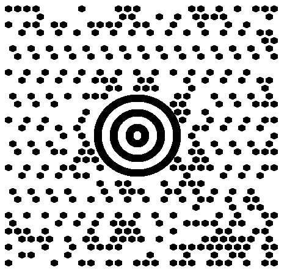

{}[Generate MaxiCode Barcodes Online](https://products.aspose.app/barcode/generate/maxicode): You can test the quality of ***Aspose.BarCode*** generation for MaxiCode barcodes and view the results online.{}

## **Overview**
*MaxiCode* is a 2D matrix barcode type that allows encoding both text information and byte streams. This symbology supports Reed-Solomon error correction. The amount of data required for error correction and barcode size are strictly specified in the *MaxiCode* standard. A *MaxiCode* barcode includes a round bullseye finder pattern composed of three concentric circles, six orientation patterns, and 33 rows with 29 or 30 hexagonal modules.  
  
The available size of information to be encoded (data capacity) depends on the input data characteristics and constitutes at most 60 bytes or 140 numerical (90 alphanumeric) digits. This symbology has been introduced for postal services; it is intended for industrial standard support and is not recommended for business-as-usual use.
  
{}*If you need any clarifications, feel free to reach out [Aspose Technical Support](/barcode/net/technical-support/): ask your questions at [Aspose.Barcode Forum](https://forum.aspose.com/c/barcode/13) or contact [Aspose Paid Support Helpdesk](https://helpdesk.aspose.com/).*{}

## **MaxiCode Mode Settings**
In ***Aspose.BarCode for .NET***, developers can set different generation modes to create *MaxiCode* barcodes using the [*MaxiCodeMode*](https://reference.aspose.com/barcode/net/aspose.barcode.generation/maxicodeparameters/maxicodemode) property of class [*MaxiCodeParameters*](https://reference.aspose.com/barcode/net/aspose.barcode.generation/maxicodeparameters). The following data modes are supported: 
- *Modes 2 and 3* - special industrial standards that are used in the transportation industry to store the information about shipping along with additional data
- *Modes 4 and 5* - can store arbitrary text information or byte streams and differ from each other only by the number of codewords for error correction and potential data capacity
- *Mode 6* - is the same as *Mode 4*, but the barcode information is used to set up hardware readers

These modes are described further in the article. You can find more information and code samples for complex data modes [here](/net/complex-maxicode/).   

### **MaxiCode Modes 2 and 3**
For correct barcode generation, *MaxiCodeModes 2 and 3* require specifying the input data in the predefined formats that can be summarized as follows:  
- <mark>Format1: “[)>(rs)01(gs)(Postal Code)(gs)(Country Code)(gs)(Service Category)(gs)(Secondary Message)(eot)”</mark>
- <mark>Format2: “(Postal Code 9 digits)(gs)(Country Code)(gs)(Service Category)(gs)(Secondary Message)(eot)”</mark>
  
The following special characters are used:
- Group separator Unicode character: (gs) - \u001d
- Record separator Unicode character: (rs) - \u001e
- End-of-transmission Unicode character: (eot) - \u0004
  
Sample *MaxiCode* barcodes demonstrated below have been created using Formats 1 and 2 of *MaxiCode Mode 2*.
   
|Mode 2|Format 1|Format 2|
| :-: | :-: | :-: |
| |||
  
The following code snippet explains how to work with MaxiCode modes.

``` csharp
string gs = "\u001d";
string rs = "\u001e";
string eot = "\u0004";
//[)>(rs)01(gs)(Postal Code)(gs)(Country Code)(gs)(Service Category)(gs)(Secondary Message)(eot)
string codetext = $"[)>{rs}01{gs}B1050{gs}056{gs}001{gs}ADDITIONAL DATA{eot}";

using (BarcodeGenerator gen = new BarcodeGenerator(EncodeTypes.MaxiCode, codetext))
{
    //set MaxiCode mode to 2
    gen.Parameters.Barcode.MaxiCode.MaxiCodeMode = MaxiCodeMode.Mode2;

    gen.Parameters.Barcode.XDimension.Pixels = 15;
    gen.Parameters.Barcode.CodeTextParameters.TwoDDisplayText = "MaxiCode Mode 2";

    gen.Save($"{path}MaxiCodeMode2First.png", BarCodeImageFormat.Png);
}


//(Postal Code 9 digits)(gs)(Country Code)(gs)(Service Category)(gs)(Secondary Message)(eot)
codetext = $"123456789{gs}056{gs}001{gs}ADDITIONAL DATA{eot}";
using (BarcodeGenerator gen = new BarcodeGenerator(EncodeTypes.MaxiCode, codetext))
{
    //set MaxiCode mode to 2
    gen.Parameters.Barcode.MaxiCode.MaxiCodeMode = MaxiCodeMode.Mode2;

    gen.Parameters.Barcode.XDimension.Pixels = 15;
    gen.Parameters.Barcode.CodeTextParameters.TwoDDisplayText = "MaxiCode Mode 2";

    gen.Save($"{path}MaxiCodeMode2Second.png", BarCodeImageFormat.Png);
}

```
  
### **MaxiCode Modes 4, 5, and 6**
*MaxiCode* barcodes generated in these modes can store the arbitrary text data or byte streams. The code sample given below shows how to use the *MaxiCode Mode 4*.

``` csharp
using (BarcodeGenerator gen = new BarcodeGenerator(EncodeTypes.MaxiCode, "Åspóse.Barcóde©"))
{
    gen.Parameters.Barcode.XDimension.Pixels = 15;
    //set MaxiCode encode mode to 4
    gen.Parameters.Barcode.MaxiCode.MaxiCodeMode = MaxiCodeMode.Mode4;
    gen.Save($"{path}MaxiCodeEncodeMode4.png", BarCodeImageFormat.Png);
}

```
  
<p align="center"></p>


## **Encoding Mode Settings**
The barcode library supports different encoding modes to generate *MaxiCode* barcodes. The required mode can be selected by setting the [*MaxiCodeEncodeMode*](https://reference.aspose.com/barcode/net/aspose.barcode.generation/maxicodeparameters/maxicodeencodemode) property of class [*MaxiCodeParameters*](https://reference.aspose.com/barcode/net/aspose.barcode.generation/maxicodeparameters). The possible values are defined in the [*MaxiCodeEncodeMode*](https://reference.aspose.com/barcode/net/aspose.barcode.generation/maxicodeencodemode/) enumeration. These modes are briefly described below:

- *Auto*. In Auto mode, the CodeText is encoded with maximum data compactness. This is the default value. 
- *Binary*. The *Binary* mode is used to encode binary data with maximum data compactness. 
- *ECI*. The Extended Channel Interpretation (ECI) mode indicates the encoded data is interpreted according to the ECI protocol defined by the AIM ECI Specifications.
- *Extended*. The *Extended* mode provides flexible encoding controls and allows for manually specifying the required encoding for a part of Codetext.

### **Encoding Mode *Auto***
In Auto mode, the CodeText is encoded with maximum data compactness. Unicode characters are re-encoded using the encoding specified in the [*ECIEncoding*](https://reference.aspose.com/barcode/net/aspose.barcode.generation/maxicodeparameters/eciencoding/) parameter, with an ECI identifier inserted. If a character is found that is not supported by the selected ECI encoding, an exception is thrown. By default, the [*ECIEncoding*](https://reference.aspose.com/barcode/net/aspose.barcode.generation/maxicodeparameters/eciencoding/) property is set to [*ECIEncodings*](https://reference.aspose.com/barcode/net/aspose.barcode.generation/eciencodings/).UTF8 (ECI ID:"\000026"). The following code sample shows how to generate MaxiCode barcode in the *Auto* mode.    

<p align="center"></p>

``` csharp
using (var gen = new BarcodeGenerator(EncodeTypes.MaxiCode, "犬Right狗"))
{
    gen.Save($"{path}MaxiCodeEncodyModeAuto.png", BarCodeImageFormat.Png);
}

```

### **Encoding Mode *Binary***
The *Binary* mode serves to encode byte streams. If a Unicode character is encountered, an exception is thrown. The code sample below explains how to work with this encoding mode.

<p align="center"></p>  
  
``` csharp
byte[] encodedArr = { 0xFF, 0xFE, 0xFD, 0xFC, 0xFB, 0xFA, 0xF9 };
using (BarcodeGenerator gen = new BarcodeGenerator(EncodeTypes.MaxiCode))
{
    bg.SetCodeText(encodedArr);
    //set MaxiCode encode mode to Binary
    gen.Parameters.Barcode.MaxiCode.MaxiCodeEncodeMode = MaxiCodeEncodeMode.Binary;
    gen.Save($"{path}MaxiCodeEncodeModeBinary.png", BarCodeImageFormat.Png);

}
```

### **Encoding Mode *ECI***
The Extended Channel Interpretation (ECI) mode indicates that the encoded data is interpreted according to the ECI protocol defined by the AIM ECI Specifications. When the ECI mode is selected, the entire CodeText is re-encoded using the encoding specified in the [*ECIEncoding*](https://reference.aspose.com/barcode/net/aspose.barcode.generation/maxicodeparameters/eciencoding/) parameter, with an ECI identifier inserted. If a character is found that is not supported by the selected ECI encoding, an exception is thrown. By default, the [*ECIEncoding*](https://reference.aspose.com/barcode/net/aspose.barcode.generation/maxicodeparameters/eciencoding/) property is set to [*ECIEncodings*](https://reference.aspose.com/barcode/net/aspose.barcode.generation/eciencodings/).UTF8 (ECI ID:"\000026").

The following code sample demonstrates how to use the *ECI* mode.

<p align="center"></p>

```csharp
// ECI mode, Latin/Greek alphabet encoding. ECI ID:"\000009"
var str = "ΑΒΓΔΕ";

using (var bg = new BarcodeGenerator(EncodeTypes.MaxiCode, str))
{
    bg.Parameters.Barcode.MaxiCode.MaxiCodeEncodeMode = MaxiCodeEncodeMode.ECI;
    bg.Parameters.Barcode.MaxiCode.ECIEncoding = ECIEncodings.ISO_8859_7;
    var img = bg.GenerateBarCodeImage();
}
```

### **Encoding Mode *Extended***
In this mode, the information passed to the [*CodeText*](https://reference.aspose.com/barcode/net/aspose.barcode.generation/barcodegenerator/codetext/) property includes control words besides the main input data. Control words serve to enable extended control over the data encoding process and allow developers to store textual sequences with different encodings in one barcode. To generate *MaxiCode* barcodes in this format, it is recommended to use class [*MaxiCodeExtCodetextBuilder*](https://reference.aspose.com/barcode/net/aspose.barcode.generation/maxicodeextcodetextbuilder/).

<p align="center"></p>

``` csharp
//create codetext
MaxiCodeExtCodetextBuilder textBuilder = new MaxiCodeExtCodetextBuilder();
textBuilder.AddECICodetext(ECIEncodings.Win1251, "Will");
textBuilder.AddECICodetext(ECIEncodings.UTF8, "犬Right狗");
textBuilder.AddECICodetext(ECIEncodings.UTF16BE, "犬Power狗");
textBuilder.AddPlainCodetext("Plain text");

//generate codetext
string codetext = textBuilder.GetExtendedCodetext();

//generate
using (BarcodeGenerator gen = new BarcodeGenerator(EncodeTypes.MaxiCode, codetext))
{
    gen.Parameters.Barcode.XDimension.Pixels = 15;
    //set encode mode to Extended
    gen.Parameters.Barcode.MaxiCode.MaxiCodeEncodeMode = MaxiCodeEncodeMode.Extended;
    gen.Parameters.Barcode.CodeTextParameters.TwoDDisplayText = "Extended mode";
    gen.Save($"{path}MaxiCodeEncodeModeExtended.png", BarCodeImageFormat.Png);
}
```

## **Aspect Ratio**
*Aspect Ratio* is the ratio between the barcode width and height. In ***Aspose.BarCode for .NET***, developers can use the [*AspectRatio*](https://reference.aspose.com/barcode/net/aspose.barcode.generation/maxicodeparameters/properties/aspectratio) property of class [*MaxiCodeParameters*](https://reference.aspose.com/barcode/net/aspose.barcode.generation/maxicodeparameters) to adjust barcode proportions with respect to the X and Y coordinates. It is implemented as a relative coefficient to the [*XDimension*](https://reference.aspose.com/barcode/net/aspose.barcode.generation/barcodeparameters/properties/xdimension) parameter. *MaxiCode* barcodes should be generated with the value of *AspectRatio* equal to 1. A sample *MaxiCode* barcode provided below has been generated using the *Aspect Ratio* set to 0.5.
  
<p align="center"></p>
  
The following code snippet illustrates how to manage *Aspect Ratio* settings for *MaxiCode* barcode generation.
  
``` csharp
BarcodeGenerator gen = new BarcodeGenerator(EncodeTypes.MaxiCode, "Åspóse.Barcóde©");
gen.Parameters.Barcode.XDimension.Pixels = 15;
//set aspect ratio 0.5
gen.Parameters.Barcode.MaxiCode.AspectRatio = 0.5f;
gen.Save($"{path}MaxiCodeAspectRatio0.5.png", BarCodeImageFormat.Png);

```

## **Structured Append**
The structured append mode is a special generation regime that allows combining up to eight MaxiCode barcodes. To use this mode, it is necessary to initialize the following properties:
-	[*MaxiCodeStructuredAppendModeBarcodesCount*]( https://reference.aspose.com/barcode/net/aspose.barcode.generation/maxicodeparameters/maxicodestructuredappendmodebarcodescount/) – is used to set the number of MaxiCode barcodes to be generated (from 2 to 8)
-	[*MaxiCodeStructuredAppendModeBarcodeId*](https://reference.aspose.com/barcode/net/aspose.barcode.generation/maxicodeparameters/maxicodestructuredappendmodebarcodeid/) – sets the position of the barcode in the sequence


<p align="center"></p>

``` csharp
using (BarcodeGenerator gen = new BarcodeGenerator(EncodeTypes.MaxiCode, "Åspóse.Barcóde©"))
{
    gen.Parameters.Barcode.XDimension.Pixels = 15;
    //set MaxiCode strucutured append mode
    gen.Parameters.Barcode.MaxiCode.MaxiCodeStructuredAppendModeBarcodeId = 3;
    gen.Parameters.Barcode.MaxiCode.MaxiCodeStructuredAppendModeBarcodeId = 5;
    gen.Save($"{path}MaxiCodeStructuredAppendMode.png", BarCodeImageFormat.Png);
}
```


