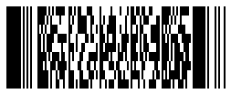
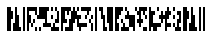

{}[Generate PDF417 and Micro PDF417 Barcodes Online](https://products.aspose.app/barcode/generate/pdf417): You can test the quality of ***Aspose.BarCode*** generation for PDF417 and Micro PDF417 barcodes and get the results online.{}

## **Overview**
*PDF417* is a group of 2D variable-length stacked symbologies that are similar to matrix barcodes in terms of various parameters. This standard supports laser scanning for high-quality documents. *PDF417* group unites *PDF417* barcodes based on [*ISO/IEC 15438*](https://www.iso.org/standard/65502.html) and  *Micro PDF417* barcodes based on [*ISO/IEC 24728*](https://www.iso.org/standard/38838.html). *PDF417* barcodes group has data density that is lower than that of matrix symbologies but several times greater compared to basic 1D stacked barcode types. *PDF417* standards enable encoding both byte streams and Unicode symbols. Moreover, *PDF417* barcodes include additional information for data recovery through Reed-Solomon error correction. 

The layout of *PDF417* barcodes include rows and columns. The basic *PDF417* standard can encode up to 1,108 bytes or 1,850 alphanumeric (2,710 numerical) symbols in up to 30 columns and 90 rows while *Micro PDF417* is capable of encoding at most 150 bytes of data or 266 alphanumeric (366 numerical) characters in up to 4 columns and 44 rows. The other feature of the *PDF417* barcode family is the extended format of representing metadata so that one file can be divided into several barcodes and then transmitted on a printed document indicating file date, name, checksum, and other information. However, metadata require additional space in a barcode image.
  
|<p align="center">**PDF417 Standard**</p>|<p align="center">**Description**</p>|
|---|---|
|[**Basic PDF417**](#pdf417)|Basic *PDF417* that is intended for work with documents of any quality and provides the possibility of laser scanning|
|[**Macro PDF417**](#macropdf417)|*PDF417* barcode type with additional metainformation like file, date, name, checksum, and other|
|[**Compact PDF417**](#compactpdf417)|*PDF417* standard, where right row indicator column and stop column are removed and replaced with single line for better compaction. The barcode can be with or without metainformation|
|[**Micro PDF417**](#micropdf417)|Specialized *PDF417* standard that allows saving print space and is intended for linked use with two-component barcodes based on GS1 composite symbologies or for work with high-quality documents|
|[**GS1 Micro PDF417**](#gs1micropdf417)|Extension of *Micro PDF417* with special short data encoding for GS1 Application Identifiers|
  
{}*If you need any clarifications, feel free to reach out [Aspose Technical Support](/barcode/net/technical-support/): ask your questions at [Aspose.Barcode Forum](https://forum.aspose.com/c/barcode/13) or contact [Aspose Paid Support Helpdesk](https://helpdesk.aspose.com/).*{}

## **PDF417**

*PDF417* barcodes can encode data in 1 to 30 data columns and 3 to 90 rows. *PDF417* barcodes have start and stop columns and left / right columns with indicative information (such as row indicator, the number of rows and columns number). Additionally, *PDF417* splits to *Macro PDF417* and *Compact PDF417* variations.

### **Basic PDF417 and Macro PDF417**
<a name="pdf417"></a>

*Basic PDF417* and *Macro PDF417* have full set of rows and columns. The main distinction between *Macro PDF417* and *Basic PDF417* is the possibility to encode additional metadata about barcode contents. This redundancy associated with auxiliary metadata allows reading such barcodes using laser scanners as well as reducing barcode image quality requirements. The specificities of using *Macro PDF417* in ***Aspose.BarCode for .NET*** are discussed further in the corresponding [**subsection**](#macropdf417).

<p align="center"></p>

``` csharp
BarcodeGenerator gen = new BarcodeGenerator(EncodeTypes.Pdf417, "Åspóse.Barcóde©");
gen.Parameters.Barcode.XDimension.Pixels = 2;
gen.Parameters.Barcode.Pdf417.Columns = 3;
gen.Save($"{path}Pdf417Basic.png", BarCodeImageFormat.Png);
```
### **Compact PDF417**
<a name="compactpdf417"></a>

The specification of *Compact PDF417* is similar to those of *Basic PDF417* and *Macro PDF417*; however, the right-side metainformation column and the right-side stop pattern are removed to save space for small-sized barcodes. Due to the absence of metainformation redundancy, it has difficulties with low-quality barcode image recognition. To set the *Compact PDF417* generation mode in ***Aspose.BarCode for .NET***, it is necessary to initialize the [*Pdf417Truncate*](https://reference.aspose.com/barcode/net/aspose.barcode.generation/pdf417parameters/properties/pdf417truncate) property of class [*Pdf417Parameters*](https://reference.aspose.com/barcode/net/aspose.barcode.generation/pdf417parameters).

<p align="center"></p>

``` csharp
BarcodeGenerator gen = new BarcodeGenerator(EncodeTypes.Pdf417, "Åspóse.Barcóde©");
gen.Parameters.Barcode.XDimension.Pixels = 2;
gen.Parameters.Barcode.Pdf417.Columns = 3;
//set Pdf417 truncated or Compact Pdf417
gen.Parameters.Barcode.Pdf417.Pdf417Truncate = true;
gen.Save($"{path}CompactPdf417Basic.png", BarCodeImageFormat.Png);
```

## **Micro PDF417 and GS1 Micro PDF417**
<a name="micropdf417"></a>

*Micro PDF417* can include from 1 to 4 columns and from 4 to 44 rows; the maximal and minimal numbers of rows depend on the number of columns according to the predefined combinations of rows, columns, and error correction codewords. In addition, each barcode contains 2-3 columns with metadata that serve as targets for barcode location in an image. In general, *Micro PDF417* is used for work with high-quality documents due to barcode recognition difficulties. Additionally, *Micro PDF417* has linked and non-linked modes which can be used to encode GS1 data which is split to barcode subset as *GS1 Micro PDF417*.

<p align="center"></p>

``` csharp
BarcodeGenerator gen = new BarcodeGenerator(EncodeTypes.MicroPdf417, "Åspóse.Barcóde©");
gen.Parameters.Barcode.XDimension.Pixels = 2;
gen.Parameters.Barcode.Pdf417.Columns = 4;
gen.Save($"{path}MicroPdf417Basic.png", BarCodeImageFormat.Png);
```

## **Barcode Layout Settings**

*PDF417* barcodes family consists from data rows combined into columns. *PDF417* and *Micro PDF417* have different amount rows and columns. Additionally, both symbology types have additional columns with metadata information which defines row parameters like row number or columns amount. To set the number of rows and columns in *PDF417* barcodes family, ***Aspose.BarCode for .NET*** enables the corresponding properties of class [*Pdf417Parameters*](https://reference.aspose.com/barcode/net/aspose.barcode.generation/pdf417parameters) that are called [*Rows*](https://reference.aspose.com/barcode/net/aspose.barcode.generation/pdf417parameters/properties/rows) and [*Columns*](https://reference.aspose.com/barcode/net/aspose.barcode.generation/pdf417parameters/properties/columns).

### **Pdf417 Layout Settings**
*PDF417* barcodes, like Basic PDF417, Macro PDF417 and Compact PDF417 allow to set from 1 to 30 columns and from 3 to 90 rows in any combination, which you can see on the following examples.

*PDF417* barcode images provided below have been generated using different layout settings.

|Layout Settings|2 Columns|6 Rows|9 Rows and 4 Columns|
| :-: | :-: | :-: | :-: |
| ||||

``` csharp
BarcodeGenerator gen = new BarcodeGenerator(EncodeTypes.Pdf417, "Åspóse.Barcóde©");
gen.Parameters.Barcode.XDimension.Pixels = 2;
//set 2 columns
gen.Parameters.Barcode.Pdf417.Columns = 2;
gen.Save($"{path}Pdf417Columns2.png", BarCodeImageFormat.Png);
//set 3 rows
gen.Parameters.Barcode.Pdf417.Columns = 0;
gen.Parameters.Barcode.Pdf417.Rows = 6;
gen.Save($"{path}Pdf417Row6.png", BarCodeImageFormat.Png);
//set 4 columns 9 rows
gen.Parameters.Barcode.Pdf417.Columns = 4;
gen.Parameters.Barcode.Pdf417.Rows = 9;
gen.Save($"{path}Pdf417Row9Columns4.png", BarCodeImageFormat.Png);
```

### **Micro PDF417 Layout Settings**
*Micro PDF417* and its variation *GS1 Micro PDF417* barcodes 1 to 4 columns and from 4 to 44 rows. You can set only defined by standard combination of rows and columns, which is described in lower table. In case if the barcode type capacity is insufficient to generate a barcode with the requested number of rows and columns, an exception will be thrown.

|<p align="center">**Data Columns**</p>|<p align="center">**Allowed Rows**</p>|<p align="center">**Data Columns**</p>|<p align="center">**Allowed Rows**</p>|
|---|---|---|---|
| 1 column | 11, 14, 17, 20, 24, 28 rows | 3 columns | 6, 8, 10, 12, 15, 20, 26, 32, 38, 44 rows |
| 2 columns | 8, 11, 14, 17, 20, 23, 26 rows | 4 columns | 4, 6, 8, 10, 12, 15, 20, 26, 32, 38, 44 rows |

*Micro PDF417* barcode images provided below have been generated using different layout settings.

|Layout Settings|2 Columns|6 Rows|8 Rows and 4 Columns|
| :-: | :-: | :-: | :-: |
| ||||

``` csharp
BarcodeGenerator gen = new BarcodeGenerator(EncodeTypes.MicroPdf417, "ASPOSE");
gen.Parameters.Barcode.XDimension.Pixels = 2;
//set 2 columns
gen.Parameters.Barcode.Pdf417.Columns = 2;
gen.Save($"{path}MicroPdf417Columns2.png", BarCodeImageFormat.Png);
//set 3 rows
gen.Parameters.Barcode.Pdf417.Columns = 0;
gen.Parameters.Barcode.Pdf417.Rows = 6;
gen.Save($"{path}MicroPdf417Row6.png", BarCodeImageFormat.Png);
//set 4 columns 9 rows
gen.Parameters.Barcode.Pdf417.Columns = 4;
gen.Parameters.Barcode.Pdf417.Rows = 8;
gen.Save($"{path}MicroPdf417Row8Columns4.png", BarCodeImageFormat.Png);
```

## **Aspect Ratio Settings**
*Aspect Ratio* is defined as the ratio between the width and height of barcode cell. In ***Aspose.BarCode for .NET***, to customize barcode proportions using the X and Y coordinates, the [*AspectRatio*](https://reference.aspose.com/barcode/net/aspose.barcode.generation/pdf417parameters/properties/aspectratio) property of class [*Pdf417Parameters*](https://reference.aspose.com/barcode/net/aspose.barcode.generation/pdf417parameters) can be used. It is implemented as a relative coefficient to the value of the [*XDimension*](https://reference.aspose.com/barcode/net/aspose.barcode.generation/barcodeparameters/properties/xdimension) parameter. For *PDF417* barcodes family, the value of *AspectRatio* should be set between 3 and 5.

### **Pdf417 Aspect Ratio Settings**
*PDF417* barcodes demonstrated below have been created using different aspect ratio settings.  

|Aspect Ratio|Is Set to 2|Is Set to 5|
| :-: | :-: | :-: |
| |||

``` csharp
BarcodeGenerator gen = new BarcodeGenerator(EncodeTypes.Pdf417, "Åspóse.Barcóde©");
gen.Parameters.Barcode.XDimension.Pixels = 2;
gen.Parameters.Barcode.Pdf417.Columns = 3;
//set aspect ratio to 2
gen.Parameters.Barcode.Pdf417.AspectRatio = 2;
gen.Save($"{path}Pdf417AspectRatio2.png", BarCodeImageFormat.Png);
//set aspect ratio to 5
gen.Parameters.Barcode.Pdf417.AspectRatio = 5;
gen.Save($"{path}Pdf417AspectRatio5.png", BarCodeImageFormat.Png);
```

### **Micro PDF417 Aspect Ratio Settings**
* Micro PDF417* barcodes demonstrated below have been created using different aspect ratio settings.  

|Aspect Ratio|Is Set to 2|Is Set to 5|
| :-: | :-: | :-: |
| |||

``` csharp
BarcodeGenerator gen = new BarcodeGenerator(EncodeTypes.MicroPdf417, "Åspóse.Barcóde©");
gen.Parameters.Barcode.XDimension.Pixels = 2;
gen.Parameters.Barcode.Pdf417.Columns = 4;
//set aspect ratio to 2
gen.Parameters.Barcode.Pdf417.AspectRatio = 2;
gen.Save($"{path}MicroPdf417AspectRatio2.png", BarCodeImageFormat.Png);
//set aspect ratio to 5
gen.Parameters.Barcode.Pdf417.AspectRatio = 5;
gen.Save($"{path}MicroPdf417AspectRatio5.png", BarCodeImageFormat.Png);
```

## **PDF417 Data Encoding Modes**
To select the data encoding mode in ***Aspose.BarCode for .NET***, it is required to set the [*Pdf417CompactionMode*](https://reference.aspose.com/barcode/net/aspose.barcode.generation/pdf417parameters/properties/pdf417compactionmode) property of class [*Pdf417Parameters*](https://reference.aspose.com/barcode/net/aspose.barcode.generation/pdf417parameters) that specifies data compaction regimes to be used during barcode generation. To encode Unicode symbols, two other properties, [*Pdf417ECIEncoding*](https://reference.aspose.com/barcode/net/aspose.barcode.generation/pdf417parameters/properties/pdf417eciencoding) and [*CodeTextEncoding*](https://reference.aspose.com/barcode/net/aspose.barcode.generation/pdf417parameters/properties/codetextencoding), can be used. Detailed explanations and code samples for these properties are provided further in the article.

### **ECI Encoding Mode**
Besides encoding Unicode characters into byte streams, the [*Pdf417ECIEncoding*](https://reference.aspose.com/barcode/net/aspose.barcode.generation/pdf417parameters/properties/pdf417eciencoding) property allows setting the ECI identifier for the current encoding that can be read and correctly interpreted by decoders. In the case of setting this property using any value that differs from *ECIEncodings.NONE*, data processing is performed using the specified ECI encoding. The present library implementation includes all well-known charset encodings that are listed in the [*ECIEncodings*](https://reference.aspose.com/barcode/net/aspose.barcode.generation/eciencodings) enumeration.  
  
The code sample given below illustrates how to set the *ECI Encoding* mode.
  
``` csharp
BarcodeGenerator gen = new BarcodeGenerator(EncodeTypes.Pdf417, "Aspose常に先を行く");
gen.Parameters.Barcode.XDimension.Pixels = 2;
gen.Parameters.Barcode.CodeTextParameters.Location = CodeLocation.Below;
gen.Parameters.Barcode.Pdf417.Columns = 3;
//set UTF8 ECI encoding
gen.Parameters.Barcode.Pdf417.Pdf417ECIEncoding = ECIEncodings.UTF8;
gen.Save($"{path}Pdf417ECIEncoding.png", BarCodeImageFormat.Png);
//try to recognize it
BarCodeReader read = new BarCodeReader(gen.GenerateBarCodeImage(), DecodeType.Pdf417);
foreach (BarCodeResult result in read.ReadBarCodes())
    Console.WriteLine("Pdf417ECIEncoding:" + result.CodeText);
```
  
<p align="center"></p>
  
### **Compaction Mode**
As mentioned above, to select the required data compaction way, the [*Pdf417CompactionMode*](https://reference.aspose.com/barcode/net/aspose.barcode.generation/pdf417parameters/properties/pdf417compactionmode) property needs to be initialized using one of the supported compaction modes are described below.
  
|Compaction Mode|Description|
|---|---|
|**Auto**|Encoding is performed in the most high-density data compaction mode that is selected automatically. In the case when [*CodeText*](https://reference.aspose.com/barcode/net/aspose.barcode.generation/barcodegenerator/properties/codetext) contents include a digit greater than 255, data compaction is executed using the encoding specified in [*CodeTextEncoding*](https://reference.aspose.com/barcode/net/aspose.barcode.generation/pdf417parameters/properties/codetextencoding)|
|**Binary**|This mode is intended to encode binary byte streams with digits from 0 to 255. If [*CodeText*](https://reference.aspose.com/barcode/net/aspose.barcode.generation/barcodegenerator/properties/codetext) contains a digit greater than 255, data compaction is performed using the encoding set in [*CodeTextEncoding*](https://reference.aspose.com/barcode/net/aspose.barcode.generation/pdf417parameters/properties/codetextencoding)|
|**Text**|Legacy mode to encode alphanumeric data. It is recommended to use the *Auto* mode|
|**Numeric**|Legacy mode to encode numerical digits. It is recommended to use the *Auto* mode|
  
Barcode images demonstrated below have been generated using different compaction mode settings.
  
|Compaction Mode|***Auto***|***Binary***|***Text***|***Numeric***|
| :-: | :-: | :-: | :-: | :-: |
| |||||
  
The following code snippet explains how to set different compaction modes.

``` csharp
BarcodeGenerator gen = new BarcodeGenerator(EncodeTypes.Pdf417, "");
gen.Parameters.Barcode.XDimension.Pixels = 2;
gen.Parameters.Barcode.CodeTextParameters.Location = CodeLocation.Below;
gen.Parameters.Barcode.Pdf417.Columns = 3;
//Set compaction mode to Auto
gen.Parameters.Barcode.Pdf417.Pdf417CompactionMode = Pdf417CompactionMode.Auto;
gen.CodeText = "Åspóse.Barcóde©";
gen.Save($"{path}Pdf417CompactionAuto.png", BarCodeImageFormat.Png);
//Set compaction mode to Binary
gen.Parameters.Barcode.Pdf417.Pdf417CompactionMode = Pdf417CompactionMode.Binary;
gen.CodeText = "Åspóse.Barcóde©";
gen.Save($"{path}Pdf417CompactionBinary.png", BarCodeImageFormat.Png);
//Set compaction mode to Text
gen.Parameters.Barcode.Pdf417.Pdf417CompactionMode = Pdf417CompactionMode.Text;
gen.CodeText = "ASPOSE";
gen.Save($"{path}Pdf417CompactionText.png", BarCodeImageFormat.Png);
//Set compaction mode to Numeric
gen.Parameters.Barcode.Pdf417.Pdf417CompactionMode = Pdf417CompactionMode.Numeric;
gen.CodeText = "1234567890";
gen.Save($"{path}Pdf417CompactionNumeric.png", BarCodeImageFormat.Png);
```
    
### **Unicode Encoding Mode**
The following code sample demonstrates how to use the [*CodeTextEncoding*](https://reference.aspose.com/barcode/net/aspose.barcode.generation/pdf417parameters/properties/codetextencoding) property to encode Unicode characters in the *Binary* mode.
  
``` csharp
Console.OutputEncoding = Encoding.Unicode;
BarcodeGenerator gen = new BarcodeGenerator(EncodeTypes.Pdf417, "Aspose常に先を行く");
gen.Parameters.Barcode.XDimension.Pixels = 2;
gen.Parameters.Barcode.CodeTextParameters.Location = CodeLocation.Below;
gen.Parameters.Barcode.Pdf417.Columns = 3;
//set UTF8 encoding
gen.Parameters.Barcode.Pdf417.CodeTextEncoding = Encoding.UTF8;
gen.Save($"{path}Pdf417CodeTextEncoding.png", BarCodeImageFormat.Png);
//try to recognize it
BarCodeReader read = new BarCodeReader(gen.GenerateBarCodeImage(), DecodeType.Pdf417);
foreach (BarCodeResult result in read.ReadBarCodes())
    Console.WriteLine("Pdf417CodeTextEncoding:" + result.GetCodeText(Encoding.UTF8));
```
  
<p align="center"></p>
  
### **Byte Stream Encoding in Binary Mode**
When it is needed to encode and transmit an array of bytes in a barcode, developers can use the *Binary* mode that can be set in ***Aspose.BarCode for .NET*** using the [*Pdf417CompactionMode*](https://reference.aspose.com/barcode/net/aspose.barcode.generation/pdf417parameters/properties/pdf417compactionmode) property of class [*Pdf417Parameters*](https://reference.aspose.com/barcode/net/aspose.barcode.generation/pdf417parameters). The following code snippet shows how to use this mode to encode an arbitrary stream of bytes. To display the custom text under a barcode, the [*TwoDDisplayText*](https://reference.aspose.com/barcode/net/aspose.barcode.generation/codetextparameters/properties/twoddisplaytext) property needs to be set (see more information about this property [here](https://docs.aspose.com/barcode/net/working-with-barcode-text-appearance/#replacing-barcode-text-in-2d-barcodes/)).
  
``` csharp
byte[] encodedArr = { 0xFF, 0xFE, 0xFD, 0xFC, 0xFB, 0xFA, 0xF9 };

//encode array to string
StringBuilder strBld = new StringBuilder();
foreach (byte bval in encodedArr)
    strBld.Append((char)bval);

//encode in Pdf417 code
BarcodeGenerator gen = new BarcodeGenerator(EncodeTypes.Pdf417, strBld.ToString());
gen.Parameters.Barcode.XDimension.Pixels = 2;
gen.Parameters.Barcode.CodeTextParameters.Location = CodeLocation.Below;
gen.Parameters.Barcode.Pdf417.Columns = 3;
//set encode mode to Binary
gen.Parameters.Barcode.Pdf417.Pdf417CompactionMode = Pdf417CompactionMode.Binary;
gen.Parameters.Barcode.CodeTextParameters.TwoDDisplayText = "Bytes mode";
gen.Save($"{path}Pdf417BytesEncoding.png", BarCodeImageFormat.Png);

//try to recognize
BarCodeReader read = new BarCodeReader(gen.GenerateBarCodeImage(), DecodeType.Pdf417);
foreach (BarCodeResult result in read.ReadBarCodes())
    Console.WriteLine("Pdf417BytesEncoding:" + BitConverter.ToString(result.CodeBytes));
```
  
<p align="center"></p>

## **PDF417 Error Correction Level Settings**
The *PDF417* barcode family applies the [Reed-Solomon error correction](https://en.wikipedia.org/wiki/Reed%E2%80%93Solomon_error_correction) mechanism to perform data recovery and integrity check. In *Micro PDF417* barcodes, the amount of redundant recovery information is defined automatically. To set the error correction level for *Basic PDF417*, *Macro PDF417*, and *Compact PDF417* in ***Aspose.BarCode for .NET***, developers can use the [*Pdf417ErrorLevel*](https://reference.aspose.com/barcode/net/aspose.barcode.generation/pdf417parameters/properties/pdf417errorlevel) property of class [*Pdf417Parameters*](https://reference.aspose.com/barcode/net/aspose.barcode.generation/pdf417parameters). Adding each two errors correction (EC) codewords allows recovering one unknown error or two known character removals. The higher is the EC level, the larger is the number of EC codewords in a barcode and accordingly, the better is the result of data recovery for severely damaged barcode images. The maximal *Level8* implies that from 255 to 511 errors can be corrected; at the same time, the barcode encoding capacity will be reduced by 512 bytes. All supported EC levels are listed below.    

|EC Level|Number of EC Codewords|Error Correction Level|Number of EC Codewords|
| :-: | :-: | :-: | :-: |
|**Level 0**|2 EC codewords|**Level 5**|64 EC codewords|
|**Level 1**|4 EC codewords|**Level 6**|128 EC codewords|
|**Level 2**|8 EC codewords|**Level 7**|256 EC codewords|
|**Level 3**|16 EC codewords|**Level 8**|512 EC codewords|
|**Level 4**|32 EC codewords| |
  
*PDF417* barcode images shown below have been created using different error correction level settings.  
  
|Error Correction Level|Is Set to 2|Is Set to 5|
| :-: | :-: | :-: |
| |||
  
``` csharp
BarcodeGenerator gen = new BarcodeGenerator(EncodeTypes.Pdf417, "Åspóse.Barcóde©");
gen.Parameters.Barcode.XDimension.Pixels = 2;
gen.Parameters.Barcode.Pdf417.Columns = 3;
//set error level 2
gen.Parameters.Barcode.Pdf417.Pdf417ErrorLevel = Pdf417ErrorLevel.Level2;
gen.Save($"{path}Pdf417ErrorLevel2.png", BarCodeImageFormat.Png);
//set error level 5
gen.Parameters.Barcode.Pdf417.Pdf417ErrorLevel = Pdf417ErrorLevel.Level5;
gen.Save($"{path}Pdf417ErrorLevel5.png", BarCodeImageFormat.Png);
```
 
## **PDF417 Metadata Encoding**
*Macro PDF417* and *Micro PDF417* standards enable encoding additional metainformation about data origins and identification. These metadata are encoded in barcodes along with main input information and occupy the same data blocks. Metadata can be classified into main and optional ones that are explained further. *Micro PDF417* can encode the same metadata fields, but because its encoding capacity is lower than Macro PDF417, only main metadata should be set.
<a name="macropdf417"></a>

### **Main Metadata Settings**
Main metadata that determine encoding the rest of the fields include the following parameters.

|Main Metadata Field|Description|
|---|---|
|[*Pdf417MacroFileID*](https://reference.aspose.com/barcode/net/aspose.barcode.generation/pdf417parameters/properties/pdf417macrofileid)|Unique identifier of a barcode series or PDF417 file that is set manually|
|[*Pdf417MacroSegmentID*](https://reference.aspose.com/barcode/net/aspose.barcode.generation/pdf417parameters/properties/pdf417macrosegmentid)|Current segment identifier that starts with 0 and often is accompanied with an optional field called [*Pdf417MacroSegmentsCount*](https://reference.aspose.com/barcode/net/aspose.barcode.generation/pdf417parameters/properties/pdf417macrosegmentscount) that specifies the number of barcodes in a series|

The following code snippet illustrates how to manage main metadata for *MacroPDF417* barcodes.

``` csharp
BarcodeGenerator gen = new BarcodeGenerator(EncodeTypes.MacroPdf417, "Åspóse.Barcóde©");
gen.Parameters.Barcode.XDimension.Pixels = 2;
gen.Parameters.Barcode.Pdf417.Columns = 4;
//set metadata
gen.Parameters.Barcode.Pdf417.Pdf417MacroFileID = 12345678;
gen.Parameters.Barcode.Pdf417.Pdf417MacroSegmentID = 12;
gen.Save($"{path}MacroPdf417Main.png", BarCodeImageFormat.Png);
//try to recognize it
BarCodeReader read = new BarCodeReader(gen.GenerateBarCodeImage(), DecodeType.MacroPdf417);
foreach (BarCodeResult result in read.ReadBarCodes())
{
    Console.WriteLine("---MacroPdf417Main---");
    Console.WriteLine("Codetext:" + result.CodeText);
    Console.WriteLine("Pdf417MacroFileID:" + result.Extended.Pdf417.MacroPdf417FileID);
    Console.WriteLine("Pdf417MacroSegmentID:" + result.Extended.Pdf417.MacroPdf417SegmentID.ToString());
}
```

<p align="center"></p>

### **Optional Metadata Settings**
Optional metadata include various fields that are listed in the table below.
  
|Optional Metadata Field|Description|
|---|---|
|[*Pdf417MacroSegmentsCount*](https://reference.aspose.com/barcode/net/aspose.barcode.generation/pdf417parameters/properties/pdf417macrosegmentscount)|Number of barcodes in a series|
|[*Pdf417MacroFileName*](https://reference.aspose.com/barcode/net/aspose.barcode.generation/pdf417parameters/properties/pdf417macrofilename)|Name of a file|
|[*Pdf417MacroChecksum*](https://reference.aspose.com/barcode/net/aspose.barcode.generation/pdf417parameters/properties/pdf417macrochecksum)|Checksum of a file that is calculated using CCITT-16 polynomial|
|[*Pdf417MacroFileSize*](https://reference.aspose.com/barcode/net/aspose.barcode.generation/pdf417parameters/properties/pdf417macrofilesize)|Total size of bytes in a series|
|[*Pdf417MacroTimeStamp*](https://reference.aspose.com/barcode/net/aspose.barcode.generation/pdf417parameters/properties/pdf417macrotimestamp)|Time of creating/sending the file|
|[*Pdf417MacroAddressee*](https://reference.aspose.com/barcode/net/aspose.barcode.generation/pdf417parameters/properties/pdf417macroaddressee)|Address of the file sender|
|[*Pdf417MacroSender*](https://reference.aspose.com/barcode/net/aspose.barcode.generation/pdf417parameters/properties/pdf417macrosender)|Name of the file sender|
|[*Pdf417MacroTerminator*](https://reference.aspose.com/barcode/net/aspose.barcode.generation/pdf417parameters/pdf417macroterminator/)|Marker of Macro PDF417 last segment (codeword 922)|
  
The following code sample shows how to set optional metadata for *MacroPDF417* barcodes.
  
``` csharp
BarcodeGenerator gen = new BarcodeGenerator(EncodeTypes.MacroPdf417, "Åspóse.Barcóde©");
gen.Parameters.Barcode.XDimension.Pixels = 2;
gen.Parameters.Barcode.Pdf417.Columns = 4;
//set metadata
gen.Parameters.Barcode.Pdf417.Pdf417MacroFileID = 12345678;
gen.Parameters.Barcode.Pdf417.Pdf417MacroSegmentID = 12;
gen.Parameters.Barcode.Pdf417.Pdf417MacroSegmentsCount = 20;
gen.Parameters.Barcode.Pdf417.Pdf417MacroFileName = "file01";
//checksumm must be calculated in CCITT-16 / CRC-16-CCITT encoding
//https://en.wikipedia.org/wiki/Cyclic_redundancy_check#Polynomial_representations_of_cyclic_redundancy_checks
//for the example we use random number
gen.Parameters.Barcode.Pdf417.Pdf417MacroChecksum = 1234;
gen.Parameters.Barcode.Pdf417.Pdf417MacroFileSize = 400000;
gen.Parameters.Barcode.Pdf417.Pdf417MacroTimeStamp = new DateTime(2019, 11, 1);
gen.Parameters.Barcode.Pdf417.Pdf417MacroAddressee = "street";
gen.Parameters.Barcode.Pdf417.Pdf417MacroSender = "aspose";
gen.Parameters.Barcode.Pdf417.Pdf417MacroTerminator = Pdf417MacroTerminator.Set;
gen.Save($"{path}MacroPdf417Optional.png", BarCodeImageFormat.Png);
//try to recognize it
BarCodeReader read = new BarCodeReader(gen.GenerateBarCodeImage(), DecodeType.MacroPdf417);
foreach (BarCodeResult result in read.ReadBarCodes())
{
    Console.WriteLine("---MacroPdf417Optional---");
    Console.WriteLine("Codetext:" + result.CodeText);
    Console.WriteLine("Pdf417MacroFileID:" + result.Extended.Pdf417.MacroPdf417FileID);
    Console.WriteLine("Pdf417MacroSegmentID:" + result.Extended.Pdf417.MacroPdf417SegmentID.ToString());
    Console.WriteLine("Pdf417MacroSegmentsCount:" + result.Extended.Pdf417.MacroPdf417SegmentsCount.ToString());
    Console.WriteLine("Pdf417MacroFileName:" + result.Extended.Pdf417.MacroPdf417FileName);
    Console.WriteLine("Pdf417MacroChecksum:" + result.Extended.Pdf417.MacroPdf417Checksum.ToString());
    Console.WriteLine("Pdf417MacroFileSize:" + result.Extended.Pdf417.MacroPdf417FileSize.ToString());
    Console.WriteLine("Pdf417MacroTimeStamp:" + result.Extended.Pdf417.MacroPdf417TimeStamp.ToString());
    Console.WriteLine("Pdf417MacroAddressee:" + result.Extended.Pdf417.MacroPdf417Addressee);
    Console.WriteLine("Pdf417MacroSender:" + result.Extended.Pdf417.MacroPdf417Sender);
    Console.WriteLine("Pdf417MacroTerminator:" + result.Extended.Pdf417.MacroPdf417Terminator);
}
```
  
<p align="center"></p>
  
### **Unicode Metadata Settings**
If required, it is possible to transmit optional metadata fields in the Unicode encoding by initializing the [*Pdf417MacroECIEncoding*](https://reference.aspose.com/barcode/net/aspose.barcode.generation/pdf417parameters/properties/pdf417macroeciencoding) property that converts the data and sends it together with the corresponding encoding identifier. The following code sample illustrates how to use this setting for *Macro PDF417* barcodes.
  
``` csharp
BarcodeGenerator gen = new BarcodeGenerator(EncodeTypes.MacroPdf417, "Åspóse.Barcóde©");
gen.Parameters.Barcode.XDimension.Pixels = 2;
gen.Parameters.Barcode.Pdf417.Columns = 4;
//set metadata
gen.Parameters.Barcode.Pdf417.Pdf417MacroFileID = 12345678;
gen.Parameters.Barcode.Pdf417.Pdf417MacroSegmentID = 12;
gen.Parameters.Barcode.Pdf417.Pdf417MacroFileName = "伍01";
gen.Parameters.Barcode.Pdf417.Pdf417MacroAddressee = "街";
gen.Parameters.Barcode.Pdf417.Pdf417MacroSender = "компания";
//set metadata ECI UTF8
gen.Parameters.Barcode.Pdf417.Pdf417MacroECIEncoding = ECIEncodings.UTF8;
gen.Save($"{path}MacroPdf417ECIEncoding.png", BarCodeImageFormat.Png);
//try to recognize it
BarCodeReader read = new BarCodeReader(gen.GenerateBarCodeImage(), DecodeType.MacroPdf417);
foreach (BarCodeResult result in read.ReadBarCodes())
{
    Console.WriteLine("---MacroPdf417ECIEncoding---");
    Console.WriteLine("Codetext:" + result.CodeText);
    Console.WriteLine("Pdf417MacroFileID:" + result.Extended.Pdf417.MacroPdf417FileID);
    Console.WriteLine("Pdf417MacroSegmentID:" + result.Extended.Pdf417.MacroPdf417SegmentID.ToString());
    Console.WriteLine("Pdf417MacroFileName:" + result.Extended.Pdf417.MacroPdf417FileName);
    Console.WriteLine("Pdf417MacroAddressee:" + result.Extended.Pdf417.MacroPdf417Addressee);
    Console.WriteLine("Pdf417MacroSender:" + result.Extended.Pdf417.MacroPdf417Sender);
}
```
  
<p align="center"></p>


## **GS1 Micro PDF417 encoding modes**
<a name="gs1micropdf417"></a>
*Micro PDF417* barcodes have low amount of data capacity. To solve this problem, *Micro PDF417* barcode standard allows to encode some of [*GS1 Application Identifiers*](https://www.gs1.org/standards/barcodes/application-identifiers) in short format with special Codewords. We use [*EncodeTypes.GS1MicroPdf417*](https://reference.aspose.com/barcode/net/aspose.barcode.generation/encodetypes/gs1micropdf417/) barcode type for this manipulations. All of these modes can be split to ordinary and "Linked" modes. Linked modes define linear symbol, printed below the *Micro PDF417* barcode, is “linked” to the data of the *Micro PDF417* barcode.

### **UCC/EAN-128 modes**
Codewords *903*, *904* and *905* of *GS1 Micro PDF417* barcode allow in short form encode any GS1 CodeText without linked state. Codeword *905* can encode in shortest form GS1 text with “01” application identifier.

``` csharp
BarcodeGenerator gen = new BarcodeGenerator(EncodeTypes.GS1MicroPdf417, "(01)12345678901231(240)ABCD123456789012345");
gen.Parameters.Barcode.XDimension.Pixels = 2;
gen.Parameters.Barcode.Pdf417.Columns = 4;
//Micro Pdf417 Codewords 903 - 905, UCC/EAN-128 emulation
gen.Save($"{path}GS1MicroPdf417Mode903To905.png", BarCodeImageFormat.Png);
//try to recognize it
BarCodeReader read = new BarCodeReader(gen.GenerateBarCodeImage(), DecodeType.GS1MicroPdf417);
foreach (BarCodeResult result in read.ReadBarCodes())
{
    Console.WriteLine("CodeText:" + result.CodeText);
    Console.WriteLine("Pdf417_IsLinked:" + result.Extended.Pdf417.IsLinked);
}
```

<p align="center"></p>

### **Linked UCC/EAN-128 modes**
Codewords *906*, *907*, *912*, *914*, *915* of *GS1 Micro PDF417* barcode allow in short form encode any GS1 CodeText and implement "Linked" state to the barcode. To enable these modes you need to set [*IsLinked*](https://reference.aspose.com/barcode/net/aspose.barcode.generation/pdf417parameters/islinked/) property.

#### **Linked UCC/EAN-128 906 and 907 modes**
Codewords *906* and *907* allow to encode any GS1 Application Identifiers in short mode. You can see this in the following example.

``` csharp
BarcodeGenerator gen = new BarcodeGenerator(EncodeTypes.GS1MicroPdf417, "(01)12345678901231(240)ABCD123456789012345");
gen.Parameters.Barcode.XDimension.Pixels = 2;
gen.Parameters.Barcode.Pdf417.Columns = 4;
gen.Parameters.Barcode.Pdf417.IsLinked = true;
//Micro Pdf417 Codewords 906,907 - "Linked" UCC/EAN-128 emulation
gen.Save($"{path}GS1MicroPdf417Mode906And907.png", BarCodeImageFormat.Png);
//try to recognize it
BarCodeReader read = new BarCodeReader(gen.GenerateBarCodeImage(), DecodeType.GS1MicroPdf417);
foreach (BarCodeResult result in read.ReadBarCodes())
{
    Console.WriteLine("CodeText:" + result.CodeText);
    Console.WriteLine("Pdf417_IsLinked:" + result.Extended.Pdf417.IsLinked);
}
```

<p align="center"></p>

#### **Linked UCC/EAN-128 912 mode**
Codeword *912* allows to encode GS1 Application Identifiers “17”, “15”, “13”, “11”, which can be followed by “10” and “21” GS1 AI or without any. The provided examples demonstrate this.

|GS1 Application Identifiers| “17” And “10” | “15” And “10” | “13” And “21” | “11” And “21” | “17” |
| :-: | :-: | :-: | :-: | :-: | :-: |
| ||||||

``` csharp
BarcodeGenerator gen = new BarcodeGenerator(EncodeTypes.GS1MicroPdf417, "(17)991231(10)ABCD");
gen.Parameters.Barcode.XDimension.Pixels = 2;
gen.Parameters.Barcode.Pdf417.Columns = 2;
gen.Parameters.Barcode.Pdf417.IsLinked = true;
//Micro Pdf417 Codewords 912 - "Linked" UCC/EAN-128, GS1 AI 17 and 10
gen.Save($"{path}GS1MicroPdf417Mode912_17_10.png", BarCodeImageFormat.Png);
//Micro Pdf417 Codewords 912 - "Linked" UCC/EAN-128, GS1 AI 15 and 10
gen.CodeText = "(15)991231(10)ABCD";
gen.Save($"{path}GS1MicroPdf417Mode912_15_10.png", BarCodeImageFormat.Png);
//Micro Pdf417 Codewords 912 - "Linked" UCC/EAN-128, GS1 AI 13 and 21
gen.CodeText = "(13)991231(21)ABCD";
gen.Save($"{path}GS1MicroPdf417Mode912_13_21.png", BarCodeImageFormat.Png);
//Micro Pdf417 Codewords 912 - "Linked" UCC/EAN-128, GS1 AI 11 and 21
gen.CodeText = "(11)991231(21)ABCD";
gen.Save($"{path}GS1MicroPdf417Mode912_11_21.png", BarCodeImageFormat.Png);
//Micro Pdf417 Codewords 912 - "Linked" UCC/EAN-128, GS1 AI 17 without second GS1 AI
gen.CodeText = "(17)991231";
gen.Save($"{path}GS1MicroPdf417Mode912_17.png", BarCodeImageFormat.Png);
```

#### **Linked UCC/EAN-128 914 and 915 modes**
Codeword *914* allows in short form encoding “10” GS1 AI as the first identifier, Codeword 915 in short form encodes CodeText with “21” GS1 AI.

|GS1 Application Identifiers| “10” | “21” |
| :-: | :-: | :-: |
| |||

``` csharp
BarcodeGenerator gen = new BarcodeGenerator(EncodeTypes.GS1MicroPdf417, "(10)ABCD12345(240)ABCD");
gen.Parameters.Barcode.XDimension.Pixels = 2;
gen.Parameters.Barcode.Pdf417.Columns = 3;
gen.Parameters.Barcode.Pdf417.IsLinked = true;
//Micro Pdf417 Codewords 914 - "Linked" UCC/EAN-128 implied GS1 "10" AI
gen.Save($"{path}GS1MicroPdf417Mode914.png", BarCodeImageFormat.Png);
//Micro Pdf417 Codewords 915 - "Linked" UCC/EAN-128 implied GS1 "21" AI
gen.CodeText = "(21)ABCD12345(240)ABCD";
gen.Save($"{path}GS1MicroPdf417Mode915.png", BarCodeImageFormat.Png);
```


  
## **PDF417 and Micro PDF417 Special Parameters**
For the *PDF417* barcode family, ***Aspose.BarCode for .NET*** allows encoding special control parameters, such as indicating hardware reader initialization and *Code 128* emulation. Code snippets explaining how to work with these settings are provided further.

### **Hardware Reader Initialization**
To encode the special flag "921" indicating that the barcode data is intended for hardware reader initialization, developers can use the [*IsReaderInitialization*](https://reference.aspose.com/barcode/net/aspose.barcode.generation/pdf417parameters/properties/isreaderinitialization) property. The following code sample illustrates how to set this field.
  
``` csharp
BarcodeGenerator gen = new BarcodeGenerator(EncodeTypes.Pdf417, "Aspose");
gen.Parameters.Barcode.XDimension.Pixels = 2;
gen.Parameters.Barcode.Pdf417.Columns = 3;
//set flag that indicates that data is encoded for reader initialization
gen.Parameters.Barcode.Pdf417.IsReaderInitialization = true;
gen.Save($"{path}Pdf417ReaderInitialization.png", BarCodeImageFormat.Png);
//try to recognize it
using (BarCodeReader read = new BarCodeReader(gen.GenerateBarCodeImage(), DecodeType.Pdf417))
    foreach (BarCodeResult result in read.ReadBarCodes())
    {
        Console.WriteLine("CodeText:" + result.CodeText);
        Console.WriteLine("IsReaderInitialization:" + result.Extended.Pdf417.IsReaderInitialization);
    }
```

<p align="center"></p>

### **Linkage Flag to Non EAN.UCC Linear Component**
You can encode special flag “918” indicating that current barcode is associated with linear component in any composite symbology. You can use [*IsLinked*](https://reference.aspose.com/barcode/net/aspose.barcode.generation/pdf417parameters/islinked/) property for this.

``` csharp
BarcodeGenerator gen = new BarcodeGenerator(EncodeTypes.Pdf417, "Aspose");
gen.Parameters.Barcode.XDimension.Pixels = 2;
gen.Parameters.Barcode.Pdf417.Columns = 3;
//set flag that indicates that data is encoded with NON EAN.UCC Linked mode 918
gen.Parameters.Barcode.Pdf417.IsLinked = true;
gen.Save($"{path}Pdf417IsLinked.png", BarCodeImageFormat.Png);
//try to recognize it
using (BarCodeReader read = new BarCodeReader(gen.GenerateBarCodeImage(), DecodeType.Pdf417))
    foreach (BarCodeResult result in read.ReadBarCodes())
    {
        Console.WriteLine("CodeText:" + result.CodeText);
        Console.WriteLine("IsLinked:" + result.Extended.Pdf417.IsLinked);
    }
```

<p align="center"></p>

### **Micro PDF417 Code 128 emulation mode**
You can encode special set of flags “908”, “909”, “910”, “911” indicating that current *Micro PDF417* barcode is encoded in special “Code 128 emulation” mode and in some cases can be decoded as [*Code 128*](https://reference.aspose.com/barcode/net/aspose.barcode.generation/encodetypes/code128/) barcode instead of *Micro PDF417*. You can use [*IsCode128Emulation*](https://reference.aspose.com/barcode/net/aspose.barcode.generation/pdf417parameters/iscode128emulation/) property for this. “908”, “909” allow to encode data as FNC1 in second position, at this time outdated mode, but previously is used by AIM Association.

|Code 128 emulation codewords| Codeword 908 FNC1 + a-z and A-Z symbols | Codeword 909 FNC1 +  00-99 symbols | Codeword 910, 911 any Code 128 symbols|
| :-: | :-: | :-: | :-: |
| ||||

``` csharp
//Encodes MicroPdf417 in Code 128 emulation mode with FNC1 in second position and Application Indicator "a", mode 908.
BarcodeGenerator gen = new BarcodeGenerator(EncodeTypes.MicroPdf417, "a\u001d1222322323");
gen.Parameters.Barcode.XDimension.Pixels = 2;
gen.Parameters.Barcode.Pdf417.Columns = 4;
gen.Parameters.Barcode.Pdf417.IsCode128Emulation = true;
gen.Save($"{path}MicroPdf417IsCode128Emulation_fnc1a.png", BarCodeImageFormat.Png);
//try to recognize it
using (BarCodeReader read = new BarCodeReader(gen.GenerateBarCodeImage(), DecodeType.MicroPdf417))
    foreach (BarCodeResult result in read.ReadBarCodes())
    {
        Console.WriteLine("CodeText:" + result.CodeText);
        Console.WriteLine("IsCode128Emulation:" + result.Extended.Pdf417.IsCode128Emulation);
    }

//Encodes MicroPdf417 in Code 128 emulation mode with FNC1 in second position and Application Indicator "99", mode 909.
gen.CodeText = "99\u001d1222322323";
gen.Save($"{path}MicroPdf417IsCode128Emulation_fnc199.png", BarCodeImageFormat.Png);
//try to recognize it
using (BarCodeReader read = new BarCodeReader(gen.GenerateBarCodeImage(), DecodeType.MicroPdf417))
    foreach (BarCodeResult result in read.ReadBarCodes())
    {
        Console.WriteLine("CodeText:" + result.CodeText);
        Console.WriteLine("IsCode128Emulation:" + result.Extended.Pdf417.IsCode128Emulation);
    }

//Encodes MicroPdf417 in Code 128 emulation mode, modes 910, 911
gen.CodeText = "123456789012345678";
gen.Save($"{path}MicroPdf417IsCode128Emulation.png", BarCodeImageFormat.Png);
//try to recognize it
using (BarCodeReader read = new BarCodeReader(gen.GenerateBarCodeImage(), DecodeType.MicroPdf417))
    foreach (BarCodeResult result in read.ReadBarCodes())
    {
        Console.WriteLine("CodeText:" + result.CodeText);
        Console.WriteLine("IsCode128Emulation:" + result.Extended.Pdf417.IsCode128Emulation);
    }
```

### **Micro PDF417 Macro Characters**

In ***Aspose.BarCode for .NET***, developers can use so-called macro characters for *Micro PDF417* barcode generation. You can use [*MacroCharacters*](https://reference.aspose.com/barcode/net/aspose.barcode.generation/pdf417parameters/macrocharacters/) property for this. *Micro PDF417* enables abbreviating industry-specific headers and trailers in one character. This feature allows reducing the number of characters required to encode data using specific structured formats and can be enabled to address some specific industrial requirements.

|Macro Characters| Macro Character 05 | Macro Character 06 |
| :-: | :-: | :-: |
| |||

``` csharp
//Encodes MicroPdf417 Codewords 916 Macro strings 05
BarcodeGenerator gen = new BarcodeGenerator(EncodeTypes.MicroPdf417, "12345ABC");
gen.Parameters.Barcode.XDimension.Pixels = 2;
gen.Parameters.Barcode.Pdf417.Columns = 4;
gen.Parameters.Barcode.Pdf417.MacroCharacters = MacroCharacter.Macro05;
gen.Save($"{path}MicroPdf417MacroCharacters_Macro05.png", BarCodeImageFormat.Png);
//try to recognize it
using (BarCodeReader read = new BarCodeReader(gen.GenerateBarCodeImage(), DecodeType.MicroPdf417))
    foreach (BarCodeResult result in read.ReadBarCodes())
        Console.WriteLine("CodeText:" + result.CodeText);

//Encodes MicroPdf417 Codewords 917 Macro strings 06
gen.Parameters.Barcode.Pdf417.MacroCharacters = MacroCharacter.Macro06;
gen.Save($"{path}MicroPdf417MacroCharacters_Macro06.png", BarCodeImageFormat.Png);
//try to recognize it
using (BarCodeReader read = new BarCodeReader(gen.GenerateBarCodeImage(), DecodeType.MicroPdf417))
    foreach (BarCodeResult result in read.ReadBarCodes())
        Console.WriteLine("CodeText:" + result.CodeText);
```
