{}[Generate QR Code Online](https://products.aspose.app/barcode/generate/qr): You can test the quality of ***Aspose.BarCode*** generation for QR Codes and get the results online.{}

## **Overview**
The *QR Code* family corresponds to 2D matrix barcodes of square shape (except *Rectangular Micro QR Code* (rMQR) that will be added to ***Aspose.BarCode*** in the nearest future). Accordingly, *QR Code* and *Micro QR Code* barcodes require square space to be placed on a surface. This group of symbologies has large data density and enables encoding both byte streams of data and arbitrary information represented as a set of Unicode symbols. In ***Aspose.BarCode for .NET***, the data encoding in Unicode is performed using Extended Channel Interpretation (ECI) and enables different encoding modes among which UTF8 is the most widespread one.  
  
At the minimal error correction level, the *QR Code* symbology can encode up to 7,089 numerical (4,296 alphanumeric) digits or 2,953 bytes, while the *Micro QR Code* standard allows encoding at most 35 numerical (21 alphanumeric) or 15 bytes. *Micro QR Code* is used to generate barcodes of reasonably small size; at the same time, to enable such a possibility, it does not support Extended Channel Interpretation (ECI) and does not support encoding Unicode symbols. Specifically, the *M1* version allows encoding only 5 numerical digits, while *M2* can encode 10 numerical or 6 alphanumeric symbols. This capacity may be sufficient to encode particular industrial markers.  

The key features of QR codes are summarized below:
- very high barcode recognition speed owing to geometrical specifics 
- barcode reading capability under severe 3D distortions 
- encoding byte streams of data
- encoding Unicode symbols using ECI (is not valid for *Micro QR Code*)
- high data encoding density
- customizable error correction that allows recovering up to 30% of the barcode data at the maximal level H 
  
However, *QR Code* barcodes are sensitive to substantial damages of a target pattern as they can hinder barcode detection in the scanned image.

{}*If you need any clarifications, feel free to reach out Aspose [Technical Support](/barcode/net/technical-support/): ask your questions at [Aspose.Barcode Forum](https://forum.aspose.com/c/barcode/13) or contact [Aspose Paid Support Helpdesk](https://helpdesk.aspose.com/).*{}

## **QR and Micro QR Code Generation Modes**
In ***Aspose.BarCode for .NET***, it is possible to select *QR Code* or *Micro QR Code* barcodes and its versions to be generated using two properties of class [*QrParameters*](https://reference.aspose.com/barcode/net/aspose.barcode.generation/qrparameters): [*QrEncodeType*](https://reference.aspose.com/barcode/net/aspose.barcode.generation/qrparameters/properties/qrencodetype) and [*QrVersion*](https://reference.aspose.com/barcode/net/aspose.barcode.generation/qrparameters/properties/qrversion) that are set to *Auto* by default.  
  
The first option is to initialize the [*QrVersion*](https://reference.aspose.com/barcode/net/aspose.barcode.generation/qrparameters/properties/qrversion) field that allows setting the required version of *QR Code* or *Micro QR Code*. If the inputted information is less than the capacity of the selected version, the remaining space is filled with padding symbols; if it is surplus, an exception is thrown.  
  
The second option can be used when [*QrVersion*](https://reference.aspose.com/barcode/net/aspose.barcode.generation/qrparameters/properties/qrversion) is set to *Auto*. In this case, the [*QrEncodeType*](https://reference.aspose.com/barcode/net/aspose.barcode.generation/qrparameters/properties/qrencodetype) field can be initialized to select the barcode type according to the input data size. This property can take the following values:

- *Auto*. First, the most suitable *Micro QR Code* version (from M1 to M4) is searched; then, *QR Code* versions (from *Version01* to *Version40*) are iterated over to find the most appropriate one. If the capacity of *Version40* is not sufficient for the input information, an exception is thrown.
- *ForceQR*. The most suitable *QR Code* version (from *Version01* to *Version40*) is set.
- *ForceMicroQR*. The most suitable *Micro QR Code* version (from *M1* to *M4*) is selected. If the capacity of *M4* is not sufficient to encode the inputted data, an exception is thrown. 
  
### **Automatic Sizing**
The code sample and barcode images below are provided to illustrate how to generate *QR Code* barcodes of various types using automatic size settings.
  
|
**Size Setting Mode**
|
***Auto***
|
***ForceQR***
|
***ForceMicroQR***
|
| :-: | :-: | :-: | :-: |
| ||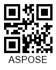|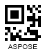|
  

BarcodeGenerator gen = new BarcodeGenerator(EncodeTypes.QR, "ASPOSE");
gen.Parameters.Barcode.XDimension.Pixels = 4;
//set Auto version
gen.Parameters.Barcode.QR.QrVersion = QRVersion.Auto;
//Set Auto QR encode type
gen.Parameters.Barcode.QR.QrEncodeType = QREncodeType.Auto;
gen.Save($"{path}QREncodeTypeAuto.png", BarCodeImageFormat.Png);
//Set the ForceMicroQR QR encode type
gen.Parameters.Barcode.QR.QrEncodeType = QREncodeType.ForceMicroQR;
gen.Save($"{path}QREncodeTypeForceMicroQR.png", BarCodeImageFormat.Png);
//Set the ForceQR QR encode type
gen.Parameters.Barcode.QR.QrEncodeType = QREncodeType.ForceQR;
gen.Save($"{path}QREncodeTypeForceQR.png", BarCodeImageFormat.Png);

   
### **Manual Version Selection**
***Aspose.BarCode for .NET*** enables manual settings for the required version of *QR Code* barcodes to be generated. To do this, it is necessary to initialize the [*QRVersion*](https://reference.aspose.com/barcode/net/aspose.barcode.generation/qrversion) property of class [*QrParameters*](https://reference.aspose.com/barcode/net/aspose.barcode.generation/qrparameters). This property can take the values from *Version 01* to *Version 40* for *QR Code* and from *M1* to *M4* for *Micro QR Code*. The code snippet and sample barcode labels demonstrated below are given to explain how to generate *QR Code* barcodes by setting the required version manually.
  
|
**QR Version**
|
**Is Set to *QR Version 05***
|
**Is Set to *Micro QR Version M4***
|
| :-: | :-: | :-: |
| |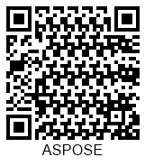|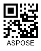|
  

BarcodeGenerator gen = new BarcodeGenerator(EncodeTypes.QR, "ASPOSE");
gen.Parameters.Barcode.XDimension.Pixels = 4;
//set MicroQR 4 version
gen.Parameters.Barcode.QR.QrVersion = QRVersion.VersionM4;
gen.Save($"{path}QRVersionM4.png", BarCodeImageFormat.Png);
//set QR 5 version
gen.Parameters.Barcode.QR.QrVersion = QRVersion.Version05;
gen.Save($"{path}QRVersion05.png", BarCodeImageFormat.Png);


## **Data Encoding Modes**
***Aspose.BarCode for .NET*** supports several most widespread data encoding modes, including the Unicode standard. To set the required encoding mode, it is necessary to initialize the [*QrEncodeMode*](https://reference.aspose.com/barcode/net/aspose.barcode.generation/qrparameters/properties/qrencodemode) property of class [*QrParameters*](https://reference.aspose.com/barcode/net/aspose.barcode.generation/qrparameters). This property can take the following values:
-	*Auto*. This encoding mode implies that the data passed to [*CodeText*](https://reference.aspose.com/barcode/net/aspose.barcode.generation/barcodegenerator/properties/codetext) is encoded according to the value of the [*CodeTextEncoding*](https://reference.aspose.com/barcode/net/aspose.barcode.generation/qrparameters/properties/codetextencoding) property that gets the encoding of the inputted symbols (by default, it is set to *UTF8*).
-	*Bytes*. This mode is used to work with streams of bytes and can encode values from 0 to 255. If a byte stream contains digits greater than 255, the *UTF16LE* encoding is applied. 
-	*Utf8BOM* and *Utf16BEBOM*. These modes are applied to encode the input data using UTF8 and UTF16BE encodings, respectively; a byte order mark (BOM) character is added to indicate the used encoding. Note that it is preferable to use the *ECIEncoding* mode as it allows setting the encodings that are explicitly specified in the *QR Code* standard.  
-	*ECIEncoding*. This data encoding mode implies using the encoding listed in [*QrECIEncoding*](https://reference.aspose.com/barcode/net/aspose.barcode.generation/qrparameters/properties/qreciencoding).
-	*ExtendedCodetext*. In this mode, information passed to the *CodeText* property contains control words besides the main text to be encoded. These control words are intended to set advanced control over data encoding and allow including text with different encodings into a single *QR Code* barcode.
  
### ***Auto* Mode**
The *Auto* data encoding mode utilizes the information from the [*CodeTextEncoding*](https://reference.aspose.com/barcode/net/aspose.barcode.generation/qrparameters/properties/codetextencoding) property to encode the input data. In case the text encoding is not defined explicitly in *CodeTextEncoding*, the binary encoding mode is applied. The code snippet provided below demonstrates how to use the *Auto* encoding mode.
  

BarcodeGenerator gen = new BarcodeGenerator(EncodeTypes.QR, "Aspose常に先を行く");
gen.Parameters.Barcode.XDimension.Pixels = 4;
Console.OutputEncoding = Encoding.Unicode;
//set the encode mode to Auto
gen.Parameters.Barcode.QR.QrEncodeMode = QREncodeMode.Auto;
//set CodeText encoding to UTF8
gen.Parameters.Barcode.QR.CodeTextEncoding = Encoding.UTF8;
gen.Save($"{path}QrEncodeModeAuto.png", BarCodeImageFormat.Png);
//attempt to recognize it
BarCodeReader read = new BarCodeReader(gen.GenerateBarCodeImage(), DecodeType.QR);
read.BarcodeSettings.DetectEncoding = true;
foreach (BarCodeResult result in read.ReadBarCodes())
    Console.WriteLine("QrEncodeModeAuto:" + result.CodeText);

  

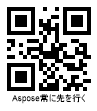

### ***Bytes* Mode**
The *Bytes* data encoding mode implies representing an input byte stream as an array of characters and then as a string. It allows encoding values from 0 to 255. In the case when a byte stream includes digits greater than 255, such a character is encoded as two bytes using the UTF16LE encoding (the lower byte first). The code sample provided below explains how to use the *Bytes* encoding mode. To visualize the text under a *QR Code* barcode, the [*TwoDDisplayText*](https://reference.aspose.com/barcode/net/aspose.barcode.generation/codetextparameters/properties/twoddisplaytext) property needs to be initialized.  
  

byte[] encodedArr = { 0xFF, 0xFE, 0xFD, 0xFC, 0xFB, 0xFA, 0xF9};

//encode array to string
StringBuilder strBld = new StringBuilder(); ;
foreach(byte bval in encodedArr)
    strBld.Append((char)bval);

//encode in QR code
BarcodeGenerator gen = new BarcodeGenerator(EncodeTypes.QR, strBld.ToString());
gen.Parameters.Barcode.XDimension.Pixels = 4;
//set encode mode to Bytes
gen.Parameters.Barcode.QR.QrEncodeMode = QREncodeMode.Bytes;
gen.Parameters.Barcode.CodeTextParameters.TwoDDisplayText = "Bytes mode";
gen.Save($"{path}QrEncodeModeBytes.png", BarCodeImageFormat.Png);

//attempt to recognize
BarCodeReader read = new BarCodeReader(gen.GenerateBarCodeImage(), DecodeType.QR);
foreach (BarCodeResult result in read.ReadBarCodes())
    Console.WriteLine("QrEncodeModeBytes:" + BitConverter.ToString(result.CodeBytes));

  

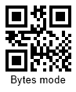

  
### ***Utf8BOM* and *Utf16BEBOM* Modes**
The *Utf8BOM* and *Utf16BEBOM* data encoding modes are used to encode the input data using *UTF8* and *UTF16BE* standards, respectively, using a byte order mark (BOM) character that is placed before the first data symbol. The following code snippet shows how to work with the *Utf16BEBOM* encoding mode.
  

BarcodeGenerator gen = new BarcodeGenerator(EncodeTypes.QR, "Aspose常に先を行く");
gen.Parameters.Barcode.XDimension.Pixels = 4;
Console.OutputEncoding = Encoding.Unicode;
//set encode mode to UTF16BE with BOM
gen.Parameters.Barcode.QR.QrEncodeMode = QREncodeMode.Utf16BEBOM;
gen.Save($"{path}QrEncodeModeUtfBOM.png", BarCodeImageFormat.Png);
//attempt to recognize it
BarCodeReader read = new BarCodeReader(gen.GenerateBarCodeImage(), DecodeType.QR);
read.BarcodeSettings.DetectEncoding = true;
foreach (BarCodeResult result in read.ReadBarCodes())
    Console.WriteLine("QrEncodeModeUtfBOM:" + result.CodeText);

  

  
### ***ECIEncoding* Mode**
In the *ECIEncoding* data encoding mode, the input data is processed using one of the encodings specified in [*QrECIEncoding*](https://reference.aspose.com/barcode/net/aspose.barcode.generation/qrparameters/properties/qreciencoding). The present library implementation includes all well-known charset encodings. In addition, the extended channel interpretation identifier that corresponds to the current encoding is set. In this way, information about the way of decoding the barcode data is passed to decoders. The *QrECIEncoding.UTF8* mode is the most preferable. The code sample given below explains how to set the *ECIEncoding* encoding mode.
  

BarcodeGenerator gen = new BarcodeGenerator(EncodeTypes.QR, "Aspose常に先を行く");
gen.Parameters.Barcode.XDimension.Pixels = 4;
Console.OutputEncoding = Encoding.Unicode;
//set encode mode to ECIEncoding and ECI to UTF8
gen.Parameters.Barcode.QR.QrEncodeMode = QREncodeMode.ECIEncoding;
gen.Parameters.Barcode.QR.QrECIEncoding = ECIEncodings.UTF8;
gen.Save($"{path}QrEncodeModeECIEncoding.png", BarCodeImageFormat.Png);
//attempt to recognize it
BarCodeReader read = new BarCodeReader(gen.GenerateBarCodeImage(), DecodeType.QR);
foreach (BarCodeResult result in read.ReadBarCodes())
    Console.WriteLine("QrEncodeModeECIEncoding:" + result.CodeText);

  

  
### ***ExtendedCodetext* Mode**
***Aspose.BarCode for .NET*** provides an advanced data encoding mode called *ExtendedCodetext* that enables flexible manual settings for *QR Code* barcode generation. Particularly, this mode includes specific encoding capabilities, such as using the multi-ECI mode and setting FNC symbols (characters used to detect and distinguish fields in variable-length application identifiers). Developers can facilitate the generation of barcodes with extended barcode text using class [*QrExtCodetextBuilder*](https://reference.aspose.com/barcode/net/aspose.barcode.generation/qrextcodetextbuilder). To replace the text displayed under the generated barcode, it is necessary to initialize the [*TwoDDisplayText*](https://reference.aspose.com/barcode/net/aspose.barcode.generation/codetextparameters/properties/twoddisplaytext) property. In the case of setting the multi-ECI mode, data processing is performed for each predefined encoding automatically. Otherwise, the information inputted into [*CodeText*](https://reference.aspose.com/barcode/net/aspose.barcode.generation/barcodegenerator/properties/codetext) is encoded according to the value of [*CodeTextEncoding*](https://reference.aspose.com/barcode/net/aspose.barcode.generation/qrparameters/properties/codetextencoding).    

The following code snippet illustrates how to use the multi-encoding ECI regime when the *ExtendedCodetext* mode is applied. 
  

//generate extended codetext
QrExtCodetextBuilder lTextBuilder = new QrExtCodetextBuilder();
lTextBuilder.AddECICodetext(ECIEncodings.Win1251, "Aspose");
lTextBuilder.AddECICodetext(ECIEncodings.UTF8, "常に先");
lTextBuilder.AddECICodetext(ECIEncodings.UTF16BE, "を行く");
lTextBuilder.AddPlainCodetext(@"!!!");
//generate barcode
BarcodeGenerator gen = new BarcodeGenerator(EncodeTypes.QR, lTextBuilder.GetExtendedCodetext());
gen.Parameters.Barcode.XDimension.Pixels = 4;
Console.OutputEncoding = Encoding.Unicode;
//set the encoding mode to ExtendedCodetext
gen.Parameters.Barcode.QR.QrEncodeMode = QREncodeMode.ExtendedCodetext;
gen.Parameters.Barcode.CodeTextParameters.TwoDDisplayText = "ExtendedCodetext mode";
gen.Save($"{path}QrEncodeModeExtendedCodetext.png", BarCodeImageFormat.Png);
//attempt to recognize it
BarCodeReader read = new BarCodeReader(gen.GenerateBarCodeImage(), DecodeType.QR);
foreach (BarCodeResult result in read.ReadBarCodes())
    Console.WriteLine("QrEncodeModeExtendedCodetext:" + result.CodeText);

  

  
## **Error Correction Level Settings**
The *QR Code* family supports four levels of Reed-Solomon error correction. This mechanism requires adding redundant information to a barcode so as to enable detecting and correcting errors automatically in the case of barcode label damages. In general, to restore 1% of errors, 2% redundancy is needed.  
  
*QR Code* standards provide the following error correction levels.
  
|
**Error Correction**
|
**Recovery Capacity**
|
| :-: | :-: |
|Level L| 7% |
|Level M| 15% |
|Level Q| 25% |
|Level H| 30% |
  
*QR Code* symbologies except *Micro QR* can set any of the supported error correction levels. In turn, *Micro QR* enables different error correction levels for different barcodes types: *M1* supports level L; *M2* - levels L and M; *M3* and *M4* - levels L, M, and Q. 
  
|
**Error Correction Level**
|
**Is Set to L**
|
**Is Set to M**
|
**Is Set to Q**
|
**Is Set to H**
|
| :-: | :-: | :-: | :-: | :-: |
| |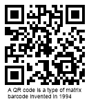|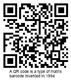|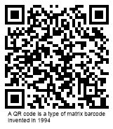|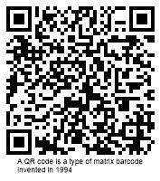|
  
The following code sample illustrates how to set error correction level for *QR Code* generation.
  

BarcodeGenerator gen = new BarcodeGenerator(EncodeTypes.QR, "A QR code is a type of matrix barcode invented in 1994");
gen.Parameters.Barcode.XDimension.Pixels = 4;
//set error correction level to L
gen.Parameters.Barcode.QR.QrErrorLevel = QRErrorLevel.LevelL;
gen.Save($"{path}QrErrorLevelL.png", BarCodeImageFormat.Png);
//set error correction level to M
gen.Parameters.Barcode.QR.QrErrorLevel = QRErrorLevel.LevelM;
gen.Save($"{path}QrErrorLevelM.png", BarCodeImageFormat.Png);
//set error correction level to Q
gen.Parameters.Barcode.QR.QrErrorLevel = QRErrorLevel.LevelQ;
gen.Save($"{path}QrErrorLevelQ.png", BarCodeImageFormat.Png);
//set error correction level to H
gen.Parameters.Barcode.QR.QrErrorLevel = QRErrorLevel.LevelH;
gen.Save($"{path}QrErrorLevelH.png", BarCodeImageFormat.Png);


## **Structured Append Mechanism**
*QR Code* symbologies (except *Micro QR*) support the possibility to generate composite barcodes using the so-called **Structured Append** mechanism. In this mode, the input data can be divided among different *QR Code* barcodes and then composed into a single image. ***Aspose.BarCode for .NET*** does not enable distributing information inputted into [*CodeText*](https://reference.aspose.com/barcode/net/aspose.barcode.generation/barcodegenerator/properties/codetext) across several *QR Code* barcodes; however, it allows creating a composite *QR Code* label manually. This can be done by initializing the [*StructuredAppend*](https://reference.aspose.com/barcode/net/aspose.barcode.generation/qrparameters/properties/structuredappend) property using the following fields: 
- *TotalCount* - the number of barcodes in a composite *QR Code* image (can take values from 2 to 16)
- *SequenceIndicator* - the sequence number of the current barcode (starting from 0)
- *ParityByte* - a byte that serves as a checksum identifier. In the general case, it is calculated as *XOR* of all bytes in which UTF16BE symbols are encoded using two bytes  
  
Sample barcode images provided below have been created using the structured append mechanism implemented in the following code snippet.
  
|
**Structured Append QR Code**
|
**First Type**
|
**Second Type**
|
| :-: | :-: | :-: |
| |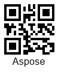||
  

BarcodeGenerator gen = null;
BarCodeReader read = null;
Console.OutputEncoding = Encoding.Unicode;
//messages
string firstMessage = "Aspose";
string secondMessage = "常に先を行く";
//calculate parity byte
byte parity = 0;
foreach (char val in firstMessage.ToCharArray())
    parity ^= (val <= 255) ? (byte)val : (byte)((byte)val ^ (byte)((int)val >> 8));
foreach (char val in secondMessage.ToCharArray())
    parity ^= (val <= 255) ? (byte)val : (byte)((byte)val ^ (byte)((int)val >> 8));

//generate the first barcode
gen = new BarcodeGenerator(EncodeTypes.QR, firstMessage);
gen.Parameters.Barcode.XDimension.Pixels = 4;
gen.Parameters.Barcode.QR.QrEncodeMode = QREncodeMode.ECIEncoding;
gen.Parameters.Barcode.QR.QrECIEncoding = ECIEncodings.UTF8;
gen.Parameters.Barcode.QR.StructuredAppend.ParityByte = parity;
gen.Parameters.Barcode.QR.StructuredAppend.TotalCount = 2;
gen.Parameters.Barcode.QR.StructuredAppend.SequenceIndicator = 0;
gen.Save($"{path}QrStructuredAppendFirst.png", BarCodeImageFormat.Png);
//attempt to recognize it
read = new BarCodeReader(gen.GenerateBarCodeImage(), DecodeType.QR);
foreach (BarCodeResult result in read.ReadBarCodes())
    Console.WriteLine($"QrStructuredAppend: Count:{result.Extended.QR.QRStructuredAppendModeBarCodesQuantity} " +
        $"Index: {result.Extended.QR.QRStructuredAppendModeBarCodeIndex} Parity:{result.Extended.QR.QRStructuredAppendModeParityData.ToString()} "+ 
        $"Codetext: {result.CodeText}");

//generate the second barcode
gen = new BarcodeGenerator(EncodeTypes.QR, secondMessage);
gen.Parameters.Barcode.XDimension.Pixels = 4;
gen.Parameters.Barcode.QR.QrEncodeMode = QREncodeMode.ECIEncoding;
gen.Parameters.Barcode.QR.QrECIEncoding = ECIEncodings.UTF8;
gen.Parameters.Barcode.QR.StructuredAppend.ParityByte = parity;
gen.Parameters.Barcode.QR.StructuredAppend.TotalCount = 2;
gen.Parameters.Barcode.QR.StructuredAppend.SequenceIndicator = 1;
gen.Save($"{path}QrStructuredAppendSecond.png", BarCodeImageFormat.Png);
//attempt to recognize it
read = new BarCodeReader(gen.GenerateBarCodeImage(), DecodeType.QR);
foreach (BarCodeResult result in read.ReadBarCodes())
    Console.WriteLine($"QrStructuredAppend: Count:{result.Extended.QR.QRStructuredAppendModeBarCodesQuantity} " +
        $"Index: {result.Extended.QR.QRStructuredAppendModeBarCodeIndex} Parity:{result.Extended.QR.QRStructuredAppendModeParityData.ToString()} " +
        $"Codetext: {result.CodeText}");


## **Aspect Ratio Settings**
*Aspect Ratio* is the ratio between the height and the width of a barcode. To adjust barcode proportions using the X and Y coordinates in ***Aspose.BarCode for .NET***, it is required to set the [*AspectRatio*](https://reference.aspose.com/barcode/net/aspose.barcode.generation/qrparameters/properties/aspectratio) property of class [*QrParameters*](https://reference.aspose.com/barcode/net/aspose.barcode.generation/qrparameters). This property is defined as a relative coefficient to the value of the [*XDimension*](https://reference.aspose.com/barcode/net/aspose.barcode.generation/barcodeparameters/properties/xdimension) parameter. Generally, the value of *AspectRatio* should be set to 1. When it is necessary to adjust the proportions of generated *QR Code* barcodes, the [*AspectRatio*](https://reference.aspose.com/barcode/net/aspose.barcode.generation/qrparameters/properties/aspectratio) property can be used. Sample barcode labels shown below have been generated using different aspect ratio settings.  
  
|
**Aspect Ratio**
|
**Is Set to 1**
|
**Is Set to 2**
|
| :-: | :-: | :-: |
| |||
  
The following code snippet explains how to set the required value of *AspectRatio* for *QR Code* barcodes.
  

BarcodeGenerator gen = new BarcodeGenerator(EncodeTypes.QR, "ASPOSE");
gen.Parameters.Barcode.XDimension.Pixels = 4;
//set Aspect Ratio to 1
gen.Parameters.Barcode.QR.AspectRatio = 1;
gen.Save($"{path}QrAspectRatio1.png", BarCodeImageFormat.Png);
//set Aspect Ratio to 2
gen.Parameters.Barcode.QR.AspectRatio = 2;
gen.Save($"{path}QrAspectRatio2.png", BarCodeImageFormat.Png);
