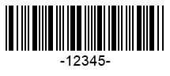

{}[Generate Codabar Barcodes online](https://products.aspose.app/barcode/generate/codabar). You can test the quality of ***Aspose.BarCode*** generation for *Codabar* barcodes and get the results online.{}

## Overview
***Aspose.BarCode for .NET*** enables generating barcode labels according to the *Codabar* standard that supports encoding numerical digits and six punctuation signs. The number of digits to be encoded in a barcode is unlimited. A *Codabar* barcode may contain four optional alphabet characters (usually, A, B, C, or D) that are used as start and stop digits. In this way, the symbology provides four types of start characters and four types of stop ones. Accordingly, for the same information to be encoded, it allows generating 16 barcodes with different service sets of start and stop characters.  
  
Input text in *Codabar* barcodes has the following format:  

<mark>[Start Character "A/B/C/D"] [Data Digits from the charset: "0-9" and "–$./:+"] [Stop Character "A/B/C/D"]</mark>

  
{}*If you need any clarifications, feel free to reach out [Aspose Technical Support](/barcode/net/technical-support/): ask your questions at [Aspose.Barcode Forum](https://forum.aspose.com/c/barcode/13) or contact Aspose [Paid Support Helpdesk](https://helpdesk.aspose.com/).*{}
  
## Start and Stop Symbols
The library allows encoding start and stop characters independently with any of four supported formats: A, B, C, or D. To set the required format, it is necessary to initiate [CodabarStartSymbol](https://apireference.aspose.com/barcode/net/aspose.barcode.generation/codabarparameters/properties/codabarstartsymbol) and [CodabarStopSymbol](https://apireference.aspose.com/barcode/net/aspose.barcode.generation/codabarparameters/properties/codabarstopsymbol) properties included in the [*Codabar*](https://apireference.aspose.com/barcode/net/aspose.barcode.generation/barcodeparameters/properties/codabar) group of parameters of class [*BarcodeParameters*](https://apireference.aspose.com/barcode/net/aspose.barcode.generation/barcodeparameters).  
By default, start and stop characters are set to "A".  
  
Sample barcode labels demonstrated below have been generated with different settings for start and stop characters.
  
|Start and Stop Characters|A+A|B+B|C+C|D+D|
| :-: | :-: | :-: | :-: | :-: |
| |||||
  
The following code snippet illustrates how to set different combinations of start and stop characters in *Codabar* barcodes. 
    

BarcodeGenerator gen = new BarcodeGenerator(EncodeTypes.Codabar, "-12345-");
gen.Parameters.Barcode.XDimension.Pixels = 2;
//set start A and stop A
gen.Parameters.Barcode.Codabar.CodabarStartSymbol = CodabarSymbol.A;
gen.Parameters.Barcode.Codabar.CodabarStopSymbol = CodabarSymbol.A;
gen.Save($"{path}CodabarStartAStopA.png", BarCodeImageFormat.Png);
//set start B and stop B
gen.Parameters.Barcode.Codabar.CodabarStartSymbol = CodabarSymbol.B;
gen.Parameters.Barcode.Codabar.CodabarStopSymbol = CodabarSymbol.B;
gen.Save($"{path}CodabarStartBStopB.png", BarCodeImageFormat.Png);
//set start C and stop C
gen.Parameters.Barcode.Codabar.CodabarStartSymbol = CodabarSymbol.C;
gen.Parameters.Barcode.Codabar.CodabarStopSymbol = CodabarSymbol.C;
gen.Save($"{path}CodabarStartCStopC.png", BarCodeImageFormat.Png);
//set start D and stop D
gen.Parameters.Barcode.Codabar.CodabarStartSymbol = CodabarSymbol.D;
gen.Parameters.Barcode.Codabar.CodabarStopSymbol = CodabarSymbol.D;
gen.Save($"{path}CodabarStartDStopD.png", BarCodeImageFormat.Png);

  
## Checksum Setting
By default, the *Codabar* symbology does not require using an obligatory checksum; however, it supports two checksum calculation algorithms: Mod10 and Mod16 (the most widely used one). The pseudocode provided below illustrates how these two checksum standards can be implemented.  


//Mod10
foreach (var value in encodedCodetext)
    checkSum = (checkSum + value) % 10;
//Mod16
foreach (var value in encodedCodetext)
    checkSum = (checkSum + value) % 16;
 
  
To enable a checksum for this barcode type, it is necessary to initialize the property [*IsChecksumEnabled*](https://apireference.aspose.com/barcode/net/aspose.barcode.generation/barcodeparameters/properties/ischecksumenabled) by setting the mode *EnableChecksum.Yes* and define the required checksum algorithm in the [*CodabarChecksumMode*](https://apireference.aspose.com/barcode/net/aspose.barcode.generation/codabarparameters/properties/codabarchecksummode) property. By default, the *Mod16* checksum is applied.  
  
*Codabar* barcode images provided below have been created with different checksum calculation settings.

|Checksum Calculation|Is Set to *None*|Is Set to *Mod10*|Is Set to *Mod16*|
| :-: | :-: | :-: | :-: |
| ||||
  
The following code sample explains how to enable different checksum standards (Mod10 and Mod16) for *Codabar* barcodes. 


BarcodeGenerator gen = new BarcodeGenerator(EncodeTypes.Codabar, "-12345-");
gen.Parameters.Barcode.XDimension.Pixels = 2;
//set None checksum
gen.Parameters.Barcode.IsChecksumEnabled = EnableChecksum.Default;
gen.Save($"{path}CodabarChecksumNone.png", BarCodeImageFormat.Png);
//set Mod10 checksum
gen.Parameters.Barcode.IsChecksumEnabled = EnableChecksum.Yes;
gen.Parameters.Barcode.Codabar.CodabarChecksumMode = CodabarChecksumMode.Mod10;
gen.Save($"{path}CodabarChecksumMod10.png", BarCodeImageFormat.Png);
//set Mod16 checksum
gen.Parameters.Barcode.IsChecksumEnabled = EnableChecksum.Yes;
gen.Parameters.Barcode.Codabar.CodabarChecksumMode = CodabarChecksumMode.Mod16;
gen.Save($"{path}CodabarChecksumMod16.png", BarCodeImageFormat.Png);
