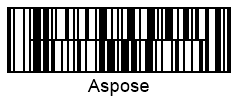

{}[Generate Codablock-F Barcodes online](https://products.aspose.app/barcode/generate/codablock?type=codablockf). You can check the quality of ***Aspose.BarCode*** generation for *Codablock-F* barcodes and view the results online.{}

## Overview
*Codablock-F* is a multiple-row stacked symbology that allows generating barcodes composed of several *Code128* barcode labels. Using this symbology, it is possible to encode up to 2,725 characters setting the required number rows (from 2 to 44) so that each of them can contain from 4 to 62 digits. *Codablock-F* has two main advantages over basic *Code128*. First, it allows utilizing horizontal and vertical space more efficiently owing to flexible settings of barcode layout (the number of rows and columns). Second, it provides two check digits (based on the modulo 86 algorithm) for an entire message encoded in a *Codablock-F* barcode in addition to obligatory checksums that are calculated for each row composed of *Code128* barcodes. Moreover, *Codablock-F* can be read by laser scanners.
  
{}*If you need any clarifications, feel free to reach out [Aspose Technical Support](/barcode/net/technical-support/): ask your questions at [Aspose.Barcode Forum](https://forum.aspose.com/c/barcode/13) or contact Aspose [Paid Support Helpdesk](https://helpdesk.aspose.com/).*{}
  
## Barcode Height Settings

In ***Aspose.BarCode for .NET***, developers can set the height of each row in a stacked barcode by initializing the [*AspectRatio*](https://apireference.aspose.com/barcode/net/aspose.barcode.generation/codablockparameters/properties/aspectratio) property of class [*CodablockParameters*](https://apireference.aspose.com/barcode/net/aspose.barcode.generation/codablockparameters). This parameter is defined as a relative coefficient to the value of the [*XDimension*](https://apireference.aspose.com/barcode/net/aspose.barcode.generation/barcodeparameters/properties/xdimension) property. It is recommended to set the value of *AspectRatio* greater than 10.  
  
Barcode labels demonstrated below have been generated with different aspect ratio settings. 
  
|
**Aspect Ratio**
|
**Is Set to 15**
|
**Is Set to 30**
|
| :-: | :-: | :-: |
| |||
  
The following code snippet explains how to adjust the height of *Codablock-F* barcodes by setting the aspect ratio.
  

BarcodeGenerator gen = new BarcodeGenerator(EncodeTypes.CodablockF, "Aspose");
gen.Parameters.Barcode.XDimension.Pixels = 2;
//set CodablockF aspect ratio 15
gen.Parameters.Barcode.Codablock.AspectRatio = 15;
gen.Save($"{path}CodablockFAspectRatio15.png", BarCodeImageFormat.Png);
//set CodablockF aspect ratio 30
gen.Parameters.Barcode.Codablock.AspectRatio = 30;
gen.Save($"{path}CodablockFAspectRatio30.png", BarCodeImageFormat.Png);

  

## Layout Settings
To set the layout of *Codablock-F* barcodes by defining the number of rows and columns, it is necessary to initialize the [*Columns*](https://apireference.aspose.com/barcode/net/aspose.barcode.generation/codablockparameters/properties/columns) and [*Rows*](https://apireference.aspose.com/barcode/net/aspose.barcode.generation/codablockparameters/properties/rows) properties of class [*CodablockParameters*](https://apireference.aspose.com/barcode/net/aspose.barcode.generation/codablockparameters) where the former is the most significant parameter. The maximal values of these properties are limited to 62 and 44 for *Columns* and *Rows*, respectively.  
  
Barcode images provided below have been generated with different layout settings.
  
|
**Layout Settings**
|
**4 Columns**
|
**4 Rows**
|
**6 Rows and 4 Columns**
|
| :-: | :-: | :-: | :-: | :-: |
| ||||
  
The following code sample illustrates how to customize layout settings for *Codablock-F* barcodes.
  

BarcodeGenerator gen = new BarcodeGenerator(EncodeTypes.CodablockF, "Aspose.Barcode");
gen.Parameters.Barcode.XDimension.Pixels = 2;
//set CodablockF columns 4
gen.Parameters.Barcode.Codablock.Columns = 4;
gen.Parameters.Barcode.Codablock.Rows = 0;
gen.Save($"{path}CodablockFCol4.png", BarCodeImageFormat.Png);
//set CodablockF rows 4
gen.Parameters.Barcode.Codablock.Columns = 0;
gen.Parameters.Barcode.Codablock.Rows = 4;
gen.Save($"{path}CodablockFRow4.png", BarCodeImageFormat.Png);
//set CodablockF columns 4 rows 6
gen.Parameters.Barcode.Codablock.Columns = 4;
gen.Parameters.Barcode.Codablock.Rows = 6;
gen.Save($"{path}CodablockFRow6Col4.png", BarCodeImageFormat.Png);
