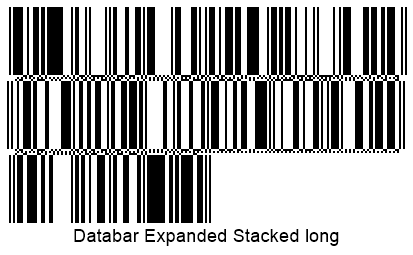
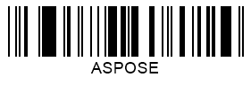
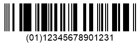

## Overview
The *DataBar* symbology was introduced at the beginning of the 2000s as a part of the GS1 group of standards. The purpose was to mitigate the problems associated with the use of barcode types developed in the 70s. At the same time, it was necessary to keep the most important feature of 1D barcodes, namely, the possibility of being scanned by laser readers. The *DataBar* standard includes the following barcode types: 
- *DataBar OmniDirectional* / *DataBar Stacked OmniDirectional*
- *DataBar Truncated* / *DataBar Stacked*
- *DataBar Limited*
- *DataBar Expanded* / *DataBar Expanded Stacked*
  
All *DataBar* standards except *DataBar Limited* can be represented both in two-row or multiple-row (up to 10 rows) forms. This allows adjusting the barcode layout and fitting it in the available area in the case of limited horizontal space. These symbologies have been developed specifically to encode GS1 identification codes for trade items (so-called Application Identifiers, see more in [GS1 Barcodes](/barcode/net/generating-barcodes-using-new-barcode-generation-api/)). Accordingly, all *DataBar* symbologies except *DataBar Expanded* and *DataBar Expanded Stacked* can be used to encode only trade identifiers defined as Global Trade Item Number (GTIN) exclusively in *GTIN12* or *GTIN13* digital formats using the 14-digit data structure. In turn, *DataBar Expanded* enables encoding any set of application identifiers; moreover, it allows including additional information in any form as it supports English alphabet characters (uppercase and lowercase), numerical digits, and 21 punctuation symbols.  

## Barcode Height Settings
*DataBar* symbologies can be divided into two main groups: continuous and stacked. In ***Aspose.BarCode for .NET***, for each of them there is its own way to adjust barcode height. Details on how to modify barcode height along with code samples and examples of generated barcodes are provided further in the article. 

### Continuous Barcodes
For continuous symbologies, such as *DataBar OmniDirectional*, *DataBar Truncated*, *DataBar Limited*, and *DataBar Expanded*, barcode heigh can be set using the [*BarHeight*](https://apireference.aspose.com/barcode/net/aspose.barcode.generation/barcodeparameters/properties/barheight) property of class [*BarcodeParameters*](https://apireference.aspose.com/barcode/net/aspose.barcode.generation/barcodeparameters).  
  
Sample *DataBar Omnidirectional* barcode labels provided below have been generated using different bar height settings.
   
| Bar Height | Is Set to 30 Pixels | Is Set to 60 Pixels |
|:--:|:--:|:--:|
| |||
  
The following code snippet illustrates how to adjust barcode height for continuos barcodes using the *DataBar Omnidirectional* symbology as an example.
  

BarcodeGenerator gen = new BarcodeGenerator(EncodeTypes.DatabarOmniDirectional, "(01)12345678901231");
gen.Parameters.Barcode.XDimension.Pixels = 2;
//set barheight 30 pixels
gen.Parameters.Barcode.BarHeight.Pixels = 30;
gen.Save($"{path}DatabarBarHeight30Pixels.png", BarCodeImageFormat.Png);
//set barheight 60 pixels
gen.Parameters.Barcode.BarHeight.Pixels = 60;
gen.Save($"{path}DatabarBarHeight60Pixels.png", BarCodeImageFormat.Png);

  
### Stacked Barcodes
In stacked symbologies, such as *DataBar Stacked OmniDirectional*, *DataBar Stacked*, and *DataBar Expanded Stacked*, barcode heigh can be customized by initializing the [*AspectRatio*](https://apireference.aspose.com/barcode/net/aspose.barcode.generation/databarparameters/properties/aspectratio) property of class [*DataBarParameters*](https://apireference.aspose.com/barcode/net/aspose.barcode.generation/databarparameters). This parameter is defined as a relative coefficient to the [*XDimension*](https://apireference.aspose.com/barcode/net/aspose.barcode.generation/barcodeparameters/properties/xdimension) property.  
  
*DataBar Stacked Omnidirectional* barcode images represented below as examples have been created with different aspect ratio settings.
  
| Aspect Ratio | Is Set to 15 | Is Set to 30 |
|:--:|:--:|:--:|
| |||
  
The following code sample explains how to customize barcode height by setting the aspect ratio for stacked symbologies considering *DataBar Stacked Omnidirectional* barcodes as an example.
  

BarcodeGenerator gen = new BarcodeGenerator(EncodeTypes.DatabarStackedOmniDirectional, "(01)12345678901231");
gen.Parameters.Barcode.XDimension.Pixels = 2;
//set DataBar AspectRatio 15
gen.Parameters.Barcode.DataBar.AspectRatio = 15;
gen.Save($"{path}DatabarAspectRatio15.png", BarCodeImageFormat.Png);
//set DataBar AspectRatio 30
gen.Parameters.Barcode.DataBar.AspectRatio = 30;
gen.Save($"{path}DatabarAspectRatio30.png", BarCodeImageFormat.Png);

  
## Layout Settings for DataBar Expanded Stacked Barcodes
The *DataBar Expanded Stacked* symbology provides flexible settings for barcode layout by varying the number of rows and columns in a barcode. The ***Aspose.BarCode*** library enables combining 22 data segments to form up to 10 strings. Developers can set the values independently for [*Rows*]( https://apireference.aspose.com/barcode/net/aspose.barcode.generation/databarparameters/properties/rows) and [*Columns*]( https://apireference.aspose.com/barcode/net/aspose.barcode.generation/databarparameters/properties/columns) properties of class [*DataBarParameters*](https://apireference.aspose.com/barcode/net/aspose.barcode.generation/databarparameters). The value set in the *Columns* property is the most significant parameter; at first, it is required to specify how many segments need to be placed in a row.  
  
Sample *DataBar Expanded Stacked* barcode labels given below have been generated with different barcode layout settings.
  
| Layout Settings | 4 Columns | 3 Rows | 6 Columns and 10 Rows |
|:--:|:--:|:--:|:--:|
| ||||
  
The following code snippet shows how to specify various layout settings for *DataBar Expanded Stacked* barcodes.
   

//set 4 columns
BarcodeGenerator gen = new BarcodeGenerator(EncodeTypes.DatabarExpandedStacked, "Databar Expanded Stacked long");
gen.Parameters.Barcode.DataBar.Columns = 4;
gen.Save($"{path}DatabarCols4.png", BarCodeImageFormat.Png);
//set 3 rows
gen = new BarcodeGenerator(EncodeTypes.DatabarExpandedStacked, "Databar Expanded Stacked long");
gen.Parameters.Barcode.DataBar.Rows = 3;
gen.Save($"{path}DatabarRows3.png", BarCodeImageFormat.Png);
//set 6 columns 10 rows
gen = new BarcodeGenerator(EncodeTypes.DatabarExpandedStacked, "Databar Expanded Stacked long");
gen.Parameters.Barcode.DataBar.Columns = 6;
gen.Parameters.Barcode.DataBar.Rows = 10;
gen.Save($"{path}DatabarCols6Rows10.png", BarCodeImageFormat.Png);

  
## Compatibility with GS1 components
Given that *DataBar Expanded* and *DataBar Expanded Stacked* symbologies, in theory, allow encoding any text, it may be required to ensure that encoded information is fully compatible with GS1 standards. To enable such controls, class [*DataBarParameters*](https://apireference.aspose.com/barcode/net/aspose.barcode.generation/databarparameters) provides the [*IsAllowOnlyGS1Encoding*](https://apireference.aspose.com/barcode/net/aspose.barcode.generation/databarparameters/properties/isallowonlygs1encoding) property that is aimed to verify the compatibility of the input barcode text with GS Application Identifiers and throws an exception in case of any mismatch. In addition, this property can be used to check the validity of input GTIN values for other *DataBar* standards.     
  
*DataBar Expanded* barcode image examples provided below have been created using the GS1 compatible and alternate encodings.
  
| GS1 Compatibility | GS1 Compatible Encoding | Alternate Encoding |
|:--:|:--:|:--:|
| |||
  
The following code snippet explains how to enable the verification of compatibility with GS1 standards for *DataBar Expanded* barcodes. In case when the *IsAllowOnlyGS1Encoding* is set, and the used encoding does not match GS1 standards, the following exception is thrown: "*Exception: Wrong GS1 Application Identifiers format*".  
  

BarcodeGenerator gen = new BarcodeGenerator(EncodeTypes.DatabarExpanded, "");
//right codetext with GS1Encoding check
gen.CodeText = "(01)12345678901231";
gen.Parameters.Barcode.DataBar.IsAllowOnlyGS1Encoding = true;
gen.Save($"{path}DatabarGS1RightEncoding.png", BarCodeImageFormat.Png);
//variable codetext without GS1Encoding check
gen.CodeText = "ASPOSE";
gen.Parameters.Barcode.DataBar.IsAllowOnlyGS1Encoding = false;
gen.Save($"{path}DatabarGS1VariableEncoding.png", BarCodeImageFormat.Png);
//variable codetext with GS1Encoding check
try
{
    gen.CodeText = "ASPOSE";
    gen.Parameters.Barcode.DataBar.IsAllowOnlyGS1Encoding = true;
    gen.GenerateBarCodeImage();
}
catch (Exception e)
{
    Console.WriteLine(e.Message);
}

  
## Enabling 2D Component
Each of the *DataBar* symbologies may contain a specific 2D component linkage flag that indicates the presence of an associated 2D barcode that can be placed alongside the generated *DataBar* barcode label. Usually, such a flag is set in GS1 composite barcode specifications. ***Aspose.BarCode for NET*** enables the [*Is2DCompositeComponent*]( https://apireference.aspose.com/barcode/net/aspose.barcode.generation/databarparameters/properties/is2dcompositecomponent) property of class [*DataBarParameters*](https://apireference.aspose.com/barcode/net/aspose.barcode.generation/databarparameters) that can be used to set this flag manually when required by particular industrial standards without affecting main information encoded in a barcode.  
  
*DataBar Expanded* barcode images shown below have been generated with different settings for the 2D component flag.
  
| 2D Component | Is Disabled | Is Enabled |
|:--:|:--:|:--:|
| |||
  
The following code example illustrates how to enable and disable the linkage to a 2D component for composite *DataBar Expanded* barcodes.
    

BarcodeGenerator gen = new BarcodeGenerator(EncodeTypes.DatabarExpanded, "(01)12345678901231");
gen.Parameters.Barcode.XDimension.Pixels = 2;
//disable 2D component flag
gen.Parameters.Barcode.DataBar.Is2DCompositeComponent = false;
gen.Save($"{path}Databar2DComponentDisabled.png", BarCodeImageFormat.Png);
//enable 2D component flag
gen.Parameters.Barcode.DataBar.Is2DCompositeComponent = true;
gen.Save($"{path}Databar2DComponentEnabled.png", BarCodeImageFormat.Png);
