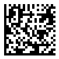
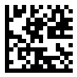

## Overview
The *Data Matrix* symbology is a 2D matrix barcode type that allows generating barcodes of rectangular and square shapes. It is a widely used industrial barcode standard that enables encoding both sets of characters and byte streams. In the maximal configuration, *Data Matrix* barcodes include 144 rows and columns and contain up to 1,555 bytes or 3,116 numerical (2,335 ASCII) symbols. Moreover, *Data Matrix* implies including additional recovery information that is used for data integrity check and error correction so that even severely damaged barcodes can be recognized. This symbology supports two main standards that are described below.  
   
|Data Matrix Standard|
**Description**
|
|---|---|
|*ECC 000-140*|Outdated standard that supports only square-shaped configuration, relies on obsolete encoding methods and enables error correction based on convolutional codes. It is not recommended for use and is currently applied only to work with industrial tasks based on outdated instructions|
|*ECC 200*|Actual standard that supports both square and rectangular barcodes, enables modern encoding methods and provides Reed-Solomon error correction. It is recommended for use in all up-to-date applications|
  
## Data Matrix ECC Standard Settings
To select the required *Data Matrix* standard for barcode generation, ***Aspose.BarCode for .NET*** includes the [*DataMatrixEcc*](https://apireference.aspose.com/barcode/net/aspose.barcode.generation/datamatrixparameters/properties/datamatrixecc) property in class [*DataMatrixParameters*](https://apireference.aspose.com/barcode/net/aspose.barcode.generation/datamatrixparameters). This property can be used to set one of the following standards: *ECC 000-140* (a set of outdated standards) and *ECC 200* (the new universal standard). By default, [*DataMatrixEcc*](https://apireference.aspose.com/barcode/net/aspose.barcode.generation/datamatrixparameters/properties/datamatrixecc) is set to *DataMatrixEccType.Ecc200*.
  
### *ECC 200*
To enable the *ECC 200** standard explicitly, it is required to set the [*DataMatrixEcc*](https://apireference.aspose.com/barcode/net/aspose.barcode.generation/datamatrixparameters/properties/datamatrixecc) property to *EccAuto* or *Ecc200*. This standard supports all data encoding modes defined in [*DataMatrixEncodeMode*](https://apireference.aspose.com/barcode/net/aspose.barcode.generation/datamatrixencodemode) including the possibility to work with Unicode characters using [*CodeTextEncoding*](https://apireference.aspose.com/barcode/net/aspose.barcode.generation/datamatrixparameters/properties/codetextencoding). Recovery capacity values for error correction are strictly specified in the standard for barcodes of different sizes.  
  
The following code snippet illustrates how to set the *ECC 200* encoding standard.
  

BarcodeGenerator gen = new BarcodeGenerator(EncodeTypes.DataMatrix, "Åspóse.Barcóde©");
gen.Parameters.Barcode.XDimension.Pixels = 4;
//set Data Matrix Ecc to 140
gen.Parameters.Barcode.DataMatrix.DataMatrixEcc = DataMatrixEccType.Ecc200;
gen.Save($"{path}DatamatrixEcc200Basic.png", BarCodeImageFormat.Png);

  

  
  
### *ECC 000-140*  
*ECC 000-140* standards are supported only by the following encoding modes specified in [*DataMatrixEncodeMode*](https://apireference.aspose.com/barcode/net/aspose.barcode.generation/datamatrixencodemode): *Auto*, *ASCII*, and *Full*; other encoding modes in this case are automatically processed as *Full*. The [*CodeTextEncoding*](https://apireference.aspose.com/barcode/net/aspose.barcode.generation/datamatrixparameters/properties/codetextencoding) property and thus encoding Unicode characters do not apply to these standards. *ECC 000-140* standards have barcode layout settings that differ from those of *ECC 200*. Among each other, they vary only in terms of damaged data recovery percentage for different error correction levels, as outlined below. 
  
|Error Correction Level|Damage Recovery Capacity|
|---| :-: |
|**Ecc000**|Only error detection|
|**Ecc050**|2.8%|
|**Ecc080**|5.5%|
|**Ecc100**|12.6%|
|**Ecc140**|25%| 
  
The following code sample shows how to enable the *ECC 140* standard.
  

BarcodeGenerator gen = new BarcodeGenerator(EncodeTypes.DataMatrix, "Åspóse.Barcóde©");
gen.Parameters.Barcode.XDimension.Pixels = 4;
//set Data Matrix Ecc to 140
gen.Parameters.Barcode.DataMatrix.DataMatrixEcc = DataMatrixEccType.Ecc140;
gen.Save($"{path}DatamatrixEcc000140Basic.png", BarCodeImageFormat.Png);

  

  
## Encoding Mode Settings
In ***Aspose.BarCode for .NET***, developers can enable different encoding modes by initializing the [*DataMatrixEncodeMode*](https://apireference.aspose.com/barcode/net/aspose.barcode.generation/datamatrixencodemode) property of class [DataMatrixParameters](https://apireference.aspose.com/barcode/net/aspose.barcode.generation/datamatrixparameters). The library supports 9 different encoding modes that are listed below. By default, the *Auto* encoding mode is set.
  
|Encoding Mode|Description|
|---|---|
|*Auto*|Similar to the *ASCII* encoding mode|
|*ASCII*|Allows encoding both ASCII symbols and byte streams, but the characters from 128 to 255 are encoded using 2 bytes. To encode an arbitrary byte stream, it is recommended to use the *Full* mode|
|*Full*|Encodes any character in 8 bits. This mode is the most suitable for encoding byte streams|
|*Custom*|Always applies the encoding specified in [*CodeTextEncoding*](https://apireference.aspose.com/barcode/net/aspose.barcode.generation/datamatrixparameters/properties/codetextencoding) for any input messages; then, the obtained byte stream is further encoded using the *Full* mode|
|*C40*, *Text*, *EDIFACT*, and *ANSIX12*|Encode only predefined character sets using the specialized industrial encodings, such as C40, Text, EDIFACT, and ANSI X12|
|*ExtendedCodetext*|Provides flexible encoding controls and the possibility to manually specify the required encoding for a part of [*Codetext*](https://apireference.aspose.com/barcode/net/aspose.barcode.generation/barcodegenerator/properties/codetext)|
  
If an input message to be encoded contains a Unicode character (any symbol with a value greater than 255), the entire message is processed using the encoding specified in [CodeTextEncoding](https://apireference.aspose.com/barcode/net/aspose.barcode.generation/datamatrixparameters/properties/codetextencoding). This feature is valid for all encoding modes besides *Custom* in which the specified encoding is always enabled. The *Custom* mode is supported only for the *ECC 200* standard. Code samples illustrating how to work with supported encoding modes are provided further in the article.
  
### *Auto* and *ASCII* Encoding Modes
*Auto* and *ASCII* encoding modes enable both encoding ASCC symbols and byte streams; however, encoding the characters from 128 to 255 requires 2 bytes. If [*Codetext*](https://apireference.aspose.com/barcode/net/aspose.barcode.generation/barcodegenerator/properties/codetext) contains Unicode symbols, the input message is transcoded in the encoding specified in [*CodeTextEncoding*](https://apireference.aspose.com/barcode/net/aspose.barcode.generation/datamatrixparameters/properties/codetextencoding).  
  
The following code snippet explains how to set the *Auto* encoding mode.


BarcodeGenerator gen = new BarcodeGenerator(EncodeTypes.DataMatrix, "Åspóse.Barcóde©");
gen.Parameters.Barcode.XDimension.Pixels = 4;
//set encode mode to Auto
gen.Parameters.Barcode.DataMatrix.DataMatrixEncodeMode = DataMatrixEncodeMode.Auto;
gen.Save($"{path}DatamatrixEncodeModeAuto.png", BarCodeImageFormat.Png);

  

 

### Encoding Byte Streams in *Full* Mode
The *Full* mode is intended to encode byte streams; each byte is encoded using 8 bits. If [*Codetext*](https://apireference.aspose.com/barcode/net/aspose.barcode.generation/barcodegenerator/properties/codetext) includes Unicode symbols, input data are transcoded using the encoding specified in [*CodeTextEncoding*](https://apireference.aspose.com/barcode/net/aspose.barcode.generation/datamatrixparameters/properties/codetextencoding). To display the text under a *Data Matrix* barcode, the [*TwoDDisplayText*](https://apireference.aspose.com/barcode/net/aspose.barcode.generation/codetextparameters/properties/twoddisplaytext) property can be initialized (see more information about this property [here](https://docs.aspose.com/barcode/net/working-with-barcode-text-appearance/#replacing-barcode-text-in-2d-barcodes/)).  
  
The following code sample illustrates how to enable the *Full* encoding mode.
  

byte[] encodedArr = { 0xFF, 0xFE, 0xFD, 0xFC, 0xFB, 0xFA, 0xF9 };

//encode array to string
StringBuilder strBld = new StringBuilder();
foreach (byte bval in encodedArr)
    strBld.Append((char)bval);

//encode in Data Matrix code
BarcodeGenerator gen = new BarcodeGenerator(EncodeTypes.DataMatrix, strBld.ToString());
gen.Parameters.Barcode.XDimension.Pixels = 4;
//set encode mode to Full
gen.Parameters.Barcode.DataMatrix.DataMatrixEncodeMode = DataMatrixEncodeMode.Full;
gen.Parameters.Barcode.CodeTextParameters.TwoDDisplayText = "Bytes mode";
gen.Save($"{path}DatamatrixEncodeModeFullBytes.png", BarCodeImageFormat.Png);

//attempt to recognize
BarCodeReader read = new BarCodeReader(gen.GenerateBarCodeImage(), DecodeType.DataMatrix);
foreach (BarCodeResult result in read.ReadBarCodes())
    Console.WriteLine("DatamatrixEncodeModeFullBytes:" + BitConverter.ToString(result.CodeBytes));


 

### Encoding Unicode Text in *Custom* Mode
The *Custom* encoding mode always at first transcodes the contents of [*Codetext*](https://apireference.aspose.com/barcode/net/aspose.barcode.generation/barcodegenerator/properties/codetext) into a byte stream; then, the generated byte stream is further processed using the *Full* mode so that each byte is encoded in 8 bits.  
  
The following code snippet shows how to work with the *Custom* mode. 

Console.OutputEncoding = Encoding.Unicode;
BarcodeGenerator gen = new BarcodeGenerator(EncodeTypes.DataMatrix, "Aspose常に先を行く");
gen.Parameters.Barcode.XDimension.Pixels = 4;
//set encode mode to Full
gen.Parameters.Barcode.DataMatrix.DataMatrixEncodeMode = DataMatrixEncodeMode.Custom;
gen.Parameters.Barcode.DataMatrix.CodeTextEncoding = Encoding.UTF8;
gen.Save($"{path}DatamatrixEncodeModeCustom.png", BarCodeImageFormat.Png);

//attempt to recognize it
BarCodeReader read = new BarCodeReader(gen.GenerateBarCodeImage(), DecodeType.DataMatrix);
foreach (BarCodeResult result in read.ReadBarCodes())
    Console.WriteLine("DatamatrixEncodeModeCustom:" + result.GetCodeText(Encoding.UTF8));


 

### Extended Encoding Controls in *ExtendedCodetext*
The *ExtendedCodetext* mode enables encoding the data in [*Codetext*](https://apireference.aspose.com/barcode/net/aspose.barcode.generation/barcodegenerator/properties/codetext) by using different encodings for different parts of the input message if required by industrial standards. The following encodings can be combined: *ASCII*, *Auto*, *C40*, *Text*, *EDIFACT*, and *ANSIX12*.  
  
The contents of [*Codetext*](https://apireference.aspose.com/barcode/net/aspose.barcode.generation/barcodegenerator/properties/codetext) need to be presented in the following form: <mark>"\Encoding_mode_name:text\Encoding_mode_name:text"</mark>. All backslashes \ must be doubled in text.  
  
To replace the text under a barcode, the [*TwoDDisplayText*](https://apireference.aspose.com/barcode/net/aspose.barcode.generation/codetextparameters/properties/twoddisplaytext) property can be used (see more information about this property [here](https://docs.aspose.com/barcode/net/working-with-barcode-text-appearance/#replacing-barcode-text-in-2d-barcodes/)).  
  
The following code snippet explains how to work with *ExtendedCodetext* mode.  
  

BarcodeGenerator gen = new BarcodeGenerator(EncodeTypes.DataMatrix, "");
gen.Parameters.Barcode.XDimension.Pixels = 4;
//set encode mode to ExtendedCodetext
gen.Parameters.Barcode.DataMatrix.DataMatrixEncodeMode = DataMatrixEncodeMode.ExtendedCodetext;
//set codetext with multiple encodings (ansix12 encoding)(Text)(ascii encoding)(Text)(edifact encoding)(Text)
gen.CodeText = @"\ansix12:ANSIX12TEXT\ascii:backslash must be \\ doubled\edifact:EDIFACT-ENCODED-TEXT";
gen.Parameters.Barcode.CodeTextParameters.TwoDDisplayText = "Extended Codetext";
gen.Save($"{path}DatamatrixExtendedCodetext.png", BarCodeImageFormat.Png);

//attempt to recognize
BarCodeReader read = new BarCodeReader(gen.GenerateBarCodeImage(), DecodeType.DataMatrix);
foreach (BarCodeResult result in read.ReadBarCodes())
    Console.WriteLine("DatamatrixExtendedCodetext:" + result.CodeText);

  

 
  
### Industrial Encoding Modes: *C40*, *Text*, *EDIFACT*, and *ANSIX12*
*C40*, *Text*, *EDIFACT*, and *ANSIX12* encoding modes can be used to encode information using specialized industrial encodings. These modes are intended for specific industrial tasks only.  
  
The following code sample explains how to set the *C40* encoding mode.
  

BarcodeGenerator gen = new BarcodeGenerator(EncodeTypes.DataMatrix, "ASPOSE.BARCODE");
gen.Parameters.Barcode.XDimension.Pixels = 6;
//set encode mode to C40
gen.Parameters.Barcode.DataMatrix.DataMatrixEncodeMode = DataMatrixEncodeMode.C40;
gen.Save($"{path}DatamatrixEncodeModeC40.png", BarCodeImageFormat.Png);

  

 
  
## Layout Settings
To set the required layout for *Data Matrix* barcodes, it is necessary to use [*Rows*](https://apireference.aspose.com/barcode/net/aspose.barcode.generation/datamatrixparameters/properties/rows) and [*Columns*](https://apireference.aspose.com/barcode/net/aspose.barcode.generation/datamatrixparameters/properties/columns) properties of class [DataMatrixParameters](https://apireference.aspose.com/barcode/net/aspose.barcode.generation/datamatrixparameters). If they are not initialized, the library sets an optimal layout according to the size of data to be encoded. Barcode layout settings differ for *ECC 000-140* and *ECC 200*. Customizing the number of rows and columns is supported only for *ECC 200*; for *ECC 00-140*, the barcode layout is defined automatically. The *ECC 200* standard implies that barcodes have even numbers of rows and columns; namely, the following layout options are available: 10 x 10; 144 x 144; 8 x 18; 16 x 48.

|
Layout Settings
|
22 Rows and 22 Columns
|
12 Rows and 36 Columns
|
| :-: | :-: | :-: |
| |||
  

BarcodeGenerator gen = new BarcodeGenerator(EncodeTypes.DataMatrix, "Åspóse.Barcóde©");
gen.Parameters.Barcode.XDimension.Pixels = 4;
//set ECC type to Ecc200
gen.Parameters.Barcode.DataMatrix.DataMatrixEcc = DataMatrixEccType.Ecc200;
//set rows 22 columns 22
gen.Parameters.Barcode.DataMatrix.Columns = 22;
gen.Parameters.Barcode.DataMatrix.Rows = 22;
gen.Save($"{path}DatamatrixRows22Columns22Ecc200.png", BarCodeImageFormat.Png);
//set rows 12 columns 36
gen.Parameters.Barcode.DataMatrix.Columns = 36;
gen.Parameters.Barcode.DataMatrix.Rows = 12;
gen.Save($"{path}DatamatrixRows12Columns36Ecc200.png", BarCodeImageFormat.Png);


## Using Macro Characters
In ***Aspose.BarCode for .NET***, developers can use so-called macro characters for *Data Matrix* barcode generation. *Data Matrix* enables abbreviating industry-specific headers and trailers in one character. This feature allows reducing the number of characters required to encode data using specific structured formats and can be enabled to address some specific industrial requirements. A macro character needs to be placed be in the first character position.

The following code snippet illustrates how to work with macro characters while generating *Data Matrix* barcodes.
  

BarcodeGenerator gen = new BarcodeGenerator(EncodeTypes.DataMatrix, "ASPOSE");
gen.Parameters.Barcode.XDimension.Pixels = 4;
//set macro character to 05
gen.Parameters.Barcode.DataMatrix.MacroCharacters = MacroCharacter.Macro05;
gen.Save($"{path}DatamatrixMacro.png", BarCodeImageFormat.Png);

//attempt to recognize it
BarCodeReader read = new BarCodeReader(gen.GenerateBarCodeImage(), DecodeType.DataMatrix);
foreach (BarCodeResult result in read.ReadBarCodes())
    Console.WriteLine("DatamatrixMacro:" + result.CodeText);

  

 
  
## Aspect Ratio Settings
*Aspect Ratio* is the ratio between the width and height of a barcode. In ***Aspose.BarCode for .NET***, developers can use the [*AspectRatio*](https://apireference.aspose.com/barcode/net/aspose.barcode.generation/datamatrixparameters/properties/aspectratio) property of class [*DataMatrixParameters*](https://apireference.aspose.com/barcode/net/aspose.barcode.generation/datamatrixparameters) to adjust barcode proportions according to the X and Y coordinates. This parameter is defined as a relative coefficient to the value of [*XDimension*](https://apireference.aspose.com/barcode/net/aspose.barcode.generation/barcodeparameters/properties/xdimension). In general, the *Aspect Ratio* value should be set to 1.
  
|
Aspect Ratio
|
Is Set to 1
|
Is Set to 0.5
|
| :-: | :-: | :-: |
| |||
  

BarcodeGenerator gen = new BarcodeGenerator(EncodeTypes.DataMatrix, "Åspóse.Barcóde©");
gen.Parameters.Barcode.XDimension.Pixels = 4;
//set aspect ratio 1
gen.Parameters.Barcode.DataMatrix.AspectRatio = 1;
gen.Save($"{path}DatamatrixAspectRatio1.png", BarCodeImageFormat.Png);
//set aspect ratio 0.5
gen.Parameters.Barcode.DataMatrix.AspectRatio = 0.5f;
gen.Save($"{path}DatamatrixAspectRatio0.5.png", BarCodeImageFormat.Png);
