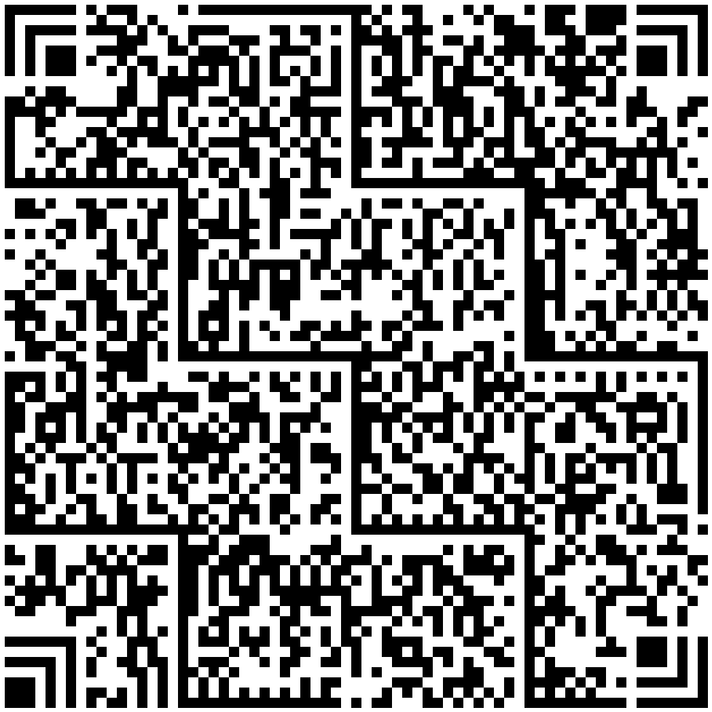

## **Overview**
Han Xin Code is a two-dimensional, variable-size matrix symbology that was designed in 2007 specifically to encode Simplified Chinese characters in addition to all ASCII characters and numeric digits. The symbol consists of an array of square modules that are arranged in a square pattern. It has also been called Chinese Sensible. GS1 China owns and maintains this symbology.

With minimum error correction levels, Han Xin Code can encode up to 2,174 common Chinese characters, 3,261 binary bytes, 4,350 ASCII characters, or 7,827 numeric characters. Multiple data types can be encoded in the same symbol.

Han Xin Code is defined in AIMD-015 Bar code symbology specification - Han Xin Code.

{}*If you need any clarifications, feel free to reach out [Aspose Technical Support](/barcode/net/technical-support/): ask your questions at [Aspose.Barcode Forum](https://forum.aspose.com/c/barcode/13) or contact [Aspose Paid Support Helpdesk](https://helpdesk.aspose.com/).*{}

## **Selectable Error Correction**
Four levels of Reed-Solomon error correction and their error correction abilities of symbol codewords are shown as follows:
  
|Error correction level|Allows recovery of|
|:--:|:--:|
|L1|8%|
|L2|15%|
|L3|23%|
|L4|30%|

Error correction is set by property [*HanXinParameters.HanXinErrorLevel*](https://reference.aspose.com/barcode/net/aspose.barcode.generation/hanxinparameters/hanxinerrorlevel/) and by default is [H*anXinErrorLevel*](https://reference.aspose.com/barcode/net/aspose.barcode.generation/hanxinerrorlevel/).L1.

The following code sample explains how to set the error correction level.

``` csharp
using (var bg = new BarcodeGenerator(EncodeTypes.HanXin, "1234567890"))
{
    // L4
    bg.Parameters.Barcode.HanXin.HanXinErrorLevel = HanXinErrorLevel.L4;
    var img = bg.GenerateBarCodeImage();
    img.Save(Global.PathCombine({path}, "img.png"));
}
```

## **Selectable Version**
There are 84 sizes of Han Xin Code symbol referred to as Version 1, Version 2 … Version 84 respectively. Version 1 measures 23 modules × 23 modules, Version 2 measures 25 modules × 25 modules and so on, increasing in steps of 2 modules per side up to Version 84 which measures 189 modules × 189 modules.

By default [*HanXinParameters.HanXinVersion*](https://reference.aspose.com/barcode/net/aspose.barcode.generation/hanxinparameters/hanxinversion/) is HanXinVersion.Auto, in this mode encoder automatically picks smallest possible version. If user wants to specify version, other possible values of [*HanXinVersion*](https://reference.aspose.com/barcode/net/aspose.barcode.generation/hanxinversion/) are HanXinVersion.Version01 - HanXinVersion.Version84.
  
| |Version 1 Symbol|Version 24 Symbol|
|--|:---:|:------:|
| |<p align="center"></p>|<p align="center"></p>|

| |Version 84 Symbol|
|--|:------:|
| |<p align="center"></p>
  
The following code sample explains how to set the version.

``` csharp
using (var bg = new BarcodeGenerator(EncodeTypes.HanXin, "1234567890"))
{
    // Auto (by default)
    var img = bg.GenerateBarCodeImage();
    img.Save(Global.PathCombine({path}, "ver_auto.png"));

    // Version 24
    bg.Parameters.Barcode.HanXin.HanXinVersion = HanXinVersion.Version24;
    img = bg.GenerateBarCodeImage();
    img.Save(Global.PathCombine({path}, "ver24.png"));
}
```

## **Set Encoding Mode**
The barcode library supports different encoding modes to generate Han Xin barcodes. Mode is chosen by setting the property [*HanXinParameters.HanXinEncodeMode*](https://reference.aspose.com/barcode/net/aspose.barcode.generation/hanxinparameters/hanxinencodemode/), possible values are in enumeration [*HanXinEncodeMode*](https://reference.aspose.com/barcode/net/aspose.barcode.generation/hanxinencodemode/). These modes are briefly described below:
- *Auto*. Sequence of *Numeric*, *Text*, *Binary* and 4 *GB18030* (Chinese) modes changing automatically. *Numeric*, *Text*, and 4 *GB18030* modes are internal modes, user can't select them forcibly. This is default mode, but it may be not suitable for some Unicode characters.
- *Binary*. *Binary* mode encodes binary data in any form and encodes them in their binary byte. Every byte in *Binary* mode is represented by 8 bits.
- *ECI*. The Extended Channel Interpretation (ECI) mode indicates the encoded data is interpreted according to the ECI protocol defined by the AIM ECI Specifications.
- *Unicode*. *Unicode* mode designs a way to represent any text data reference to UTF8 encoding/charset in Han Xin Code.
- *URI*. *URI* mode indicates the data represented in Han Xin Code is Uniform Resource Identifier (URI) reference to [*RFC 3986*](https://datatracker.ietf.org/doc/html/rfc3986).
- *Extended*. *Extended mode* will allow more flexible combinations of other modes, this mode is currently not implemented.

### ***Auto* Encoding Mode**
In the *Auto* encoding mode, the barcode data is encoded using *Numeric*, *Text*, *Binary* and 4 *GB18030* (Chinese) modes. 

The following code sample shows how to generate Han Xin barcode in the Auto mode.
  
``` csharp
// Text + Region One + Region Two + GB18030 2 Byte
var str = "abc123全ň全漄灟漄灟螅全ň螅螅螅";

using (var bg = new BarcodeGenerator(EncodeTypes.HanXin, str))
{
    bg.Parameters.Barcode.HanXin.HanXinEncodeMode = HanXinEncodeMode.Auto; // It is already Auto by default
    var img = bg.GenerateBarCodeImage();
}
```

### ***Binary* Encoding Mode**
The *Bytes* mode is used to encode byte streams. The code sample below explains how to work with the *Bytes* encoding mode.
  
``` csharp
// Binary mode 
var str = "IJK";

using (var bg = new BarcodeGenerator(EncodeTypes.HanXin, str))
{
    bg.Parameters.Barcode.HanXin.HanXinEncodeMode = HanXinEncodeMode.Binary;
    var img = bg.GenerateBarCodeImage();

    using (var r = new BarCodeReader(img, DecodeType.HanXin))
    {
        var found = r.ReadBarCodes();
        Assert.AreEqual(1, found.Length);
        var binary = "494a4b";
        Assert.AreEqual(binary.ToLower(), found[0].CodeText.ToLower());
    }
}
```

### ***ECI* Mode**
The Extended Channel Interpretation (ECI) mode indicates the encoded data is interpreted according to the ECI protocol defined by the AIM ECI Specifications. The data sequence is encoded according to the rules of other modes. User needs to select [*HanXinParameters.HanXinECIEncoding*](https://reference.aspose.com/barcode/net/aspose.barcode.generation/hanxinparameters/hanxineciencoding/) property according to charset / ECI assignment value. Default [*HanXinParameters.HanXinECIEncoding*](https://reference.aspose.com/barcode/net/aspose.barcode.generation/hanxinparameters/hanxineciencoding/) is [*ECIEncodings*](https://reference.aspose.com/barcode/net/aspose.barcode.generation/eciencodings/).ISO_8859_1 (ISO/IEC 8859-1 Latin alphabet No. 1 encoding. ECI Id:"\000003").

The following code sample demonstrate how to use the *ECI* mode.

```csharp
// ECI mode, Latin/Greek alphabet encoding. ECI Id:"\000009"
var str = "ΑΒΓΔΕ";

using (var bg = new BarcodeGenerator(EncodeTypes.HanXin, str))
{
    bg.Parameters.Barcode.HanXin.HanXinEncodeMode = HanXinEncodeMode.ECI;
    bg.Parameters.Barcode.HanXin.HanXinECIEncoding = ECIEncodings.ISO_8859_7;
    var img = bg.GenerateBarCodeImage();
}
```

### ***Unicode* Mode**
*Unicode* mode designs a way to represent any text data reference to UTF8 encoding / charset in Han Xin Code.
  
The following code sample shows how to enable the *Unicode* mode.

``` csharp
var str = "abcd АБВ ıntəˈnæʃənəl 语言语言 แผ่นดินฮั่นเสื่ ∑ f(i) = ∏ 🖨 🚘✉🥇⚽ 你好測試測試 こんにちは テスト テスト 안녕하세요 테스트 테스트";

using (var bg = new BarcodeGenerator(EncodeTypes.HanXin, str))
{
    bg.Parameters.Barcode.HanXin.HanXinEncodeMode = HanXinEncodeMode.Unicode;
    var img = bg.GenerateBarCodeImage();
}
```

### ***URI* Mode**
*URI* mode indicates the data represented in Han Xin Code is Uniform Resource Identifier (URI) reference to [*RFC 3986*](https://datatracker.ietf.org/doc/html/rfc3986).

``` csharp
// URI mode 
var str = "https://www.test.com/%BC%DE%ab/search=test";

using (var bg = new BarcodeGenerator(EncodeTypes.HanXin, str))
{
    bg.Parameters.Barcode.HanXin.HanXinEncodeMode = HanXinEncodeMode.URI;
    var img = bg.GenerateBarCodeImage();

    using (var r = new BarCodeReader(img, DecodeType.HanXin))
    {
        var found = r.ReadBarCodes();
        Assert.AreEqual(1, found.Length);
        Assert.AreEqual(str.ToLower(), found[0].CodeText.ToLower());
    }
}
```

### ***Extended* Mode - TBD**
*Extended* mode will allow more flexible combinations of other modes, this mode is currently in development.