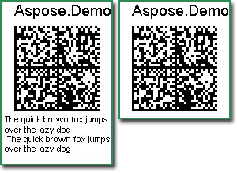
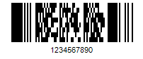
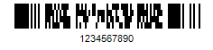

## **Hiding CodeText that is too long to display**
Unlike one-dimensional barcodes, two-dimensional ones often contain a large amount of data as they have been introduced exactly to address such a need. This human-readable code text does not require to be printed out as it does not undergo machine scanning. Therefore, it may be necessary to hide the contents of *CodeText* property for 2D barcodes in cases when it is too long to be displayed. 
<!--Often, human-readable code text is printed along with barcodes, this CodeText has nothing to do with machine scanning. In the case of two-dimensional barcodes, CodeText is simply too long to display. Under such a situation, a certain approach should be taken.-->
### **Hide BarCode CodeText**
The following code snippet demonstrates how to hide the contents of *CodeText*.



|**Hiding CodeText Contents**|
| :- |
||

### **Reduce the font size of CodeText**
The code sample provided below illustrates how to reduce the font size of *CodeText* contents.



## **Adjusting 2D barcode label size**
{} 

The size of a barcode label depends on many factors. Mainly, the following settings affect the size of the resulting image:

- Metrics
- Resolution: higher resolution will lead to a larger image size on the same screen or printer
- *GraphicsUnit*: all settings can be based on millimetres or inches
<!--- The overall image-->
- *AutoSize*: set to false means the image's size is fixed to ImageWidth * ImageHeight. Oversized barcode (e.g. CodeText very long) will be out of the frame if AutoSize is false and the size not large enough
- *ImageWidth*: only valid when AutoSize set to false
- *ImageHeight*: only valid when AutoSize set to false
- Margins: only valid when AutoSize is true, indicates the marginal area of the core barcode. This setting could be overridden by CaptionAbove and CaptionBelow. That is when AutoSize is true, and the Margins setting is not large enough to display the CaptionAbove or CaptionBelow, then the marginal area will expand automatically
- *CaptionAbove*: controlled by CaptionAbove.Visible, CaptionAbove.Space and CaptionAbove.Font
- *CaptionBelow*: controlled by CaptionBelow.Visible, CaptionBelow.Space and CaptionBeow.Font
- Core barcode
- xDimension: each (1D) black bar's or (2D) module's width
- Rows: number of (2D) module rows
- Columns: number of (2D) module columns
- AspectRatio: the ratio of yDimension/xDimension
- WideNarrowRatio: the ratio of wide bars / narrow bars or wide spaces / narrow spaces for some types of barcodes
- CodeText: controlled by CodeLocation, CodeTextFont and CodeTextSpace

{} 

Each specific type of barcode may have different semantic demands, then it will override or ignore the above settings. e.g. DataMatrix is a square-based type of barcode. The AspectRatio setting is meaningless to DataMatrix because AspectRatio has to be 1 for square modules. BarcodeGenerator will simply ignore those illegal settings and decide on its own during the process.
## **Setting Aspect Ratio of Barcodes**
The Aspect Ratio of a barcode is the width:height ratio. We can control how tall or wide the barcode can be generated using the Aspect Ratio. 3:2 Aspect Ratio means the barcode is 1.5 or 3/2 times wider than taller. Or the width of the barcode is 1.5 times larger than the height. Below is a PDF417 barcode with a 1.5 Aspect Ratio:

|**BarCode with Aspect Ratio of 1.5**|
| :- |
||
2 Aspect Ratio means the width of the barcode is 2 times greater than the height. Below is the PDF417 barcode with an Aspect Ratio of 2.

|**BarCode with Aspect Ratio of 2**|
| :- |
||
The code snippet given below demonstrates how to set the Aspect Ratio:



## **Detect Unicode Encoding of Barcode**
Aspose.BarCode API allows developers to detect the Unicode encoding. The flag works for QR/Micro QR at the moment.

In case, the detect encoding flag is enabled the barcode engine returns Unicode text while tries to detect the encoding of the barcode. The barcode may be encoded using one of the following encodings:

- UTF8
- BOM_UTF8
- BOM_UTF16BE
- BOM_UTF16LE

The flag is enabled by default. In case the flag is disabled the engine returns plain text without encoding detection.

The code example given below demonstrates how to get the plain text without encoding detection.


