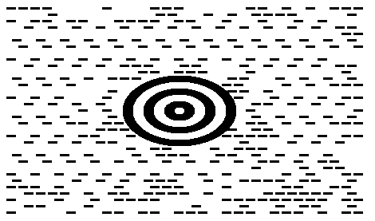

{}[Try online](https://products.aspose.app/barcode/generate). You can test the quality of ***Aspose.BarCode*** generation and view the results online.{}

## Overview
*MaxiCode* is a 2D matrix barcode type that allows encoding both text information and byte streams. This symbology supports Reed-Solomon error correction. The amount of data required for error correction and barcode size are strictly specified in the *MaxiCode* standard. A *MaxiCode* barcode includes a round bullseye finder pattern composed of three concentric circles, six orientation patterns, and 33 rows with 29 or 30 hexagonal modules.  
  
The available size of information to be encoded (data capacity) depends on the input data characteristics due to encoding specificities and constitutes at most 60 bytes or 140 numerical (90 alphanumeric) digits. This symbology has been introduced for postal services; it is intended for industrial standard support and is not recommended for arbitrary use.
  
{}*If you need any clarifications, feel free to reach out [Aspose Technical Support](/barcode/net/technical-support/): ask your questions at [Aspose.Barcode Forum](https://forum.aspose.com/c/barcode/13) or contact Aspose [Paid Support Helpdesk](https://helpdesk.aspose.com/).*{}

## MaxiCode Encoding Mode Settings
In ***Aspose.BarCode for .NET***, developers can set different encoding modes for *MaxiCode* barcode generation using the [*MaxiCodeEncodeMode*](https://apireference.aspose.com/barcode/net/aspose.barcode.generation/maxicodeparameters/properties/maxicodeencodemode) property of class [*MaxiCodeParameters*](https://apireference.aspose.com/barcode/net/aspose.barcode.generation/maxicodeparameters). The following encoding modes are supported: 
- Modes 2 and 3 - special industrial standards that are used in the transportation industry and intended for storing the information about shipping along with additional data
- Modes 4 and 5 - are intended to encode arbitrary text information or byte streams and differ from each other only by the number of codewords for error correction and potential data capacity
- Mode 6 - is similar to encoding mode 4, but the information encoded in barcodes is intended for hardware reader programming only

These modes are described further in the article.   

### Encoding Modes 2 and 3
For correct barcode generation, encoding modes 2 and 3 require specifying the input data in the predefined formats that can be summarized as follows:  
- <mark>Format1: “[)>(rs)01(gs)(Postal Code)(gs)(Country Code)(gs)(Service Category)(gs)(Secondary Message)(eot)”</mark>
- <mark>Format2: “(Postal Code 9 digits)(gs)(Country Code)(gs)(Service Category)(gs)(Secondary Message)(eot)”</mark>
  
The following special characters are used:
- Group separator Unicode character: (gs) - \u001d
- Record separator Unicode character: (rs) - \u001e
- End-of-transmision Unicode character: (eot) - \u0004
  
Sample *MaxiCode* barcodes demonstrated below have been created using Formats 1 and 2 of encoding mode 2.
   
|
**Mode 2**
|
**Format 1**
|
**Format 2**
|
| :-: | :-: | :-: |
| |||
  
The following code snippet explains how to work with encoding modes.


BarcodeGenerator gen = new BarcodeGenerator(EncodeTypes.MaxiCode, "");
gen.Parameters.Barcode.XDimension.Pixels = 15;
gen.Parameters.Barcode.CodeTextParameters.TwoDDisplayText = "MaxiCode Mode 2";

string gs = "\u001d";
string rs = "\u001e";
string eot = "\u0004";
//set MaxiCode encode mode to 2 and valid codetext
gen.Parameters.Barcode.MaxiCode.MaxiCodeEncodeMode = 2;
//[)>(rs)01(gs)(Postal Code)(gs)(Country Code)(gs)(Service Category)(gs)(Secondary Message)(eot)
gen.CodeText = $"[)>{rs}01{gs}B1050{gs}056{gs}001{gs}ADDITIONAL DATA{eot}";
gen.Save($"{path}MaxiCodeEncodeMode2First.png", BarCodeImageFormat.Png);

//set MaxiCode encode mode to 2 and valid codetext
gen.Parameters.Barcode.MaxiCode.MaxiCodeEncodeMode = 2;
//(Postal Code 9 digits)(gs)(Country Code)(gs)(Service Category)(gs)(Secondary Message)(eot)
gen.CodeText = $"123456789{gs}056{gs}001{gs}ADDITIONAL DATA{eot}";
gen.Save($"{path}MaxiCodeEncodeMode2Second.png", BarCodeImageFormat.Png);
  
  
### Encoding Modes 4, 5, and 6
These modes allow encoding the arbitrary text data and byte streams. The code sample given below shows how to perform byte stream encoding when encoding mode 4 is enabled.


BarcodeGenerator gen = new BarcodeGenerator(EncodeTypes.MaxiCode, "Åspóse.Barcóde©");
gen.Parameters.Barcode.XDimension.Pixels = 15;
//set MaxiCode encode mode to 4
gen.Parameters.Barcode.MaxiCode.MaxiCodeEncodeMode = 4;
gen.Save($"{path}MaxiCodeEncodeMode4.png", BarCodeImageFormat.Png);

  

## Aspect Ratio
*Aspect Ratio* is the ratio between the barcode width and height. In ***Aspose.BarCode for .NET***, developers can use the [*AspectRatio*](https://apireference.aspose.com/barcode/net/aspose.barcode.generation/maxicodeparameters/properties/aspectratio) property of class [*MaxiCodeParameters*](https://apireference.aspose.com/barcode/net/aspose.barcode.generation/maxicodeparameters) to adjust barcode proportions with respect to the X and Y coordinates. It is implemented as a relative coefficient to the [*XDimension*](https://apireference.aspose.com/barcode/net/aspose.barcode.generation/barcodeparameters/properties/xdimension) parameter. *MaxiCode* barcodes should be generated with the value of *AspectRatio* equal to 1. A sample *MaxiCode* barcode provided below has been generated using the *Aspect Ratio* set to 0.5.
  

  
The following code snippet illustrates how to manage *Aspect Ratio* settings for *MaxiCode* barcode generation.
  

BarcodeGenerator gen = new BarcodeGenerator(EncodeTypes.MaxiCode, "Åspóse.Barcóde©");
gen.Parameters.Barcode.XDimension.Pixels = 15;
//set aspect ratio 0.5
gen.Parameters.Barcode.MaxiCode.AspectRatio = 0.5f;
gen.Save($"{path}MaxiCodeAspectRatio0.5.png", BarCodeImageFormat.Png);
