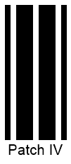
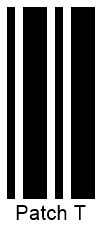
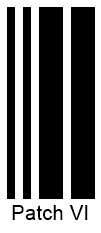

## Overview
The *Patch Code* symbology has been developed by Kodak to facilitate task management for automatic multi-page document scanning. Such barcodes do not encode any data; instead, a barcode pattern indicates an action to be performed. ***Aspose.BarCode for .NET*** supports six main *Patch Code* patterns and allows generating barcodes in two modes: as separate barcode images to be placed on a page manually; as a complete A4 or US Letter page with the required resolution. *Patch Code* barcode labels are printed on four sides of a document; however, it is sufficient to read only one of them to complete scanning. This feature allows reading barcodes successfully even if pages are rotated.

## Supported Patterns
***Aspose.BarCode for .NET*** enables generating the main *Patch Code* set that consists of six patterns. The extended set of patterns introduced by Kodak later on and not standardized yet is not supported by the library. The main pattern set includes the following options: *Patch I*, *Patch II*, *Patch III*, *Patch IV*, *Patch T*, and *Patch VI*.
Sample barcode labels provided below illustrate six basic *Patch Code* barcode types.
  
|Patch Code Standards|Patch I|Patch II|Patch III|Patch IV|Patch T|Patch VI|  
| :-: | :-: | :-: | :-: | :-: | :-: | :-: |
| |||||||
  
The following code snippet explains how to generate *Patch Code* barcodes using available patterns.
  

BarcodeGenerator gen = new BarcodeGenerator(EncodeTypes.PatchCode, "Patch I");
gen.Parameters.Barcode.CodeTextParameters.FontMode = FontMode.Manual;
gen.Parameters.Barcode.CodeTextParameters.Font.Size.Pixels = 20;
//Patch I
gen.CodeText = "Patch I";
gen.Save($"{path}PatchCodeI.png", BarCodeImageFormat.Png);
//Patch II
gen.CodeText = "Patch II";
gen.Save($"{path}PatchCodeII.png", BarCodeImageFormat.Png);
//Patch III
gen.CodeText = "Patch III";
gen.Save($"{path}PatchCodeIII.png", BarCodeImageFormat.Png);
//Patch IV
gen.CodeText = "Patch IV";
gen.Save($"{path}PatchCodeIV.png", BarCodeImageFormat.Png);
//Patch T
gen.CodeText = "Patch T";
gen.Save($"{path}PatchCodeT.png", BarCodeImageFormat.Png);
//Patch VI
gen.CodeText = "Patch VI";
gen.Save($"{path}PatchCodeVI.png", BarCodeImageFormat.Png);


## Generation Modes
***Aspose.BarCode for .NET*** enables different modes of generating *Patch Code* barcodes: as separate images or as A4 or US Letter pages with portrait or landscape orientation. Moreover, the library allows adding an optional complementary QR code as a source of supplement information that may be required to process scanning tasks. Setting other barcode types as complementary barcodes is not supported.  
  
**Setting Generation Format** 
  
To set the format of *Patch Codes* to be generated, it is necessary to initialize the [*PatchFormat*](https://apireference.aspose.com/barcode/net/aspose.barcode.generation/patchcodeparameters/properties/patchformat) property of class [*PatchCodeParameters*](https://apireference.aspose.com/barcode/net/aspose.barcode.generation/patchcodeparameters). This property can take the following values: 
- *PatchOnly* - basic *Patch Code* barcode images are generated. This value is used by default. 
- *A4* - A4 pages with portrait orientation are outputted having *Patch Code* barcodes on page borders and an optional QR code in the center.
- *A4_LANDSCAPE* - A4 pages with landscape orientation are created with *Patch Code* barcodes on page borders and an optional QR code in the center. 
- *US_Letter* - US Letter pages with portrait orientation are generated with *Patch Code* barcodes set on page borders and an optional QR code in the center.
- *US_Letter_LANDSCAPE* - US pages with landscape orientation are created with *Patch Code* barcodes placed on page borders and an optional QR code in the center.

**Adding Complementary QR Code**  
  
To add a complementary QR code to a *Patch Code* barcode page (A4 or US Letter), it is necessary to enter any text value into the [ExtraBarcodeText](https://apireference.aspose.com/barcode/net/aspose.barcode.generation/patchcodeparameters/properties/extrabarcodetext) property of class [*PatchCodeParameters*](https://apireference.aspose.com/barcode/net/aspose.barcode.generation/patchcodeparameters) and then set the [*Location*](https://apireference.aspose.com/barcode/net/aspose.barcode.generation/codetextparameters/properties/location) property of class [*CodeTextParameters*](https://apireference.aspose.com/barcode/net/aspose.barcode.generation/codetextparameters) to "*CodeLocation.None*".  
  
Images below illustrate the *Patch Code* barcode pages generated with and without adding complementary QR codes.
  
|Complementary QR Code|Is Disabled|Is Enabled|
| :-: | :-: | :-: |
| |<a href="patchcodea4withoutqr.png"> 

</a>|<a href="patchcodea4withqr.png"> 

</a>|
  
    
**Code Sample for Generation Modes**
  
The following code snippet explains how to set the required format for a *Patch Code* barcode to be generated and how to add a complementary QR code.
  

BarcodeGenerator gen = new BarcodeGenerator(EncodeTypes.PatchCode, "Patch I");
//set patch code without complimentary QR
gen.Parameters.Barcode.PatchCode.PatchFormat = PatchFormat.A4;
gen.Save($"{path}PatchCodeA4WithoutQR.png", BarCodeImageFormat.Png);
//set patch code with complimentary QR
gen.Parameters.Barcode.PatchCode.PatchFormat = PatchFormat.A4;
gen.Parameters.Barcode.PatchCode.ExtraBarcodeText = "Aspose page extra info";
gen.Parameters.Barcode.CodeTextParameters.Location = CodeLocation.None;
gen.Save($"{path}PatchCodeA4WithQR.png", BarCodeImageFormat.Png);
