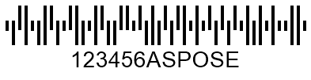
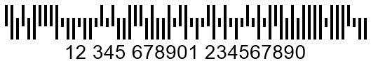
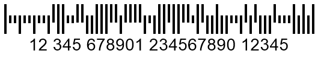
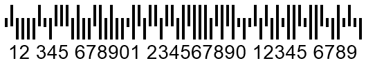
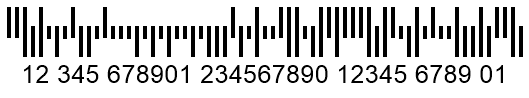
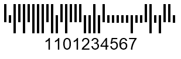
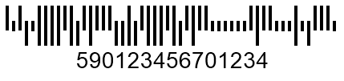
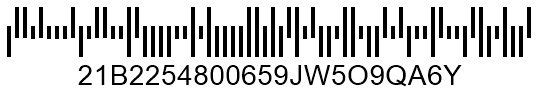

   
## **4-State Postal Standards**
***Aspose.BarCode for .NET*** supports the following 4-state postal symbologies: *RM4SCC*, *Dutch KIX*, *OneCode*, *Australia Post*, and *Mailmark*. In **4-state** barcodes, four types of bars are specified to encode information: tracker (T), descender (D), ascender (A), and full (F) bars. Each input character is encoded using four separate bars so that two bits can be encoded by one digit. Most of the 4-state standards are based on the *RM4SCC* barcode type and accordingly, can encode numerical digits and uppercase English letters. All these postal standards besides *Dutch KIX* include a checksum. Moreover, *Australia Post* and *Mailmark* provide the possibility to recover information owing to Reed-Solomon error correction. The specificities of 4-state symbology generation in ***Aspose.BarCode for .NET*** are discussed further in the article.

### **RM4SCC Symbology**
The *RM4SCC* symbology can encode numerical digits and uppercase English letters. Each character in a barcode is encoded using four bars so that two of them are extended upwards and the other two ones - downwards. Different combinations provide 36 possible symbols: 10 digits and 26 letters. This symbology requires obligatory check digit calculation that is based on the modulo 6 algorithm.
   

  
The following code sample shows how to generate *RM4SCC* barcodes.
  

BarcodeGenerator gen = new BarcodeGenerator(EncodeTypes.RM4SCC, "123456ASPOSE");
gen.Parameters.Barcode.XDimension.Pixels = 4;
gen.Parameters.Barcode.BarHeight.Pixels = 50;
gen.Save($"{path}PostalRM4SCCBarcode.png", BarCodeImageFormat.Png);


### **Dutch KIX Symbology**
The *Dutch KIX* symbology is utilized by the Royal Dutch TPG Post of Netherlands to perform automated sorting of postal codes and mails. Its specification is similar to that of the RM4SCC symbology and thus can be used to encode numerical digits and uppercase English letters. However, it does not have a checksum, as well as start and stop digits.
  

  
The following code snippet illustrates how to create *Dutch KIX* barcodes.
  

BarcodeGenerator gen = new BarcodeGenerator(EncodeTypes.DutchKIX, "123456ASPOSE");
gen.Parameters.Barcode.XDimension.Pixels = 4;
gen.Parameters.Barcode.BarHeight.Pixels = 50;
gen.Save($"{path}PostalDutchKIXBarcode.png", BarCodeImageFormat.Png);

  
### **One Code Symbology**
The *One Code* standard can be used to encode messages composed of numerical digits with the length fixed to 20, 25, 29, or 31 digits into 65-bar barcodes. It includes an eleven-bit cyclic redundancy check to recognize errors but does not support error correction.  
  
|OneCode Standard|20 Digits|25 Digits|29 Digits|31 Digits|
| :-: | :-: | :-: | :-: | :-: |  
| |||||
  
The following code sample explains how to generate *OneCode* barcodes.
    

BarcodeGenerator gen = null;
//create OneCode with 20 digits
gen = new BarcodeGenerator(EncodeTypes.OneCode, "12345678901234567890");
gen.Parameters.Barcode.XDimension.Pixels = 4;
gen.Parameters.Barcode.BarHeight.Pixels = 50;
gen.Save($"{path}PostalOneCodeBarcode20Digits.png", BarCodeImageFormat.Png);
//create OneCode with 25 digits
gen = new BarcodeGenerator(EncodeTypes.OneCode, "1234567890123456789012345");
gen.Parameters.Barcode.XDimension.Pixels = 4;
gen.Parameters.Barcode.BarHeight.Pixels = 50;
gen.Save($"{path}PostalOneCodeBarcode25Digits.png", BarCodeImageFormat.Png);
//create OneCode with 29 digits
gen = new BarcodeGenerator(EncodeTypes.OneCode, "12345678901234567890123456789");
gen.Parameters.Barcode.XDimension.Pixels = 4;
gen.Parameters.Barcode.BarHeight.Pixels = 50;
gen.Save($"{path}PostalOneCodeBarcode29Digits.png", BarCodeImageFormat.Png);
//create OneCode with 31 digits
gen = new BarcodeGenerator(EncodeTypes.OneCode, "1234567890123456789012345678901");
gen.Parameters.Barcode.XDimension.Pixels = 4;
gen.Parameters.Barcode.BarHeight.Pixels = 50;
gen.Save($"{path}PostalOneCodeBarcode31Digits.png", BarCodeImageFormat.Png);


### **Australia Post Symbology**
In the *Australia Post* symbology, input messages include specific 2-digit format control code (FCC) fields and 8-digit sorting code (SC) fields. FCC fields are used to indicate one of three available barcode types with different fixed lengths: 37, 52, or 67 bars. Depending on FCC, barcodes may contain a customer information (CI) field that identifies one of the encoding types that support numerical or alphanumeric symbols. They are predefined in the [*AustralianPostEncodingTable*](https://apireference.aspose.com/barcode/net/aspose.barcode.generation/australianpostparameters/properties/australianpostencodingtable) property. Customer information can occupy 16 bars in 52-length barcodes or 31 bars in 67-length ones. The *Australia Post* standard contains a checksum and information used for Reed-Solomon data recovery.  
  
Input messages can be defined using one of the following formats specified in the table below.  
  
|FCC Field|Sorting Code Field|Customer Information Field|  
| :-: | :-: | :-: |
|11|8 digits|None|
|59|8 digits|16 bars|
|62|8 digits|31 bars|
  
The value of the FCC field can be defined using the [*AustralianPostEncodingTable*](https://apireference.aspose.com/barcode/net/aspose.barcode.generation/australianpostparameters/properties/australianpostencodingtable) property that needs to be initialized with one of the values from the [*CustomerInformationInterpretingType*](https://apireference.aspose.com/barcode/net/aspose.barcode/customerinformationinterpretingtype) enumeration (as represented in the table below).
  
|Australia Post Encoding Table|Supported Symbols|
| :-: |---|
|CTable|0-9, A-Z, a-z, space symbol, and #|
|NTable|0-9|
|Other|0, 1, 2, and 3 that correspond to H, A, D, and T states, respectively|
  
Barcode images demonstrated below have been generated using different setings for the FCC field.
  
|Australia Post Standards|FCC 11|FCC 59 Table|FCC 62N Table|FCC 62C Table|FCC 62C Other Table|
| :-: | :-: | :-: | :-: | :-: | :-: |  
| ||||||
  
The following code snippet explains how to generate *Australia Post* barcodes with different settings.
  

BarcodeGenerator gen = null;
//create AustraliaPost FCC 11
gen = new BarcodeGenerator(EncodeTypes.AustraliaPost, "1101234567");
gen.Parameters.Barcode.XDimension.Pixels = 4;
gen.Parameters.Barcode.BarHeight.Pixels = 50;
gen.Save($"{path}PostalAustraliaPostFCC11.png", BarCodeImageFormat.Png);
//create AustraliaPost FCC 59 NTable
gen = new BarcodeGenerator(EncodeTypes.AustraliaPost, "590123456701234");
gen.Parameters.Barcode.XDimension.Pixels = 4;
gen.Parameters.Barcode.BarHeight.Pixels = 50;
gen.Parameters.Barcode.AustralianPost.AustralianPostEncodingTable = CustomerInformationInterpretingType.NTable;
gen.Save($"{path}PostalAustraliaPostFCC59NTable.png", BarCodeImageFormat.Png);
//create AustraliaPost FCC 62 NTable
gen = new BarcodeGenerator(EncodeTypes.AustraliaPost, "620123456701234");
gen.Parameters.Barcode.XDimension.Pixels = 4;
gen.Parameters.Barcode.BarHeight.Pixels = 50;
gen.Parameters.Barcode.AustralianPost.AustralianPostEncodingTable = CustomerInformationInterpretingType.NTable;
gen.Save($"{path}PostalAustraliaPostFCC62NTable.png", BarCodeImageFormat.Png);
//create AustraliaPost FCC 62 CTable
gen = new BarcodeGenerator(EncodeTypes.AustraliaPost, "6201234567ASPOSE");
gen.Parameters.Barcode.XDimension.Pixels = 4;
gen.Parameters.Barcode.BarHeight.Pixels = 50;
gen.Parameters.Barcode.AustralianPost.AustralianPostEncodingTable = CustomerInformationInterpretingType.CTable;
gen.Save($"{path}PostalAustraliaPostFCC62CTable.png", BarCodeImageFormat.Png);
//create AustraliaPost FCC 62
gen = new BarcodeGenerator(EncodeTypes.AustraliaPost, "6201234567321032103210");
gen.Parameters.Barcode.XDimension.Pixels = 4;
gen.Parameters.Barcode.BarHeight.Pixels = 50;
gen.Parameters.Barcode.AustralianPost.AustralianPostEncodingTable = CustomerInformationInterpretingType.Other;
gen.Save($"{path}PostalAustraliaPostFCC62OtherTable.png", BarCodeImageFormat.Png);


### **Mailmark Symbology**
The *Mailmark* symbology has been developed by Royal Mail of the United Kingdom. Its specification is similar to that of *RM4SCC* but has the predefined data format requirements and does not provide extra space for the customer-specific content. This standard allows encoding numerical digits, uppercase English letters, and space. Moreover, barcodes contain a checksum and information to perform data recovery using Reed-Solomon error correction.  
*Mailmark* supports the following options: 
- **Type L** - encodes 26 characters 
- **Type C** - encodes 22 characters
  
|Mailmark Standards|Type C|Type L|
| :-: | :-: | :-: |  
| |||
  
The following code sample shows how to create *Mailmark* barcodes of different types.
    

BarcodeGenerator gen = null;
//create Mailmark C Type
gen = new BarcodeGenerator(EncodeTypes.Mailmark, "21B2254800659JW5O9QA6Y");
gen.Parameters.Barcode.XDimension.Pixels = 4;
gen.Parameters.Barcode.BarHeight.Pixels = 50;
gen.Save($"{path}PostalMailmarkCType.png", BarCodeImageFormat.Png);
//create Mailmark L Type
gen = new BarcodeGenerator(EncodeTypes.Mailmark, "41038422416563762EF61AH8T");
gen.Parameters.Barcode.XDimension.Pixels = 4;
gen.Parameters.Barcode.BarHeight.Pixels = 50;
gen.Save($"{path}PostalMailmarkLType.png", BarCodeImageFormat.Png);
