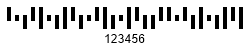
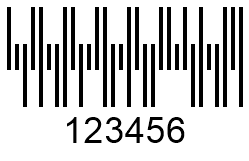
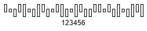

{}[Generate USPS Planet and](https://products.aspose.app/barcode/generate/planet) [USPS Postnet Barcodes online](https://products.aspose.app/barcode/generate/postnet). You can check the quality of ***Aspose.BarCode*** generation for postal barcodes and view the results online.{}

## **Barcode Height Settings**
In ***Aspose.BarCode for .NET***, the height and the width of *Postal* barcodes are calculated automatically based on the value of the [*XDimension*](https://apireference.aspose.com/barcode/net/aspose.barcode.generation/barcodeparameters/properties/xdimension) property. However, it is possible to manually adjust the barcode height regardless of the width by initializing the [*BarHeight*](https://apireference.aspose.com/barcode/net/aspose.barcode.generation/barcodeparameters/properties/barheight) property of class [*BarcodeParameters*](https://apireference.aspose.com/barcode/net/aspose.barcode.generation/barcodeparameters).  
  
Sample *Planet* and *RM4SCC* barcode images provided below have been generated with different bar height settings.  
  
|Planet Barcode Height| | |
| :-: | :-: | :-: |
|Bar Height|Is Set to None|Is Set to 100 Pixels|
| |||
  
|RM4SCC Barcode Height| | |
| :-: | :-: | :-: |
|Bar Height|Is Set to None|Is Set to 100 Pixels|
| |||
  
The following code snippet explains how to adjust the height of postal barcodes (*Planet* and *RM4SCC* ones).
  

BarcodeGenerator gen = null;
//set Planet barcode BarHeight none
gen = new BarcodeGenerator(EncodeTypes.Planet, "123456");
gen.Parameters.Barcode.XDimension.Pixels = 4;
gen.Save($"{path}PostalPlanetBarHeightNone.png", BarCodeImageFormat.Png);
//set RM4SCC barcode BarHeight none
gen = new BarcodeGenerator(EncodeTypes.RM4SCC, "123456");
gen.Parameters.Barcode.XDimension.Pixels = 4;
gen.Save($"{path}PostalRM4SCCBarHeightNone.png", BarCodeImageFormat.Png);
//set Planet barcode BarHeight 100 pixels
gen = new BarcodeGenerator(EncodeTypes.Planet, "123456");
gen.Parameters.Barcode.XDimension.Pixels = 4;
gen.Parameters.Barcode.BarHeight.Pixels = 100;
gen.Save($"{path}PostalPlanetBarHeight100Pixels.png", BarCodeImageFormat.Png);
//set RM4SCC barcode BarHeight 100 pixels
gen = new BarcodeGenerator(EncodeTypes.RM4SCC, "123456");
gen.Parameters.Barcode.XDimension.Pixels = 4;
gen.Parameters.Barcode.BarHeight.Pixels = 100;
gen.Save($"{path}PostalRM4SCCBarHeight100Pixels.png", BarCodeImageFormat.Png);


## **Bar Filling Settings**
In ***Aspose.BarCode for .NET***, developers can customize the appearance of *Postal* barcodes by setting bars to have an empty filling. It can be done using the [*FilledBars*](https://apireference.aspose.com/barcode/net/aspose.barcode.generation/barcodeparameters/properties/filledbars) property of class [*BarcodeParameters*](https://apireference.aspose.com/barcode/net/aspose.barcode.generation/barcodeparameters). By default, the value of this property is set to *True* that results in generating barcode images with filled bars.  
  
*Planet* and *RM4SCC* barcodes labels shown below have been created with different settings for the bar filling property.
  
|Planet Bar Filling| | |
| :-: | :-: | :-: |
|Bar Filling Settings|Filled Bars|Empty Bars|
| |||
  
|RM4SCC Bar Filling| | |
| :-: | :-: | :-: |
|Bar Filling Settings|Filled Bars|Empty Bars|
| |||
  
The following code sample illustrates how to manage bar filling settings for postal barcodes (*Planet* and *RM4SCC* ones).
  

BarcodeGenerator gen = null;
//set Planet barcode filled bars
gen = new BarcodeGenerator(EncodeTypes.Planet, "123456");
gen.Parameters.Barcode.XDimension.Pixels = 4;
gen.Save($"{path}PostalPlanetFilledBars.png", BarCodeImageFormat.Png);
//set RM4SCC barcode filled bars
gen = new BarcodeGenerator(EncodeTypes.RM4SCC, "123456");
gen.Parameters.Barcode.XDimension.Pixels = 4;
gen.Save($"{path}PostalRM4SCCFilledBars.png", BarCodeImageFormat.Png);
//set Planet barcode empty bars
gen = new BarcodeGenerator(EncodeTypes.Planet, "123456");
gen.Parameters.Barcode.XDimension.Pixels = 4;
gen.Parameters.Barcode.FilledBars = false;
gen.Save($"{path}PostalPlanetEmptyBars.png", BarCodeImageFormat.Png);
//set RM4SCC barcode empty bars
gen = new BarcodeGenerator(EncodeTypes.RM4SCC, "123456");
gen.Parameters.Barcode.XDimension.Pixels = 4;
gen.Parameters.Barcode.FilledBars = false;
gen.Save($"{path}PostalRM4SCCEmptyBars.png", BarCodeImageFormat.Png);

  