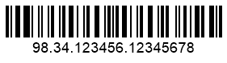
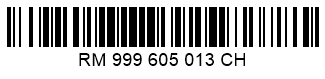
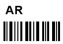

## **Overview**

*Swiss Post Parcel* is a barcode type used by the Swiss Post to manage mail sending and shipping. Each parcel is assigned with a unique barcode that serves as an identifier in automatic parcel processing. This type is based on *Code 128* (charsets B and C) and inherits its advantages, including obligatory checksum controls, high data density, and the support of laser scanning.  
  
## **Swiss Post Parcel Barcode Subtypes**

*Swiss Post Parcel* allows generating three types of barcodes:
- *Domestic Mail* - a shipping identifier used to process postal and cargo shipments inside Switzerland. It is defined as an 18-digit code that starts with 98 or 99 and includes only a standard Code 128 checksum, e.g., "98.34.123456.12345678". As seen, for convenience, codes are divided by dots into four fragments.
- *International Mail* - a shipping identifier used for transnational shipments. It has the following format: **LLXXXXXXXXCCH**, where L denotes an uppercase English letter; X – a numerical digit from 0 to 9; C – a control digit; CH – the standard addition of two letters that remains unchanged. As seen, the code is protected by an additional checksum used together with the standard Code 128 check digit, e.g., "RM999605013CH". The control checksum can be computed manually or automatically by the ***Aspose.BarCode*** library.
- *Additional Service Codes* - different codes used to indicate additional services for a shipment and defined as 4-digit sets, e.g., "0327". One shipment may include from 1 to 10 service codes. The library supports the service codes described in the table below.  
  
|Service Name|Letter Abbreviation|Service Code Number|
|---|---|:--:|
|Business reply label|GAS|0203|
|Personal delivery|RMP|0322|
|Return receipt|AR|0327|
|Electronic return receipt|eAR|0328|
|Cash on delivery (obsolete)|-|0340|
|Electronic cash on delivery|BLN|0341|
|ID Check|ID+RMP|0470|
|Items for the blind|CEC|0610|
|Military mail|MIL|1007|
|Second attempted delivery on the following Saturday|-|2512|
  
## **Generate Swiss Post Parcel Barcodes**

The code examples provided further demonstrate how to generate and read *Swiss Post Parcel* barcodes using the ***Aspose.BarCode*** library. 


### **Domestic Mail**

This example demonstrates how to generate *Swiss Post Parcel* barcodes for *Domestic Mail*. The *Domestic Mail* identifier can be passed in its original form or as an 18-digit code. Both options provide the same results for generation and recognition.  
  
|Domestic Mail Barcode|With Original Identifier|With 18-digit Code|
|:--:|:--:|:--:|
| |||
  
``` csharp

//generate a Swiss Post Domestic Mail barcode with the original identifier
gen = new BarcodeGenerator(EncodeTypes.SwissPostParcel, "98.34.123456.12345678");
gen.Parameters.Barcode.XDimension.Pixels = 2;
gen.Parameters.Barcode.BarHeight.Pixels = 40;
gen.Save($"{path}SwissPostDomesticMailAsIs.png", BarCodeImageFormat.Png);

//read the current barcode value
foreach(BarCodeResult result in new BarCodeReader(gen.GenerateBarCodeImage(), DecodeType.SwissPostParcel).ReadBarCodes())
    Console.WriteLine($"Barcode type:{result.CodeTypeName}, Barcode Data:{result.CodeText}");

//generate a Swiss Post Domestic Mail barcode with the 18-digit code
gen = new BarcodeGenerator(EncodeTypes.SwissPostParcel, "983412345612345678");
gen.Parameters.Barcode.XDimension.Pixels = 2;
gen.Parameters.Barcode.BarHeight.Pixels = 40;
gen.Save($"{path}SwissPostDomesticMailAsDigits.png", BarCodeImageFormat.Png);

//read the current barcode value
foreach (BarCodeResult result in new BarCodeReader(gen.GenerateBarCodeImage(), DecodeType.SwissPostParcel).ReadBarCodes())
    Console.WriteLine($"Barcode type:{result.CodeTypeName}, Barcode Data:{result.CodeText}");

```


### **International Mail**

The code example provided below explains how to generate *Swiss Post Parcel* barcodes for *International Mail*. Here, the postal shipping identifier contains an invalid checksum value, the library will automatically correct it while generating the barcode. If the shipping identifier does not include a checksum digit, it will be automatically created and added to the barcode by the library.  
  
|International Mail Barcode|With Correct Checksum|Without Checksum|With Erroneous Checksum|
|:--:|:--:|:--:|:--:|
| ||||
  
``` csharp

//generate a Swiss Post International Mail barcode
gen = new BarcodeGenerator(EncodeTypes.SwissPostParcel, "RM999605013CH");
gen.Parameters.Barcode.XDimension.Pixels = 2;
gen.Parameters.Barcode.BarHeight.Pixels = 40;
gen.Save($"{path}SwissPostInternationalMailAsIs.png", BarCodeImageFormat.Png);

//read the current barcode value
foreach (BarCodeResult result in new BarCodeReader(gen.GenerateBarCodeImage(), DecodeType.SwissPostParcel).ReadBarCodes())
    Console.WriteLine($"Barcode type:{result.CodeTypeName}, Barcode Data:{result.CodeText}");

//generate a Swiss Post International Mail barcode with the erroneous checksum
gen = new BarcodeGenerator(EncodeTypes.SwissPostParcel, "RM999605017CH");
gen.Parameters.Barcode.XDimension.Pixels = 2;
gen.Parameters.Barcode.BarHeight.Pixels = 40;
gen.Save($"{path}SwissPostInternationalMailWithWrongChecksum.png", BarCodeImageFormat.Png);

//read the current barcode value
foreach (BarCodeResult result in new BarCodeReader(gen.GenerateBarCodeImage(), DecodeType.SwissPostParcel).ReadBarCodes())
    Console.WriteLine($"Barcode type:{result.CodeTypeName}, Barcode Data:{result.CodeText}");

//generate a Swiss Post International Mail barcode without checksum
gen = new BarcodeGenerator(EncodeTypes.SwissPostParcel, "RM99960501CH");
gen.Parameters.Barcode.XDimension.Pixels = 2;
gen.Parameters.Barcode.BarHeight.Pixels = 40;
gen.Save($"{path}SwissPostInternationalMailWithoutChecksum.png", BarCodeImageFormat.Png);

//read the current barcode value
foreach (BarCodeResult result in new BarCodeReader(gen.GenerateBarCodeImage(), DecodeType.SwissPostParcel).ReadBarCodes())
    Console.WriteLine($"Barcode type:{result.CodeTypeName}, Barcode Data:{result.CodeText}");

```


### **Additional Service Codes**

This example shows how to generate *Swiss Post Parcel* barcodes to indicate *Additional Services* required for postal shipments. Such barcodes can be created in a form of *Code 128*. A human-readable designation of the service can be added manually.  
  
|Additional Service Barcode|As *Swiss Post Parcel*|As *Code 128*|
|:--:|:--:|:--:|
| |||
  
``` csharp

//Additional Service codes are:
//Personal delivery (RMP) 0322
//Return receipt (AR) 0327
//Cash on delivery (currently obsolete) 0340
//Electronic cash on delivery (BLN) 0341
//Items for the blind (CEC) 0610
//Military mail (MIL) 1007
//Second attempted delivery on the following Saturday 2512
//Electronic return receipt (eAR) 0328
//ID check (ID+RMP) 0470
//Business reply label (GAS) 0203

//generate a Swiss Post Additional Service barcode
gen = new BarcodeGenerator(EncodeTypes.SwissPostParcel, "0327");
gen.Parameters.Barcode.XDimension.Pixels = 2;
gen.Parameters.Barcode.BarHeight.Pixels = 40;
gen.Parameters.Barcode.CodeTextParameters.Location = CodeLocation.None;
gen.Parameters.CaptionAbove.Visible = true;
gen.Parameters.CaptionAbove.Alignment = TextAlignment.Left;
gen.Parameters.CaptionAbove.Text = "AR";
gen.Parameters.CaptionAbove.Font.Size.Pixels = 24;
gen.Parameters.CaptionAbove.Font.Style = System.Drawing.FontStyle.Bold;
gen.Save($"{path}SwissPostAdditionalServiceAsIs.png", BarCodeImageFormat.Png);

//read the current barcode value
foreach (BarCodeResult result in new BarCodeReader(gen.GenerateBarCodeImage(), DecodeType.SwissPostParcel).ReadBarCodes())
    Console.WriteLine($"Barcode type:{result.CodeTypeName}, Barcode Data:{result.CodeText}");

//generate a Swiss Post Additional Service barcode in the form of Code 128
gen = new BarcodeGenerator(EncodeTypes.Code128, "0327");
gen.Parameters.Barcode.XDimension.Pixels = 2;
gen.Parameters.Barcode.BarHeight.Pixels = 40;
gen.Parameters.Barcode.CodeTextParameters.Location = CodeLocation.None;
gen.Parameters.CaptionAbove.Visible = true;
gen.Parameters.CaptionAbove.Alignment = TextAlignment.Left;
gen.Parameters.CaptionAbove.Text = "AR";
gen.Parameters.CaptionAbove.Font.Size.Pixels = 24;
gen.Parameters.CaptionAbove.Font.Style = System.Drawing.FontStyle.Bold;
gen.Save($"{path}SwissPostAdditionalServiceAsCode128.png", BarCodeImageFormat.Png);

//read the current barcode value
foreach (BarCodeResult result in new BarCodeReader(gen.GenerateBarCodeImage(), DecodeType.SwissPostParcel).ReadBarCodes())
    Console.WriteLine($"Barcode type:{result.CodeTypeName}, Barcode Data:{result.CodeText}");

```