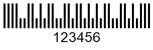
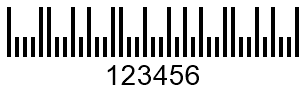
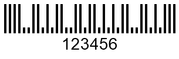

{}[Generate USPS Planet and](https://products.aspose.app/barcode/generate/planet) [USPS Postnet Barcodes online](https://products.aspose.app/barcode/generate/postnet). You can check the quality of ***Aspose.BarCode*** generation for postal barcodes and view the results online.{}
  
## **2-State Postal Standards**
***Aspose.BarCode for .NET*** supports the following 2-state postal standards: *Planet* and *Postnet*. Both of them can encode only numerical digits and contain an obligatory checksum. The length of a numerical set to be encoded is unlimited. Generation code samples and examples of *Planet* and *Postnet* barcode labels are provided below.  

### **Planet Symbology**
In the *Planet* symbology, each character is encoded by five bars so that three of them are full-length and two ones are half-length. The following code snippet shows how to generate a *Planet* barcode.
  

BarcodeGenerator gen = new BarcodeGenerator(EncodeTypes.Planet, "123456");
gen.Parameters.Barcode.XDimension.Pixels = 4;
gen.Parameters.Barcode.BarHeight.Pixels = 50;
gen.Parameters.Barcode.Postal.PostalShortBarHeight.Pixels = 20;
gen.Save($"{path}PostalPlanetBarcode.png", BarCodeImageFormat.Png);

  

 
  
### **Postnet Symbology**
The *Postnet* barcode type implies encoding each character using five bars where three ones are full-length and two ones are half-length. The following code sample can be used to create a *Postnet* barcode.


BarcodeGenerator gen = new BarcodeGenerator(EncodeTypes.Postnet, "123456");
gen.Parameters.Barcode.XDimension.Pixels = 4;
gen.Parameters.Barcode.BarHeight.Pixels = 50;
gen.Parameters.Barcode.Postal.PostalShortBarHeight.Pixels = 20;
gen.Save($"{path}PostalPostnetBarcode.png", BarCodeImageFormat.Png);

  

## **Generation Specifics for 2-State Barcodes**
In ***Aspose.BarCode for .NET***, the generation of 2-state postal barcodes (*Planet* or *Postnet*) has several peculiarities related to the ways of handling incorrect input text and modifying the length of bars. These specifics are explained below.

### **Incorrect Input Text Handling**
By default, in case of passing incorrect input text to the [*CodeText*](https://apireference.aspose.com/barcode/net/aspose.barcode.generation/barcodegenerator/properties/codetext) property (for *Planet* or *Postnet* barcodes, any symbols besides numerical ones), class [*BarcodeGenerator*](https://apireference.aspose.com/barcode/net/aspose.barcode.generation/barcodegenerator) filters out the characters that do not match the required specification and creates a barcode based on the correct numerical digits only. However, if it is required to handle invalid symbols in [*CodeText*](https://apireference.aspose.com/barcode/net/aspose.barcode.generation/barcodegenerator/properties/codetext) by throwing an exception, the [*ThrowExceptionWhenCodeTextIncorrect*](https://apireference.aspose.com/barcode/net/aspose.barcode.generation/barcodeparameters/properties/throwexceptionwhencodetextincorrect) property needs to be set to *True*, as illustrated in the code snippet given below. As a result, the following exceptions will be thrown: "*Exception: Symbology Planet - codetext is invalid*"; "*Exception: Symbology Postnet - codetext is invalid*".  


BarcodeGenerator gen = null;
gen = new BarcodeGenerator(EncodeTypes.Planet, "1234567WRONG");
gen.Parameters.Barcode.ThrowExceptionWhenCodeTextIncorrect = true;
try
{
    gen.GenerateBarCodeImage();
}
catch (Exception e)
{
    Console.WriteLine(e.Message);
}
gen = new BarcodeGenerator(EncodeTypes.Postnet, "1234567WRONG");
gen.Parameters.Barcode.ThrowExceptionWhenCodeTextIncorrect = true;
try
{
    gen.GenerateBarCodeImage();
}
catch (Exception e)
{
    Console.WriteLine(e.Message);
}


### **Short Bar Height Settings**
In general, **2-state** barcodes are composed of long and short bars so that the latter is usually defined as the half-length of the former. In ***Aspose.BarCode for .NET***, it is possible to customize the height of short bars manually by initializing the [*PostalShortBarHeight*](https://apireference.aspose.com/barcode/net/aspose.barcode.generation/postalparameters/properties/postalshortbarheight) property of class [*PostalParameters*](https://apireference.aspose.com/barcode/net/aspose.barcode.generation/postalparameters).  
  
Sample barcode labels demonstrated below have been generated with different short bar settings.
  
|
**Short Bar Height Settings**
|
**Is Set to 10 Pixels**
|
**Is Set to 30 Pixels**
|
| :-: | :-: | :-: |  
| |||
  
The following code snippet is provided to explain how to customize the length of short bars in 2-state postal barcodes.


BarcodeGenerator gen = null;
//set Planet barcode ShortBarHeight 10 pixels
gen = new BarcodeGenerator(EncodeTypes.Planet, "123456");
gen.Parameters.Barcode.XDimension.Pixels = 4;
gen.Parameters.Barcode.BarHeight.Pixels = 50;
gen.Parameters.Barcode.Postal.PostalShortBarHeight.Pixels = 10;
gen.Save($"{path}PostalPlanetShortBarHeight10Pixels.png", BarCodeImageFormat.Png);
//set Planet barcode ShortBarHeight 30 pixels
gen = new BarcodeGenerator(EncodeTypes.Planet, "123456");
gen.Parameters.Barcode.XDimension.Pixels = 4;
gen.Parameters.Barcode.BarHeight.Pixels = 50;
gen.Parameters.Barcode.Postal.PostalShortBarHeight.Pixels = 30;
gen.Save($"{path}PostalPlanetShortBarHeight30Pixels.png", BarCodeImageFormat.Png);

 