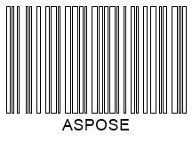

## **Bar Filling Modes**
For 1D barcodes, ***Aspose.BarCode for .NET*** provides a specific mode to generate barcodes with empty bars instead of filled ones. Such a modification can be done using the [*FilledBars*](https://apireference.aspose.com/barcode/net/aspose.barcode.generation/barcodeparameters/properties/filledbars) property of class [*BarcodeParameters*](https://apireference.aspose.com/barcode/net/aspose.barcode.generation/barcodeparameters). This property is set to *True* by default and is valid only for 1D barcodes. 
  
|Bar Filling Modes|Filled|Empty|
| :-: | :-: | :-: |
| |||
  
The following code sample demonstrates how to adjust the bar filling mode for *Code 128*.


BarcodeGenerator gen = new BarcodeGenerator(EncodeTypes.Code128, "ASPOSE");
gen.Parameters.Barcode.XDimension.Pixels = 2;
//set bars filled
gen.Parameters.Barcode.FilledBars = true;
gen.Save($"{path}BarsFilledCode128.png", BarCodeImageFormat.Png);
//set bars empty
gen.Parameters.Barcode.FilledBars = false;
gen.Save($"{path}BarsEmptyCode128.png", BarCodeImageFormat.Png);

