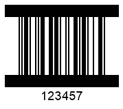

## **Handling Exception on Incorrect Barcode Text**
In case when a barcode has not been created correctly due to invalid barcode text, by default, the library can generate additional dummy data to bring the barcode into line with the standard or delete conflicting characters. Thereafter barcode generation is considered successful.  
  
Developers can change this behaviour by setting the [*ThrowExceptionWhenCodeTextIncorrect*](https://apireference.aspose.com/barcode/net/aspose.barcode.generation/barcodeparameters/properties/throwexceptionwhencodetextincorrect) property of [*BarcodeParameters*](https://apireference.aspose.com/barcode/net/aspose.barcode.generation/barcodeparameters) class. When this property is enabled, an exception is thrown if the barcode text has been found incorrect or incomplete.
  
|
**Barcode Text Correctness**
|
**Correct with Valid Barcode Text**
|
**Adjusted with Invalid Barcode Text**
|
| :-: | :-: | :-: |
| |||
  
The code sample given below illustrates how to set the [*ThrowExceptionWhenCodeTextIncorrect*](https://apireference.aspose.com/barcode/net/aspose.barcode.generation/barcodeparameters/properties/throwexceptionwhencodetextincorrect) property. In this example, the following exception will be thrown: "*Symbology ITF 6 - codetext is invalid*". 
  

BarcodeGenerator gen = new BarcodeGenerator(EncodeTypes.ITF6, "123457");
gen.Parameters.Barcode.XDimension.Pixels = 2;
//correct codetext with correction check
gen.CodeText = "12345";
gen.Parameters.Barcode.ThrowExceptionWhenCodeTextIncorrect = true;
gen.Save($"{path}ITF6Correct.png", BarCodeImageFormat.Png);
//incorrect codetext without correction check
gen.CodeText = "12";
gen.Parameters.Barcode.ThrowExceptionWhenCodeTextIncorrect = false;
gen.Save($"{path}ITF6Filled.png", BarCodeImageFormat.Png);
//incorrect codetext without correction check
try
{
    gen.CodeText = "12";
    gen.Parameters.Barcode.ThrowExceptionWhenCodeTextIncorrect = true;
    gen.GenerateBarCodeImage();
}
catch (Exception e)
{
    Console.WriteLine(e.Message);
}
