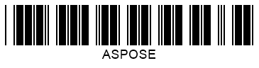

## **Wide-to-Narrow Ratio Settings**
Two-width 1D barcodes are based on the binary code principle, meaning that information is encoded using bars and spaces with two options of width: wide and narrow. Two-width barcode symbologies include the following: *Codabar*, *Code 11*, *Code 32*, *Code 39*, *DataLogic 2-of-5*, *IATA 2-of-5*, *Interleaved 2-of-5*, *ITF 6*, *ITF 14*, *Matrix 2-of-5*, *MSI*, *OPC*, *PZN*, *Standard 2-of-5*, and *VIN*.  
  
In ***Aspose.BarCode for .NET***, the **wide-to-narrow ratio** parameter defines the relation between the width of wide and narrow elements. It can be set in the [*WideNarrowRatio*](https://apireference.aspose.com/barcode/net/aspose.barcode.generation/barcodeparameters/properties/widenarrowratio) property of class [*BarcodeParameters*](https://apireference.aspose.com/barcode/net/aspose.barcode.generation/barcodeparameters). The larger is the value of the wide-to-narrow ratio, the wider is the generated barcode. Readability also improves when this parameter is increased. By default, the value of *WideNarrowRatio* is set to 3.  
  
|Wide-to-Narrow Ratio|Is Set to 2|Is Set to 5|
| :-: | :-: | :-: |
| |||
  
The code snippet provided below illustrates how to adjust the setting of the wide-to-narrow ratio for *Code 39*.  


BarcodeGenerator gen = new BarcodeGenerator(EncodeTypes.Code39Extended, "ASPOSE");
gen.Parameters.Barcode.XDimension.Pixels = 2;
//set Wide-to-Narrow Ratio to 2
gen.Parameters.Barcode.WideNarrowRatio = 2;
gen.Save($"{path}WideNarrow2Code39.png", BarCodeImageFormat.Png);
//set Wide-to-Narrow Ratio to 5
gen.Parameters.Barcode.WideNarrowRatio = 5;
gen.Save($"{path}WideNarrow5Code39.png", BarCodeImageFormat.Png);

  