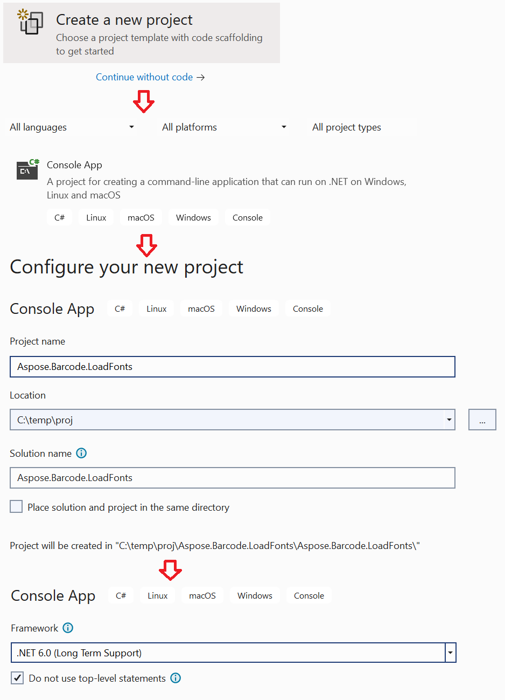
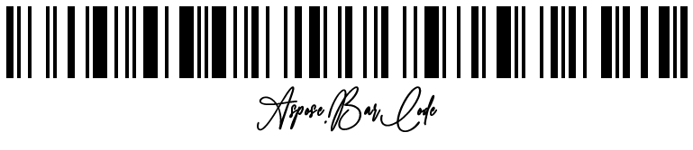

## **Overview**
This article describes how to load custom fonts for barcode generation in **Aspose.Barcode for .Net**. This is allowed only for [*.Net Standard*](https://learn.microsoft.com/dotnet/standard/net-standard) and [*.Net Core*](https://learn.microsoft.com/dotnet/core/introduction) library versions. Aspose.Barcode in *.Net Standard* and *.Net Core* library versions uses [*Aspose.Drawing.Common*](https://www.nuget.org/packages/Aspose.Drawing.Common/) as graphics library and it allows to load custom fonts to the [AppDomain](https://learn.microsoft.com/dotnet/framework/app-domains/application-domains) without installing them to system.

You can anytime download the [example application](aspose.barcode.loadfonts.zip).

## **Create .Net console application**
First, you need to create ***.Net Console application***. You can do this in ***Visual Studio 2022***. For this you need to:



1. Open ***Visual Studio 2022*** and select “Create a new project”.
2. Select ***Console App***.
3. Set the application name and folder.
4. Select ***.Net 6.0*** as target framework.

The next you need to add reference to NuGet package [Aspose.BarCode](https://www.nuget.org/packages/Aspose.BarCode/24.1.0) and your project should look like this:

``` xml
<Project Sdk="Microsoft.NET.Sdk">
	<PropertyGroup>
		<OutputType>Exe</OutputType>
		<TargetFramework>net6.0</TargetFramework>
	</PropertyGroup>
	<ItemGroup>
		<PackageReference Include="Aspose.BarCode" Version="24.1.0.0"/>
	</ItemGroup>
</Project>
```

## **Fonts Loader module**
The following code allows you to load custom fonts to local [AppDomain](https://learn.microsoft.com/dotnet/framework/app-domains/application-domains) for *Aspose.Drawing.Common* library using.

``` csharp
using System;
using System.IO;
using System.Runtime.InteropServices;

namespace Aspose.Barcode.LoadFonts
{
    public class AsposeFontsLoader
    {
        /// <summary>
        /// Adds font file to Aspose.Drawing main fonts
        /// </summary>
        ///<param name="fontName">font file</param>  
        public static void RegisterFontFromFile(string fontName)
        {
            using (Stream fontStream = new FileStream(fontName, FileMode.Open, FileAccess.Read, FileShare.Read))
                RegisterFontFromStream(fontStream);
        }

        /// <summary>
        /// Adds font stream to Aspose.Drawing main fonts
        /// </summary>
        ///<param name="fontStream">font stream</param>  
        public static void RegisterFontFromStream(Stream fontStream)
        {
            //load font
            Aspose.Drawing.Text.PrivateFontCollection collection = new Aspose.Drawing.Text.PrivateFontCollection();
            AddFontData(collection, fontStream);

            //register
            Aspose.Drawing.Text.InstalledFontCollection installed = new Aspose.Drawing.Text.InstalledFontCollection();
            installed.AddFamilies(collection.Families);
        }

        /// <summary>
        /// Adds font stream to private fonts collection
        /// </summary>
        ///<param name="privateCollection">private fonts collection where we add the following font stream</param>  
        ///<param name="fontStream">font stream</param>  
        public static void AddFontData(Aspose.Drawing.Text.PrivateFontCollection privateCollection, Stream fontStream)
        {
            byte[] fontData = new byte[fontStream.Length];
            fontStream.Position = 0;
            fontStream.Read(fontData, 0, fontData.Length);

            IntPtr dataPointer = Marshal.AllocHGlobal(fontData.Length);
            try
            {
                Marshal.Copy(fontData, 0, dataPointer, fontData.Length);
                privateCollection.AddMemoryFont(dataPointer, fontData.Length);
            }
            finally
            {
                Marshal.FreeHGlobal(dataPointer);
            }
        }
    }
}
```

## **Generate barcode with locally loaded font**
With the following code you can generate Code128 barcode with custom calligraphic font *Claire Amoreth*

``` csharp
//register fonts
AsposeFontsLoader.RegisterFontFromFile(@"..\..\..\..\fonts\ClaireAmoreth.ttf");

//generate barcode
BarcodeGenerator gen = new BarcodeGenerator(EncodeTypes.Code128, "Aspose.BarCode");
gen.Parameters.Barcode.XDimension.Pixels = 4;
gen.Parameters.Barcode.BarHeight.Pixels = 80;
gen.Parameters.Barcode.CodeTextParameters.Font.Style = FontStyle.Bold;
gen.Parameters.Barcode.CodeTextParameters.Font.FamilyName = "Claire Amoreth";
gen.Save("code128.png", BarCodeImageFormat.Png);
```

And result:


