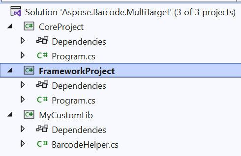

## **Overview**
This article describes how to develop custom libraries using **Aspose.Barcode for .Net** for multiple .Net versions in the same project. In some cases, it is required to develop custom libraries which can be used from *.Net Framework* and *.Net Core* with the same API. You can use *.Net Standard* for this, but **Aspose.Barcode for .Net** uses [*Aspose.Drawing.Common*](https://www.nuget.org/packages/Aspose.Drawing.Common/) as graphics library for *.Net Standard* and in some cases it can be required to use standard [*System.Drawing*](https://learn.microsoft.com/dotnet/api/system.drawing) which is common for *.Net Framework* code. In this way you can use [multi-targeting](https://learn.microsoft.com/nuget/create-packages/multiple-target-frameworks-project-file) to develop custom library for every required [targets framework](https://learn.microsoft.com/dotnet/standard/frameworks).

You can anytime download the [example application](aspose.barcode.multitarget.zip).

## **Create .Net projects**
You need to create solution with three projects, where the project tree looks like on image:



- *MyCustomLib* as *Class Library* which can be used as multi-targeting custom library for *.Net Framework 4.8* and *.Net 6.0*;
- *FrameworkProject* as ***Console App*** which can be used as console application for *.Net Framework 4.8*;
- *CoreProject* as ***Console App*** which can be used as console application for *.Net 6.0*.

## **Update project files to support multi-targeting**
You need to update project files to use MyCustomLib as custom library with the same API for both *.Net Framework 4.8* and *.Net 6.0* projects.

### **Update MyCustomLib.csproj**
At first, we need to update ***MyCustomLib.csproj*** and add *.Net Framework 4.8* and *.Net 6.0* with following row:

``` text
<TargetFrameworks>net48;net6.0</TargetFrameworks>
```

Also we need to add reference to [*Aspose.BarCode*](https://www.nuget.org/packages/Aspose.BarCode/24.1.0)

``` xml
<Project Sdk="Microsoft.NET.Sdk">
	<PropertyGroup>
		<TargetFrameworks>net48;net6.0</TargetFrameworks>
	</PropertyGroup>
	<ItemGroup>
		<PackageReference Include="Aspose.BarCode" Version="24.1.0.0"/>
	</ItemGroup>
</Project>
```

### **Update FrameworkProject.csproj**
Update *FrameworkProject.csproj* with links to *MyCustomLib* and *Aspose.BarCode* and set *.Net Framework 4.8* as target framework.

``` xml
<Project Sdk="Microsoft.NET.Sdk">
	<PropertyGroup>
		<OutputType>Exe</OutputType>
		<TargetFramework>net48</TargetFramework>
	</PropertyGroup>
	<ItemGroup>
		<ProjectReference Include="..\MyCustomLib\MyCustomLib.csproj"/>
		<PackageReference Include="Aspose.BarCode" Version="24.1.0.0"/>
	</ItemGroup>
</Project>
```

### **Update CoreProject.csproj**
Update *CoreProject.csproj* with links to *MyCustomLib* and *Aspose.BarCode* and set *.Net 6.0* as target framework.

``` xml
<Project Sdk="Microsoft.NET.Sdk">
	<PropertyGroup>
		<OutputType>Exe</OutputType>
		<TargetFramework>net6.0</TargetFramework>
	</PropertyGroup>
	<ItemGroup>
		<ProjectReference Include="..\MyCustomLib\MyCustomLib.csproj"/>
		<PackageReference Include="Aspose.BarCode" Version="24.1.0.0"/>
	</ItemGroup>
</Project>
```

## MyCustomLib Example Code
We can write the following example code in our custom multiplatform library which we can use in the same way in both applications.

``` csharp
using Aspose.BarCode.Generation;
#if NETSTANDARD2_0_OR_GREATER || NETCOREAPP2_1_OR_GREATER
using Aspose.Drawing;
#else
using System.Drawing;
#endif

namespace MyCustomLib
{
    public class BarcodeHelper
    {
        public static Bitmap GenerateCode128Barcode(string CodeText)
        {
            BarcodeGenerator gen = new BarcodeGenerator(EncodeTypes.Code128, CodeText);
            gen.Parameters.Barcode.XDimension.Pixels = 2;
            return gen.GenerateBarCodeImage();
        }
    }
}
```

## Console Application Code
And now we can write identical code which uses our MyCustomLib multiplatform library for *.Net Framework 4.8* and *.Net 6.0* console applications

``` csharp
using System;
using MyCustomLib;
using Aspose.BarCode.BarCodeRecognition;
#if NETSTANDARD2_0_OR_GREATER || NETCOREAPP2_1_OR_GREATER
using Aspose.Drawing;
#else
using System.Drawing;
#endif

namespace FrameworkProject
{
    internal class Program
    {
        static void Main(string[] args)
        {
            Bitmap bmp = BarcodeHelper.GenerateCode128Barcode("Aspose.BarCode");
            using (BarCodeReader reader = new BarCodeReader(bmp))
                foreach (BarCodeResult result in reader.ReadBarCodes())
                    Console.WriteLine($"{result.CodeTypeName}:{result.CodeText}");
        }
    }
}
```
