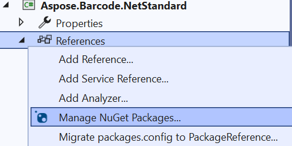

## **Overview**
This article describes how to use **Aspose.Barcode for .Net** [*.Net Standard*](https://learn.microsoft.com/dotnet/standard/net-standard) libraries with [*.Net Framework*](https://learn.microsoft.com/uk-ua/dotnet/core/porting/third-party-deps#net-framework-compatibility-mode) v4.7.2 projects. Aspose.Barcode for .Net uses [*System.Drawing*](https://learn.microsoft.com/dotnet/api/system.drawing) for any .NET Framework library version and [*Aspose.Drawing.Common*](https://www.nuget.org/packages/Aspose.Drawing.Common/) for .Net Standard and [*.Net Core*](https://learn.microsoft.com/dotnet/core/introduction) versions. In this way to use .Net Standard versions of *Aspose.Barcode* with .Net Framework projects it is needed to add some manual changes to configuration project files.

You can anytime download the [example application](aspose.barcode.netstandard.zip).

## **Create .Net Framework project**
First, you need to create ***.Net Framework Console application***. You can do this in ***Visual Studio 2022***. For this you need to:


1. Open ***Visual Studio 2022*** and select “Create a new project”.
2. Select ***Console App(.Net Framework)***.
3. Set the application name and folder.
4. Select ***.Net Framework 4.7.2*** as target framework.

The second, you need to add the following [*NuGet*](https://learn.microsoft.com/nuget/what-is-nuget) packages to [*packages.config*](https://learn.microsoft.com/nuget/reference/packages-config):



- [Aspose.BarCode](https://www.nuget.org/packages/Aspose.BarCode/24.1.0)
- [Aspose.Drawing.Common](https://www.nuget.org/packages/Aspose.Drawing.Common/24.1.0)
- [System.Text.Encoding.CodePages](https://www.nuget.org/packages/System.Text.Encoding.CodePages/8.0.0)

## **Update NuGet packages to .Net Standard versions**

You can see all of packages are added as .Net Framework versions. We need to change this behavior to .Net Standard versions using with editing two files: ***packages.config*** and ***Aspose.Barcode.NetStandard.csproj***.

### **Edit packages.config**

You need to edit ***packages.config*** and replace all ***targetFramework to*** ***netstandard2.0*** as you can see in the following example:

``` xml
<?xml version="1.0" encoding="utf-8"?>
<packages>
  <package id="Aspose.BarCode" version="24.10.0" targetFramework="netstandard2.0" />
  <package id="Aspose.Drawing.Common" version="24.10.0" targetFramework="netstandard2.0" />
  <package id="System.Text.Encoding.CodePages" version="8.0.0" targetFramework="netstandard2.0" />
</packages>
```

### **Edit Aspose.Barcode.NetStandard.csproj**
You need to edit Aspose.Barcode.NetStandard.csproj and also replace all paths in ***Reference*** ***HintPath*** to ***netstandard2.0*** as you can see in the following example:

``` xml
<ItemGroup>
  <Reference Include="Aspose.BarCode, Version=24.10.0.0, Culture=neutral, PublicKeyToken=716fcc553a201e56, processorArchitecture=MSIL">
    <HintPath>..\packages\Aspose.BarCode.24.10.0\lib\netstandard2.0\Aspose.BarCode.dll</HintPath>
  </Reference>
  <Reference Include="Aspose.Drawing.Common, Version=24.10.0.0, Culture=neutral, PublicKeyToken=716fcc553a201e56, processorArchitecture=MSIL">
    <HintPath>..\packages\Aspose.Drawing.Common.24.10.0\lib\netstandard2.0\Aspose.Drawing.Common.dll</HintPath>
  </Reference>
  <Reference Include="System.Text.Encoding.CodePages, Version=8.0.0.0, Culture=neutral, PublicKeyToken=b03f5f7f11d50a3a, processorArchitecture=MSIL">
    <HintPath>..\packages\System.Text.Encoding.CodePages.8.0.0\lib\netstandard2.0\System.Text.Encoding.CodePages.dll</HintPath>
  </Reference>
</ItemGroup>
```

## **Use Aspose.Barcode for .Net Standard Library**

After all upper manipulations you can use *.Net Standard* version of the ***Aspose.Barcode for .Net*** in *.Net Framework* project. You can see this with the following code:

``` csharp
BarcodeGenerator gen = new BarcodeGenerator(EncodeTypes.Code128, "Aspose.BarCode");
gen.Parameters.Barcode.XDimension.Pixels = 2;
Aspose.Drawing.Bitmap bmp = gen.GenerateBarCodeImage();

using (BarCodeReader reader = new BarCodeReader(bmp, DecodeType.Code128))
{
    foreach (BarCodeResult result in reader.ReadBarCodes())
        Console.WriteLine($"{result.CodeTypeName}:{result.CodeText}");
}
```
