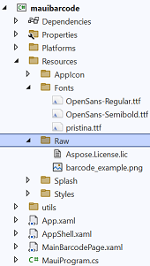

## **Overview**

This article describes how to use ***Aspose.Barcode*** in [ ***.Net MAUI*** ](https://learn.microsoft.com/dotnet/maui/what-is-maui) mobile application. ***.Net MAUI*** technology allows to develop application for the most of mobile OS, like ***iOS***, ***Android*** or ***Tizen***, also for ***MacOS*** and ***Windows***. This allows you to use barcode support anywhere on any device.

You can anytime download the [example application](mauibarcode.zip).

## **Create .Net MAUI App project**

At first you need to create ***.Net MAUI App***. You can do this in ***Visual Studio 2022***. For this you need to:
1. Open ***Visual Studio 2022*** and select “Create a new project”.
2. Select ***.Net MAUI App***.
3. Set the application name and folder.
4. Select ***.Net 6.0*** as target framework.
5. Add references to ***Aspose.Barcode***, ***Aspose.Drawing Common*** and ***System.Text.Encoding.CodePages*** to ***“x.csproj”*** file:

<!--Reference to Aspose libraries-->
<ItemGroup>
	<PackageReference Include="Aspose.BarCode" Version="23.5.0" />
	<PackageReference Include="Aspose.Drawing.Common" Version="23.5.0" />
	<PackageReference Include="System.Text.Encoding.CodePages" Version="7.0.0" />
</ItemGroup>


After project creation you have to create Android Emulator. How to do this you can read in [this article](https://learn.microsoft.com/dotnet/maui/android/emulator/debug-on-emulator).

## **Application Appearance**

Because ***Visual Studio*** does not have visual designer for ***.Net MAUI*** pages, we need to add the following markup to ***“x.xaml”*** Main Page and add empty ***OnDrawBarcodeBtn***, ***OnReadBarcodeBtn*** functions to the page code ***“x.xaml.cs”***:

<ScrollView>
    <VerticalStackLayout
        Spacing="25"
        Padding="30,0"
        VerticalOptions="Center"
        HorizontalOptions="Center">
        
        <Label
            Text="Aspose.Barcode .Net MAUI Application"
            SemanticProperties.HeadingLevel="Level2"
            FontSize="18" />

        <Image
            x:Name="DrawImage"
            Aspect="AspectFit"
            HeightRequest="300" />

         <Button
            x:Name="DrawBarcodeBtn"
            Text="Draw Barcode"
            Clicked="OnDrawBarcodeBtn" />
            
         <Button
            x:Name="ReadBarcodeBtn"
            Text="Read Barcode"
            Clicked="OnReadBarcodeBtn" />

    </VerticalStackLayout>
</ScrollView>


Also, we need to add ***“barcode_example.png”*** to the ***Assets*** and add following code to form initialization code in ***“x.xaml.cs”***.\


public partial class MainBarcodePage : ContentPage
{
    public MainBarcodePage()
    {
        InitializeComponent();
        DrawImage.Source = ImageSource.FromStream(() => FileSystem.Current.OpenAppPackageFileAsync("barcode_example.png").Result);
    }

    private void OnDrawBarcodeBtn(object sender, EventArgs e)
    {
    }

    private void OnReadBarcodeBtn(object sender, EventArgs e)
    {
    }
}

The visual result of the markup must be the following:\

## **Utility Classes**

We implemented some utility classes which helps to read files from Application Package and register additional fonts for ***Aspose.Drawing.Common*** library, like ***MauiApp*** does. Font registering is required for mobile application because not all of mobile OS have required fonts and charsets.

The following code allows to read files from Application Package:

/// 

/// Storage Utilities
/// 

public class StorageUtils
{
    /// 

    /// Reads data from files in App package into memory stream because on some system 
    /// stream from package does not have lenght and position
    /// 

    ///<param name="fontFiles">filename in App package</param>  
    /// <returns>initilized memory stream</returns> 
    public static MemoryStream ReadAppPackageFileToMemoryStream(string filename)
    {
        if (!Microsoft.Maui.Storage.FileSystem.Current.AppPackageFileExistsAsync(filename).Result) return null;
        
        using (Stream fstream = Microsoft.Maui.Storage.FileSystem.Current.OpenAppPackageFileAsync(filename).Result)
        {
            List<byte> streamData = new List<byte>();
            int realRead = 0;
            byte[] data = new byte[262144];
            do
            {
                realRead = fstream.Read(data, 0, data.Length);
                for(int i = 0; i < realRead; ++i)
                    streamData.Add(data[i]);
            } while (0 != realRead);

            return new MemoryStream(streamData.ToArray());
        }
    }
}

The following code allows to read ***ttf*** files from Application Package and register to ***Aspose.Drawing.Common*** library:

/// 

/// Aspose.Drawing Fonts Manager
/// 

public class PrivateFontsManager
{
    /// 

    /// Register fonts from App Package in Aspose.Drawing
    /// 

    ///<param name="fontFiles">list of font files added to project</param>  
    public static void RegisterFontsFromAppPackage(params string[] fontFiles)
    {
        Aspose.Drawing.Text.PrivateFontCollection collection = new Aspose.Drawing.Text.PrivateFontCollection();
        List<Stream> fonts = ReadFontsFromAppPackage(fontFiles);

        //create private fonts collection
        foreach (Stream stream in fonts)
            AddFontData(collection, stream);

        //register
        Aspose.Drawing.Text.InstalledFontCollection installed = new Aspose.Drawing.Text.InstalledFontCollection();
        installed.AddFamilies(collection.Families);
    }

    /// 

    /// Reads font files added to project to streams
    /// 

    ///<param name="fontFiles">list of font files added to project</param>  
    /// <returns>streams from font files added to project</returns> 
    public static List<Stream> ReadFontsFromAppPackage(params string[] fontFiles)
    {
        List < Stream > res = new List<Stream>();
        foreach(string ffile in fontFiles)
        {
            try
            {
                if (!Microsoft.Maui.Storage.FileSystem.Current.AppPackageFileExistsAsync(ffile).Result) continue;
                
                List<byte> streamData = new List<byte>();
                using (Stream fstream = Microsoft.Maui.Storage.FileSystem.Current.OpenAppPackageFileAsync(ffile).Result)
                {
                    int realRead = 0;
                    byte[] data = new byte[262144];
                    do
                    {
                        realRead = fstream.Read(data, 0, data.Length);
                        for (int i = 0; i < realRead; ++i)
                            streamData.Add(data[i]);
                    } while (0 != realRead);
                }
                //add
                res.Add(new MemoryStream(streamData.ToArray()));
            }
            catch (Exception e)
            { 
                Console.WriteLine(e.Message);
            }
        }

        return res;
    }

    /// 

    /// Adds font stream to private fonts collection
    /// 

    ///<param name="privateCollection">private fonts collection where we add the following font stream</param>  
    ///<param name="fontStream">font stream</param>  
    public static void AddFontData(Aspose.Drawing.Text.PrivateFontCollection privateCollection, Stream fontStream)
    {
        byte[] fontData = new byte[fontStream.Length];
        fontStream.Position = 0;
        fontStream.Read(fontData, 0, fontData.Length);

        IntPtr dataPointer = Marshal.AllocHGlobal(fontData.Length);
        try
        {
            Marshal.Copy(fontData, 0, dataPointer, fontData.Length);
            privateCollection.AddMemoryFont(dataPointer, fontData.Length);
        }
        finally
        {
            Marshal.FreeHGlobal(dataPointer);
        }
    }
}


## **Set License and Register Fonts**

Because ***Aspose.Barcode*** requires license we need to add license file to the Assets and required fonts to ***Fonts*** folder. We added ***“pristina.ttf”*** font as an example.

We use ***LicenseManager*** as license setter:

/// 

/// Aspose.Barcode License initializer
/// 

public class LicenseManager
{
    private static LicenseManager _instance = new LicenseManager();
    private LicenseManager()
    {
        // init the license
        (new Aspose.BarCode.License()).SetLicense(StorageUtils.ReadAppPackageFileToMemoryStream("Aspose.License.lic"));
    }
    
    /// 

    /// Set License one time
    /// 

    public static void SetLicense()
    {
        LicenseManager local = _instance;
    }
}

To register license and fonts we need to add the following code to ***CreateMauiApp*** method:

public static MauiApp CreateMauiApp()
{
	//set license
	Aspose.Barcode.Utils.LicenseManager.SetLicense();

	var builder = MauiApp.CreateBuilder();
	builder
		.UseMauiApp<App>()
		.ConfigureFonts(fonts =>
		{
			fonts.AddFont("OpenSans-Regular.ttf", "OpenSansRegular"); fonts.AddFont("OpenSans-Semibold.ttf", "OpenSansSemibold");
			fonts.AddFont("pristina.ttf", "Pristina");
		});

	//register fonts
	Aspose.Drawing.MAUI.PrivateFontsManager.RegisterFontsFromAppPackage("OpenSans-Regular.ttf", "OpenSans-Semibold.ttf", "pristina.ttf");

	return builder.Build();
}


## **Generate Barcode**

The following code generates barcode image and shows in the application:

private void OnDrawBarcodeBtn(object sender, EventArgs e)
{
    BarcodeGenerator generator = new BarcodeGenerator(EncodeTypes.Code128, "Aspose.Barcode");
    generator.Parameters.Barcode.CodeTextParameters.Font.FamilyName = "Pristina";
    generator.Parameters.Barcode.XDimension.Pixels = 2;
    //generate and save
    MemoryStream ms = new MemoryStream();
    generator.Save(ms, BarCodeImageFormat.Png);
    ms.Position = 0;

    //draw
    DrawImage.Source = ImageSource.FromStream(() => ms);
}

The application appearance with generated barcode you can see on the image:\

## **Recognize Barcodes**

We added ***“barcode_example.png”*** which is set as start image for the mobile application and the following code recognizes it and draws the barcodes rectangles and text over recognized barcodes:

private void OnReadBarcodeBtn(object sender, EventArgs e)
{
    MemoryStream ms = StorageUtils.ReadAppPackageFileToMemoryStream("barcode_example.png");

    using (Bitmap bmp = new Bitmap(new MemoryStream(ms.ToArray())))
    {
        SolidBrush barcodeBrush = new SolidBrush(Aspose.Drawing.Color.FromArgb(0x6f00FF00));
        Aspose.Drawing.Font textFont = new Aspose.Drawing.Font("Pristina", 10);
        SolidBrush textBrush = new SolidBrush(Aspose.Drawing.Color.Red);

        using (Graphics graphics = Graphics.FromImage(bmp))
        {
            BarCodeReader reader = new BarCodeReader(new MemoryStream(ms.ToArray()), DecodeType.Code128, DecodeType.QR, DecodeType.DataMatrix);
            foreach (BarCodeResult result in reader.ReadBarCodes())
            {
                graphics.FillRectangle(barcodeBrush, result.Region.Rectangle);
                graphics.DrawString(result.CodeText, textFont, textBrush, result.Region.Rectangle.Left, result.Region.Rectangle.Top);
            }
        }

        ms = new MemoryStream();
        bmp.Save(ms, Aspose.Drawing.Imaging.ImageFormat.Png);
        ms.Position = 0;
    }

    //draw
    DrawImage.Source = ImageSource.FromStream(() => ms);
}


The application appearance with recognized barcodes you can see on the image:\

