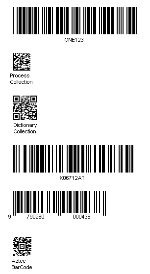

***Aspose.BarCode for .NET*** allows creating multiple barcodes of different types within one image, including postal, QR Code, PDF417, EAN, Code 39, Code 128, ISBN, MSI, and others.



A sample image with several barcodes is provided below.   
  

