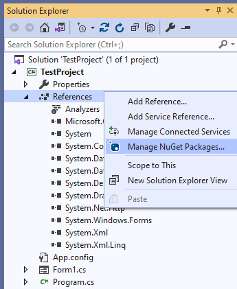
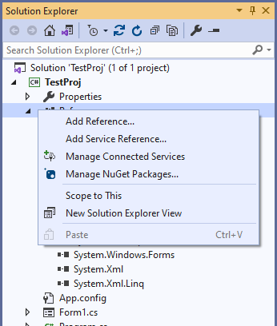
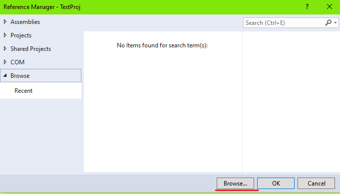
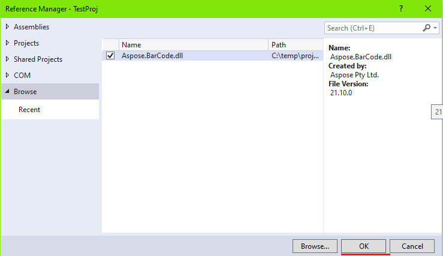

## **Overview**
In this article, new users can find information and brief tutorials about how to install ***Aspose.BarCode for .NET*** and start using its classes in a .NET project. There are three ways to deploy ***Aspose.BarCode for .NET***: adding a NuGet package (simple and fast), referencing an Aspose.BarCode package in a project (more flexible) or installing the library manually from the archive (to perform custom installation). In each case, to start working with code without limitations, it is required to set the license first. You can see how to do that in [Licensing](/barcode/net/licensing/).  
  
Below you can walk through all available installation modes and select the one that is the most appropriate in your case. If you have any specific questions or problems with installation, please check how to contact [Technical Support](/barcode/net/technical-support/). 

## **Using NuGet Package**
Installing ***Aspose.BarCode for .Net*** through NuGet is the most convenient way to download and deploy Aspose .NET APIs. Execute the steps listed below to complete the installation automatically.
1. Create a new project using .NET Framework or .NET Core in Visual Studio 2019.
2. In ***Solution Explorer***, make a right mouse click on References and select *Manage NuGet Packages*.
  

  

  
3. In the ***NuGet Package Manager*** window, go to the *Browse* tab, type “Aspose.barcode” in the text box, and click the *Install* button.
  

  

  
4. The library has been downloaded and installed successfully.

## **Referencing Aspose.BarCode Package in Project File**
This option suggests adding a reference to a NuGet package through editing the source file of a project (*.csproj). Follow the steps below to launch the installation in this way:  
1. Create a new project with .NET Framework or .NET Core in Visual Studio 2019.
2. Open the project file (*.csproj) and add the following code:  
  

<Project Sdk="Microsoft.NET.Sdk">
	<!--Reference to Aspose.Barcode-->
	<ItemGroup>
		<PackageReference Include="Aspose.BarCode" Version="21.10.0.0" />
	</ItemGroup>	
	<!--Reference to .Net Core libraries if .Net Core application-->
	<ItemGroup Condition="$(DefineConstants.Contains(NETCOREAPP))">
		<PackageReference Include="System.Drawing.Common" Version="5.0.2" />
		<PackageReference Include="System.Text.Encoding.CodePages" Version="5.0.0" />
	</ItemGroup>	
</Project>

  
3. The library has been installed and referenced in your project successfully.
  
## **Manual Installation of Aspose.BarCode Library from Archive**
This installation mode is introduced for experienced users who would like to perform the customized installation. It allows manually setting up the library from the corresponding archive. Follow the instructions below to deploy Aspose.BarCode for .NET in this manner.  
1. Create a new project using .NET Framework or .NET Core in Visual Studio 2019.
2. Download the archive with the library for various .NET frameworks from [here](https://downloads.aspose.com/barcode/net).
3. As soon as the download has been completed, select the required library and copy it into the project folder or the folder with libraries.
4. In ***Solution Explorer***, make a right mouse click on *References* and select *Add Reference*.  
   

  
  
    
5. Go to the *Browse tab* and click the *Browse* button.  
    

  
    
    
6. Select the required library version and click the *OK* button.  
  

  
  
    
7. The library has been installed successfully.

