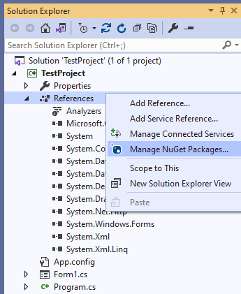
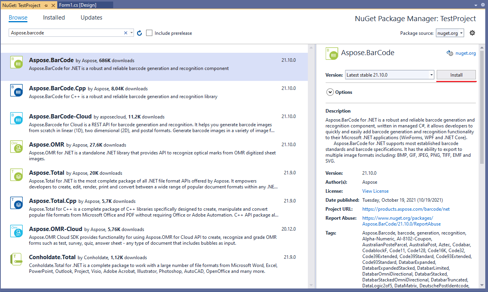
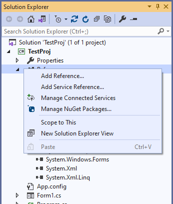
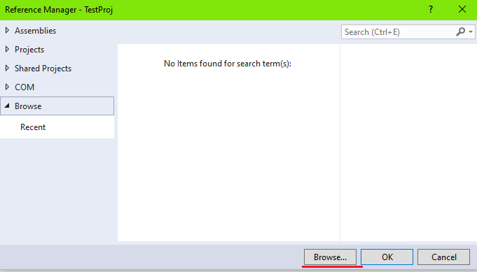
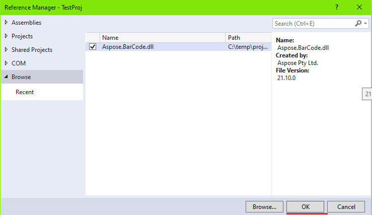
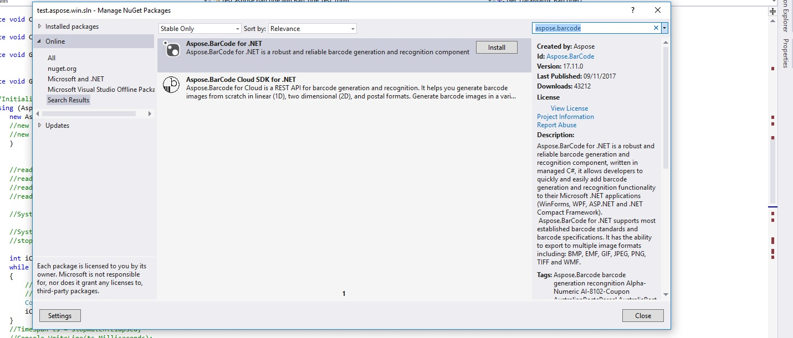
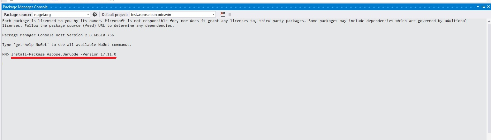
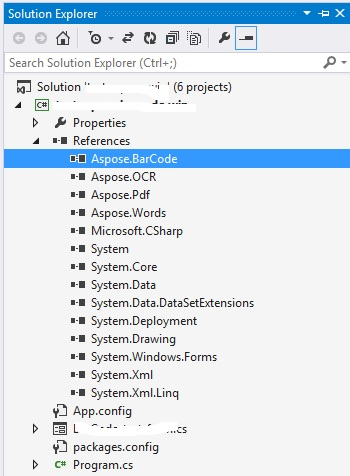

## **Overview**
In this article, new users can find information and brief tutorials about how to install ***AsposeBarCode for.NET*** and start using its classes in a .NET project. There are three ways to deploy ***AsposeBarCode for.NET***: adding a NuGet package (simple and fast), referencing an AsposeBarCode package in a project (more flexible), or installing the library manually from the archive (to perform custom installation).   
Below you can walk through all available istallation modes and select the one that is the most appropriate for your case. If you have any specific questions or problems with installation, you can check how to reach out [Technical Support](/barcode/net/technical-support/). 

## **Using NuGet Package**
Installing ***Aspose.BarCode for .Net*** through NuGet is the most easy and convenient way to download and deploy Aspose .NET APIs. Execute the steps listed below to complete installation automatically.
1. Create a new project using .NET Framework or .NET Core in Visual Studio 2019.
2. In ***Solution Explorer***, make a right mouse click on Refences and select *Manage NuGet Packages*.  
  

  
3. In the ***NuGet Package Manager*** window, go to the *Browse* tab, type “Aspose.barcode” in the text box, and click the *Install* button.
  

  
4. Now the library has been downloaded and installed successfully. You can start coding after setting the license.

## **Referencing Aspose.BarCode Package in Project File**
This option suggests adding a reference to a NuGet package through editing the source file of a project (*.csproj). Follow the steps below to launch installation in this way.
1. Create a new project with .NET Framework or .NET Core in Visual Studio 2019.
2. Open the project file (*.csproj) and add the following code:  
  

<Project Sdk="Microsoft.NET.Sdk">
	<!--Reference to Aspose.Barcode-->
	<ItemGroup>
		<PackageReference Include="Aspose.BarCode" Version="21.10.0.0" />
	</ItemGroup>	
	<!--Reference to .Net Core libraries if .Net Core application-->
	<ItemGroup Condition="$(DefineConstants.Contains(NETCOREAPP))">
		<PackageReference Include="System.Drawing.Common" Version="5.0.2" />
		<PackageReference Include="System.Text.Encoding.CodePages" Version="5.0.0" />
	</ItemGroup>	
</Project>

  
3. The library has been installed and referenced in your project successfully. You can start working with code after deploying the license.

## **Manual Installation of Aspose.BarCode Library from Archive**
This installation mode is introduced for experienced users who would like to perform customized installation. It allows manually setting up the library from the corresponding archive. Follow the instructions below to deploy Aspose.BarCode for .NET in this manner.  
1. Create a new project using .NET Framework or .NET Core in Visual Studio 2019.
2. Download the archive with the library for various .NET frameworks from [here](https://downloads.aspose.com/barcode/net).
3. As soon as downloading has been completed, Select the required library and copy it into the project folder or the folder with libraries.
4. In ***Solution Explorer***, make a right mouse click on *References* and select *Add Reference*.  
  
  
    
5. Go to the *Browse tab* and click the *Browse* button.  
  
    
    
6. Select the required library version and click the *OK* button.  
  
  
    
7. The library has been installed successfully. You can begin working with code as soon as the license has been set.

<!--
## **Install or Update Aspose.BarCode using the Package Manager Console**
Follow the steps below to install or upgrade the Aspose.BarCode API using the package manager console:
Open your solution/project in Visual Studio.
Select **TOOLS** -> **NuGet Package Manager** -> **Package Manager Console** from the top menu. This will open package manager console.

Type the command “Install-Package Aspose.BarCode -Version x.x.0” and press enter to install the latest full release into your application. Alternatively, you can add the "-prerelease" suffix to the command to specify that the latest release including hotfixes is to be installed as well.

If you are not familiar with the Aspose EULA <http://www.aspose.com/corporate/purchase/end-user-license-agreement.aspx> then it is a good idea to read the license referenced in the URL. 
You should now find that Aspose.BarCode has successfully been added and referenced in your application for you.

In the package manager console, you can use the command **Update-Package Aspose.BarCode.NET** and press enter to check for any updates to the Aspose.BarCode package and install them if present. You can also add the "-prerelease" suffix to update the latest release.
## **Referencing the Component**
By following the steps given below, one can add a reference to the Visual Studio .NET project:

1. In the Solution Explorer, expand the project node you want to add a reference to.
1. Right-click **References** node for the project and select **Add Reference** menu item.
1. In the Add Reference dialog box, select the **.NET** tab (usually selected by default).
1. If you have used the MSI installer to install Aspose.BarCode, you will see Aspose.BarCode in the top pane. Select it and click the **Select** button.
1. If you have downloaded and unpacked the DLL only, click the **Browse** button and lock for Aspose.BarCode.dll. 
   You have referenced Aspose.BarCode and it should appear in the **SelectedComponents** pane of the dialog box.
1. Click **OK**.
1. An Aspose.BarCode reference appears under the **References** node of the project.
## **Uninstalling Aspose.BarCode for .NET**
If you have used MSI installer to deploy Aspose.BarCode, follow these steps to completely remove the component and the associated demos and documentation:

1. From the **Start** menu, select **Settings** and then **Control Panel**.
1. Click **Add/Remove Programs**.
1. Select Aspose.BarCode.
1. Click **Change/Remove** to remove Aspose.BarCode.
## **Targeting Specific .NET Framework Version**
Although Aspose.BarCode references .NET Framework 1.1, it is possible to use it on a machine with only version 1.0 installed. But you need to add an entry to the application configuration file to redirect the references because otherwise, the component will try to load assemblies from .NET Framework 1.1. Each assembly that makes up the .NET Framework must be redirected to use .NET Framework version 1.0. The configuration file is an XML file that can be changed as needed. Developers can use it to change settings without recompiling applications. The name and location of the application configuration file depending on the application's host, which can be one of the following:

- Executable--hosted application: The configuration file for an application hosted by the executable host is in the same directory as the application. The name of the configuration file is the name of the application with a .config extension. For example, an application called myApp.exe can be associated with a configuration file called myApp.exe.config.
- ASP.NET-hosted application: ASP.NET configuration files are called Web.config and placed in the application directory as well.

Enter the following XML in the application configuration file:



## **See Also**
For more information see the MSDN article [https://docs.microsoft.com/en-us/dotnet/standard/library-guidance/cross-platform-targeting](https://docs.microsoft.com/en-us/dotnet/standard/library-guidance/cross-platform-targeting).
-->
