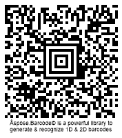

{}[Generate Aztec Code Barcodes Online](https://products.aspose.app/barcode/generate/aztec): You can check the quality of ***Aspose.BarCode*** generation for Aztec Code barcodes and view results.{}

## **Overview**
*Aztec Code* is a 2D barcode type that allows encoding alphanumeric characters and streams of bytes. *Aztec Code* barcodes are composed of square modules that create individual patterns in the center of a barcode image. These so-called bulls-eye signs facilitate barcode detection and scanning. This type supports Reed-Solomon error correction to assure data integrity and completeness. It benefits from high reading accuracy and data density.  
  
The *Aztec Code* barcode type supports three subtypes:
-	*Full-Range Aztec Code* - allows encoding up to 3,832 numerical or 3,067 alphanumeric symbols or 1,914 bytes
-	*Compact Aztec Code* - allows encoding up to 110 numerical or 89 alphanumeric symbols or 53 bytes
-	*Aztec Rune* - allows encoding values from 0 to 255 and is mainly used to label objects in Augmented Reality systems
  
{}*If you need any clarifications, feel free to reach out [Aspose Technical Support](/barcode/nodejsjava/technical-support/): ask your questions at [Aspose.Barcode Forum](https://forum.aspose.com/c/barcode/13) or contact [Aspose Paid Support Helpdesk](https://helpdesk.aspose.com/).*{}
  
## **Generation Modes**
The preferred generation mode can be set using the [*AztecSymbolMode*]() enum of class [*AztecParameters*](). The following modes are supported:
- *Auto*: identifies the most suitable *Aztec Code* type with the data capacity that is sufficient to encode data passed through the *setCodeText* method
- *Compact*: allows generating *Compact Aztec Code* barcodes with at most 4 layers and 27x27 modules
- *FullRange*: creates *Full-Range Aztec Code* barcodes with at most 32 layers and 151x151 modules
- *Rune*: generates *Aztec Rune* barcodes with at most 11x11 modules and can encode only numerical symbols from 0 to 255
  
Following *Aztec Code* barcode images have been generated through various generation modes.
  
|Generation Mode|*Auto*|*Compact*|*Full-Range*|*Rune*|
| :-: | :-: | :-: | :-: | :-: |
| |||||
  
 
## **Encoding Byte Streams**
In ***Aspose.BarCode for Node.js via Java***, streams of bytes can be encoded as *Aztec Code* barcodes. To display the text label, it is required to call the *setTwoDDisplayText* method of class [*CodetextParameters*](). 
  

  
## **Encoding Unicode Symbols**
Unicode symbols can be encoded using the *setCodeTextEncoding* method of class [*AztecParameters*](). This method is applicable to all *Aztec Code* barcodes except *Rune*.
  

  
## **Error Correction Settings**
*Aztec Code* barcodes include recovery information that can occupy from 5 to 95% of the entire encoded data stream. It is recommended to set this parameter to 23%. To select the required error correction level, it is necessary to use the *setAztecErrorLevel* method of class [*AztecParameters*]().  
  
Following barcode images have been created using various error correction levels.
  
|Error Correction Level|Is Set to 5|
**Is Set to 50**
|
| :-: | :-: | :-: |
| |||
  

## **Aspect Ratio Settings**
*Aspect Ratio* is defined as the ratio between the barcode width and height. To modify proportions using the X and Y coordinates, the barcode library provides the *setAspectRatio* method of class [*AztecParameters*](). *AspectRatio* is determined as a relative coefficient to the value of *XDimension*. In general, it is recommended to set *AspectRatio* equal to 1. If the proportions of *Aztec Code* barcodes to be generated need to be adjusted, the *setAspectRatio* method can be used to do this.  
  
Following barcodes have been generated with various values of the aspect ratio.
  
|Aspect Ratio|Is Set to 1|Is Set to 0.5|
| :-: | :-: | :-: |
| |||
  
