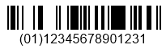
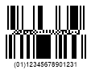
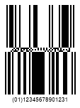

{}[Generate DataBar Barcodes Online](https://products.aspose.app/barcode/generate/databar): You can check the quality of ***Aspose.BarCode*** generation for DataBar barcodes and view results online.{}

## **Overview**
The *DataBar* standard was developed in the 2000s in compliance with the GS1 standard. It was intended to address problems of barcode types introduced in the 70s. However, it was also important to preserve one of the key features of 1D barcodes, i.e, the laser scanning ability. The following subtypes are represented within the *DataBar* type: 
- *DataBar Omnidirectional* / *DataBar Stacked Omnidirectional*
- *DataBar Expanded* / *DataBar Expanded Stacked*
- *DataBar Truncated* / *DataBar Stacked*
- *DataBar Limited*
  
With the exception of except *DataBar Limited*, all aforementioned subtypes have two-row and multiple-row (at most 10 rows) versions. This property enables fitting the barcode layout to the limited horizontal space. *DataBar* standards have been introduced to work with GS1 identification codes (Application Identifiers) used to mark trade items. All *DataBar* subtypes excluding *DataBar Expanded* / *DataBar Expanded Stacked* are applicable only to the trade identifiers determined using Global Trade Item Number (GTIN) in *GTIN12* or *GTIN13* digital formats with the 14-digit data structure. In contrast, *DataBar Expanded* barcodes are compatible with any type of application identifiers and may contain additional data in any format as it allows encoding uppercase and lowercase English alphabet symbols, numerical digits, and 21 punctuation signs.  

{}*If you need any clarifications, feel free to reach out [Aspose Technical Support](/barcode/nodejsjava/technical-support/): ask your questions at [Aspose.Barcode Forum](https://forum.aspose.com/c/barcode/13) or contact [Aspose Paid Support Helpdesk](https://helpdesk.aspose.com/).*{}

## **Barcode Height Settings**
*DataBar* standards can be classified in two types: continuous and stacked. ***Aspose.BarCode for Node.js via Java*** provides its own mode to customize the height of barcodes for for each of these types, as explained further in the article.

### **Continuous Barcode Types**
*DataBar Omnidirectional*, *DataBar Truncated*, *DataBar Limited*, and *DataBar Expanded* correspond to continuos barcode types. Here, barcode heigh can be adjusted using the *setBarHeight* method of class [*BarcodeParameters*](https://reference.aspose.com/barcode/nodejs/BarcodeParameters).  
  
Following *DataBar Omnidirectional* barcode images have been created setting various barcode heights.
   
|Barcode Height|Is Set to 30 Pixels|Is Set to 60 Pixels|
| :-: | :-: | :-: |
| |||
  
  
### **Stacked Barcode Types**
*DataBar Stacked Omnidirectional*, *DataBar Stacked*, and *DataBar Expanded Stacked* can be classified as stacked barcode types. For such barcode types, the heigh of barcodes can be customized by calling the *setAspectRatio* method of class [*DataBarParameters*](https://reference.aspose.com/barcode/nodejs/DataBarParameters). *AspectRatio* is specified as a relative coefficient to the value of *XDimension*.  
  
Following *DataBar Stacked Omnidirectional* barcodes have been generated setting different values of the aspect ratio.
  
|Aspect Ratio|Is Set to 15|Is Set to 30|
| :-: | :-: | :-: |
| |||

## **DataBar Expanded Stacked Layout Settings**
The *DataBar Expanded Stacked* subtype supports flexible barcode layout that may be adjuted by changing barcode row and column numbers. ***Aspose.BarCode*** allows adding up to 22 segments to compose at most 10 strings. The barcode layout of *DataBar Expanded Stacked* barcodes can be customized through *setRows* and *setColumns* methods of class [*DataBarParameters*](https://reference.aspose.com/barcode/nodejs/DataBarParameters). It should be noted that first, the number of segments in a row has to be determined using the *setColumns* method.  
  
Following *DataBar Expanded Stacked* barcodes have varying barcode layouts.
  
|Layout Settings|4 Columns|3 Rows|6 Columns and 10 Rows|
| :-: | :-: | :-: | :-: |
| ||||

## **Compatibility with GS1 Components**
Considering that *DataBar Expanded* / *DataBar Expanded Stacked* subtypes enable data encoding in any format, it may be important to ensure compatibilty of the encoded information with GS1 standards. This can be impemented through the *setAllowOnlyGS1Encoding* method of class [*DataBarParameters*](https://reference.aspose.com/barcode/nodejs/DataBarParameters). This method requests checking for compatibility of the encoded data with GS Application Identifiers. An exception is thrown if an inconsistency is identified. This method can also serve to verify the correctness of GTIN values in other *DataBar* subtypes.     
  
*DataBar Expanded* barcodes shown below have been generated suing the GS1-compatible and non-compatible data formats.
  
|GS1 Compatibility|GS1 Compatible Encoding|Alternate Encoding|
| :-: | :-: | :-: |
| |||

## **Enabling 2D Component**
*DataBar* standards allow adding a 2D component linkage flag to enable creating a related 2D barcode that can be printed together with the corresponding *DataBar* barcode. Such a flag is often used in GS1-compatible composite barcode types. The barcode library provides the *set2DCompositeComponent* method of class [*DataBarParameters*](https://reference.aspose.com/barcode/nodejs/DataBarParameters) that allows setting this flag manually for specific industrial standards without changing the data encoded in the main barcode.  
  
*DataBar Expanded* barcodes below have different settings for the 2D component flag.
  
|2D Component Flag|Is Disabled|Is Enabled|
| :-: | :-: | :-: |
| |||
  
